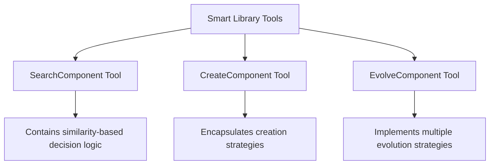
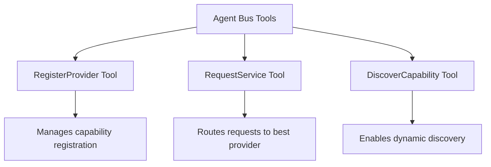
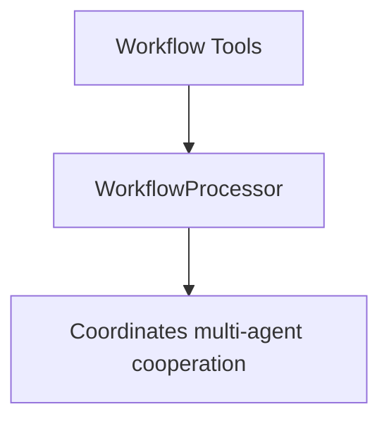

# Evolving Agents Framework

A toolkit for agent autonomy, evolution, and governance. Create agents that can understand requirements, evolve through experience, communicate effectively, and build new agents and tools - all while operating within governance guardrails.


## Why the World Needs This Toolkit
Current agent systems are designed primarily for humans to build and control AI agents. The Evolving Agents Framework takes a fundamentally different approach: agents building agents.

Our toolkit provides:

- **Autonomous Evolution**: Agents learn from experience and improve themselves without human intervention
- **Agent Self-Discovery**: Agents discover and collaborate with other specialized agents to solve complex problems
- **Governance Firmware**: Enforceable guardrails that ensure agents evolve and operate within safe boundaries
- **Self-Building Systems**: The ability for agents to create new tools and agents when existing ones are insufficient
- **Agent-Centric Architecture**: Communication and capabilities built for agents themselves, not just their human creators

Instead of creating yet another agent framework, we build on existing frameworks like BeeAI to create a layer that enables agent autonomy, evolution, and self-governance - moving us closer to truly autonomous AI systems that improve themselves while staying within safe boundaries.

## Key Features

- **Intelligent Agent Evolution**: Tools encapsulate the logic to determine when to reuse, evolve, or create new components
- **Agent-to-Agent Communication**: Agents communicate through capabilities rather than direct references
- **Smart Library with Semantic Search**: Find relevant components using OpenAI embeddings with built-in decision logic
- **Multi-Strategy Evolution**: Multiple evolution strategies (standard, conservative, aggressive, domain adaptation)
- **Human-readable YAML Workflows**: Define complex agent collaborations with simple, version-controlled YAML
- **Multi-Framework Support**: Seamlessly integrate agents from different frameworks (BeeAI, OpenAI, etc.)
- **Governance through Firmware**: Enforce domain-specific rules across all agents
- **Agent Bus Architecture**: Connect agents through a unified communication system with pluggable backends

For detailed architectural information, see [ARCHITECTURE.md](docs/ARCHITECTURE.md).

## Quick Start

```bash
# Clone the repository
git clone https://github.com/yourusername/evolving-agents-framework.git
cd evolving-agents-framework

# Install dependencies
pip install -r requirements.txt
pip install -e .

# Setup the agent library
python examples/setup_simplified_agent_library.py

# Run the pure ReAct agent demonstration
python examples/pure_react_system_agent.py
```

## Agent-Centric Architecture

The Evolving Agents Framework features a true agent-centric architecture where:

1. **The SystemAgent is a Pure ReActAgent**: Built on BeeAI's ReActAgent, it makes decisions through reasoning rather than hardcoded logic
2. **Tools Encapsulate Strategies**: Each specialized tool contains its own decision-making logic and strategies
3. **Everything is an Agent**: Components communicate through capabilities, not direct references
4. **Strategy Evolution**: Tools can evolve their strategies independently of the agent that uses them

### Key Components

The architecture consists of three main types of tools, each with its own specialized strategies:

#### 1. Smart Library Tools



#### 2. Agent Bus Tools



#### 3. Workflow Tools



## Demonstration

The `examples/pure_react_system_agent.py` demonstrates the capabilities of our agent-centric architecture:

### Demo 1: Search with Embedded Decision Logic
Shows how the SearchComponentTool contains the logic to decide whether to reuse, evolve, or create new components:
- If similarity ≥ 0.8: Recommends reusing an existing component
- If 0.4 ≤ similarity < 0.8: Recommends evolving an existing component
- If similarity < 0.4: Recommends creating a new component

### Demo 2: Creation with Embedded Strategies
Shows how the CreateComponentTool handles:
- Code generation for new components
- Framework selection
- Metadata management
- Next step recommendations

### Demo 3: Evolution with Multiple Strategies
Demonstrates the EvolveComponentTool's different evolution strategies:
- **Standard**: Balanced evolution that preserves core functionality while adding new features
- **Conservative**: Minimal changes to the original component, focusing on compatibility
- **Aggressive**: Significant changes that optimize for new requirements
- **Domain Adaptation**: Specialized for adapting components to new domains

### Demo 4: Complete Workflow
Shows all tools working together in a complete workflow:
1. Searching for components
2. Making decisions based on search results
3. Creating or evolving components
4. Registering components with the Agent Bus
5. Processing documents using the registered components

## Example: Using the SystemAgent

```python
# Initialize the SystemAgent
llm_service = LLMService(provider="openai", model="gpt-4o")
library = SmartLibrary("library.json")
agent_bus = SimpleAgentBus()

# Create the SystemAgent as a pure BeeAI ReActAgent
system_agent = await SystemAgentFactory.create_agent(
    llm_service=llm_service,
    smart_library=library,
    agent_bus=agent_bus,
    memory_type="token"
)

# Ask the SystemAgent to process a document
response = await system_agent.run("""
I have an invoice that needs processing:

INVOICE #12345
Date: 2023-05-15
Vendor: TechSupplies Inc.
Total Due: $1,822.80

Please search for relevant components, decide whether to reuse, evolve, or 
create new components, and then process this invoice.
""")

print(response.result.text)
```

## Key Technical Achievements

1. **Tool-Encapsulated Logic**: Each tool contains its own strategy, enabling independent evolution
2. **Pure ReActAgent Implementation**: SystemAgent uses reasoning rather than hardcoded functions
3. **Circular Dependency Resolution**: Clean architecture with proper interfaces
4. **Strategy Polymorphism**: Multiple strategies can be selected dynamically
5. **Capability-Based Communication**: Components communicate via capabilities, not direct references

## Use Cases

- **Document Processing**: Create specialized agents for different document types that collaborate to extract and analyze information
- **Healthcare**: Medical agents communicating with pharmacy and insurance agents to coordinate patient care
- **Financial Analysis**: Portfolio management agents collaborating with market analysis agents
- **Customer Service**: Routing agents delegating to specialized support agents
- **Multi-step Reasoning**: Break complex problems into components handled by specialized agents

## Contributing

Contributions are welcome! Please feel free to submit a Pull Request.

## License

[Apache v2.0](LICENSE)

## Star History

[](https://star-history.com/#matiasmolinas/evolving-agents&Timeline)

## Acknowledgements

- [Matias Molinas](https://github.com/matiasmolinas) and [Ismael Faro](https://github.com/ismaelfaro) for the original concept and architecture
- BeeAI framework for integrated agent capabilities