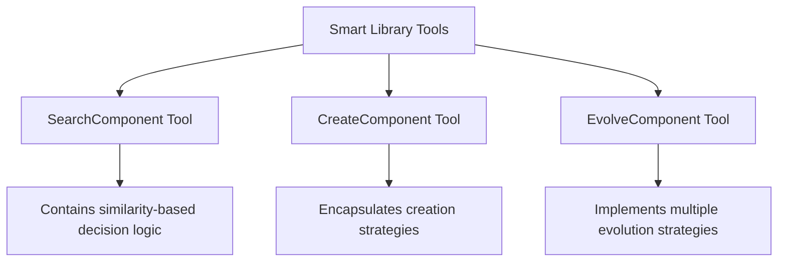
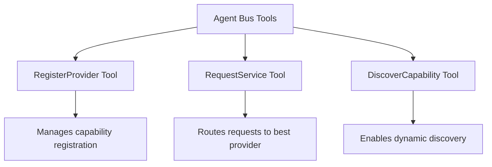
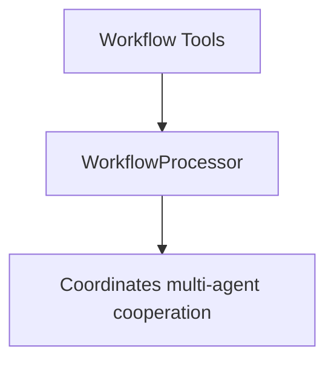
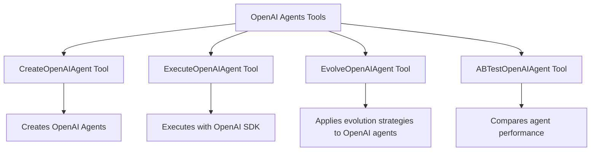

# Evolving Agents Toolkit

A toolkit for agent autonomy, evolution, and governance. Create agents that can understand requirements, evolve through experience, communicate effectively, and build new agents and tools - all while operating within governance guardrails.


## Why the World Needs This Toolkit
Current agent systems are designed primarily for humans to build and control AI agents. The Evolving Agents Toolkit takes a fundamentally different approach: agents building agents.

Our toolkit provides:

- **Autonomous Evolution**: Agents learn from experience and improve themselves without human intervention
- **Agent Self-Discovery**: Agents discover and collaborate with other specialized agents to solve complex problems
- **Governance Firmware**: Enforceable guardrails that ensure agents evolve and operate within safe boundaries
- **Self-Building Systems**: The ability for agents to create new tools and agents when existing ones are insufficient
- **Agent-Centric Architecture**: Communication and capabilities built for agents themselves, not just their human creators

Instead of creating yet another agent framework, we build on existing frameworks like BeeAI and OpenAI Agents SDK to create a layer that enables agent autonomy, evolution, and self-governance - moving us closer to truly autonomous AI systems that improve themselves while staying within safe boundaries.

## Key Features

- **Intelligent Agent Evolution**: Tools encapsulate the logic to determine when to reuse, evolve, or create new components
- **Agent-to-Agent Communication**: Agents communicate through capabilities rather than direct references
- **Smart Library with Semantic Search**: Find relevant components using OpenAI embeddings with built-in decision logic
- **Multi-Strategy Evolution**: Multiple evolution strategies (standard, conservative, aggressive, domain adaptation)
- **Human-readable YAML Workflows**: Define complex agent collaborations with simple, version-controlled YAML
- **Multi-Framework Support**: Seamlessly integrate agents from different frameworks (BeeAI, OpenAI Agents SDK, etc.)
- **Governance through Firmware**: Enforce domain-specific rules across all agent types
- **Agent Bus Architecture**: Connect agents through a unified communication system with pluggable backends
- **Cross-Framework Evolution**: Apply powerful evolution strategies to both BeeAI and OpenAI agents

For detailed architectural information, see [ARCHITECTURE.md](docs/ARCHITECTURE.md).

## Supported Frameworks

### BeeAI Framework
Our core agent architecture is built on BeeAI's ReActAgent system, providing reasoning-based decision making.

### OpenAI Agents SDK
We now fully support the OpenAI Agents SDK, enabling:
- Creation and execution of OpenAI agents within our system
- Experience-based evolution of OpenAI agents
- Firmware rules translated to OpenAI guardrails
- A/B testing between original and evolved agents
- YAML workflow integration across frameworks

## Quick Start

```bash
# Clone the repository
git clone https://github.com/matiasmolinas/evolving-agents.git
cd evolving-agents

# Install dependencies
pip install -r requirements.txt
pip install -e .

# Install OpenAI Agents SDK
pip install -r requirements-openai-agents.txt

# Setup the agent library
python examples/setup_simplified_agent_library.py

# Run the pure ReAct agent demonstration
python examples/pure_react_system_agent.py

# Run the OpenAI Agents integration demo
python examples/openai_agents_workflow_integration.py

# Run the OpenAI Agents evolution demo
python examples/openai_agent_evolution_demo.py
```

## Agent-Centric Architecture

The Evolving Agents Framework features a true agent-centric architecture where:

1. **The SystemAgent is a Pure ReActAgent**: Built on BeeAI's ReActAgent, it makes decisions through reasoning rather than hardcoded logic
2. **Tools Encapsulate Strategies**: Each specialized tool contains its own decision-making logic and strategies
3. **Everything is an Agent**: Components communicate through capabilities, not direct references
4. **Strategy Evolution**: Tools can evolve their strategies independently of the agent that uses them
5. **Cross-Framework Evolution**: Both BeeAI and OpenAI agents can evolve through experience

### Key Components

The architecture consists of four main categories of tools, each with specialized strategies:

#### 1. Smart Library Tools



#### 2. Agent Bus Tools



#### 3. Workflow Tools



#### 4. OpenAI Agents Tools



## Evolution Strategies

Both BeeAI and OpenAI agents can evolve through multiple strategies:

- **Standard**: Balanced evolution that preserves core functionality while adding new features
- **Conservative**: Minimal changes to the original component, focusing on compatibility
- **Aggressive**: Significant changes that optimize for new requirements
- **Domain Adaptation**: Specialized for adapting components to new domains

### OpenAI Agent Evolution

OpenAI agents gain unique evolution capabilities:

1. **Experience Tracking**: Records invocation patterns, success rates, and performance across domains
2. **A/B Testing**: Quantitative comparison between agent versions
3. **Auto-Evolution**: Automatic detection of evolution candidates based on experience
4. **Framework-Specific Optimization**: Evolution strategies tailored to OpenAI agent instructions

## Example: Using the SystemAgent with OpenAI Agents

```python
# Initialize the SystemAgent
llm_service = LLMService(provider="openai", model="gpt-4o")
library = SmartLibrary("library.json")
agent_bus = SimpleAgentBus()

# Initialize provider registry with both BeeAI and OpenAI providers
provider_registry = ProviderRegistry()
provider_registry.register_provider(BeeAIProvider(llm_service))
provider_registry.register_provider(OpenAIAgentsProvider(llm_service))

# Create the SystemAgent
system_agent = await SystemAgentFactory.create_agent(
    llm_service=llm_service,
    smart_library=library,
    agent_bus=agent_bus,
    memory_type="token"
)

# Request creation of an OpenAI agent
response = await system_agent.run("""
Create a new OpenAI agent called "InvoiceProcessor" that can extract 
structured data from invoice documents.

Use the openai-agents framework with the gpt-4o model and configure it to:
1. Extract invoice number, date, vendor, items, and totals
2. Verify calculations
3. Output data in JSON format

After creating the agent, test it with a sample invoice.
""")

print(response.result.text)
```

## Example: OpenAI Agent Evolution

```python
# Initialize evolution components
agent_logger = OpenAIAgentLogger()
evolve_tool = EvolveOpenAIAgentTool(library, llm_service, agent_logger=agent_logger)

# Evolve the agent with standard strategy
evolution_input = evolve_tool.input_schema(
    agent_id_or_name="InvoiceProcessor",
    evolution_type="standard",
    changes="Improve JSON output structure and add calculation verification",
    learning_from_experience=True
)

# Run the evolution
evolution_result = await evolve_tool._run(evolution_input)
print(json.loads(evolution_result.get_text_content())["message"])
```

## Key Technical Achievements

1. **Tool-Encapsulated Logic**: Each tool contains its own strategy, enabling independent evolution
2. **Pure ReActAgent Implementation**: SystemAgent uses reasoning rather than hardcoded functions
3. **Cross-Framework Integration**: Seamless interaction between BeeAI and OpenAI agents
4. **Experience-Based Evolution**: Agents evolve based on performance metrics and usage patterns
5. **Unified Governance**: Firmware rules apply to all agent types through appropriate mechanisms

## Use Cases

- **Document Processing**: Create specialized agents for different document types that collaborate to extract and analyze information
- **Healthcare**: Medical agents communicating with pharmacy and insurance agents to coordinate patient care
- **Financial Analysis**: Portfolio management agents collaborating with market analysis agents
- **Customer Service**: Routing agents delegating to specialized support agents
- **Multi-step Reasoning**: Break complex problems into components handled by specialized agents

## Contributing

Contributions are welcome! Please feel free to submit a Pull Request.

## License

[Apache v2.0](LICENSE)

## Star History

[](https://star-history.com/#matiasmolinas/evolving-agents&Timeline)

## Acknowledgements

- [Matias Molinas](https://github.com/matiasmolinas) and [Ismael Faro](https://github.com/ismaelfaro) for the original concept and architecture
- BeeAI framework for integrated agent capabilities
- OpenAI for the Agents SDK