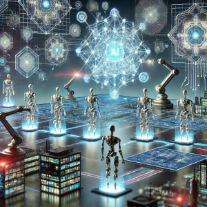
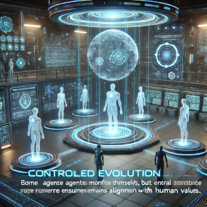
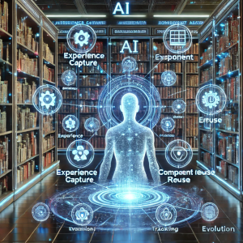
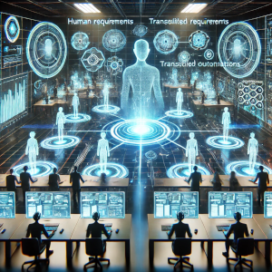
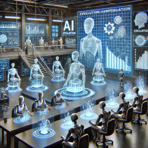
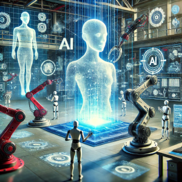
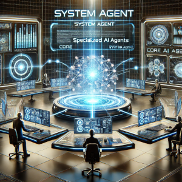

# Evolving Agents Toolkit

A toolkit for agent autonomy, evolution, and governance. Create agents that can understand requirements, evolve through experience, communicate effectively, and build new agents and tools - all while operating within governance guardrails.


## Why the World Needs This Toolkit
Current agent systems are designed primarily for humans to build and control AI agents. The Evolving Agents Toolkit takes a fundamentally different approach: agents building agents.



Our toolkit provides:

- **Autonomous Evolution**: Agents learn from experience and improve themselves without human intervention
- **Agent Self-Discovery**: Agents discover and collaborate with other specialized agents to solve complex problems
- **Governance Firmware**: Enforceable guardrails that ensure agents evolve and operate within safe boundaries
- **Self-Building Systems**: The ability for agents to create new tools and agents when existing ones are insufficient
- **Agent-Centric Architecture**: Communication and capabilities built for agents themselves, not just their human creators

Instead of creating yet another agent framework, we build on existing frameworks like BeeAI and OpenAI Agents SDK to create a layer that enables agent autonomy, evolution, and self-governance - moving us closer to truly autonomous AI systems that improve themselves while staying within safe boundaries.

## Why is Firmware Essential in Autonomous Agent Evolution?

In a system where agents and tools can evolve autonomously and create new components from scratch, governance firmware becomes not just important but essential. Without proper guardrails:



- **Capability Drift**: Evolved agents could develop capabilities that stray from their intended purpose
- **Alignment Challenges**: Self-improving systems may optimize for the wrong objectives without proper constraints
- **Safety Concerns**: Autonomous creation of new agents could introduce unforeseen risks or harmful behaviors
- **Compliance Issues**: Evolved agents might unknowingly violate regulatory requirements or ethical boundaries

Our firmware system addresses these challenges by embedding governance rules directly into the evolution process itself. It ensures that:

1. All evolved agents maintain alignment with human values and intentions
2. Component creation and evolution happens within clearly defined ethical and operational boundaries
3. Domain-specific compliance requirements (medical, financial, etc.) are preserved across generations
4. Evolution optimizes for both performance and responsible behavior

The firmware acts as a constitution for our agent ecosystem - allowing freedom and innovation within sensible boundaries.

## Why Do We Need a Smart Library?

The Smart Library serves as the institutional memory and knowledge base for our agent ecosystem. It provides several critical functions:



- **Component Reuse**: Prevents reinventing the wheel by making existing, proven agents and tools discoverable
- **Experience Capture**: Records performance metrics and usage patterns to guide future evolution
- **Semantic Discovery**: Enables finding components based on capabilities rather than exact name matches
- **Evolution Tracking**: Maintains lineage of components across multiple generations of improvements
- **Cross-Domain Transfer**: Allows innovations from one domain to benefit others through knowledge sharing

By maintaining a searchable repository of components, the Smart Library enables a cumulative learning process where each new solution builds upon previous advances, significantly accelerating development of agent-based systems.

## Why Do We Need Workflow Generation and Execution?

Workflow capabilities bridge the gap between human requirements and agent execution by:



- **Translating Requirements**: Converting natural language needs into precise agent collaboration patterns
- **Orchestrating Collaboration**: Coordinating multiple specialized agents to solve complex problems
- **Optimizing Resource Usage**: Selecting the most appropriate agents for each task based on capabilities
- **Ensuring Reproducibility**: Creating version-controlled definitions of multi-agent processes
- **Enabling Adaptation**: Allowing workflows to evolve as requirements change or new capabilities emerge

The workflow system serves as the bridge between human intent and agent execution, ensuring that complex requirements can be addressed through well-orchestrated collaboration between specialized components.

## Why Do We Need Agent and Tool Evolution?

Evolution capabilities are essential because no agent or tool is perfect from the start. Evolution enables:



- **Performance Improvement**: Refining agents based on observed successes and failures
- **Adaptation to Change**: Updating tools when external services or requirements change
- **Specialization**: Creating domain-specific variants optimized for particular use cases
- **Knowledge Transfer**: Applying learnings from one domain to another through targeted adaptation
- **Interface Alignment**: Adjusting agents to work better with new LLMs or companion tools

Evolution represents the core learning mechanism of our system, allowing it to improve over time through experience rather than requiring constant human intervention and rebuilding.

## Why Create Agents and Tools from Scratch?

While evolution is powerful, sometimes entirely new capabilities are needed. Creation from scratch:



- **Fills Capability Gaps**: Creates missing components when no suitable starting point exists
- **Implements Novel Approaches**: Builds components that use fundamentally new techniques
- **Introduces Diversity**: Prevents the system from getting stuck in local optima by introducing fresh approaches
- **Responds to New Requirements**: Addresses emerging needs that weren't anticipated in existing components
- **Leverages LLM Strengths**: Utilizes the code generation capabilities of modern LLMs to create well-designed components

The creation capability ensures that our system can expand to meet new challenges rather than being limited to its initial design, making it truly adaptable to changing needs.

## Why a System Agent?

The System Agent serves as both the orchestrator and embodiment of our agent-centric philosophy:



- **Consistency in Architecture**: Applies the agent-centric approach to the system itself, not just its components
- **Decision Intelligence**: Makes sophisticated decisions about when to reuse, evolve, or create components
- **Meta-Reasoning**: Reasons about the agent ecosystem and its own actions in a transparent, explainable way
- **Unified Control**: Provides a single interface to all toolkit capabilities while maintaining modularity
- **Embodied Philosophy**: Demonstrates our architectural principles in action by being itself an agent

By implementing the system control layer as an agent with specialized tools, we ensure our architecture is consistent, flexible, and aligned with our core philosophy that agents should build and manage agents.

## Key Features

- **Intelligent Agent Evolution**: Tools encapsulate the logic to determine when to reuse, evolve, or create new components
- **Agent-to-Agent Communication**: Agents communicate through capabilities rather than direct references
- **Smart Library with Semantic Search**: Find relevant components using OpenAI embeddings with built-in decision logic
- **Multi-Strategy Evolution**: Multiple evolution strategies (standard, conservative, aggressive, domain adaptation)
- **Human-readable YAML Workflows**: Define complex agent collaborations with simple, version-controlled YAML
- **Multi-Framework Support**: Seamlessly integrate agents from different frameworks (BeeAI, OpenAI Agents SDK, etc.)
- **Governance through Firmware**: Enforce domain-specific rules across all agent types
- **Agent Bus Architecture**: Connect agents through a unified communication system with pluggable backends
- **Cross-Framework Evolution**: Apply powerful evolution strategies to both BeeAI and OpenAI agents

For detailed architectural information, see [ARCHITECTURE.md](docs/ARCHITECTURE.md).

## Supported Frameworks

### BeeAI Framework
Our core agent architecture is built on BeeAI's ReActAgent system, providing reasoning-based decision making.

### OpenAI Agents SDK
We now fully support the OpenAI Agents SDK, enabling:
- Creation and execution of OpenAI agents within our system
- Experience-based evolution of OpenAI agents
- Firmware rules translated to OpenAI guardrails
- A/B testing between original and evolved agents
- YAML workflow integration across frameworks

## Quick Start

```bash
# Clone the repository
git clone https://github.com/matiasmolinas/evolving-agents.git
cd evolving-agents

# Install dependencies
pip install -r requirements.txt
pip install -e .

# Install OpenAI Agents SDK
pip install -r requirements-openai-agents.txt
```

## Example Code Snippets

```python
# Initialize the SystemAgent
llm_service = LLMService(provider="openai", model="gpt-4o")
library = SmartLibrary("library.json")
agent_bus = SimpleAgentBus()

# Initialize provider registry with both BeeAI and OpenAI providers
provider_registry = ProviderRegistry()
provider_registry.register_provider(BeeAIProvider(llm_service))
provider_registry.register_provider(OpenAIAgentsProvider(llm_service))

# Create the SystemAgent
system_agent = await SystemAgentFactory.create_agent(
    llm_service=llm_service,
    smart_library=library,
    agent_bus=agent_bus,
    memory_type="token"
)
```

## Coming Soon: Example Tutorials

We're developing a comprehensive set of tutorial examples to help you get started with the Evolving Agents Toolkit:

1. **Building a Smart Library** - Creating and populating your own smart library of agents and tools
2. **Workflow Generation and Execution** - Defining and running multi-agent workflows using YAML
3. **Agent Evolution** - Evolving agents to improve performance and adapt to new requirements
4. **Creating New Agents from Scratch** - Building entirely new agents for novel use cases

Stay tuned for these detailed examples!

## Key Technical Achievements

1. **Tool-Encapsulated Logic**: Each tool contains its own strategy, enabling independent evolution
2. **Pure ReActAgent Implementation**: SystemAgent uses reasoning rather than hardcoded functions
3. **Cross-Framework Integration**: Seamless interaction between BeeAI and OpenAI agents
4. **Experience-Based Evolution**: Agents evolve based on performance metrics and usage patterns
5. **Unified Governance**: Firmware rules apply to all agent types through appropriate mechanisms

## Use Cases

- **Document Processing**: Create specialized agents for different document types that collaborate to extract and analyze information
- **Healthcare**: Medical agents communicating with pharmacy and insurance agents to coordinate patient care
- **Financial Analysis**: Portfolio management agents collaborating with market analysis agents
- **Customer Service**: Routing agents delegating to specialized support agents
- **Multi-step Reasoning**: Break complex problems into components handled by specialized agents

## Contributing

Contributions are welcome! Please feel free to submit a Pull Request.

## License

[Apache v2.0](LICENSE)

## Star History

[](https://star-history.com/#matiasmolinas/evolving-agents&Timeline)

## Acknowledgements

- [Matias Molinas](https://github.com/matiasmolinas) and [Ismael Faro](https://github.com/ismaelfaro) for the original concept and architecture
- BeeAI framework for integrated agent capabilities
- OpenAI for the Agents SDK