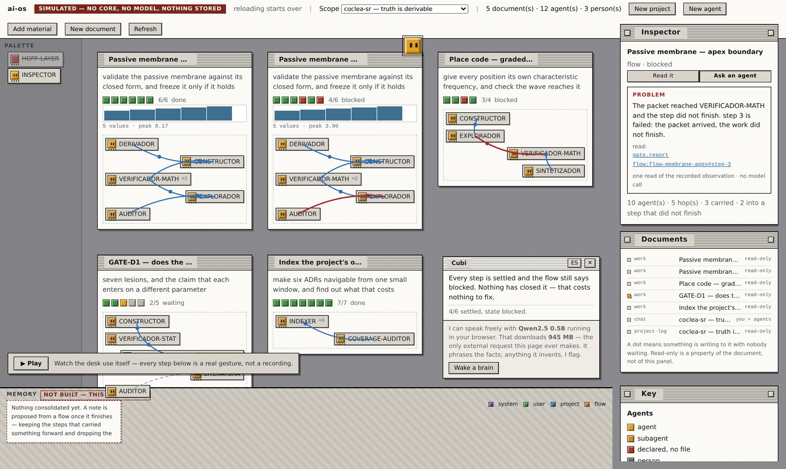

# ai-os

**Why another agent framework?** It isn't one.

> Everyone can generate. Almost nobody can tell you, six months later, whether the
> number in their README is still the number their code produces — **and prove it
> to a stranger.**

ai-os is the layer that makes agent work checkable by something that is not
another model, and keeps it checked. It is
**an agent-based operating system**, built on [QM](https://github.com/yc-software/qm),
and the operating-system part is *how*; the sentence above is *why*.

| | |
|---|---|
| **Truth from outside the code** | `truth/` must not import `src/`. The value a gate checks **cannot be produced by the code under test** |
| **A kernel that ignores the language of the work** | Python writes a JSON gate report; a TypeScript kernel parses, summarises and decides, and runs nothing |
| **"Did not run" is not "passed"** | the freeze verdict returns `blockers` and `unknown` separately and refuses on either |
| **Attestation, not assertion** | content-addressed runs, a hash-chained ledger, `make reproduce`, and the environment recorded in the artifact |
| **Every published number tied to its producer** | five of the nine numbers on this page and in `doc/` are checked against the artifact that produced them, nightly |

**The strong version of that argument is false and we are the ones who measured
it.** `physics-verifiers` gave a frontier model twelve fabricated physics results
and nine subtly defective ones. It caught **all of them, twice**
([results](https://github.com/EvolvingAgentsLabs/physics-verifiers/blob/main/experiments/judge_vs_physics/RESULTS.md)).
So the claim is narrower, and it is the part that survives: **a model can judge a
task but cannot generate one with a known answer** — you do not create truth by
asserting it — and **a judge that is right every time still hands you no ledger,
no freeze and no reproduction command.**

**What it is worth, measured rather than argued.** The checkers were finished on
2026-08-23 and run by somebody who had never run this system. In one day they
found a published count wrong in thirteen places for six days; an **attested
report that could not have been produced by the code committed beside it**; a
statistic that moves with a library version rather than with the data; a
transposed table nobody had compared to its own artifact; and a defect in the new
instrument itself. Neither project could be started from its own documentation.
None of it was reachable by reading — [19 §7](doc/19-what-would-make-this-matter.md#7--what-running-p0-found-on-the-same-day).

**And the workload that makes it real.** `projects/coclea-sr` took a 1995
biophysics hypothesis from mathematics, through a **falsification of its own
model**, to a gated set of falsifiable statements about ear disease and its
treatment — **28 gates / 135 checks, all green [ran]**. The whole arc, and what it
does **not** show, is [doc 18](doc/18-from-a-hypothesis-to-a-therapeutic-surface.md).

Work also outlives the conversation: agents and their sub-agents are markdown
files in a project's own folder, and the interface is a desk you arrange rather
than a chat log. Every claim about whether *that* helps has a measurement
attached too — including the ones that came back saying it did not.

### → **[evolvingagentslabs.github.io](https://evolvingagentslabs.github.io/)** — what it is, and a desk you can use in the browser

<a href="https://evolvingagentslabs.github.io/demo/"></a>

<sub><b><a href="https://evolvingagentslabs.github.io/demo/">Open the demo →</a></b> <b>Horizontal is time and the right edge is now.</b> Each rope is one flow of work; where it sits is which agent is holding it. It starts with you asking, dips through the agents, and — if it finished — comes back to you. Drag left to go back, scroll to zoom, click any rope or bead.<br><br><b>Hue is which thread. Texture is what happened.</b> A hop that carried is lit; one that arrived and was used by nobody goes dark; one still waiting on a verdict frays; and one nobody recorded is <b>not drawn at all</b> — you see the background through it, because <i>did not run</i> is not <i>passed</i>.<br><br><b>And everything that moves is a measurement.</b> Exactly one thing animates on its own: a step that is open right now. When none is, nothing on the page moves — which is the only thing that makes the moving version worth believing.<br><br>Four scopes, all real: <b>coclea-sr</b> (two chains, the same six agents, thirty hours apart — one came home, one stopped at a gate that measured 2.592e-4 against a tolerance of 1.0e-4), <b>hemo-verified</b> (no closed form, so the judge itself is measured: 0.9056 against a kill threshold written down first), and the two scopes that carry a flow which is green and wrong. <b>The orchestration is simulated</b> — no core, no model, nothing stored — but the numbers come from the projects' own artifacts, and <a href="scripts/check-demo-provenance.py"><code>check-demo-provenance.py</code></a> fails the build if any stops matching. To re-derive them yourself, byte by byte, in your browser: <b><a href="https://evolvingagentslabs.github.io/verify/">the verification page</a></b>.</sub>

## Run it

Three processes. The [**manual**](doc/manual.md) has the whole sequence with
screenshots; the short version:

```bash
cd ai-base  && npm ci && node --env-file=.env src/index.ts   # core        :8080
cd ai-flows && node --env-file=../ai-base/.env scripts/serve.ts  # flows   :8097
cd ai-ui    && node scripts/serve.ts                         # the desk    :8098
```

Español: [Correr ai-os](doc/es/manual.md).

## Documentation

| | |
|---|---|
| [**Manual**](doc/manual.md) | Running it, gesture by gesture, with screenshots from a live instance · [es](doc/es/manual.md) |
| [**Specifications**](doc/) | One document per pillar and per problem. These are the specs the code follows |
| [**Decisions**](doc/adr/) | One file per architectural decision, superseded rather than edited |
| [**Next**](NEXT.md) | What to pick up next, and how to get the stack back up |

## State

`ai-base`, `ai-flows` and `ai-ui` run — **626 tests of our own**, on top of the
3,768 `ai-base` carries from upstream. `ai-storage` is specified and not built,
though the first piece of its argument now runs inside `ai-flows`: a project
knowledge base an eight-thousand-token window can navigate — a flat file of the
same material stops fitting at 16 units, the index is still at 4,523 of 8,000
tokens at 2,000 ([05](doc/05-ai-storage.md)).

Both projects' evidence now runs **nightly** in
[`projects.yml`](.github/workflows/projects.yml) — the gates, the ledger, the
report hygiene, H0's reproduction, and every published number checked against the
artifact it came from. Until 2026-08-23 there was no Python in CI at all.

Nothing in this repository describes software that exists unless it says so, and
every screenshot is from a live instance.

## Layout

| | | |
|---|---|---|
| [`ai-base/`](ai-base/) | QM, vendored as a subtree and pulled weekly | MIT, upstream's |
| [`ai-flows/`](ai-flows/) | Flows, composition, the measurement harness, the knowledge base and the [system agents](ai-flows/agents/system/memory/) | Apache 2.0 |
| [`ai-memory/`](ai-memory/) | The memory agents, as a tree that runs as a tree | Apache 2.0 |
| [`ai-ui/`](ai-ui/) | The desk | Apache 2.0 |
| [`projects/`](projects/) | Work running **on** the OS. Two: [`coclea-sr/`](projects/coclea-sr/), Python, **28 gates / 135 checks**, and [`hemo-verified/`](projects/hemo-verified/), whose kill gate survived at AUC 0.906 | Apache 2.0 |
| `ai-storage/` | Not built | — |

`ai-base/` stays byte-identical to upstream. Anything we change there needs a
line in [`ai-base/AI-OS-PATCHES.md`](ai-base/AI-OS-PATCHES.md), and CI enforces
it. Full terms: [licensing](doc/06-licensing.md).

## Languages

English is canonical. Every document has a Spanish mirror in
[`doc/es/`](doc/es/); when they disagree, the English one is right.

---

The primary project of [Evolving Agents Lab](https://github.com/EvolvingAgentsLabs).
Everything else in the organisation is frozen — [why](doc/07-freeze-policy.md).
