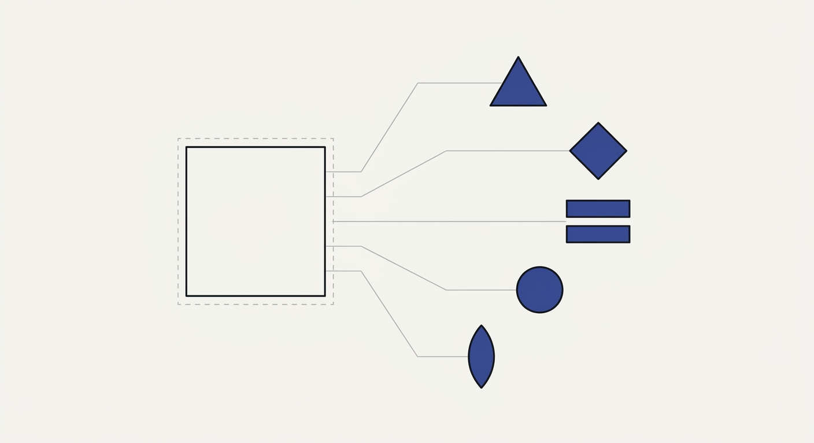

> **FROZEN — 2026-08-01.** Not under development. This repository is kept
> because it is still true, not because it is maintained.
>
> The idea that justified it — versioning an agent's evolution so two branches
> of work can be compared and rejoined — is carried forward in
> **[ai-os](https://github.com/EvolvingAgentsLabs/ai-os)**, the organisation's
> active project, as flow lineage. See
> [`doc/03-ai-flows.md`](https://github.com/EvolvingAgentsLabs/ai-os/blob/main/doc/03-ai-flows.md).
>
> Last verified: 2026-08-01.

# Evolving Agents

<p align="center">
  
</p>

> **The loop is solved. What happens after the fork is not.**
>
> A plugin for the [Claude Agent SDK](https://code.claude.com/docs/en/agent-sdk/overview)
> that versions an agent's evolution — diff it, merge it, refuse to ship it when
> the eval fails.

[](https://opensource.org/licenses/Apache-2.0)

---

## The gap

The Agent SDK runs the loop, ships the tools, manages context, and enforces
permissions. It also branches: `fork` gives you a second session starting from a
copy of the first.

Nothing brings the two back together. There is no merge, no diff between two
sessions, nothing that refuses to promote an agent whose eval regressed, and the
transcript is plain JSONL that anyone can edit. Sessions persist the
*conversation* — the skills, subagents, model and goal that produced it are not
versioned alongside it.

That gap is this repository. Most of it is closed; the last row is not, and it is
the one worth being precise about.

| | Agent SDK | This plugin |
|---|---|---|
| Branch a session | `fork` | — |
| Snapshot code, goal, models and trace as one unit | — | `avcs_commit` |
| Compare two snapshots | — | `avcs_diff`, per dimension |
| Rejoin two snapshots | — | `avcs_merge`, with a `--reconcile` seam for goal and trace |
| Refuse to ship a regression | — | `avcs_freeze`, which fails unless the eval passes |
| Prove a transcript wasn't edited | — | Ed25519-signed commits |
| Keep the trace past compaction | summarised away | archived by the `PreCompact` hook |
| **Diff or merge two forked _sessions_** | — | **not yet — [M1](PLAN.md)** |

The unit `avcs_diff` and `avcs_merge` operate on is an **agentvcs commit**, not an
SDK session. Both work today, and neither will take two session IDs: a session is
an append-only event log, and the adapter that turns one into something mergeable
does not exist yet. Two forked sessions do share a prefix, so the common ancestor
is findable — the open question is what a *conflict* means when both branches are
conversations that reached different conclusions about the same file.

That adapter is [M1](PLAN.md), it has not started, and it is the reason this
repository exists rather than a detail of it.

## Install

```python
from claude_agent_sdk import query, ClaudeAgentOptions

options = ClaudeAgentOptions(
    plugins=[{"type": "local", "path": "/path/to/evolving-agents/plugin"}],
)
```

Full details in [`plugin/README.md`](plugin/README.md). The MCP server has **zero
runtime dependencies** — standard library only, with a test that fails if that
ever stops being true.

## What is here

| | |
|---|---|
| [`plugin/`](plugin/) | The Agent SDK plugin: MCP server + three hooks |
| [`packages/agentvcs/`](packages/agentvcs/) | The version control itself — 220 tests, no dependencies. **Not on PyPI**; install from source |
| [`packages/memory/`](packages/memory/) | Structured recall above the SDK's flat `.claude/` memory files. Works; measures no better than naive matching — see [PLAN.md](PLAN.md) |
| [`demos/robot/`](demos/robot/) | A 2D robot that evolves its own skills, versioned with agentvcs |
| [`legacy/eat/`](legacy/eat/) | The Evolving Agents Toolkit, 2025. Kept readable; see below |

## Why this repository has a 2025 in it

It was the Evolving Agents Toolkit: 18,680 lines across twelve subsystems — a
component library, an agent bus, smart memory, an evolution loop, and a
governance layer called Firmware. Backed by MongoDB Atlas.

It had **three test functions.**

That number is the story. EAT was not a product that failed; it was an
architecture written down and never pinned to anything that could contradict it.

Most of it is now deleted, because the SDK does it better —
[`docs/WHAT-WAS-DELETED.md`](docs/WHAT-WAS-DELETED.md) lists the 10,165 lines and
what replaced each one. `Firmware` asked a model to *"never use dangerous
imports"* in a string; a `PreToolUse` hook returning `permissionDecision: "deny"`
stops the call whatever the model decided. We do not ship our own version of a
problem that is already solved.

What survives in `legacy/eat/` is the ancestry of what ships today. Read
`evolution/` if you read one thing: 337 lines that closed the loop between an
agent changing and that change being kept, with nothing to verify the change was
an improvement. `avcs_freeze` is the same idea with the missing half added.

## Evidence

Claims here are measured, including the ones that came back flat.

- **The dual-embedding resolver does not help.** EAT indexed every component
  twice — once for what it is, once for what it is *for*. Rebuilt and measured:
  80% acc@1 either way, no difference. The second axis is genuinely distinct
  (`cosine = 0.753`); it just buys nothing on a modern encoder.
- **This organisation's "byte-identical wire format" claim was wrong.** Two of
  three opcode regexes matched; `HALT` had diverged in a way that changes what
  parses. Found by writing the test instead of repeating the sentence.

## Breaking change

`pip install git+https://github.com/EvolvingAgentsLabs/evolving-agents` no longer
installs an `evolving_agents` package — this is a monorepo now. Install what you
want by name:

`agentvcs` was never published to PyPI — the release workflow exists but its
Trusted Publisher was never registered, so `pip install agentvcs` returns 404.
Install from source:

```bash
pip install "git+https://github.com/EvolvingAgentsLabs/evolving-agents#subdirectory=packages/agentvcs"
```

The 2025 package sits at `legacy/eat/` with its original `setup.py`, unchanged.

---

<sub>By [Matias Molinas](https://github.com/matiasmolinas) and
[Ismael Faro](https://github.com/ismaelfaro) · Apache 2.0</sub>
