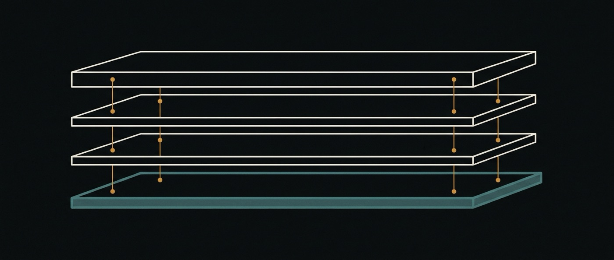

# 01 · Architecture



<sub>Four layers, joined at a few precise points.</sub>

> **Reference.** The system as it runs, and where the parts that do not run attach.


## The stack

```
┌──────────────────────────────────────────────────────────────┐
│  ai-ui          intelligent canvas · OS-level interface       │
│                 (HTTP plugin over core, like QM's web-ui)     │
├──────────────────────────────────────────────────────────────┤
│  ai-flows       flows · steps · resumption · fork & merge     │
│                 (new service in core + flow store)            │
├──────────────────────────────────────────────────────────────┤
│  ai-storage     memory: system / user / project / flow        │
│                 (MemoryService implementation + scope kinds)  │
├──────────────────────────────────────────────────────────────┤
│  ai-base (QM)   harness · scopes · sandbox · identity ·       │
│                 policy · audit · surfaces · deployment        │
├──────────────────────────────────────────────────────────────┤
│  Postgres · Node 24 · Fastify · per-scope sandboxes           │
└──────────────────────────────────────────────────────────────┘
```

Each pillar attaches at a *different* kind of seam, and the difference matters
for how expensive each one is to build and to maintain against a moving upstream.

## Where each pillar attaches

| Pillar | Attachment | Cost of upstream drift |
|---|---|---|
| `ai-storage` | Implements QM's existing `MemoryService` interface, registered in `src/wiring.ts` | **Low** — interface is stable and narrow |
| `ai-ui` | HTTP plugin over the core API, using the plugin chassis contract | **Low** — plugins never import core (enforced upstream) |
| `ai-flows` | **Own package over the signed HTTP API** + own `flow_` store. Was "new service inside core", cost **High**, until the seam was read — [ADR-0006](adr/0006-ai-flows-lives-outside-core.md) | **Low** — it imports nothing from `ai-base` |
| `ai-base` | Is the upstream | n/a |

### What `ai-storage` actually attached to, which is not this row — 2026-08-24

The row above says **implements QM's `MemoryService`, Postgres, low drift**. What
was built is a **filesystem store around a local model**: `FileStore` with an
atomic write and a journal, notes as JSON on disk, an index that splits when it
exceeds a token budget, and five specialists. It implements no upstream
interface, touches no Postgres table, and is registered in no wiring file.

That is a divergence from the plan, and it is recorded rather than edited away
because the reason is worth keeping. `MemoryService` is keyed by scope and
returns whole documents; [22 §17](22-ai-storage-qwen.md#17) is built on a
guarantee that interface cannot express — **a read that does not fit is refused,
never truncated** — and the refusal has to reach the caller as an event. A
`get(scope)` that returns a string has nowhere to put `MEMORY_CONTEXT_LIMIT`.

So the row is not yet wrong about the *attachment*; it is a plan that has not
been executed. Sitting behind `MemoryService` is still the right end state, and
what has to happen first is an adapter that can express a refusal. Until that
exists, `ai-storage` is a package the rest of the system does not import — which
is the honest cost of the divergence and the reason it is written down here.

That table is the actual architecture decision, and one row of it changed on
2026-08-02. It used to read that `ai-flows` requires cutting into core — the
stated reason the fork exists ([ADR-0001](adr/0001-fork-vs-dependency.md)) and
the reason `ai-flows` was said to carry the maintenance burden for the whole
project. Reading the route table rather than the architecture showed the public
API already exposes create, advance, inspect, steer and abort
(`src/api/routes/turns.ts:154-161`), which is the whole of M2, so **all three
pillars are now built without forking anything** ([ADR-0006](adr/0006-ai-flows-lives-outside-core.md)).

That does not retire the fork. `ai-base` still carries two recorded patches, the
scope-kind widening of [ADR-0003](adr/0003-storage-scope-axis.md) is still
planned, and later milestones may need a route that does not exist yet. It does
mean the burden is a good deal smaller than this document asserted, and that
[ADR-0001](adr/0001-fork-vs-dependency.md)'s scheduled re-evaluation should be
made with that correction in hand.

**Design rule that falls out of this:** anything that *can* be built against a
public seam is built against a public seam, even when editing core would be
quicker. Every line added to `ai-base/src/` is a line we merge by hand forever.

## The three seams, verified

Read at `ai-base` commit `7f2c916`.

### 1. `MemoryService` — the storage seam

`ai-base/src/memory/memory-service.ts:28`

```ts
export interface MemoryService {
  recall(scopeId: ScopeId): Promise<string>;
  capture(scopeId: ScopeId, facts: string[], at: number, author?: string): Promise<number>;
  query(scopeId: ScopeId, q: string, limit?: number): Promise<string[]>;
  read(scopeId: ScopeId): Promise<string>;
  replace(scopeId: ScopeId, content: string, author?: string): Promise<void>;
  readHead?(scopeId: ScopeId): Promise<MemoryHead>;
  replaceIfRevision?(scopeId, content, revision, author?): Promise<boolean>;
  history?(scopeId: ScopeId, limit?: number): Promise<MemoryRevision[]>;
  restore?(scopeId, revision, expectedRevision, author?): Promise<boolean>;
  updatedAt?(scopeId: ScopeId): Promise<number | undefined>;
  metadata?(): Promise<Map<ScopeId, { bytes: number; updatedAt?: number }>>;
}
```

Five required methods, keyed by scope, plus optional revision history with
optimistic concurrency (sha256 revision tokens). `ai-storage` implements this.
Two existing implementations to study: `memory-service.ts` (workspace-backed)
and `postgres-memory-service.ts`.

Alongside it, `src/memory/strategy.ts:14` defines `MemoryStrategy` —
`onTurnEnd` / `maintain` / `promptLines` — with four shipped strategies
(`per-turn`, `scratch-promote`, `agent-only`, `consolidation`). Consolidation
across levels is a strategy, not a new subsystem.

### 2. The plugin chassis — the UI seam

`ai-base/plugins/chassis/package.json` states the contract in its own
description: *"source-auth signing, the signed core-client helpers, small
node:http request/response helpers, error helpers, and the common `CORE_*` env
block… never imports core."*

Four plugins ship against it: `web-ui`, `admin`, `portal`, `auth`. `ai-ui` is a
fifth. The existing `web-ui` is Vite + Lit + `dockview-core` + `@earendil-works/pi-web-ui`
— `dockview-core` is a docking/panel layout engine, which is the closest thing
upstream has to a canvas and a reasonable starting point rather than a rival.

### 3. `Harness` — the model seam

`ai-base/src/harness/harness.ts:167`. `profile` / `turns` / `models` / `tools`,
constructed through `defineHarness()`. Six implementations ship: `claude`,
`codex`, `opencode`, `pi`, `mock`, `replay`.

ai-os does **not** add a harness. This seam is listed because it constrains
`ai-flows`: a flow step must be expressible as a `HarnessTurnInput` and its
result read from a `HarnessTurnResult`, or the flow engine ends up welded to one
model vendor — which is the thing QM deliberately avoided.

## Where ai-flows cuts into core

There is no flow engine to extend. Verified: `src/processes/` is *OS process
reaping inside the sandbox* (`process-reaper.ts` sends TERM then KILL), not
workflow. What exists is one layer down:

| Subsystem | What it does | Why it is not a flow engine |
|---|---|---|
| `src/runs/` | Executes one turn; run store, signals, activity, tool ledger | Scoped to a single turn |
| `src/tasks/` | **Records subagent executions** — states, an event log, CAS transitions | Owned by the harness, bound to one `originRunId`, empty on half the harnesses. See below |
| `src/triggers/` | Webhook / monitor / consent triggers | Starts turns; does not sequence them |
| `src/monitors/` | Watch broker, poller and store (489 lines) | Fires on external change; does not carry work forward |
| `src/cron/` | Scheduled firing | Starts turns on a clock |
| `src/sessions/` | Conversation persistence, entries, leases, fork | Append-only event log |
| `src/core/turn-resume.ts` | **Resumes an interrupted turn** — `findTrailingPartialTurn`, attempt counting, a `turn.resume` audit action | Recovers *one turn* after a crash; carries nothing across turns |

So `ai-flows` is genuinely new construction, not a re-skin — and it must
*compose* these rather than replace them: a flow step ultimately becomes a run,
a flow can be woken by a trigger, a monitor or a cron, and a flow's conversation
is a session.

**Two corrections worth stating plainly**, because the first version of this
document got both wrong and one of them shaped an ADR:

- `src/tasks/` is not a to-do list. It is the **subagent execution tracker**:
  `pending | in_progress | completed | skipped | failed`, a `TaskEvent` log with
  `fromStatus`/`toStatus`, and `transitionStatus()` with compare-and-swap. The
  harness writes it from the agent CLI's `task_started` / `task_updated` /
  `task_notification` events. This is the swarm dimension, and it already exists.
  What it changes for us is [ADR-0004](adr/0004-flows-and-the-subagent-record.md).
- QM **does** resume. Not multi-turn work — but a turn interrupted mid-flight is
  recovered, with attempts counted and the resumption audited. Saying "nothing
  resumes" was false.

## The harness capability matrix

This is the constraint that shapes `ai-flows` most, and it is invisible until you
run the thing. Capabilities are **not uniform across harnesses**:

| Harness | Delegation | Agents defined by | `tasks` rows | OpenRouter models |
|---|:--:|---|:--:|:--:|
| `pi` (default) | **yes** | **the workspace** (`agents/*.md`) | no | **yes** |
| `mock` | no | — | no | yes |
| `claude` | yes | the harness (3 fixed) | yes | no |
| `codex` | yes | the CLI | yes | no |
| `opencode` | yes | the CLI | yes | no |

Delegation column: `pi-tools.ts:2415` defines a `delegate` tool, admitted to the
tool list only when the harness supplies `runChild`, which `pi-harness.ts:1345`
does. `tasks` column: references to `TaskStore` per harness — `pi` and `mock`
have zero; `claude` and `codex` have three each, `opencode` two. Right column:
`selectableCatalogForHarness` (`model/model-catalog.ts:109`) admits
`provider === "openrouter"` only for `pi` and `mock`. **[read]**

**Corrected 2026-08-06.** This table previously read "Subagents + `tasks`" as one
column and concluded *"the two columns never overlap — a cheap or non-Anthropic
model and subagent fan-out cannot be had at the same time."* That conclusion is
no longer true, and it was load-bearing for
[03-ai-flows § portability](03-ai-flows.md#the-portability-constraint) and for
[08-roadmap](08-roadmap.md). The upstream commit that broke it is named
`Agents as markdown, and subagents on the harness that reaches cheap models`.
Conflating delegation with `tasks` is what let one column go stale unnoticed;
they are now separate columns because they are separate capabilities.

What survives of the old claim: **`pi` delegates but records nothing.** It writes
no `tasks` rows, so on the default harness a subagent's execution leaves no
durable trace — only the child's returned report, folded into the parent's turn.
ADR-0004's enforcement still holds for the opposite reason than intended: the
flow suite runs on `mock`, which has neither delegation nor `tasks`.

**The column that matters most for anything above the turn is the third.** On
`pi`, an agent is a markdown file in the scope's own workspace —
`agents/<name>.md`, frontmatter declaring `description` and `tools`, body as
instructions, parsed by `parseAgentDefinition` (`agents/agent-definition.ts`).
`pi-tools.ts` is the **only** caller of that parser in the tree **[read]**: on
`claude` the three child agents are hardcoded at `claude-harness.ts:341`
(`research`, `code`, `consult`), and `codex` / `opencode` delegate inside their
own CLI. So a workspace that defines its own agents as files is a `pi` fact, not
a base fact — see [12-conformation](12-conformation.md#the-inert-folder).

Every harness that delegates bounds the tree at one level. On `pi` the mechanism
is explicit and is one line: the child's tool set is built without `runChild`,
"which is what denies it `delegate`" (`pi-harness.ts:1313-1318`), and
`CHILD_POLICY` states it in prose — *"You cannot delegate further."*

## The lineage gap, and why it belongs to ai-os

`forkSession` (`src/api/app-sessions.ts:392`) copies entries up to `upToSeq` into
a fresh session. Grepping the whole tree for `forkedFrom`, `parentSessionId` and
`upToSeq` returns only the fork call sites and an audit row
(`action: "session.fork"`). **Nothing persists the parent.**

The same shape appears in skills: `src/skills/skill-store.ts:142` does
`s.version += 1` on update — a monotonic counter with no prior version retained,
so there is no diff and no rollback.

Both are the same missing idea: *branching without lineage*. ai-os needs lineage
for flows anyway (fork a flow, compare two attempts, merge the good one). The
design consequence is stated in [03-ai-flows](03-ai-flows.md): **flow lineage is
built in `ai-flows` as a first-class property, and the session-level fix is
offered upstream as a small, separate, human-written proposal** — recording
`forkedFrom: { sessionId, upToSeq }` — rather than being smuggled in as part of
our fork.

## Data ownership

| Data | Owner | Store |
|---|---|---|
| Identity, scopes, grants, audit | ai-base | Postgres (upstream schema) |
| Sessions, entries, runs | ai-base | Postgres (upstream schema) |
| Skills, packs, bundles | ai-base | Postgres (upstream schema) |
| **Flows, steps, flow lineage** | ai-flows | Postgres, **new tables, `flow_` prefix** |
| **Memory at four levels** | ai-storage | Postgres, new tables, behind `MemoryService` |
| Canvas layout, view state | ai-ui | Per-scope, via core API |

New tables are prefixed and never alter upstream tables. A migration that
touches an upstream table is a merge conflict waiting in every future pull, and
is treated as a design failure rather than a shortcut.

## Open questions

These are unresolved and deliberately not answered yet, because answering them
before the first flow runs would be guessing:

1. **Is a flow step a turn, or can it be a plain function?** Making every step a
   model turn is expensive and sometimes absurd; making steps arbitrary code
   turns the flow engine into a general workflow runtime, which is a much larger
   project.
2. **Does a flow own a session, or reference many?** Owning one is simpler;
   referencing many is what multi-agent work actually looks like.
3. **What is a conflict when two forked flows disagree?** Two files edited is
   easy. Two conclusions reached about the same file is the interesting case and
   the one no existing tool answers.
4. **Does scoped memory beat one flat file?** Open, and the design must survive
   the answer being *no* — it has been *no* before, on a closely related claim.
