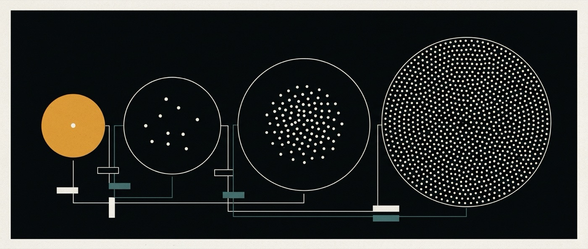

# 09 · Scales — who a flow belongs to



<sub>Individual to system — one axis, and it is the scope.</sub>


> **Reference.** The axis is specified. Only the individual scale is in M2 scope.
>
> This document exists because the same question was about to be answered twice —
> once for flows, once for memory — with two different vocabularies. It is
> answered once here, and both pillars point at it.

## The question

Work happens at four social scales, and both `ai-flows` and `ai-storage` need an
answer for each:

| Scale | The work |
|---|---|
| **Individual** | one person and their agents |
| **Collective** | a group of people working together |
| **Project** | sustained work with a roster, spanning one or more groups |
| **System** | the whole deployment |

The tempting move is to define six flow shapes × four scales and four memory
levels × four scales. That is twenty-four shape definitions and sixteen memory
cells written before a single flow has run, which is the exact failure this
organisation has already recorded once ([README house rule 4](README.md#house-rules)).

This document does the cheap thing instead: it establishes that **the scale axis
already exists in the base**, names what upstream already implements at each
scale, and specifies only the four questions a scale has to answer.

## The finding: the scale axis is `scopeId`

QM's scope kinds are a closed union — `ai-base/src/types.ts:12` **[read]**:

```ts
const SCOPE_KINDS = ["personal", "channel", "team", "org", "group"] as const;
```

A `ScopeId` is `"<kind>:<ref>"` and it is the single key for memory, files,
keychain view, permissions, crons and sandbox ([ADR-0003](adr/0003-storage-scope-axis.md)).
The flow model already carries one on its first line ([03](03-ai-flows.md), the
model block: `Flow ├─ id, scopeId, title`).

**Decision: the scale of a flow is its scope. There is no second taxonomy.**
Recorded as [ADR-0005](adr/0005-scale-is-scope.md).

The reason is the same one that killed the fake-scope alternative in ADR-0003: a
parallel classification means two answers to *"who can read this"*, and the one
that loses is always the one the permission check does not consult.

## What upstream already implements at each scale

| Scale | Scope | Membership comes from | Evidence |
|---|---|---|---|
| Individual | `personal:<principalId>` | the principal itself | `types.ts:25` |
| Collective | `group:<ref>` · `channel:<ref>` | the directory — `listGroupsFor`, `listChannelsFor` | `app-helpers.ts:339-348` |
| **Project** | **`group:web-project-<id>`** | a `Project` record with `ownerId` + `memberIds` | `projects/project-store.ts:11,47` |
| System | `org:<orgId>` | the deployment | `app-helpers.ts:334` |

All four **[read]**.

### The correction this document makes to 05

[05-ai-storage](05-ai-storage.md) maps the project level to `team` / `channel`.
That is wrong, and the right answer is more useful than the wrong one:

**A project in QM is a group scope with a reserved ref prefix.**

```ts
const PROJECT_GROUP_PREFIX = "web-project-";
export function projectScopeId(id: string): ScopeId {
  return scopeId("group", projectGroupRef(id));
}
```

`project-store.ts:9,43-49`. There is a `ProjectStore` with `create`,
`listForMember`, `addMember`, `removeMember`, `withRosterLock` and a `version`
per roster (`project-store.ts:27-41`) **[read]**. The project scale is not
something ai-os has to invent; it is something ai-os has to *not reimplement*.

`team:` is a different thing entirely: it comes from `Principal.teamIds`
(`types.ts:8`), populated by identity, and is derived per viewer at
`app-helpers.ts:333`. Identity-provider teams, not project rosters.

There is also a live asymmetry worth knowing before leaning on either kind:

```ts
isManageableCreationScope → kind === "channel" || kind === "team"   // types.ts:36
isSharedScope             → kind === "channel" || kind === "group"  // types.ts:42
```

The two helpers disagree about `team` and `group`. A "project" answered by
`team:` is manageable but not shared; answered by `group:` it is shared but not
manageable. Picking the wrong one produces a permission answer that looks right
in one call site and wrong in the other.

## The four questions a scale must answer

Not six shapes per scale. Four questions per scale, and a shape inherits its
scale's answers:

1. **Who can advance it** — who may cause the next step to run
2. **Who can see it** — the read boundary, which is the ACL, not a UI filter
3. **Where its memory promotes** — the next level up, and whether promotion is
   automatic (see [05](05-ai-storage.md#promotion): automatic is allowed,
   unrecorded is not)
4. **What happens when two participants collide** — the one that theory gets
   wrong, because the base has already decided part of it

| Scale | Advance | See | Memory promotes to | Collision |
|---|---|---|---|---|
| Individual | the owner | the owner | user level | none possible — one participant |
| Collective | any member in scope | scope members | user (built) and project (unbuilt) | `steer` into the live run — see below |
| Project | any roster member | roster members | system (unbuilt) | roster version guard — see below |
| System | operators only | everyone | terminal | out of scope until a system scope exists |

The unbuilt cells are marked unbuilt on purpose. This table is a specification of
*where the answers go*, and three of them are currently empty.

## Three constraints the base has already decided

Every collective answer above is bounded by these. All **[read]**, and none of
them are visible from the documents alone — which is the argument for keeping
this section short and the theory shorter.

### 1. One run at a time per session

The claim query in `postgres-run-store.ts:149`:

```sql
SELECT id FROM runs WHERE status='pending'
  AND session_id NOT IN (SELECT session_id FROM runs WHERE status='running')
ORDER BY created_at ASC FOR UPDATE SKIP LOCKED LIMIT 1
```

Runs are serialised per session. **Collective does not mean concurrent.** Two
members of a group cannot have two runs executing against the same session, ever.
Concurrency at the collective scale requires the flow to span several sessions,
which is [03's open question #2](03-ai-flows.md#open-questions) — and this
constraint is what makes that question load-bearing rather than a matter of
taste.

### 2. The multiplayer primitive that exists is `steer`, not parallelism

```ts
export type RunSignalKind = "abort" | "steer";   // run-signal-store.ts:3
```

A second message arriving at a live run is routed as a signal into it
(`app-turn.ts:326-338`) and applied mid-turn (`run-signal-store.ts:80`). So the
shape of collective work upstream already supports is **interleaving through one
live run**, not parallel execution. A flow that wants two people acting at once
is not extending this primitive; it is asking for a different one.

### 3. Roster changes invalidate in-flight work

```ts
async function withCurrentProjectRoster<T>(fn) {            // app-turn.ts:102
  return (await deps.projects.withVersion(conversationRef, projectVersion, fn)) ?? null;
}
```

If the roster version moved, the turn is **refused**: `"project membership
changed; retry from the current project"` (`app-turn.ts:337`). Upstream has
already decided that a membership change mid-work is a refusal rather than a
silent continue. Flows inherit this; they do not get to re-decide it, and a flow
engine that enqueues runs must go through the same guard.

## Memory, by the same axis

The four levels of [05](05-ai-storage.md#the-four-levels) are this same axis,
plus one level below it:

| Level | Scale | Exists today |
|---|---|---|
| System | system | `org:` only; no `system` kind — [ADR-0003](adr/0003-storage-scope-axis.md) |
| Project | project | yes, as `group:web-project-<id>` |
| User | individual | yes, `personal:` |
| Flow | below every scale | **no** — no `flow` scope kind exists |

One promotion arrow is already built, and 05 does not say so:

```ts
export function ccTargetFor(origin, actorId): ScopeId | null   // memory-service.ts:158
export async function ccCaptureToPersonal(...)                 // memory-service.ts:166
```

A fact learned in a shared scope is copied to the acting person's `personal:`
scope, with the source labelled. It fires only for `channel` / `group` origins
and never for system actors, and it is wired into two of the three memory
strategies (`per-turn.ts:140`, `scratch-promote.ts:167-170`) **[read]**.

That is the `project → user` arrow of 05's promotion diagram, in production,
today. The arrows that do **not** exist are `flow → project` and
`project → system` — and the first cannot exist until a `flow` scope does.

## What M2 touches

**One cell.** Individual scale, `personal:` scope, one session, `Open` shape
([08-roadmap M2](08-roadmap.md)).

| Cell | Status |
|---|---|
| Individual × `Open` | **M2** |
| Collective × `Open` | after M2, and gated on open question #2 |
| Project × any shape | after the roster guard is exercised by a flow |
| System × any shape | needs a `system` scope kind — ADR-0003, untested |
| Any scale × the other five shapes | M6, and only when real work demands one |

Writing the other cells now would mean specifying handoff semantics for scales
whose concurrency model is an open question. The order is deliberate: the
individual cell is the one that falsifies `ai-flows` at all ([03 § How this gets
falsified](03-ai-flows.md#how-this-gets-falsified)), and if a flow does not beat
a session for one person, the collective cells are decoration on something that
does not work.

## The assumptions this document rests on

Stated because the alternative — a theory document whose assumptions are implicit
— is how the first pass of `doc/` acquired seven material errors in a single
hour of actually running the base ([02 § What running it changed](02-ai-base.md#what-running-it-changed)).

| # | Assumption | Status | The check that settles it |
|---|---|---|---|
| 1 | Adding `flow` / `system` to `SCOPE_KINDS` **fails closed** in every ACL path | **tested — and it did not hold** **[ran]** | `ai-base/test/scope-kind-fail-closed.test.ts`. See below |
| 2 | A step is a model turn | open ([03 #1](03-ai-flows.md#open-questions)) | the first step that only renames a file |
| 3 | A flow may span several sessions | open ([03 #2](03-ai-flows.md#open-questions)) | forced by constraint 1 above; settle it before the collective cell |
| 4 | A project may span **one or more groups** | **false today** — a project *is* one group (`project-store.ts:47`) | needs a new relation and therefore a new ADR; do not assume it in any design |
| 5 | Every scope kind gets its own `MEMORY.md` | **[read]** (`memory-service.ts:6`), observed for `personal:` only **[ran]** ([02](02-ai-base.md#what-running-it-changed)) | write to a `group:` scope and look on disk |
| 6 | The scales differ from each other in a way that matters | **unproven** — see falsification | the four-question table, filled from real flows |

### Assumption 1, run

ADR-0003 called this "the first thing to test". It was tested before the widening,
and **it was false** — not for the kinds ai-os plans to add, but already, today:

`actorMayReadScope` (`triggers/run-trigger.ts`) ended with
`if (kind !== "channel") return true`, so a cron or monitor whose `ownerScopeId`
did not parse — malformed, or merely miscased as `PERSONAL:U1` — **ran the turn
for an actor with no membership evidence anywhere.** `currentScopeMembers`
returns `undefined` for any kind it does not recognise, and the caller reads
`undefined` as "fall back to `actorMayReadScope`", which said yes.

Fixed by enumerating the kinds it grants; identical behaviour for all five
current kinds. The rest of the ACL surface was already correct — every decision
in `resolution/scope-membership.ts` ends in `return false`.

**What this buys the scale axis** is a mechanism rather than a reassurance: the
test carries a census asserting `SCOPE_KINDS` holds exactly the five upstream
kinds, so the day the widening lands, the test fails and its author has to give
`flow` and `system` an explicit decision instead of letting them inherit a
default. That is the guard ADR-0003 asked for, and it runs as its own CI job —
`Fail-closed scope guard` in `.github/workflows/ci.yml`, named separately from
the five test shards so its failure is unmissable rather than buried.

**The general lesson, worth more than the bug:** the fail-open was in a
fall-through, not in a permission function. Nothing in the four-question table
would have found it, because the table describes what each scale *should*
answer — and this code never asked.

Assumptions 1 and 4 are the load-bearing ones. **4 is the one that contradicts a
stated goal**: "a project spanning one or more working groups" is not a thing the
base can express today, and the honest version of that requirement is a new
relation between `Project` and several `group:` scopes, argued in its own ADR
when a real project needs it.

## How this gets falsified

**The claim:** the four scales answer the four questions *differently*, and the
difference is what a single flat scope cannot express.

**The measurement:** once flows run at more than one scale, fill the four-question
table from behaviour rather than from design. If every scale answers all four
questions identically, the axis is bookkeeping — **this document should be
deleted and the scale collapsed back into `scopeId` with no ai-os semantics on
top**, not defended.

**The narrower claim, and the one worth watching first:** at the collective
scale, someone other than the flow's creator advances it. If, across real work,
nobody ever picks up a flow they did not start, the collective scale is unused
weight regardless of how well it is specified — and the handoff contract in each
shape definition ([03](03-ai-flows.md#flow-shapes)) is the thing being falsified,
not this document.
