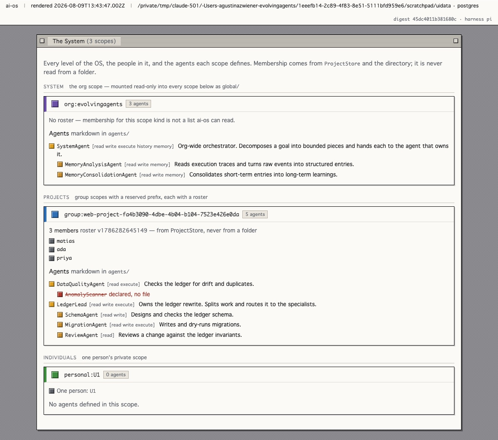

# 12 · Conformation — the shape of the system, and who can see it


<sub>Scopes, the agents inside them, and the threads between — two of which end nowhere.</sub>


> **Reference.** The projector is built, tested and run **[ran]**. It returned
> five holes against a real base, listed in § What the projector found. No new
> folder exists, and none may exist until a hole names it.

An operating system lets you see its own shape. You can open the process list,
walk the filesystem, ask who is logged in. ai-os today cannot answer any of those
questions about itself: there is no way to see which scopes exist, which agents a
project has defined, who is on its roster, or who has said what to whom. The
information exists — almost all of it, in stores that already run — and nothing
projects it.

This document is about that gap, and about a mistake that is very easy to make
while closing it.

## The mistake this document exists to prevent

The intuitive move is to design a folder hierarchy: a project directory holding a
`users/` folder, an `agents/` folder, and under each orchestrator agent a
`subagents/` folder. It reads like Windows' system directory or a repository's
`.git`, and the analogy is a good one for *artefacts*.

It is the wrong analogy for *people*. A `users/` folder in a project is a list of
who belongs to that project, and

> **[ADR-0005](adr/0005-scale-is-scope.md), on the same idea in a different
> shape:** "it is an ACL that no ACL function reads. Membership belongs to the
> directory and the project store; a flow that keeps its own copy has a stale
> copy the moment someone is removed."

The failure is not that the folder is redundant. It is that the folder is a
*second answer* to "who may read this", and the two answers diverge silently —
the one that loses is the one nobody sees losing. This organisation has already
found one fail-open of exactly that shape, and it was in a fall-through rather
than in a permission function (`triggers/run-trigger.ts`, recorded in
[09-scales](09-scales.md)).

**The rule, stated once and then relied on everywhere below:**

> A scope's folders hold agents, skills, artefacts and memory.
> **They never hold membership.** Membership is projected from `ProjectStore` and
> the directory at read time, never stored beside the work.

## The folder structure already exists

It is not a design task. It is `resolution/resolution-service.ts:37-45`, and it
is three lines **[read]**:

```ts
const layers: WorkspaceLayer[] = [
  { scopeId: orgScope, mountPath: "global", mode: "ro" },
  { scopeId: scope,    mountPath: "",       mode: "rw" },
];
if (isDm && actor.teamIds) for (const tid of actor.teamIds)
  layers.push({ scopeId: scopeId("team", tid), mountPath: `team-${tid}`, mode: "ro" });
```

A `WorkspaceLayer` is `{ scopeId, mountPath, mode }` (`types.ts:108`). Every turn
runs against a layered filesystem assembled from scopes, with reserved
directories inside it — `agents/`, `skills/`, `memory/MEMORY.md`.

Read as an OS layout:

| Layer | Is | Mode |
|---|---|---|
| `global/` | the **system** folder — the org scope, mounted into every other scope | read-only |
| `` (root) | the **working** folder — the scope this conversation belongs to | read-write |
| `team-<id>/` | team scopes, in DMs only | read-only |

And a project is not a new object either. `projects/project-store.ts:47`:

```ts
const PROJECT_GROUP_PREFIX = "web-project-";
export function projectScopeId(id: string): ScopeId {
  return scopeId("group", projectGroupRef(id));
}
```

with `create`, `listForMember`, `addMember`, `removeMember`, `withRosterLock` and
a `version` per roster. [ADR-0005](adr/0005-scale-is-scope.md) is explicit:
**"ai-os does not implement a project object."**

So the map from the intuitive design to what runs today:

| The intuition | Where it already is | Status |
|---|---|---|
| Project folder | the `rw` layer of `group:web-project-<id>` | **exists** |
| OS system folder | `global/`, mounted read-only into every scope | **exists** |
| Per-project agents | `agents/*.md` in the `rw` layer | **exists, `pi` only** |
| System agent repository | `global/agents/*.md` | mounted, **unreachable** (below) |
| Project roster | `ProjectStore` + `version` | **exists upstream** |
| Orchestrator with subagents | `delegate` + `agents/<n>.md` | **exists at depth 1** |
| Seeing any of it | — | **nothing** |

The last row is the whole gap. Six of seven rows are built; the one that is
missing is the one that would let anyone find out that the other six are.

## The inert folder

An agent is a markdown file: `agents/<name>.md`, frontmatter declaring
`description` and `tools`, body as instructions, parsed by
`parseAgentDefinition` (`agents/agent-definition.ts`) and handed to `delegate`
(`pi-tools.ts:2444`) which reads it through the scope's own tool context.

`pi-tools.ts` is the **only** caller of that parser in the tree **[read]**. On
`claude` the three child agents are hardcoded (`claude-harness.ts:341` —
`research`, `code`, `consult`); `codex` and `opencode` delegate inside their own
CLI.

**Therefore a project's `agents/` folder is inert on three of five harnesses.** A
team that defines its agents as files is defining them for `pi`. This is not an
argument against the folder — it is the argument for stating the limit in the
projector's output, because a folder that silently does nothing on the harness
you happen to be running is worse than no folder at all.

Note also what `pi` does *not* do: it writes no `tasks` rows, so a delegation on
the default harness leaves no durable trace beyond the child's returned report.
The conformation of a running system is visible; the history of it is not.

## The unreachable repository

`global/agents/*.md` is mounted read-only into every scope. `delegate` cannot
address it.

`agentDefinitionPath(name)` returns `` `agents/${name}.md` `` and `isSafeSkillName`
is `^[A-Za-z0-9](?:[A-Za-z0-9_.-]{0,126}[A-Za-z0-9_-])?$` — no `/`. The global
layer mounts at `global`, so its agents live at `global/agents/<name>.md`, and no
value of `name` reaches them **[read]**.

An organisation-wide agent repository is therefore one regex away from existing.
It is the smallest real widening available and it belongs upstream rather than in
our fork, because it is a coherent upstream feature and not an ai-os concern —
[ADR-0008](adr/0008-conformation-is-projected.md) records it as a proposal, not a
patch.

## Depth, and the line that sets it

"Orchestrator agents, and for orchestrators a folder of subagents" is depth two.
It is denied on purpose, in one line, with the reason written next to it
(`pi-harness.ts:1313-1318`) **[read]**:

> "A delegated agent runs as its own isolated session against the parent's tool
> context, so it shares the workspace and the memory scope but starts with an
> empty conversation. **It is built without `runChild`, which is what denies it
> `delegate` and bounds the tree at one level.**"

and `CHILD_POLICY` states it in prose: *"You cannot delegate further."*

Two things follow. First, the shared workspace means a child already sees the
same `agents/` directory its parent did — the folder of subagents exists; what is
denied is the *recursion*, not the *directory*. Second, lifting the cap is one
argument (`runChild` passed to the child's tool set) with an unbounded
consequence, and it is not an ai-os decision to take quietly inside a fork.
Deferred with a condition in [ADR-0008](adr/0008-conformation-is-projected.md).

## Agents with user-level privileges

`PrincipalType = "internal" | "guest"` (`types.ts:3`). There is no agent
principal, and the two ways to get one differ in kind, not in effort:

- **Impersonation** — the agent acts as a human principal. Cheap, and it destroys
  the audit trail: every question of the form *who did this* becomes
  unanswerable, permanently and retroactively. Rejected.
- **A third principal type** — the agent *is* a principal, with its own
  `personal:` scope, its own memory, its own ACL entries, and its own rows in
  every audit record. Correct, and it edits `types.ts` at the centre of a
  hand-merged dependency.

The second is the right design and the wrong thing to build before the projector
has shown a system where it would be legible. Deferred with a condition.

## What is actually missing: nobody can see any of this



<sub>The projector's output, rendered — a live instance. Every level, its roster, its agent tree. <code>AnomalyScanner</code> is struck through because it is declared in <code>DataQualityAgent.md</code> and has no file: a declared name is a claim, a file is a fact. <strong>[ran]</strong> 2026-08-09.</sub>

Which is a projection problem, not a storage problem. The substrate for the
communication graph is durable and already written: the session tape carries
`kind: "message"`, `author`, `scopeLabel` and `overheard` per record
(`sessions/session-store.ts`), scoped exactly the way permissions are.

Two adjacent stores look like they would serve and do not — both worth naming
because both would produce a graph that quietly loses data:

- `AuditLog` is **in-memory**, capped at 50,000 events, lost on restart
  (`audit/audit-log.ts`) **[read]**.
- `run_activity` carries a TTL and is swept:
  `DELETE FROM run_activity WHERE created_at < $1`
  (`runs/postgres-run-activity-store.ts:30`) **[read]**. It is also exposed on no
  API route ([ADR-0007](adr/0007-observation-captured-not-derived.md)).

So: read the tape, project the graph, and do not build a bus.

## The projector, and how it gets falsified

`ai-flows/src/conformation.ts` — read-only, no new tables, no new scope kinds, no
route. It reads what exists and emits one document:

- **Conformation** — scopes; for `group:web-project-*`, the roster and its
  `version` from `ProjectStore`; per scope, the workspace listing filtered to
  `agents/`, `skills/`, `memory/`; each agent parsed with `parseAgentDefinition`
  so its description and declared tools are shown rather than its filename.
- **Communication** — edges reconstructed from session tape records, actor to
  actor, labelled by scope.
- **Holes** — every place a question was asked and the data did not exist, stated
  as a hole rather than omitted.

The last bullet is the deliverable. A projector that renders a full picture
proves the folders are unnecessary; a projector full of holes specifies exactly
which ones are needed, from evidence rather than from analogy.

> **Falsification, written before running it:** if the projector's output is
> enough for a person to understand and steer the system, then this was a
> projection problem and **no new folder ships** — this document is then a
> paragraph in [09-scales](09-scales.md) and should be deleted as a document.
> If it is not enough, the holes are the specification, and each new folder
> arrives with the hole it fills.

A second condition, narrower and worth watching: the communication graph is only
*analysable* if a repeat can be told from noise. That instrument already exists —
`ai-flows/src/observability.ts`, δ measured at 21.1% raw and 0% normalized
([10-observability](10-observability.md)) — and the graph reuses it. If the graph
needs its own analyser, that is evidence it is measuring something the flow
layer already measures better.

## What the projector found

Run 2026-08-06, `HARNESS=pi`, `deepseek/deepseek-v4-flash`, against a seeded
scope pair plus two real turns **[ran]**. Five holes. Two were expected and
three were not, and the unexpected three are the reason this was built before any
folder was:

**1 · No store answers "which scopes exist".** `SessionStore.distinctScopes()`
lists scopes that have held a conversation; `WorkspaceStore` cannot enumerate
scope ids at all (`list(scopeId)` and nothing else). A scope with files and no
conversation is invisible to every store. The probe recovers it by decoding
workspace directory names and confirming the round-trip through
`scopeStorageKey` — which is lossy, so a name that does not round-trip is
reported undecodable rather than guessed at.

**2 · Nobody authors anything.** *The finding.* `meta.author` on a tape record is
written from `actor.displayName` and from nothing else
(`core/orchestrator.ts:2170`). Two turns, differing in one field:

| Scope | actor | tape records | attributed |
|---|---|---|---|
| `personal:U1` | no `displayName` | 2 | **0** |
| `personal:U2` | `displayName: "Ada"` | 2 | **1** |

So authorship is a **mutable human label, not a principal id**, absent whenever
the surface does not supply one — and the second unattributed record in U2's
scope is the *assistant's own reply*. **The agent, the most active actor in an
agent OS, is anonymous in its own communication record.** A graph that drew those
silently would have merged every distinct speaker into one node and looked
complete doing it. The projector raises a hole instead, and a test fixes the
behaviour.

### Attribution, recovered

Hole 2 turned out to be mostly repairable against the public seam, which is why
it was not patched into core. Upstream already answers "who spoke" — the join
behind `attributedTurns` matches `session_entries` to `participants` within the
membership window (`memory-session-store.ts:494`). It aggregates the answer by
day and never exposes it per record. `attributeMessage` applies the same join and
keeps the per-record result.

Three sources, in precedence order, each labelled on the edge it produces so a
reader can discount it: `declared` (upstream wrote `meta.author`), `role` (an
assistant entry — the agent spoke, no ambiguity possible), `window` (exactly one
membership window covered the record).

Same two turns, re-run **[ran]**:

| | before | after |
|---|---|---|
| attributed | **1 of 4** | **4 of 4** |
| the agent's own turns | 0 of 2 | **2 of 2**, via `role` |
| the human with no display name | unattributed | **`U1`**, via `window` |

The recovered identifier is the **principal id**, which is what a durable graph
needs and is strictly better than the display name `meta.author` would have
carried.

One rule is load-bearing and is where this departs from upstream's own join:
**when several windows cover a record it resolves to `ambiguous`, never to a
pick.** Upstream's aggregate counts one turn under every candidate principal,
which a usage metric tolerates; a communication graph that did it would draw an
edge from somebody who did not speak, and that is worse than drawing none.

What remains is a residual, and it is now the only attribution hole: the recovery
matches on `ParticipantWindow.validFrom` / `validTo`, which are **timestamps**,
while upstream attributes on `validFromSeq` / `validToSeq`, which are **not
exposed**. The two agree except at a window boundary. That is the second of the
two upstream asks.

**3 · A project scope can carry the reserved prefix with no roster behind it.**
`group:web-project-seed` projected as a project and `ProjectStore` returned
nothing for it. The prefix is a naming convention; nothing enforces that a scope
wearing it is registered.

**4 · The system agent repository is unreachable**, as predicted above — one
`org:` agent, addressable by nothing.

**5 · The membership-shaped path was reported, not believed.** The seeded
`users/alice.md` appeared as a finding while the roster came from the roster port
alone. That is ADR-0008's rule executing rather than asserted.

### What running it cost to find

Three defects in the probe itself, none of which a reading would have caught, and
each of which produced a **clean and entirely wrong view**:

- `WorkspaceStore.list` returns **absolute** paths (`workspace-store.ts:61-68`),
  while `delegate` addresses `agents/x.md` relative to the layer root. Wired
  through unconverted, the first run rendered two seeded scopes with no agents,
  no memory and no findings — a confident empty picture.
- The same function is wrapped in `catch { return [] }`, so an unreadable scope
  and an empty scope are indistinguishable from outside.
- `meta.author` was **[read]** off the `TapeMeta` type and assumed filled. A type
  says a field may be present; it does not say the pipeline fills it.

The pattern is the one this repository keeps recording: every instrument that
lied here lied by rendering cleanly. None of the three failed loudly, and the
fixture tests passed throughout — including through two NUL bytes that had
silently replaced the separators in a Map key, invisible until `grep` began
treating the source as binary.

## What this cost to find

Every claim in this document is a `[read]` against a dependency that is pulled
weekly, and one of them — the harness matrix — was wrong in `doc/` for five days
and cited in four places before anyone opened the file
([01-architecture](01-architecture.md#the-harness-capability-matrix), corrected
2026-08-06).

The habit that follows, and it is cheap: **a claim about upstream capability
names the file and line that would have to change for it to stop being true.**
"`pi` has no subagents" named nothing and could not rot visibly. "`delegate` is
admitted only when the harness supplies `runChild`, `pi-harness.ts:1345`" names
the exact line whose deletion falsifies it.
