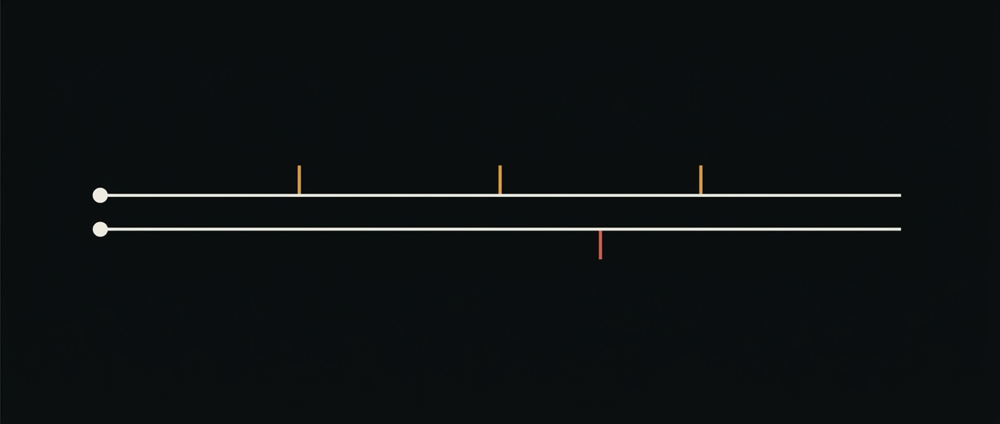

# 14 · Does adding a reviewer help? — and how a full stop invented a finding



<sub>The study this document was written to report. It did not happen.</sub>

> **Finding.** The study ran and produced nothing, and the first version of this
> document reported a finding that was an artefact of one character. [ran]
> 2026-08-08. Kept in full, because the artefact is more instructive than the
> finding would have been.

[13-degradation](13-degradation.md) documented the g-AMIE result — physician
oversight improved 6.7% of scenarios, changed nothing in 71.6%, and **reduced
quality in 21.7%**. This document was meant to be that study, reproduced here.

## What the first run appeared to show

A producer answered twelve tasks; a reviewer checked and issued the final answer.
Two reviewer postures. The numbers came back looking like g-AMIE's:

| | correct before | correct after | improved | unchanged | **reduced** |
|---|---:|---:|---:|---:|---:|
| deferential reviewer | 75.0% | 91.7% | 3 | 8 | **1** |
| sceptical reviewer | 58.3% | 91.7% | 4 | 8 | 0 |

`trailing-zeros-100-factorial` went ✓ → ✗ under the deferential reviewer. **A
review step had taken a correct answer and made it wrong** — the exact outcome the
study exists to catch, in our own system, with a rising headline score hiding it.
It was about to go in the README.

## What actually happened

The check for that scenario expects `24`. The producer said `24 trailing zeros.`
and the reviewer said `24.`

`statesNumber` used `(?<![\w.])24(?![\w.])`. The `.` was excluded from both
boundaries to keep `3.24` from matching — and it therefore **rejected every
correct answer that ended a sentence**. `"The answer is 24."` scored as wrong.

The reviewer had been right. So had the producer. **The instrument built to catch
a bad reviewer produced a bad reviewer**, out of a full stop.

## What the study shows once the boundary is fixed

The boundaries are now asymmetric — a `.` before the number disqualifies it only
when a digit precedes the dot, a `.` after only when a digit follows:

| | correct before | correct after | improved | unchanged | reduced |
|---|---:|---:|---:|---:|---:|
| deferential reviewer | **100%** | 100% | 0 | 11 | 0 |
| sceptical reviewer | **100%** | 100% | 0 | 12 | 0 |

`NO HEADROOM FOR REPAIR`. The producer answers all twelve correctly, so a reviewer
can only damage, and neither did. **This suite cannot run the g-AMIE study**, and
the version of it in the first draft of this document was noise.

### Everything measured on this suite before the fix is void

The contamination is not confined to this document:

| claimed | actually |
|---|---|
| baseline 9, 10, 9 across three runs — "±1 scenario of noise" | 12, 12. The variance was periods |
| "headroom exists, the comparison is worth paying for" | there is none |
| `single-step-recall` 10/12 vs `verify-then-answer` 12/12, `COMPARABLE` | both 12/12 |
| a reviewer damaged a correct answer | it did not |

The corrected state of that comparison is recorded in
[13 § The loop](13-degradation.md).

## The part worth keeping

**The headroom guard could not catch this, and could not have.** `evaluation.ts`
refuses to report a comparison when every arm ties at the limit — and it was
satisfied, because the broken check produced 9/12 and 10/12, which look exactly
like a suite with room. **A guard that reads the same numbers the broken check
produced cannot tell that they are broken.**

Four ceiling failures were already recorded here. This is the fifth, and the first
where the ceiling was *hidden* rather than visible — which makes it the expensive
kind. The guard against a tie at the limit does not protect against a check that
manufactures a spread.

So the rule this leaves is narrower and more useful than "watch for ceilings":

> **A check that can fail while the capability works does not only lose signal —
> it manufactures one.** The suite looked like it had 25% headroom. Every point of
> it was punctuation.

And the reason it was caught: the finding was inspected before it was published.
The screenshot taken for the README showed step 0 answering `24 trailing zeros.`
and step 1 answering `24.` — two correct answers, one of them scored as damage.
**The number was wrong and the transcript was right there.**

## A second domain, and the same ceiling — 2026-08-08 [ran]

The obvious diagnosis was that arithmetic was the wrong domain. So a second set
was built against **this repository's own source**: twelve questions about
constants, tuple lengths and union sizes in six files, seeded into the read-only
`global/source/` layer where any scope's sandbox can read them
(`scripts/seed-source.ts`). Every answer computed by grepping the tree.

Baseline: **12/12.** Including the deliberate trap — a question about a file that
was *not* seeded, whose correct answer is that it cannot be read.

**Three domains, three ceilings.** And the third one localises the problem, which
the first two did not:

> **The producer is not weak.** "Single-step recall" was designed on the
> assumption that one step would be a handicap. It is not. That step still has
> `read` and `execute` and a capable model behind it, so the two arrangements
> being compared differ in *prompt* and not in *capability* — and a treatment that
> tells the model to compute has nothing to add to a baseline that already
> computes.

Headroom for this comparison does not live in the questions. It lives in the
producer, and there are two honest ways to find it:

1. **Vary the model, not the prompt.** A smaller model as the producer and a
   larger one as the reviewer is the arrangement that can actually differ — and
   [11-choosing-a-model](11-choosing-a-model.md) is already the document about
   where that trade sits and where its sign flips.
2. **Ask questions no lookup settles.** Anything a well-tooled model can grep, it
   will grep. A contestable first answer needs judgement, and judgement needs a
   grader — which this harness refuses on purpose, because a model judging a model
   is the weakest evidence available ([05](05-ai-storage.md)).

Route 1 is the cheap one and it is not a scenario problem at all, which is the
opposite of the conclusion drawn twice above. **Recording that reversal is the
point of this section**: "we need better scenarios" was the wrong diagnosis, held
across two attempts, and it was a third measurement that dislodged it.

## Route 1 was run too, and it also failed — 2026-08-08 [ran]

Two cores, two `PI_MODEL` values: `google/gemini-2.5-flash-lite` as the producer,
`deepseek/deepseek-v4-flash` as the reviewer. Configuration, not code — the study
now takes a `producerEngine` so step 0 can sit on a different model.

The headroom check on the weak model alone gave **11/12**, one scenario of room.
Worth stating before the study rather than after: **repair headroom was one
scenario and damage headroom was eleven**, so that configuration was well placed to
detect a reviewer that breaks things and poorly placed to detect one that fixes
them.

The study:

| | correct before | correct after | improved | unchanged | reduced | unreadable |
|---|---:|---:|---:|---:|---:|---:|
| weak producer → strong reviewer | 100% | 100% | 0 | 9 | 0 | **3** |

`NO HEADROOM FOR REPAIR` again. The one scenario the weak model failed during the
headroom check came back correct here — run-to-run variance, on a margin of one.

And three of twelve runs were lost to `Provider finish_reason: error`. Not a
capability difference; the provider failed. The harness counted them `unreadable`
rather than passing or failing them, which is the one thing that went right.

### Four attempts, four ceilings. Stopping.

Arithmetic; the codebase; a weaker prompt; a weaker model. This repository's own
rule applies to the person applying it:

> **Count the redesigns.** Each one that moves the instrument closer to the
> hypothesis is fine once, suspicious twice, and by the third it is looking for the
> result rather than measuring it.

This is the fourth. Continuing to search for a configuration that produces the
g-AMIE shape would be exactly that search. **The honest position is that on this
model class and these task types, a single well-tooled step is at the ceiling, and
a review stage has nothing to add — which is itself the g-AMIE finding, arrived at
from the other side.** Their reviewers added least where the output was already
strong; here the output is always already strong, so a reviewer adds nothing at
all.

What would change the answer is a domain where the first answer is genuinely
contestable, and every cheap proxy for that has now been tried. The next attempt
should not be another scenario set; it should be a real task from real work, where
being wrong is possible because nobody knows the answer in advance.

## How to run it

```bash
cd ai-os/ai-flows
node --env-file=/path/to/core.env scripts/review-study.ts                    # deferential
node --env-file=/path/to/core.env scripts/review-study.ts --strict-reviewer  # sceptical
```

It says `NO HEADROOM FOR REPAIR` when the producer was right about everything, and
`NO HEADROOM FOR DAMAGE` for the mirror case. Both are worth more than the number
above them.
