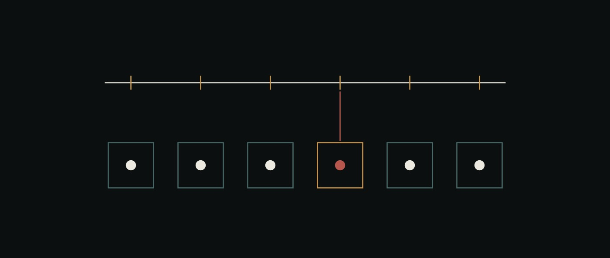

# 16 · A workload with an oracle

The reference never touches the chain. The one red step is red because of a comparison, not because of how it looked.

> **Reference.** `ai-flows/src/gates.ts` runs and is tested against gate reports
> that Python produced — 18 tests, and six of them read the real files off disk.
>
> The `Gated` flow shape this chapter argues for was **built on 2026-08-15** and
> the argument below is what it was built from; the shape itself, and the three
> refusals it makes, are in [17](17-a-project-is-born.md).
>
> The workload it describes, [`projects/coclea-sr/`](../projects/coclea-sr/),
> runs: 135 gate checks across 28 gates **[ran]**, one hypothesis falsified by its own control
> arm **[ran]**, and a §R2 answer that the narrowed model could not reproduce
> ([ADR-0004](../projects/coclea-sr/decisions/0004-the-narrowed-model-three-ingredients.md)).

## The hole this closes, quoted from the code that left it

[`ai-flows/src/types.ts`](../ai-flows/src/types.ts) defines what an attempt
observed, and then explains why half of it is always empty:

> `value` — *"Present only where the shape declares a metric. `null` for
> `open`."* … *"defined only where a shape declares a metric, and today no shape
> does."*

[`engine.ts`](../ai-flows/src/engine.ts) refuses to fill it in, and is right to:

> *"`value` is null because `open` declares no metric; inventing a score here is
> how a shape acquires a number nobody defined."*

The reason no shape declared a metric was never that nobody wrote the code.
**Every workload this repository had ran on prose.** For prose, "did this step
succeed" has no answer outside somebody's judgement, and
[13-degradation](13-degradation.md) is the record of what happens when a number
is derived anyway: `contribution.ts`, built and falsified the same day, because
with no notion of a right answer there is nothing to be right or wrong about.

What was missing was not a field. It was **a workload with an external oracle**.

## What a cochlea has that a migration proposal does not

The eigenvalues of a fixed-free string have a closed form. GATE-A01 is not an
opinion about whether the numbers look right:

    |w_numeric - w_analytic| / w_analytic < 1e-4

where the analytic value is produced by a module *forbidden to import the code
under test* — the project's specification §6.4 rule 4, enforced by the
directory layout. The tolerance was written before the solver, by somebody who
was not the solver. That is a declared metric in the sense `types.ts` meant.

The measured value, for the record: **9.2784e-6**, a factor of ten inside the
bar.

## Three things this workload taught the OS

### 1. Green is not correct, and neither is a green *suite*

The [signal lab](../ai-ui/src/dsp-demo.ts) already argued that a step can run,
settle, report and carry nothing. The cochlea argues one level up, about a
*result*, and it does it with a defect kept in the solver on purpose.

The apex node of the membrane owns **half a cell** of mass. Give it a whole one
and every eigenvalue is wrong by `O(dx)`. Measured, on the same run:

| gate | what it checks | verdict on the defect |
|---|---|---|
| A02 | orthogonality under weight `mu` | **green** |
| A03 | mode `n` has `n-1` interior zeros | **green** |
| A11 | stiffness is symmetric, mass positive | **green** |
| A01 | eigenvalues against the closed form | red — `2.5921e-4` vs `1.0e-4` |
| A12 | convergence order | red — **0.9996** instead of 2 |

Three of five gates pass a solver that is wrong in every number it reports. The
obvious sanity check on a mass matrix — *does it integrate to the continuum
mass* — **prefers the defect**, which sums to exactly 1.0 while the correct
assembly sums to `1 - dx/2`.

And the two gates that do catch it say different things. A01 says *how far off*.
A12 says *where*: first order is a boundary error, and the free end is the
helicotrema. **The gate that trips first is not the gate that localises.**

The general lesson for `ai-flows`: a suite of green gates is evidence only if it
is known which of them can go red. `gates.ts` exports `nonDiscriminating()` for
exactly this, and the project keeps a known-wrong artefact so the question has an
answer rather than an assumption.

### 2. "Did not run" is not "passed"

`freezeVerdict` returns `blockers` and `unknown` as separate lists and refuses on
either. Merging them means the freeze gate opens widest exactly when the suite is
most broken — the run that failed to start is indistinguishable from the run
where nothing objected. This is the same distinction `attest.py` enforces on the
producing side: a gate with no report is absent from the state map, never assumed
green.

### 3. The instrument's own floor moves

GATE-A12 fits a convergence order across grids. A second-order scheme's error
falls like `N^-2` while the matrix norm — and so the eigensolver's precision
floor — rises like `N^2`. **Every convergence study eventually measures the
solver instead of the discretisation.**

Measured on the fundamental: error ratios of 4.000, 3.997, 4.017, and then
**4.423** on the last refinement, where the error (5.8e-9) is barely twice the
floor (2.9e-9). The fitted order came out 2.0306 instead of 2.0000 — *inside the
gate's band*, and clean-looking, and about the wrong thing.

It was caught because two independent implementations disagreed: the TypeScript
solver in the demo reported 1.9841 for the same quantity. Both were inside the
band. Neither was measuring what it claimed. The gate now computes its own floor
and drops the contaminated points, **naming which** — a silently truncated fit
reads as full coverage.

## The seam, and the language question

`projects/coclea-sr/` is Python. `ai-os` is TypeScript. That is not a problem to
be solved; it is the thing to be demonstrated.

**An operating system does not require its workloads to be written in its own
language.** If it did, it would be a library. The kernel here is TypeScript, the
work is numpy and mpmath, and three seams carry it — none of them a port:

1. **Agents are markdown**, so they were already language-agnostic. `VERIFICADOR-MATH`
   is a file with a `tools:` line; the Python is what it *runs*, not what it *is*.
2. **The gate report is the interchange format.** Python writes JSON, TypeScript
   reads it as an `Observation` with a real `value`. `gates.ts` is pure — parse,
   summarise, decide — with no filesystem, no clock and no execution, because the
   seam that matters is the format, not the transport.
3. **`ai-base` already has the execution primitive.** `sandbox/local-sandbox.ts`
   spawns `docker exec`; `aws-sandbox.ts` and `sprites-sandbox.ts` sit beside it.
   A Python process under that sandbox *is* the OS running a process. Recompiling
   the workload to WebAssembly would add a second execution substrate next to the
   one the kernel already has and CI already tests — new surface area where the
   answer already exists.

### The mismatch the seam found

Digests must be taken over the **artefact's bytes**, never over a
re-serialisation. Python and JavaScript do not agree on floats:

    python  {"gate":"A01","max_relative_error":9.278e-06,"passed":true}
    node    {"gate":"A01","max_relative_error":0.000009278,"passed":true}

Same value, different bytes: the two runtimes switch to exponent notation at
`1e-5` and `1e-7` respectively, and gate measurements live in that band. `1e+21`
and `0.30000000000000004` agree, which makes it the worst kind of mismatch —
invisible to any number a person would test with. A digest that disagreed across
the boundary would report "this artefact changed" on everything that crossed it,
and an alarm that is wrong every time is an alarm that gets switched off.

## The run on a live instance, 2026-08-14 — [ran]

`ai-flows/scripts/seed-cochlea.ts` seeds the same eight agents as markdown into a
real project scope and runs a three-step flow over the **actual gate reports**.
Nine files written through a turn and read back from the store; three steps
advanced against DeepSeek V4 Flash through the running core.

**What is real and what is not.** The project, the scope, the agent files, the
gate data, the flow and the model calls are real. The agents do **not** run
pytest: `execute` reaches the sandbox workspace, which is not the checkout the
project lives in, so the numbers are carried in as data rather than produced
in-loop. Mounting the project into the sandbox is the next step and is not done.

### The first run contradicted itself, and the seed was why

`VERIFICADOR-MATH` read the summary, found a measured value for one gate and
booleans for the other seven, and called those seven **UNKNOWN** — correctly, by
its own rule that a verdict with no number is an opinion. Two steps later
`AUDITOR` read the same file and answered **FREEZE**, quoting `mayFreeze: true`.

Both were right about what they read. The seed had written a `freeze_verdict`
field into the data, so the agent holding the gate could take the shortcut past
the evidence — **the same defect as a gate that cannot fail**, one level up.
Handing a verifier the answer it exists to derive is not a convenience.

### The second run, with the verdict removed and the evidence carried instead

| | first run | second run |
|---|---|---|
| gates called green with a number | 1 of 8 | **8 of 8** |
| gates called UNKNOWN | 7 | **0** |
| `AUDITOR`'s decision | FREEZE, quoting a precomputed field | FREEZE, derived, naming A12 |

Every figure the agents quoted was checked against the reports on disk and is
real: A01 `9.28e-6`, A02 `2.22e-15`, A04 `3.99e-7`, A07 `0.0086`, A08 `2.31e-6`,
A11 `0`, A12 `1.999`. None fabricated.

And the second run produced a better argument for A02 than this repository had
written down. Where `test_A02_orthogonality.py` says the structural Gram is the
identity because of how `eigenmodes` normalises, the agent gave the general
reason: *"eigenvectors of a symmetric pencil are M-orthogonal by construction,
regardless of what is in M."* That is why the gate cannot see a mass defect —
the defect is in `M`.

**The cheap lesson, which is the point of running it at all:** a multi-agent
verification topology is only as good as what the seed hands it. One field in one
JSON file turned a verifier into a rubber stamp, and nothing in the flow's state,
trace or contribution signal would have shown it. What showed it was two agents
reading the same file and disagreeing.

## Completing the workload, and the gesture it exposed

The project reached its own main result on 2026-08-14 — **GATE-B2, a
statistically significant interior maximum in SNR against noise, at 24 of 24
probe-and-frequency combinations**, with the measured optimum 11.6% from the
parameter-free prediction `σ_opt = θ/2`. 80 gate **checks** green that day, up
from 45; 135 across 28 gates as of 2026-08-17. Where the workload went after
that — through a pathology section whose discrimination claim is itself gated —
is [18](18-from-a-hypothesis-to-a-therapeutic-surface.md).

Two things about that run belong here rather than in the project.

### The desk could not start work

Every gesture the desk had — assign, unassign, advance, fork, ask, arrange —
operates on a document that **already exists**. There was no way to create one.
So beginning a project meant leaving the interface for a `curl` or a seed script,
which is a strange shape for a surface whose whole claim is that work outlives
the conversation.

`POST /flow` and a `New document` form close it, and two choices in it are the
same rules this workload has been enforcing everywhere else:

* **`actorId` is required with no default** — ADR-0009's rule, that a flow with
  no actor is not created rather than created and attributed to a service
  account.
* **The goal is required and is not defaulted from the title.** A document whose
  goal restates its name declares nothing about what "done" means, which is the
  first of the four things [03-ai-flows](03-ai-flows.md) says a session lacks and
  a flow exists to supply.

It was built with an inline form rather than `window.prompt`, and the second
reason is the one worth recording: a native dialog blocks the page's event loop,
so the gesture would have been **untestable by anything driving a browser** —
including the check that it works at all. A product decision and a testability
decision pointed the same way, which is usually a sign the idiom was wrong to
begin with.

### The interchange format broke, and the tests went green

Python's `json.dumps` writes `Infinity` and `-Infinity`. **JSON has neither.**
Two GATE-A10 reports carried an SNR of `-inf` at the noise level where the
detector never fires, `JSON.parse` threw on the TypeScript side, and
`realReports()` — which returned `[]` on any failure — handed back nothing. Four
cross-language drift tests then **reported themselves as skipped**.

The seam had broken and the suite was green. That is worse than the bug: a
failing test is a message and a skipped test is silence.

Both halves are fixed and the fix is in both directions. The writers sanitise
non-finite values to `null` — which is JSON's absent value, and an SNR of minus
infinity *is* "no signal was detectable", where a coerced `0` would be a
fabricated measurement — and pass `allow_nan=False` so anything the sanitiser
misses raises at write time. The readers now distinguish **absent** from
**unreadable**: no directory is a legitimate skip, a directory of files that will
not parse is a failure that names them.

**The general rule for a cross-language seam:** a reader that cannot tell "the
producer has not run" from "the producer produced something I cannot read" will
convert every interchange break into a coverage loss. Both sides of this one now
say which.

### E4, and what a workload with an oracle can say about the world

The project emitted its physiological verdict on 2026-08-14, and the shape of it
is worth recording here rather than only in the project: **the model is
dimensionless, and the verdict is not.**

`σ_opt = θ/2` cannot be compared against nanometres without inventing a
displacement scale, and any comparison built on one would be a statement about
that invention. What made the verdict possible was inverting Rice's crossing
rate so the units cancel — inferring the noise from a **spontaneous firing rate**,
which is measurable, instead of from a displacement, which is not.

That inversion is itself checked: GATE-A10 feeds it a spontaneous rate the
*simulator* produced and recovers the known ratio to 0.25%. Only then is it
pointed at physiology.

**The verdict: the stochastic-resonance optimum is reachable by auditory-nerve
fibres up to a characteristic frequency of about 1 kHz and not above it.** It
supports the 1995 hypothesis and bounds it, which is a sharper claim than the
one it started from.

Two things travel with it and are worth generalising:

* **The empirical numbers are marked `[read]` and were not independently
  verified**, because this pass had no literature access in the loop. Citing a
  paper beside a number taken from the project's own specification would have
  been manufacturing provenance. The run records the caveat in a field, so no
  figure derived from it can be quoted without it.
* **The load-bearing assumption is named in the run**, not buried in prose:
  `ω_eff = 2π·CF`. A result whose weakest link is findable is a result somebody
  can attack; one whose weakest link is implicit is one that gets quoted.

### Figures that carry their own provenance

Spec §8.4 asks that every figure carry its run id and manifest hash. Doing that
in the PNG's own text chunks rather than in a caption means the provenance
survives the figure being copied into a slide — which is the only journey a
figure actually takes.

It also caught a defect immediately. Run directories here are **content-addressed**,
so sorting their names gives no ordering at all; the first version of the figure
script took the lexically last directory and reached for a *superseded* run. It
failed loudly only because that run's schema had changed. Had it not, the figure
would have shown stale numbers under a correct-looking stamp — provenance that
was present, machine-readable, and wrong.

**The lesson for any attested store: content addressing removes the ordering you
did not know you were relying on.** Sort by something that means time.

## What this argued should be built next — and was, on 2026-08-15

> Built. `FLOW_SHAPES = ["open", "gated"]`, the engine refuses to complete a
> gated flow over a red or never-run gate, and the desk carries the reason.
> [17 · A project is born](17-a-project-is-born.md) has the measured refusals.
> The argument below is left as it was written, because it is what the shape was
> built from.

**A `Gated` flow shape.** `FLOW_SHAPES = ["open"]` at the time of writing, and
[NEXT.md](../NEXT.md) lists the missing shapes without a reason to pick one
first. This is the reason: a `Gated` flow declares its required gates at
creation, its steps carry observations with real values, and it **cannot reach
`done` while a required gate is red or missing**. The freeze logic exists and is
tested; what is unbuilt is the wiring in `engine.ts` and the shape in
`types.ts`.

The deliberate order matters. `gates.ts` was written and tested first, against a
workload that exists, so the shape is being argued for from a measured need
rather than from the list of shapes somebody wrote down in `03-ai-flows`.

## What this workload is not evidence for

It is one project, in one domain, whose oracle is a closed-form solution. **The
whole argument depends on that oracle existing**, and most work does not have
one — which is the situation `contribution.ts` was built for and failed in. This
document claims that a workload with an oracle exposes a shape `ai-flows` is
missing. It does not claim the shape helps work that has no oracle, and the
stopwatch that would decide anything about the desk ([NEXT.md § 1](../NEXT.md))
is still unrun.

The physics result is likewise bounded and negative:
[ADR-0002](../projects/coclea-sr/decisions/0002-the-place-code-needs-fluid-coupling-not-a-ground-spring.md)
records that the model of the specification cannot produce a cochlear traveling
wave, that the reason is analytic, and that the replacement operator is specified
and not built. The passive string is validated. It is simply not a cochlea.

## Where to read the code

| | |
|---|---|
| [`ai-flows/src/gates.ts`](../ai-flows/src/gates.ts) | The seam: parse, summarise, freeze verdict, observation |
| [`ai-flows/test/gates.test.ts`](../ai-flows/test/gates.test.ts) | 18 tests, six of them against the real Python reports |
| [`ai-ui/src/cochlea-demo.ts`](../ai-ui/src/cochlea-demo.ts) | The demo scope, and a third independent eigensolver |
| [`ai-ui/test/cochlea-demo.test.ts`](../ai-ui/test/cochlea-demo.test.ts) | The anti-drift test between the demo and the project |
| [`projects/coclea-sr/`](../projects/coclea-sr/) | The workload, its gates, its ledger and its decisions |
