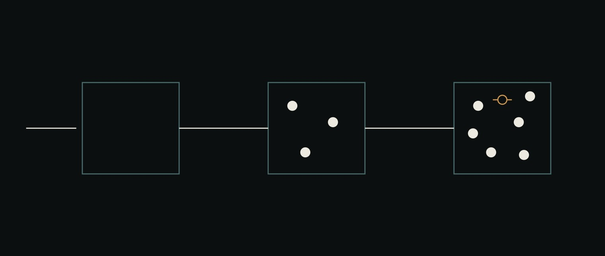

# 17 · A project is born



<sub>Empty, staffed, furnished. The struck-through circle is a name declared in markdown with no file behind it.</sub>

> **Reference.** Everything below ran. Numbers are from the live stack —
> `make up`, then the desk's own routes — and each is dated 2026-08-15.

Until this chapter, ai-os could *show* projects. Every scope the desk had ever
displayed was minted by a seed script run from a shell, so a person sitting at
the desk could open work somebody else had started and could not start their
own. That is the difference between an operating system and a dashboard over one.

This chapter is the gesture chain that closes it, and the two older systems it
finally reproduces.

## The chain, end to end

```
POST /project   ->  group:coclea-sr-from-the-desk-a76a8960-…
POST /agent     ->  agents/DERIVADOR.md, agents/VERIFICADOR-MATH.md
POST /file      ->  COCLEA-SR-SPEC.md, 39485 of 39485 bytes present
POST /flows     ->  a document, gated on A01/A08/A12
POST /advance   ->  the agent read the spec and answered from §0 and §4.5
```

Nothing in that list is a script. Each is a route the desk calls, and each has a
control on the page.

The new scope is deliberately **empty** — no agents, no documents, no layout.
Seeding it with a starter flow would make the first thing a person sees something
they did not write, and the emptiness is honest: the project exists and nothing
has happened in it yet.

## The two stores, and the bug that found them

`POST /file` was wrong first, and the way it was wrong is worth more than the
route.

It wrote through `workspace.write`, read the file back through `workspace.read`,
and answered `201 … bytes: 37691`. The agent asked to summarise that file then
replied that it did not exist. **The route had confirmed its own write with its
own reader**, which is not a check.

A scope has two stores and they are not interchangeable:

| store | holds | who reads it |
|---|---|---|
| workspace | agent definitions (`agents/*.md`), the memory mirror | the core, host-side, when loading a roster |
| sandbox | everything an agent reads or runs | the agent, inside its container |

Material now goes to the sandbox and is verified with `wc -c` run **inside** it.
A write the sandbox does not have answers `500`, not `201`.

## An agent is a markdown file

`POST /scopes/:id/agents` writes one and does nothing else.
[`ai-flows/src/agent-file.ts`](../ai-flows/src/agent-file.ts) is the single
renderer — `scripts/seed-cochlea.ts` had a private copy — and its test
round-trips through **upstream's own parser**, so a shape only our reader accepts
cannot pass.

The validator was itself wrong in the way that matters. It restated the allowed
tool names as a hand-written list including `search`, which does not exist. A
roster declaring it passed validation, upstream then rejected the whole `tools:`
list, and two agents installed that **loaded fine and had no tools at all** —
visible only as `tools=  ok=false` beside six that were fine. The list is now
`CHILD_TOOL_NAMES`, re-exported rather than restated
([`ai-base/AI-OS-PATCHES.md`](../ai-base/AI-OS-PATCHES.md)), and the test runs the
validator *and* upstream's parser over every name instead of comparing two lists
that would have agreed with each other.

## llmunix's move: the project writes its own roster

[llmunix-marketplace](https://github.com/EvolvingAgentsLabs/llmunix-marketplace)
was built around one gesture — give the kernel a goal and it writes the agents
that goal needs. It could not work here without a crossing, because an agent
writes into its sandbox and the core loads definitions from the workspace.
`POST /scopes/:id/agents/from-sandbox` is that crossing, and **it validates**.

Measured, in the project created above:

```
step 1  the agent read COCLEA-SR-SPEC.md §6.2 and wrote roster.json  -> 8
install REFUSED, nothing installed:
          EXPLORADORES -> unknown tool(s): search. Known: background,
                          execute, history, memory, publish, read, write
          LITERATURA   -> same
step 2  the agent edited roster.json from that refusal, in its own words:
          EXPLORADORES -> read, write, execute, background
          LITERATURA   -> read, write, memory
install DERIVADOR CONSTRUCTOR VERIFICADOR-MATH VERIFICADOR-STAT
        EXPLORADORES LITERATURA SINTETIZADOR AUDITOR — all ok=true
```

Nothing installs unless every draft validates. A roster half-installed because
the fourth entry was malformed is a scope whose agents do not match what anyone
approved, and no later step could tell.

That refuse-and-repair loop is what ai-os adds to llmunix, which had nothing
between the model and the roster.

## skillos's move: choose from an index, load one body

[skillos](https://github.com/EvolvingAgentsLabs/skillos) organised skills
`Domain → Family → Skill` with a lazy load and claimed roughly 61% fewer
routing-phase tokens. **That number is not carried over** — it was measured on a
different catalogue, and an inherited number is one nobody checked.
[`ai-flows/src/skills.ts`](../ai-flows/src/skills.ts) recomputes it on whatever
tree is present. On the seed tree, live:

```
18 skills · index 4,397 chars vs full 105,423 · saved 95.8%
```

To *choose* a skill an agent needs every name and one line; to *use* one it needs
that body and no other. A test asserts no body leaks into the index, and another
asserts the saving comes out near zero on a catalogue where there is none — the
measurement has to be able to come out badly.

Resolution is exact-match only. A fuzzy resolver hands back a plausible
neighbour for a name that does not exist, and the agent then follows instructions
for a skill it did not pick: the one failure lazy loading introduces that eager
loading cannot produce.

```
GET /scopes/:id/skills            index + count + savedFraction + broken
GET /scopes/:id/skills?path=…     the one body, 404 for a name that is not there
```

## Memory that survives the session

llmunix kept it in `memory/long_term/`; skillos produced it with a dream pass.
`ai-memory/` is the better shape for it — six eve subagents, a keeper that routes
— and **it does not execute in this workspace**: the local world accepts a
session, dispatches a turn, and the turn's run never starts. Thirty-nine runs
from an earlier attempt were still `running` three days later.
[`ai-flows/src/memory.ts`](../ai-flows/src/memory.ts) is the same job, smaller,
on the substrate that does run.

The mechanics are [`wiki.ts`](../ai-flows/src/wiki.ts), untouched. What is new is
the same crossing again: an agent writes `notes.json` into its sandbox and code
decides whether it becomes memory.

`id`, `hash`, `chars` and the source offsets are computed from the quoted text,
never read from the draft — `wiki.ts` records two models classifying one input
correctly while one reported a source range that did not match the text it had
hashed, and nothing complained. So a draft carries a **quote**, which is located
in the file it cites. That is a check; offsets could only be believed.

**Recall was broken in the way a memory is worst broken.** The pass stored
`ground spring`; a query for `ground-spring` returned nothing while the same
response reported `total: 2`. Exact keyword comparison made two turns disagreeing
about a hyphen produce "I don't cover that" about something covered. Folded to
case and separators — not stemmed, because a recall that matches everything
decided nothing and there would be no way to see which happened.

```
ground-spring / ground spring / PLACE_CODE  ->  the falsified ADR
hopf,cochlear-amplifier                     ->  nothing, correctly
```

## Delegation

One level runs, on the `pi` harness, and it was verified rather than assumed. A
parent handed a child the gate-suite command; the child returned `17 passed in
0.45s` and reported that it could not see the parent's conversation. Two levels
are bounded by construction — a delegated child is built without `runChild`, so
it has no `delegate` tool — which is upstream's shape and recorded in
[`ai-base/AI-OS-PATCHES.md`](../ai-base/AI-OS-PATCHES.md).

## The `Gated` shape, which [16](16-a-workload-with-an-oracle.md) argued for

Built. A gated flow names the checks it must satisfy and cannot reach `done`
while one is red or has never run:

```
gates all green        ->  done     | complete
a gate that is red     ->  blocked  | halted — red: Z99
a gate that never ran  ->  blocked  | halted — never ran: H01, H02
```

Red and never-ran are reported separately and neither folds into the other:
absent a checker is not the same as passing. A gated flow with an empty
`requiredGates` is refused at creation rather than treated as nothing to check.

## What is not here

- **`ai-memory/` still does not run.** The eve tree is the better architecture
  and this chapter routes around it rather than fixing it.
- **Two-level delegation.** Bounded upstream; not attempted.
- **Provisioning a project's source from the desk.** `POST /file` writes one file
  at a time; a project's code still arrives through
  `ai-flows/scripts/provision-project.ts`.
- **Running the gate suite from the desk in one turn.** The full suite is minutes
  — `A09` alone is over 100 seconds — so a live demonstration uses the subset
  named in [`projects/coclea-sr/CLAUDE.md`](../projects/coclea-sr/CLAUDE.md):
  28 checks in about 1.7 seconds.
