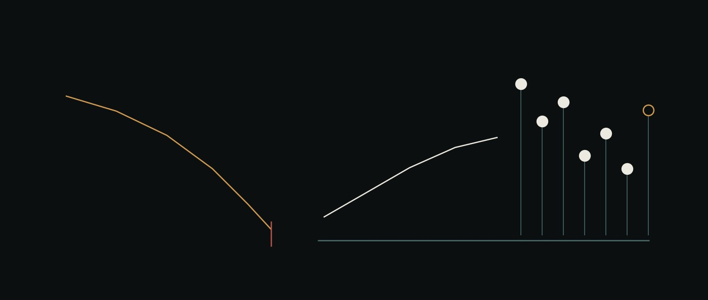

# 18 · From a hypothesis to a therapeutic surface



<sub>A trajectory that decays and stops, and a second one that propagates on a base the first did not have — opening into seven signatures, one of them open because it is a posit.</sub>

> **Reference.** Everything below either ran or is marked as not having run.
> [`projects/coclea-sr/`](../projects/coclea-sr/) holds **28 gates / 135 checks,
> all green [ran]**, one hypothesis falsified by its own control arm **[ran]**,
> and a pathology section whose discrimination claim is itself gated **[ran]**.
> `ai-base`, `ai-flows` and `ai-ui` run 851 tests of their own **[ran]**.
>
> This chapter is the one that answers *"what is a multi-agent OS actually for"*
> with a worked example rather than an argument. It is also the chapter with the
> most against it, and §8 is where that lives.

## The claim, stated so it can be disagreed with

A biophysics hypothesis from ~1995 — that noise helps the ear detect signals too
weak to cross a threshold — was taken end to end on this system: posed as
mathematics, simulated, **found to be built on a wrong model**, repaired against
a condition registered before the repair, measured, bounded, and finally turned
into a set of falsifiable statements about disease and its treatment.

The claim is not that agents did science. It is narrower and it is checkable:

> A multi-agent system with **independently generated truth** and **eval-gated
> promotion** can carry a real research question through the stage where the
> question's own author was wrong — and can do it in a way where the wrongness is
> the recorded output rather than a story told afterwards.

The falsification condition is on the table: if the model's failure had been
found by a person reading plots, or if the repair had been accepted because it
looked physiological, none of this would be evidence for anything. §4 is about
exactly that moment.

## 1 · Posing biophysics as mathematics that can be checked

The cochlea is a graded mechanical structure in fluid. High frequencies peak near
the base, low frequencies travel toward the apex; a complex sound is decomposed
mechanically before any of it reaches a nerve. Written down, that is a
Sturm-Liouville problem with spatially varying coefficients, one end constrained
and one free.

The part that made it tractable for agents is not the mathematics. It is a
directory rule:

> **`truth/` must not import `src/`.**

Closed forms — sympy and mpmath — live in `truth/`. The solver lives in `src/`.
A gate compares one against the other, and the rule means the value a gate checks
against **cannot be produced by the code under test**. It is four words of policy
and it is the load-bearing structure of the whole project, because it is what
makes a passing gate mean something other than self-consistency.

What that bought, concretely **[ran]**:

| | checked against | measured |
|---|---|---|
| uniform eigenvalues | `ω_n = (2n−1)πc/2L` | `9.28e-6` |
| exponential profile | roots of `tan βL = −2β/α` | `2.31e-6` |
| stochastic variance | the Lyapunov solution | within sampling error |
| the SR optimum, 0-D | Rice's crossing rate, `σ_opt = θ/2` | `9.5%` |
| transmission line | `P = sin(k(1−x))/sin(k)` | `7.3e-7`, order `2.00` |
| power balance | influx at the stapes = dissipation | residual `4.3e-8` |

None of those numbers is negotiable through language. That is the property being
bought. **Conservation of energy does not care how persuasive an agent is.**

## 2 · Simulating it, and the part that is not the simulation

The solver is unremarkable and that is fine — finite volume, modal projection,
an exact OU treatment where Euler-Maruyama would have cost 45.8% bias at the
specification's own production step **[ran]**.

What is worth reporting is that **the measurement pipeline needed more gates than
the physics did.** Of the project's twenty-six, roughly half check the
instrument rather than the model: does the analysis recover a known optimum in a
toy where the answer is fixed? Does the interaction estimator recover an
interaction of known size, and report none when there is none? Does Holm actually
remove something, or is the correction a no-op wearing a name?

The reason is in [`projects/coclea-sr/README.md`](../projects/coclea-sr/README.md)
under *"Nine ways the instrument lied"*. Every one of those produced a number that
looked like evidence. **None was caught by reading the code.** Each was caught by
running it and distrusting the first result — a memory benchmark that scored its
baseline 10/10 and therefore could not move; a gate keyed to one failure mode that
would have cancelled an experiment over a subject failing the other way; a
convergence gate whose own precision floor rose as fast as the error it was
measuring fell.

If there is one transferable finding for anyone building agents for science, it
is this one, and it is unglamorous: **the instrument is where the lying happens.**

## 3 · The model was wrong, and how that was found

This is the load-bearing section.

The first operator was close to the 1995 idea: a graded string, the membrane's own
tension carrying the wave, mass and stiffness varying with position. Elegant, and
several low-level gates passed on it.

It did not behave like a cochlea. The traveling wave died before reaching the place
the same model said it should peak. Measured, the response fell **by twenty-eight
orders of magnitude** before arriving **[ran]**.

The reason was a sign that no parameter choice can move. For a string, the membrane
impedance sits in the **numerator** of the local wavenumber — so the wave is blocked
exactly where the membrane is stiff, which is where it has to enter. A fluid
transmission line puts the same impedance in the **denominator**, and then the signs
come out right *for the physical reason*: propagating basal to the characteristic
place, wavelength collapsing at it, evanescent apical to it. Békésy's peak as a
consequence rather than an input.

Three things about how that went, and each is a rule now:

**The acceptance condition was written before the replacement was built.** The new
operator had to produce propagation in the correct physiological direction and the
correct frequency-to-place relation. Registered first, then implemented, then run.
[ADR-0002](../projects/coclea-sr/decisions/0002-the-place-code-needs-fluid-coupling-not-a-ground-spring.md).

**The redesigns were counted.** Three model changes in one session — a coupling
term absorbed, made explicit, then rescaled — each moving the instrument closer to
the answer it wanted. The third is where you stop and record the falsification
rather than take the fourth. *"Once is fine, twice is suspicious, by the third it
is looking for the result rather than measuring it."*

**The alternative is what the rule exists to prevent.** Had the inverted traveling
wave been discovered *after* the stochastic layer was built on top of it, every
number above it would have been void.

## 4 · The result, and its two boundaries

Only after the mechanics and the pipeline survived their gates was the 1995
question run.

**Stochastic resonance is there, and it is where the theory says.** Three drive
frequencies, eight positions, noise swept at each: SNR against noise shows an
interior maximum whose 95% interval clears both ends of the grid — **24 curves of
24 [ran]**. The measured optimum sits at **11.6% of the parameter-free prediction
`σ_opt = θ/2`**, which is half a grid spacing: matched to the resolution of the
instrument. Every free quantity — noise intensity, damping, drive amplitude, the
SNR's constant — cancels out of that prediction, so there is nothing left to tune
into agreement.

And then the two boundaries, which are worth more than the result:

**Frequency.** Bridging to auditory-nerve physiology through spontaneous rate, the
regime is reachable **only up to a characteristic frequency of about 1 kHz [ran]**.
Above that it is not compatible with the model's own assumptions. So the hypothesis
narrowed from *"the ear uses noise"* to *"here is the regime where the mechanism
survives, and here is where this model says it should not"*.

**Sharpness.** The passive membrane's `Q` is 2.2–2.7 **[ran]**; a living cochlea is
far more selective. That gap is reported rather than tuned away, and it is the
quantitative argument for the active layer — which is what made §5 possible.

One more, from the interaction experiment: mechanical and neuronal noise each help
on their own, but their measured interaction is **negative — sub-additive, −1.22 dB,
CI [−1.58, −0.87] [ran]**. Not the cooperation the intuition expected.

## 5 · From a corrected model to a therapeutic surface

Here is the part that surprised us, and it is a consequence of §3 rather than of a
plan.

The string had two knobs: the membrane's own tension and mass. **No intervention
reaches either.** The transmission line put the *fluid* inside the operator — scala
geometry, entrained mass, viscous loss — and fluid is precisely what a diuretic or
an osmotic agent acts on. The active layer added `μ_H`, the distance to the Hopf
point, which salicylate and furosemide already move in humans, reversibly, today.
The threshold detector added `θ`.

So the falsified model was replaced by one with a **therapeutic surface**. The
falsification bought the section.

[`PATHOLOGIES.md`](../projects/coclea-sr/PATHOLOGIES.md) states the rule: *a
pathology is a transform on parameters the model already has, and nothing else*.
No new term, no new equation, no fitted constant. `Lesion()` with every default
**is** a healthy cochlea, so a lesion is literally the diff — and the null control
is free.

Seven lesions, and the table is read by its **zeros** — what identifies a lesion is
not the column that moved but the five that did not **[ran]**:

| lesion | knob | CF | Q | sensitivity | compression | knee | optimal noise | oscillates |
|---|---|---|---|---|---|---|---|---|
| healthy | — | 1.000 | 1.000 | 0 dB | 0.365 | 0.0028 | 0.500 | no |
| conductive | `drive` | 1.000 | 1.000 | **−20.0 dB** | 0.365 | 0.0028 | 0.500 | no |
| OHC loss | `μ_H` | 1.000 | 1.000 | 0 dB | **0.811** | **0.354** | 0.500 | no |
| prestin block | `μ_H` | 1.000 | 1.000 | 0 dB | **0.638** | **0.089** | 0.500 | no |
| hydrops | `β,S,M` | **1.117** | **1.056** | **−3.9 dB** | 0.365 | 0.0028 | 0.500 | no |
| synaptopathy | `θ` | 1.000 | 1.000 | 0 dB | 0.365 | 0.0028 | **0.900** | no |
| overdriven | `μ_H`>0 | 1.000 | 1.000 | 0 dB | — | — | 0.500 | **yes** |

**The discrimination is itself gated.** GATE-D1 checks three things, and the last
two are what make the first mean anything: six distinct signatures of seven; a
lesion that changes nothing reproduces the reference to `0.0` in every component;
and **no single observable separates the catalogue** (best column: 3 distinct
values of 7), so the pattern is load-bearing rather than decorative. Probed rather
than assumed: de-lesion the hydrops and it collapses onto healthy and the gate goes
red **[ran]**.

The one collision — `OHC loss` and `prestin block` — is **asserted, not excluded**.
They are one axis at two depths and no single-instant measurement separates two
points on one axis. A gate that quietly dropped the pair would pass equally well on
a model that had collapsed all seven lesions onto one knob, which is the failure
the gate exists to catch.

### What the model then says about treatment

Four directions, each with a falsifier and each with a normative *"what the model
cannot say"* field — without that field the direction does not publish. The
cheapest needs no new therapy at all:

    gain  ∝ |μ_H|^(−1)     →  a 10× retreat from criticality costs 20 dB
    knee  ∝ |μ_H|^(+3/2)   →  the same retreat moves the knee 31.6×

Same parameter, different powers. **The compression knee is 1.5× more sensitive in
log terms than the audiogram**, and the input/output slope of a distortion-product
emission is a standard clinic measurement. The model says an ototoxicity monitoring
protocol should watch the slope, not the threshold. That is a claim a clinician can
attack with data that already exists.

And the hazard, which is the clearest example on this page of why a *mechanism* was
worth building: every amplifier-restoring therapy pushes `μ_H` toward zero, and zero
is the bifurcation. Past it the oscillator runs with no input — spontaneous emission,
and the tonal tinnitus that sometimes accompanies it.

> The target is a point the treatment must approach and must not cross, and the
> failure mode on the far side is a **symptom**, not an absence of benefit.

A model fitted to outcomes could not say that, because the failure lives on the far
side of a boundary the data would not contain.

## 6 · Who did what — agents, humans, and the two together

The roster is eight roles, and the separation is the design rather than the
decoration: a **Deriver** producing independent analytic references, a **Builder**
implementing solvers, a **Math Verifier** and a **Statistical Verifier** attacking
them from different directions, **Explorers** sweeping, a **Literature** role
comparing against physiology, a **Synthesizer**, and an **Auditor** on provenance.

Honestly, though, the division of labour that mattered was not agent-versus-agent:

**Agents did well:** deriving closed forms and checking them symbolically; writing
the solvers; sweeping parameters; finding the *numerical* causes of failures — a
boundary treatment that fails to halve a control volume at a free end is exactly
the kind of defect a model diagnoses quickly and a person misses at 2am.

**Agents did badly, repeatedly:** deciding when a redesign had become
result-seeking; noticing that a gate could not fail; noticing that a benchmark's
baseline already sat at the ceiling. Every one of the nine instrument failures was
caught by *running* something and distrusting the number, never by an agent reading
its own design.

**The human contribution that no arrangement of agents replaced** was refusing the
plausible result: stopping when the plots looked physiological but the wave ran the
wrong way, and deciding that a falsification was the output rather than a setback.

**And the shape that made the pair work** is `Gated`: agents free to explore, change
equations, rewrite solvers, produce artefacts that turn out to be wrong — but an
artefact cannot become a dependency for later work until it survives its gates.
Mistakes stay easy to create and become hard to preserve.

## 7 · The system measuring itself

The project is also ai-os's own evaluation workload, and it behaves like one.

Running §7.4 — the cost/quality curve of the explorer:verifier ratio — against the
live stack immediately surfaced a real defect in `ai-flows`: an attempt sat
`running` for **3,316 seconds** while the flow reported `waiting`, which is the same
state a healthy flow reports **[ran]**. Fixed with a stale-attempt reaper, three
tests. That is the point of having a workload with an oracle: it is load that a
prose task never generates.

It found a second one on the next run, and this one is sharper: **the price tag
destroyed the measurement**. A transient DNS failure on the cost endpoint raised
out of `spend_so_far` at the line *after* a flow had finished, discarding an
answer that had already been measured because its price could not be read. The
probe now retries and then returns `null` — a missing cost is a missing cost, and
the row keeps its answer.

Two instrument corrections were made **before** that experiment's data landed, and
both are recorded rather than silently applied: the retraction metric was biased by
arm (5 explorer-verifier pairs at 5:1 against 9 at 1:1, so it rises with the
verifier count whether or not anything is caught), and per-flow cost attribution
rests on an endpoint that has not been cross-checked against a second one that
disagrees with it.

The first of those paid off immediately. The run's **only** flagged retraction was
a verifier that said "WRONG" in prose and then produced a number agreeing with the
explorers to within a tenth of the tolerance. The biased metric counts it at 25%;
the unbiased one reports 0%. A verifier that says WRONG and then agrees has not
retracted anything — it has produced prose that a metric keyed to prose will
count.

## 8 · What this does not show

The section with the most against it, kept in full.

**The cochlea has not been shown to use stochastic resonance.** A computational
model cannot establish that. What the experiment shows is that the mechanism
survives inside this model, reproduces the pre-registered signature, and generates
predictions comparable with physiology.

**No claim here has been compared against patient data.** §5 is a set of
model-derived hypotheses. `μ_H = −0.02` for a healthy cochlea is a posit with no
derivation; two of the seven lesions are parameterised by hand; and the model
already disagrees with the clinic in at least one place we could find (it *sharpens*
tuning under hydrops where Ménière's broadens it). All three are in
[PATHOLOGIES.md §4](../projects/coclea-sr/PATHOLOGIES.md) and in
[ADR-0006](../projects/coclea-sr/decisions/0006-pathology-as-a-parameter-transform.md).

**The architecture's usual justification is weaker than we assumed, and we found
that out ourselves.** A companion experiment tested whether a frontier model can
catch fabricated and subtly defective physics results. It caught **all** of them —
twelve blatant fabrications and nine subtle numerical defects — and named causes at
the level of *"the boundary treatment at the free end fails to halve the control
volume"*. So "the model cannot tell" is **not** the argument for gates. The two
things that survive are narrower: a model can *judge* a task but cannot *generate*
one with a known answer (you cannot create truth by asserting it), and a judge that
is right every time still hands you no ledger, no freeze and no reproduction
command.

**And our own ratio experiment came back null.** [E7](../projects/coclea-sr/experiments/E7-RESULTS.md)
measured whether more verifying agents and fewer exploring ones buys correctness.
Ten flows, forty agent claims, three arms: **100% accurate in every arm, zero
corrections, 0% dissent per verifier**. Verification bought nothing, because
nothing was ever wrong — the entire spread across every agent was 0.034 against a
tolerance of 0.25.

The task was designed so that reasoning from the docstrings gives the wrong
answer and measuring gives the right one. Forty out of forty **measured**. That is
a mildly encouraging finding about the model, and a fatal one for the experiment:
the baseline sat at the ceiling, so every arm tied, and a tie reads as a result.

The rule that would have caught it is in this repository's own `CLAUDE.md` —
*check headroom before building the treatment, never after* — and one cheap
control flow, run before the other nine were bought, would have said so. **Writing
a rule down is not the same as applying it**, and that is the most useful thing
this experiment produced.

**One convention slipped and is now closed.** Docs 15–18 had no illustration
where 00–14 do. It was recorded here rather than quietly dropped, and then fixed
as a **generator** — [`assets/make-illustrations.py`](assets/make-illustrations.py),
whose palette was sampled pixel-by-pixel from the existing plates rather than
guessed — so the next document does not reopen it.

## 9 · Reproducing it

```bash
cd projects/coclea-sr
.venv/bin/python -m pytest gates/ -q      # 28 gates, 135 checks, ~9 min
.venv/bin/python gates/check_reports.py   # reports with no test behind them
python3 verify_ledger.py                  # the hash chain, stdlib only
python3 render_evidence.py                # report/evidence.html, from the ledger
```

Every accepted run records its parameters, seed, code state and dependency hashes.
Artefact transitions go into an append-only hash-chained ledger. Figures carry their
run id, result hash and commit **in the PNG's own metadata**. Run directories are
content-addressed, so a re-run with different numbers cannot overwrite an attested
one.

The point of that machinery is a question worth more than this project:

> What if reproducibility were a property of the instrument rather than a promise
> made after the experiment?

Today the final artefact of science is a paper, and the code, seeds, rejected
models and intermediate decisions live somewhere else if they survive at all. For
computational science there is no reason that has to remain true. The artefact can
be executable — hypothesis, assumptions, derivations, implementation, *the
implementations that were rejected*, the gates, the raw runs, the seeds, the
provenance chain, and the exact path by which a claim became accepted.

A reviewer would not only read the conclusion. They could rebuild it.

---

**Related.** [16 · A workload with an oracle](16-a-workload-with-an-oracle.md) is
why this project is here. [17 · A project is born](17-a-project-is-born.md) is how
it was staffed and furnished from the desk. [`projects/coclea-sr/`](../projects/coclea-sr/)
is the work itself; [`PATHOLOGIES.md`](../projects/coclea-sr/PATHOLOGIES.md) is
spec §13.
