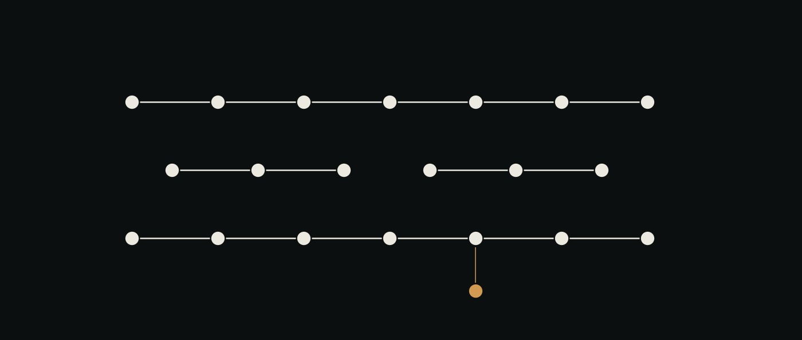

# Everything is an agent

Identical marks, three chains, one link never recorded — and one mark attached to a chain by a stem: the system agent, drawn like everything else.

*A redesign of the desk, the demo, and the tour. Written before the code, because
the last version was built against an example that stopped being the project.*

---

## 0. The question this answers

> NeXT made everything in the UI an object. Now everything is an agent. What
> does a desk look like where everything is alive, where the flows of
> information are the thing you see, and where you can inspect any of it — or
> put a system agent on it to inspect it for you?

That is the brief. The rest of this document is what it costs to take it
literally, and what has to be thrown away to do it.

---

## 1. What the current desk actually shows a stranger

Not a critique from taste. Four things that are true of the file published at
`/demo/`, each checkable by opening it.

**The landing scope is fiction.** `renderDeskHtml` is called with
`scopeId: "group:web-project-demo"`. The documents are *Ledger currency
rewrite* and *Duplicate ledger rows*. There is no such project. The two
projects that carry the entire argument — `coclea-sr`, whose 135 gate checks
ran green on a GitHub runner in 23m27s, and `hemo-verified`, whose oracle panel
is measured against 98 rows of known error — are, respectively, the fourth
option in a dropdown and *absent*.

A visitor's first screen is an invented example. Everything real is behind a
`<select>`.

**Agents are furniture, not objects.** The surface has a `.shelf` labelled
"Agents" along one edge; documents are the things laid out on the desk, and
cubes are attached to them. The document is first-class and the agent is its
decoration. That is precisely backwards from the brief.

**The flows of information are not visible.** There is a trace you can read, a
digest that summarises, strips that are green. There is nowhere on the screen
where you *watch something move from one agent to another*. The word "flow"
appears; the flow does not.

**Nothing inspects anything.** The rail has a panel called *Selected* that
prints facts about whatever you clicked. There is no inspector in the NeXT
sense — one panel, bound to the current selection, showing the object's real
fields — and there is certainly no agent doing the inspecting.

And the tour: seven of its thirteen beats narrate the invented web project.
The cochlea gate — a result held at `blocked` by an oracle declared before the
run, which is the single best thing in the repository — is never reached at all.

---

## 2. The spirit of the canvas, re-read

`doc/04-ai-ui.md` names four properties: **Spatial, Live, Generated,
Steerable**. Re-reading it against the brief, three of the four survive intact
and one was written too small.

*Spatial* survives. *Live* survives. *Generated* survives — and
`doc/15-generated-interaction.md` phase 5, **specified and never built**, turns
out to be the load-bearing one:

> Drag cube ReviewAgent onto cube MigrationAgent. That is declaring it a
> subagent. The model writes the diff to `MigrationAgent.md`. The desk stops
> being a viewer of ai-os and becomes an editor of it.

That gesture — *drag one agent onto another thing to declare a relationship,
and the relationship gets written down* — is the whole NeXT Interface Builder
move. In IB you control-dragged a wire from one object to another and the
connection became real, in the file. Nobody typed it.

The property that was written too small is **Steerable**. The canvas says the
user can act on what they see. But the brief asks for something stronger, and
it is the thing ai-os can do that a diagram cannot:

> **you can put an agent on it.**

Not "you can inspect it" — you can *delegate the inspecting*. An inspector that
is itself an agent, subject to the same rules as every other agent, leaving the
same trail. That is a fifth property, and it is the one worth having.

**The metaphor also has to move.** System 7's desk was right for "documents
laid out in space". It is wrong for "information moving between live things",
because on a System 7 desk nothing moves unless you move it. The reference is
NeXT: the object palette, the canvas, the **Inspector**, and above all the
**connections you could see and inspect**.

---

## 3. The inversion

> The document was the object and the agent was its decoration.
> **Invert it.** The agent is the object; the document is the trail it leaves.

Concretely, four things change on the surface.

### 3.1 Agents are the nodes

Off the shelf, onto the desk. An agent is a box with a name, a state, and the
tools it is allowed to use. It is alive: it is idle, or it is working, and
which one is visible without clicking.

The shelf does not disappear — it becomes the **palette**, which is what it
always was in IB: the place you drag *new* objects from.

### 3.2 Flows are wires, and the wires carry things you can open

A flow is not a list of steps in a panel. It is a **path through the agents**,
drawn on the desk, with the thing that moved travelling along it.

The discipline that keeps this from being an animation:

> **A wire carries a real artifact or it carries nothing.**

If a hop produced a file — a gate report, a ledger line, an oracle score, a
frozen verdict — the packet on that wire is addressed to it, and clicking the
packet opens the bytes. If a hop produced nothing recorded, the wire is drawn
**unknown**: dashed, grey, labelled. Never plausible, never smoothed.

That is `freezeVerdict`'s `blockers`-vs-`unknown` split, made visual. "Did not
run" is not "passed", and it must not be drawn like it.

### 3.3 One Inspector, bound to the selection

NeXT had exactly one inspector panel. Click a different object and the panel
changes to be about that object. There was never a question of which panel to
look at.

The desk gets the same: one panel, and it inspects whatever is selected —
an agent, a wire, a packet, a gate, a document. For each, it shows the **real
fields**: for an agent, its markdown; for a packet, the bytes that moved; for a
gate, the report JSON with the number and the tolerance side by side.

### 3.4 The Inspector has a second position: put an agent on it

The panel has a switch.

- **Read it** — the fields, as above. You do the looking.
- **Ask an agent** — drag `INSPECTOR` onto the thing. It is an agent like any
  other: it appears on the desk, it takes a step, it costs something, and it
  produces a finding.

And the rule that makes the second position worth more than a chat window:

> **Every finding cites the artifact it came from, and the citation is
> clickable.**

The system agent says "GATE-A01 reports 2.592e-4 against a tolerance of
1.0e-4, so this chain cannot freeze" — and next to that sentence is the report
it read. You are one click from checking it. When it has no artifact to cite,
it is required to say `unknown`, and the desk draws that differently from an
answer.

This is the whole thesis of the repository, expressed as a UI affordance rather
than as a paragraph in a README: *a model's judgement is a claim; a claim needs
an address.*

---

## 4. The two projects, which are the demo

The invented web project stops being the landing scope. The demo lands on real
work, and the two real projects are chosen because **they disagree about
whether truth is derivable**, which is the most interesting thing either of
them has to say.

### coclea-sr — truth is derivable, so let code derive it

A cochlear model whose eigenvalues have a closed form. `truth/` computes it and
is **forbidden to import `src/`**. A gate is an oracle declared before the run.

Two chains, eight agents each, six steps each, **both entirely green**. One is
wrong in every number it reports — an `O(dx)` mass error at the helicotrema,
invisible to every sanity check, and actually *preferred* by the naive one. It
does not freeze, because GATE-A01 says 2.592e-4 against a tolerance of 1.0e-4
and GATE-A12 says the convergence order is 0.9996 where it should be 2.

The desk shows: two identical-looking wire paths, one ending in a frozen
result, one ending at a red gate that can be opened.

### hemo-verified — truth is not derivable, so measure the judge

Blood flow, where there is no closed form for the cases that matter. So you
build a panel of seven oracles and you do the thing almost nobody does: you
**measure the panel** against 98 rows whose true error you know.

The numbers are in `gates/reports/h0.json`, and they are humbling on purpose:

| what | value |
|---|---|
| rows | 98 |
| accepted / rejected / escalated | 48 / 32 / 18 |
| composite AUC | 0.9056 |
| weakest single oracle (A5) | 0.5209 |
| false accept rate | 0.0208 |

Six of the seven oracles, alone, are close to a coin flip. The composite is
not. **That is a fact about judging that you only get by measuring**, and it is
recorded with the hash of every oracle and the exact environment — python
3.13.12, numpy 2.5.2, scipy 1.18.1 — that produced it.

Put next to each other on the same desk, the two projects say: *when you can
derive the answer, derive it and let code check; when you cannot, do not
substitute a confident model — measure how good your judge actually is, and
publish the number.*

That is the contribution, and it is why this is not another agent framework.

---

## 5. The tour, rebuilt

Same rule as before, unchanged and non-negotiable: **the tour drives the real
client with real events.** If the desk breaks, the tour breaks. Nothing here
draws a frame or animates a fake.

What changes is what it is about. Nine beats:

1. **The desk is agents.** Not a diagram — each box is a thing with tools and a
   state, and two of them are working right now.
2. **A flow is a path.** Follow one packet from `DERIVADOR` to the gate.
3. **Open the packet.** These are the bytes that moved. Not a summary of them.
4. **Two chains, both green.** Select them side by side. Nothing in either
   trace separates them.
5. **The gate separates them.** One froze. One is held at `blocked`. Open
   GATE-A01: 2.592e-4 against 1.0e-4.
6. **Put an agent on it.** Drag `INSPECTOR` onto the blocked chain. It runs.
   It answers — and it cites the report.
7. **Check the citation.** One click. The number in the sentence is the number
   in the file. *This is the beat the whole tour exists for.*
8. **The other project.** Switch to hemo. There is no closed form here, so the
   judge itself is on trial: 0.9056 composite, 0.5209 for A5 alone.
9. **It is yours.** Drag anything.

The tour ends on the gesture rather than on a summary, because the gesture is
the argument.

---

## 6. What keeps this honest

A redesign that makes the desk prettier and the numbers vaguer would be a loss,
so the redesign ships with a check.

`scripts/check-demo-provenance.py` reads the built demo and, for every number
it displays that is attributed to a project artifact, resolves that artifact and
compares. Disagreement fails the build. The demo cannot drift from the projects,
and the projects cannot drift from the demo — the same rule
`test/cochlea-demo.test.ts` already enforces for the eigenvalues, applied to
everything the redesign puts on screen.

The existing rules stay: the demo is **generated** from the product's own code,
never hand-maintained; the simulation is injected only under `simulate`; the
unsimulated page contains no tour.

---

## 7. What this does not do

Stated plainly, because a design document that only lists wins is marketing.

- **It does not run the stopwatch.** `NEXT.md` says "no more desk before the
  stopwatch" — M5's falsification, a user and a three-day-old flow they did not
  run, timed. This work is explicitly authorised to override that rule, and it
  does not discharge it. The redesign should make the stopwatch *easier* to run
  — a visitor who can follow one packet and open it is exactly the measurement
  M5 wants — but until it is run, ai-ui remains unfalsified.
- **It does not make the inspector agent a real model.** In the published demo
  there is no model; the finding is produced by the same simulation that
  produces everything else, and it is labelled as such in the chrome. What is
  real is the *citation*: the artifact it points at is the artifact in the repo,
  and the provenance check proves it.
- **It does not delete the other scopes.** The signal lab and the memory lab
  each carry a falsification the two projects do not — a step that ran and
  carried nothing, and a flow that is green and wrong. They stop being the
  landing and stay in the palette.
