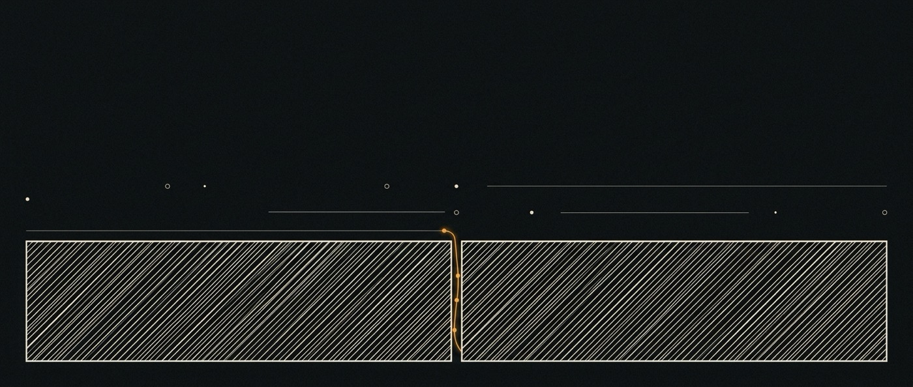

# 02 · ai-base — qué nos da QM



<sub>Una base, partida por una junta que igual sostiene.</sub>

> **Referencia.** QM tal como es, leído del código y no de su README.


> **El inglés es canónico.** Traducción de [`doc/02-ai-base.md`](../02-ai-base.md).
>
> Todo acá fue leído en el commit `7f2c916` de `ai-base` (upstream
> `yc-software/qm@main`, 2026-07-31). QM publica a diario. **Reverificar antes de
> apoyarse en cualquier número de línea de este documento.
>
> **Revisado el 2026-08-01 después de correrlo de verdad.** La primera versión de
> este documento se escribió sólo leyendo y contenía siete errores materiales, dos
> de los cuales ya se habían endurecido en un ADR. Las afirmaciones ahora se
> marcan **[read]** o **[ran]** para que la diferencia se vea. Esa distinción es
> lo más útil de este archivo.

## Qué es

| | |
|---|---|
| Upstream | https://github.com/yc-software/qm |
| Licencia | MIT, `Copyright (c) 2026 QM contributors` |
| Creado | 2026-07-29 |
| Lenguaje | TypeScript, corrido directo sobre Node ≥ 24.15 |
| HTTP | Fastify |
| Persistencia | Postgres |
| Tamaño | ~72.000 líneas en 45 subsistemas dentro de `src/` |
| Vendorizado en | `7f2c916` |

QM se describe como *"a multiplayer agent harness for work. In Slack and on the
web."* El encuadre que nos importa: **el core es genérico, y todo lo específico de
una empresa vive en un directorio de deployment aparte** que depende de
`@yc-software/qm` y cablea los sustratos en un solo archivo.

## Subsistemas, por tamaño

Los diez más grandes, que es un proxy razonable de dónde fue el pensamiento:

| Subsistema | Líneas | Qué contiene |
|---|---:|---|
| `src/api/` | 16.214 | Superficie HTTP, rutas, servicios de app |
| `src/harness/` | 9.945 | Seis harness de modelos + routing + compactación + replay |
| `src/slack/` | 6.994 | Superficie de Slack |
| `src/core/` | 5.855 | Orquestador de turnos, opciones/resultado/reanudación |
| `src/sandbox/` | 3.226 | Sandbox durable por scope |
| `src/deploy/` | 2.485 | Maquinaria de deployment |
| `src/credentials/` | 2.410 | Keychain, vistas de credenciales por scope |
| `src/skills/` | 1.890 | Store de skills, packs, materialización, sync |
| `src/sessions/` | 1.820 | Sesiones, entradas, leases |
| `src/runs/` | 1.762 | Run store, señales, actividad, ledger de tools |

## Las partes sobre las que construye ai-os

### Scopes — el modelo de aislamiento

`src/types.ts:12`

```ts
const SCOPE_KINDS = ["personal", "channel", "team", "org", "group"] as const;
```

Un `ScopeId` es `"<kind>:<ref>"`. Memoria, archivos, vista del keychain, permisos,
crons, web apps y el sandbox están todos indexados por scope. Es lo más fuerte que
tiene QM y ai-os lo hereda entero.

**El hueco para nosotros:** la unión es cerrada, y no tiene `flow` ni `system`.
Nuestros cuatro niveles de memoria (sistema / usuario / proyecto / flow) mapean a
`org` / `personal` / `team`|`channel` / **nada**. Agregar un kind implica editar
este archivo — un punto de fork real, tratado en
[ADR-0003](adr/0003-storage-scope-axis.md).

### `MemoryService` — qué es la memoria hoy

`src/memory/memory-service.ts`. La implementación por defecto es un archivo
markdown:

- `MEMORY_FILE = "memory/MEMORY.md"`, encabezado `# Memory`
- `MAX_FACTS = 300`; al desbordar se **descartan los bullets más viejos**
- `capture()` incorpora hechos como `- (YYYY-MM-DD) hecho`, deduplicados por texto
  normalizado
- la procedencia no confiable se desactiva textualmente — `(said in X)` pasa a
  `[claimed source: X]`
- las revisiones son sha256 del contenido, con `history` / `restore` /
  `replaceIfRevision` opcionales para concurrencia optimista

Es un diseño bueno y chico. Sus límites son exactamente la apertura de ai-os: un
namespace plano por scope, expulsión FIFO como única política de olvido, ninguna
noción de a qué *trabajo* pertenece un hecho, y `query()` como único mecanismo de
recuperación.

### Estrategias — el seam de consolidación

`src/memory/strategy.ts:14` — `MemoryStrategy { onTurnEnd?, maintain?, promptLines? }`,
seleccionada por una unión cerrada `"per-turn" | "scratch-promote" | "agent-only"`
con un envoltorio de consolidación (`DEFAULT_CONSOLIDATE_AFTER`). La promoción
entre niveles de `ai-storage` es una estrategia, y agregar una implica ensanchar
esa unión — un punto de fork de una línea, o un parche limpio para upstream.

### Plugins — cómo se engancha una UI

`plugins/` contiene `web-ui`, `admin`, `portal`, `auth`, y `chassis` (compartido,
privado, nunca publicado). El chassis provee firma de source-auth, helpers
firmados de cliente del core, y el bloque de env `CORE_*`, y la regla es
explícita: los plugins hablan con el core por HTTP firmado y **nunca importan el
core**.

`web-ui` es Vite + Lit, con `dockview-core` para layout de paneles y
`@earendil-works/pi-web-ui`. 128 archivos TypeScript.

### Harnesses — la capa de modelos

`src/harness/harness.ts:167`, `defineHarness(profile, implementation, tools)`.
Implementaciones: `claude-harness`, `codex-harness`, `opencode-harness`,
`pi-harness`, más `mock-harness` y `replay` para tests. La compactación de
contexto es propia de QM (`context-compaction.ts`), no del proveedor.

### Seguridad

Tres posturas a nivel de organización, que los scopes más angostos sólo pueden
endurecer: **strict** (cada llamada a herramienta se pausa para aprobación),
**auto** (por defecto — un clasificador filtra datos externos etiquetados por
procedencia antes de que lleguen al modelo), **dangerous** (sin filtrado, sin
pausas). Una política de comandos predeclarada — reglas de aprobación y negaciones
duras para borrados recursivos o SQL destructivo — aplica en *todas* las posturas,
dangerous incluida.

ai-os hereda todo eso y no agrega nada. Los flows ejecutan bajo la misma política;
un flow no es una vía de escape de la aprobación. Se dice explícitamente porque
"la automatización corre desatendida así que necesita menos controles" es el
desvío obvio y equivocado acá.

## Huecos verificados — la razón por la que existe ai-os

Cada uno se chequeó contra el código, no se infirió de la documentación.

**1. No hay motor de workflows.** `src/processes/` es reaping de procesos del SO
dentro del sandbox (`process-reaper.ts` manda TERM, espera, manda KILL). Lo más
cercano es `runs` (un turno), `tasks` (el tracker de subagentes — ver abajo),
`triggers`, `monitors` y `cron` (formas de arrancar un turno). **Nada secuencia
trabajo entre turnos, y nada lleva un objetivo de un turno al siguiente.**
→ **`ai-flows`**

Dicho con cuidado, porque el primer borrador exageró: QM *sí* reanuda
(`src/core/turn-resume.ts` — `findTrailingPartialTurn`, conteo de intentos, acción
de auditoría `turn.resume`). Recupera un **turno** interrumpido. Lo que no existe
es algo que sobreviva *entre* turnos como unidad de trabajo. **[read]**

**2. Fork sin linaje.** `src/api/app-sessions.ts:392` `forkSession(sessionId,
principalId, { upToSeq })` copia las entradas visibles a una sesión nueva y
escribe una fila de auditoría `action: "session.fork"`. Buscar `forkedFrom` /
`parentSessionId` en el árbol: no hay puntero al padre persistido. Podés
bifurcar; nunca podés hacer diff ni merge. → **linaje de `ai-flows`**, más una
propuesta chica para upstream.

**3. Las skills versionan sin historia.** `src/skills/skill-store.ts:142` —
`s.version += 1`. Un contador, no una historia: no se retiene el contenido previo,
así que no hay diff ni rollback. Hay firma HMAC y `promote()` con gate de admin,
así que la mitad de *confianza* existe y la de *historia* no.

**4. La memoria tiene un solo eje.** Cubierto arriba. → **`ai-storage`**

**5. La interfaz es una transcripción.** Paneles alrededor de un log de chat.
→ **`ai-ui`**

## Qué cambió al correrlo

Todo en esta sección es **[ran]** — observado el 2026-08-01 contra
`deepseek/deepseek-v4-flash` vía OpenRouter, `HARNESS=pi`, stores en memoria.

**Corre, y la suite está verde.** `npx tsc --noEmit` limpio; `npm test` →
**3.712 tests, 3.580 pass, 0 fail, 132 skipped, 93 s**. Sin paso de build — Node
ejecuta el TypeScript directo.

**Postgres es opcional.** `config.databaseUrl ? postgres : memory` en todo
`wiring.ts`. El servidor reporta `store=memory, runStore=memory` y funciona. El
roadmap antes daba a entender que Postgres era prerequisito; no lo es.

**La memoria es exactamente lo que describía este documento** — verificado
escribiéndole:

```
data/workspaces/personal__matias/memory/MEMORY.md

# Memory

- (2026-08-01) User is building ai-os, an agent operating system.
- (2026-08-01) Flagship repo is EvolvingAgentsLabs/ai-os.
```

**`execute` necesita Docker — construido, y funciona.** El sandbox se niega sin una
imagen local. Después de `npm run sandbox:local:build` (→
`qm-sandbox-local:latest`, 1,31 GB, `linux/amd64`), corren comandos reales:

```
SANDBOX-OK
x86_64
Python 3.11.2
```

**La afirmación de "computadora durable" se sostiene.** Un archivo escrito en
`/workspace` en una sesión se lee desde una sesión *distinta* del mismo scope —
verificado, no supuesto. El sandbox pertenece al scope, no a la conversación.

**Es lento en Apple Silicon, y eso es un dato de planificación.** La imagen es
`linux/amd64`, así que corre emulada: ~47 s en frío, ~25 s en caliente, contra
~4 s para un turno sin herramientas. Cualquier paso de flow que invoque comandos
cuesta decenas de segundos localmente. Para M2 eso significa que el ciclo de
iteración es de minutos, no de segundos — presupuestarlo, o construir una imagen
arm64.

**La API exige requests firmadas.** HMAC-SHA256 sobre
`v0:{segundos-unix}:{MÉTODO}\n{path}\n{body}`, enviado como `x-timestamp` y
`x-signature`, con ventana de replay de cinco minutos
(`src/auth/source-auth-sign.ts`). `POST /v1/turns` recibe
`{ surface, actor, conversation: { kind, threadRef }, text }`.

### La superficie fija de tools

Los agentes hijos reciben exactamente: `execute`, `read`, `write`, `publish`,
`memory`, `history`, `background`. Un paso de flow tiene que expresarse a través
de esos o de una herramienta MCP nueva — no hay vía de escape general de ejecución
de código más allá de `execute`. **[read]**

### Las capacidades no son uniformes entre harness

La restricción que más importa, y la que este documento antes omitía por completo.
Ver la matriz en
[01-architecture](01-architecture.md#la-matriz-de-capacidades-por-harness): el
*tracking* de subagentes (filas `tasks`) existe sólo en `claude` / `codex` /
`opencode`; los modelos de OpenRouter funcionan sólo en `pi` / `mock`. **[read]**

**Corregido el 2026-08-06.** Este párrafo terminaba en *"los conjuntos son
disjuntos — modelo barato y multi-agente son mutuamente excluyentes hoy"*, marcado
**[ran]**. Delegación y `tasks` son dos capacidades, no una, y la frase las
confundía. `pi` hoy delega y conserva OpenRouter; lo que no hace es registrar. La
marca **[ran]** se ganó observando filas `tasks` y después se gastó en una
afirmación sobre multi-agente — que es cómo un hecho bien medido se convierte en
una conclusión equivocada.

### Ya existe un benchmark de memoria

`src/memory/bench.ts` (151 líneas) más `scripts/memory-bench.ts`, ejecutado con
`npm run bench:memory`. Compara variantes de `MemoryStrategyKind` sobre
conversaciones guionadas y juzga cada cuaderno resultante en **`signalToNoise`**,
**`staleness`** e **`inferenceVsObservation`**.

Eso es una medición funcionando de la calidad de memoria, upstream, hoy — y
`staleness` es una de las dos métricas que `ai-storage` proponía inventar. Ver
[05-ai-storage](05-ai-storage.md). **[read]**

### Layers de organización — el seam de deployment

`deploy/layers/README.md`. El camino de personalización soportado por QM para un
fork privado: el core queda idéntico a upstream, y todo lo específico de la
organización se confina a `deploy/layers/<org>/` — configuración de deployment,
herramientas y skills del sandbox, imágenes de plugins propios, infraestructura.
Upstream mantiene ese directorio vacío salvo por ese README.

Generado, no armado a mano (el scaffold incluye el `.gitignore` que mantiene
`.env` y el estado de Terraform fuera de Git):

```bash
node cli/bin/qm.ts init deploy/layers/evolvingagents --org evolvingagents --target fly
```

**Qué cubre y qué no.** Cubre deployment y plugins de organización — así que
`ai-ui` va acá, bajo `plugins/`. No acomoda un servicio nuevo del core, que es lo
que es `ai-flows`. Esa asimetría es toda la forma de nuestra divergencia con
upstream ([ADR-0001](adr/0001-fork-vs-dependency.md)).

QM además trae tres skills de Claude Code en `.claude/skills/` — `update-qm`
(mergear upstream en un fork privado), `upstream-pr` (mandar un cambio de vuelta
con el contexto de organización limpiado), `dev-instance` (correr el árbol
localmente). Leerlas; **no ejecutar las dos primeras acá**, porque ambas asumen que
la raíz del repositorio es qm. Ver `ai-base/AI-OS-PATCHES.md`.

## Trabajar con el upstream

**Cadencia de pull.** Semanal, vía
`git subtree pull --prefix=ai-base https://github.com/yc-software/qm.git main --squash`.
Semanal y no continua: con un upstream que se mueve a diario y un subtree
squasheado, los conflictos salen más baratos resueltos en una sentada que en seis.

**Política de modificación dentro de `ai-base/`.** En orden de preferencia:

1. No hacerlo. Construir contra el seam.
2. Si es inevitable, hacer el ensanchamiento más chico posible (un miembro de
   unión, un método de interfaz vuelto opcional) y registrarlo en `doc/adr/`.
3. Cada modificación lleva una línea en `ai-base/AI-OS-PATCHES.md` — qué, por qué,
   si es upstreameable, y el issue upstream si se ofreció.

**Contribuir de vuelta.** El `CONTRIBUTING.md` de QM pide **texto escrito a mano,
no código**, como un ADR informal en `adrs/`. Así que el camino hacia upstream es
una propuesta redactada, no un pull request generado acá. La primera a mandar,
porque es chica, autocontenida y útil para ellos independientemente de nosotros:
*registrar `forkedFrom: { sessionId, upToSeq }` en el fork*.

## Qué no tocamos

Identidad, ACL, credenciales, sandbox, postura de seguridad, Slack, deploy. Si
alguno parece necesitar cambios, eso es evidencia de que el diseño de arriba está
mal. Releer esta sección antes de editar cualquiera de ellos.
