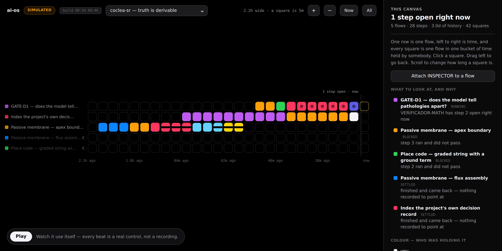

# 04 · ai-ui — el canvas inteligente

Un stream reordenado como mapa.

> **El inglés es canónico.** Traducción de [`doc/04-ai-ui.md`](../04-ai-ui.md).
>
> **Referencia.** Construido y corriendo — `ai-ui/`, 300 tests. Sigue sin probar.
>
> El escritorio existe: documentos, cubos de agente, la cara de traza, layout que
> persiste por scope, y `make up` lo sigue sirviendo. Sobre los mismos módulos se
> construyeron y publicaron otras tres superficies — carriles, una trenza, y el
> canvas de actividad que está en `/demo/` ahora ([21](../21-threads-of-thought.md)
> §9–10, en inglés).
>
> Lo que **no** pasó, en ninguna de las cuatro, es la falsación al pie de este
> documento — el cronómetro, un flow de tres días que corrió otra persona,
> escritorio contra transcript. **Cuatro superficies y ningún cronómetro es peor
> que una superficie y ningún cronómetro**, porque es cuatro veces la evidencia
> de que nadie midió si alguna ayuda. Hasta que corra, la afirmación honesta es
> que funcionan, no que ayudan.

## El problema

La web UI de QM es una buena aplicación de chat: dos sesiones concurrentes, una
barra lateral con archivos, crons, keychain, deploys, memoria y skills. Vite +
Lit, con `dockview-core` haciendo el layout de paneles
(`ai-base/plugins/web-ui/`).

Una transcripción es la forma correcta para una conversación y la equivocada para
el trabajo. Tres fallas concretas:

1. **El presente se va hacia arriba.** El estado actual del trabajo se deduce
   leyendo historia hacia atrás. En trabajo que dura semanas, la respuesta a
   "dónde está esto" no está en el último mensaje.
2. **Los artefactos se mencionan, no se sostienen.** Un archivo, una app, un
   borrador, una decisión — cada uno aparece como un mensaje *sobre* él, y después
   se aleja al mismo ritmo que una charla trivial.
3. **Los paneles son un menú fijo.** Archivos, crons, keychain, skills — los
   mismos paneles sin importar qué estés haciendo. La interfaz no tiene opinión
   sobre el trabajo.

## La afirmación

> La interfaz debería ser una **proyección del estado del trabajo**, espacial y
> viva, generada por el sistema — no un log de lo que se dijo.

## Qué significa "canvas inteligente"

Con precisión, para que no degenere en "un canvas con IA adentro":

**Espacial.** Los objetos tienen posición y persisten. Un flow, sus pasos, sus
artefactos, sus agentes y sus preguntas abiertas son cosas que acomodás y a las
que volvés, no mensajes que dejás atrás. La posición significa algo y se guarda.

**Vivo.** Los objetos reflejan el estado actual sin que haya que volver a
preguntar. Un paso corriendo se ve corriendo. Un artefacto que cambió un agente
se actualiza en el lugar.

**Generado.** Esta es la palabra que carga el peso. El canvas lo *compone el
sistema a partir del estado del flow* — la forma de un `Fan-out` sobre 40 hilos no
es la de una `Deliberation` sobre tres arquitecturas, y el usuario no debería
estar armando ninguna de las dos a mano. El sistema propone la disposición; el
usuario la sobreescribe; **la sobreescritura se recuerda** y le gana a la
propuesta de ahí en adelante.

**Dirigible.** La manipulación directa es una entrada de primera clase, a la par
del texto. Mover un paso, partir un artefacto, marcar una rama como muerta — todo
eso son instrucciones, no sólo cambios de vista.

El modo de falla contra el que hay que diseñar: un layout generado que se
reacomoda bajo las manos del usuario. **Regla: el sistema propone cuando cambia el
estado; nunca reacomoda lo que el usuario tocó.**

### Una quinta propiedad, agregada el 2026-08-23

Cuatro propiedades aguantaron la relectura. Una estaba escrita demasiado chica, y
la corrección está en [doc 20](20-everything-is-an-agent.md).

**Dirigible** dice que el usuario puede actuar sobre lo que ve. La versión más
fuerte —y la que ai-os puede hacer y un diagrama no— es:

**Delegable.** Le podés poner un agente encima. No "podés inspeccionar este
objeto", sino *podés entregarle este objeto a un agente y recibir lo que
encontró*. El inspector no es una función de la herramienta, es un participante:
`INSPECTOR` tiene un nombre, un archivo y una sola herramienta declarada, `read`.
Si pudiera hacer algo que ningún otro agente puede, "todo es un agente" sería
decoración sobre un caso especial.

Y la propiedad que hace que delegar valga más que una ventana de chat, que es la
única regla de toda esta superficie:

> **Todo hallazgo cita el artefacto que leyó, y la cita es una dirección.**

Cuando el agente no tiene nada que leer está obligado a devolver `unknown` —no un
rodeo, no una lectura plausible— y el escritorio lo dibuja distinto de una
respuesta. Eso es la división de `freezeVerdict` entre `blockers` y `unknown`
([doc 19 §4](19-what-would-make-this-matter.md)) expresada como una affordance en
vez de como un párrafo.

### Y la metáfora se movió

El escritorio de abajo se decidió contra System 7, que era lo correcto para
*documentos dispuestos en el espacio*. Es lo equivocado para *información
moviéndose entre cosas vivas*, porque en un escritorio System 7 no se mueve nada
salvo que lo muevas vos — y los flujos de información son lo que esta superficie
más necesita mostrar.

La referencia es NeXT: la paleta de objetos, el canvas, el único **Inspector**
atado a la selección, y sobre todo las **conexiones que se podían ver e
inspeccionar**. En Interface Builder arrastrabas un cable de un objeto a otro y la
conexión se volvía real, en el archivo. Nadie la tipeaba. Acá los objetos son
agentes y los cables son traspasos — con la cosa que se movió viajando por uno,
y se puede abrir.

### Y después se fue también el chrome — 2026-08-23

El párrafo de arriba decía "el chrome de System 7 se queda". No se quedó, y la
razón es el mismo argumento una vuelta después.

**El disfraz no cargaba información.** Barras de título rayadas, dos cuadraditos
de ventana falsos en cada panel que no cierran ni maximizan nada, un dither al
50% en el fondo, una sombra dura de 3px sobre todo a la misma profundidad. Nada
de eso le dice nada al lector sobre el sistema. Es referencia de época, y la
referencia de época es decoración por más cuidadosamente que esté dibujada — que
es exactamente contra lo que este documento dedica una sección a advertirle al
canvas.

**Y una colisión sí era estructural.** `AGENT_COLOR` y `STATE_COLORS.running`
eran el mismo ámbar. Un agente en reposo y un paso en vuelo eran del mismo color,
en la misma superficie, al mismo tiempo. Eso no es un problema de estilo; es el
vocabulario reclamando una distinción que no puede dibujar.

Así que la regla que sigue ahora la paleta, y la única que sigue:

> **El color es estado y evidencia. Nada más en la superficie está coloreado.**

Los agentes son una piedra cálida; los subagentes un tono de ella; una persona un
gris frío. La especie es forma y peso. Todo lo saturado del escritorio es o el
estado de un paso o el de un cable — lo que quiere decir que un lector que
aprende cinco marcas puede leer toda la superficie, y una captura de pantalla
carga la misma información que la página.

Lo que se conserva del look viejo, porque nunca fue disfraz: la grilla de
píxeles, la densidad, monoespaciada para cualquier cosa con dirección, y la regla
de que todo color dibujado aparece en una leyenda generada desde las tablas y no
desde una lista mantenida a mano.

Lo que lo reemplaza: la tipografía propia de la plataforma, una sola escala de
sombra que significa elevación, líneas de un pelo en vez de negro de 1px, y un
fondo que se retira.

## La metáfora: un escritorio, no un dashboard — decidido 2026-08-09

Las cuatro palabras de arriba dicen qué *hace* el canvas. No dicen nada de cómo
tiene que verse, y lo primero que se construyó a partir de ellas — un documento
plano y oscuro — se ganó exactamente una queja: **era poco claro.** Todo pesaba
lo mismo, así que nada te decía qué clase de cosa estabas mirando.

La respuesta es una metáfora lo bastante vieja como para haber sido probada con
gente que nunca había usado una computadora: **el escritorio de System 7 y
Windows 3.1.**

- **Una ventana es un borde.** Una barra de título y un marco te dicen dónde
  termina una cosa y empieza la siguiente, antes de leer ninguna de las dos.
- **Un biselado es una superficie.** Levantado es una cosa; hundido es un
  recipiente que contiene cosas. Es una pista de profundidad que no necesita
  leyenda.
- **Un bloque de color es un tipo.** Un color por rol de scope, por agente y por
  estado de paso, que no se usa para nada más — el progreso de un flow pasa a ser
  una tira de cubitos que se cuenta desde el otro lado de la sala, y *dónde* se
  frenó se ve sin leer.
- **Un documento es un documento.** Un flow es una hoja con la esquina doblada,
  porque eso es lo que es: una cosa con título que alguien tiene que retomar.
- **Las bandejas sostienen trabajo.** Bandeja de entrada para lo que se sigue
  moviendo, de salida para lo que ya se asentó. No es decoración — "dónde está
  esto y hay alguien sosteniéndolo" es la pregunta para la que existe el canvas,
  así que debería ser la primera que contesta el layout.

Esto ya está **[ran]**: el explorador sólo-lectura de `ai-flows/src/view.ts` se
reconstruyó así, y sus capturas están en [el manual](manual.md). El canvas hereda
el vocabulario en lugar de inventar un segundo.

Lo que el canvas agrega encima es exactamente las cuatro propiedades de arriba:
posición que persiste, estado que se actualiza en su lugar, disposición compuesta
a partir de la forma del flow, y manipulación directa como entrada. El explorador
no tiene ninguna **a propósito**, que es lo que lo vuelve el brazo de control: ver
§ Cómo se falsifica esto.

Una cosa sobre la que la época *no* vota. Geneva de nueve puntos en una pantalla
de 640×480 era una restricción, no un objetivo, y reproducirla sería resignar
justo la claridad por la que se adoptó la metáfora. **Cromo de época, tipografía
de hoy.**

## Por qué una proyección y no un transcripto — la razón de muestreo

La afirmación de arriba se lee como gusto personal. No lo es, y vale la pena
decir por qué, porque convierte una estética en una restricción.

Una persona mira un flow a cierta tasa — realistamente una o dos veces por día.
El flow produce intentos a su propia tasa, que puede ser de varios por hora. **Un
observador que muestrea a $f_s$ solo puede observar fielmente cambios más lentos
que $f_s/2$.** Todo lo más rápido no desaparece: *aliasea*, y vuelve disfrazado
de tendencia lenta que no existe. Tres reversiones no relacionadas dentro de un
día, muestreadas una vez, se leen como una dirección.

Un transcripto es el stream crudo a tasa completa entregado a un observador que
muestrea muy por debajo. No es apenas verboso — como señal está **mal**, y mal en
la dirección específica de fabricar narrativa falsa.

Dos consecuencias para v1, ambas baratas:

1. **Una proyección declara la tasa de cambio que representa.** "Estado de las
   últimas 6 horas" es un objeto distinto de "estado ahora", y un canvas que no
   dice cuál está mostrando está invitando al lector a inferir una tendencia a
   partir de ruido.
2. **El cambio más rápido que el muestreo se agrega, nunca se descarta.**
   Descartar es lo que produce aliasing; resumir es lo que lo evita. Quince
   intentos desde la última vez que miraste son un objeto que dice *quince
   intentos, acá quedó* — no el último, y no los quince.

Esto no agrega mecanismo. Le da una razón y una regla testeable a un compromiso
que ya estaba tomado, y es el mismo argumento que hace
[10-observabilidad](10-observability.md) un nivel más abajo, donde el instrumento
muestreado es el flow mismo.

## Relación con la web-ui existente

`ai-ui` es un **quinto plugin**, construido contra el mismo chassis que `web-ui`,
`admin`, `portal` y `auth`. No bifurca ni reemplaza a `web-ui`, por dos razones:
`web-ui` es la superficie que todo el upstream mantiene funcionando, y correr las
dos permite compararlas sobre trabajo real en vez de afirmar que el canvas es
mejor.

**Vive en `ai-base/deploy/layers/evolvingagents/plugins/`** — la ubicación
sancionada por QM para las imágenes de servicio propias de una organización
(`ai-base/deploy/layers/README.md`). Es el único pilar que no necesita ninguna
divergencia del core: es exactamente la personalización para la que upstream
diseñó el límite de layers. El código fuente vive en `ai-ui/`; el layer contiene
su imagen de deploy y su configuración.

Cuando el canvas necesite datos que la API de QM no expone, la solución es una
ruta en `ai-flows`, no un canal especial hacia el core.

### El contrato del chassis, verificado

`ai-base/plugins/chassis/package.json` — *"firma de source-auth, los helpers
firmados de cliente del core, helpers chicos de request/response de `node:http`,
helpers de error, y el bloque común de env `CORE_*`… nunca importa el core."*

Consecuencias que aceptamos:

- `ai-ui` habla con el core **sólo por HTTP firmado**. Sin proceso compartido, sin
  acceso directo a los stores.
- Auth, identidad y scope vienen del core. El canvas renderiza lo que el scope de
  quien llama permite, y nunca lo amplía.
- El chassis es sólo-fuente y no se publica; las imágenes Docker copian
  `plugins/chassis` junto a cada plugin. `ai-ui` sigue el mismo empaquetado.

## Tecnología

Arrancar de lo que upstream ya corre, y divergir sólo donde el canvas lo exija:

| Aspecto | Elección | Por qué |
|---|---|---|
| Render | Lit | Lo que usa `web-ui`; no un segundo framework en un mismo repo |
| Layout | `dockview-core`, y después reevaluar | Ya es dependencia; los paneles acoplables son un canvas débil pero un punto de partida real |
| Transporte | HTTP firmado del chassis + el streaming existente del core | No inventar un segundo protocolo |
| Superficie de canvas | **Abierta** | Los paneles acoplables podrían no sobrevivir al contacto con un canvas espacial. Decidir después de renderizar el primer flow real, no ahora |

Esa última fila queda deliberadamente sin resolver. Elegir un motor de canvas
antes de haber renderizado un flow real es el tipo de decisión que esta
organización ya tomó demasiado temprano.

## Alcance del v1

**Adentro:** renderizar un flow corriendo — pasos, estados, artefactos, el agente
activo; actualizaciones en vivo; manipulación directa del estado de un paso;
layout persistido por scope; disposición propuesta por el sistema según la forma
del flow, sobreescribible y pegajosa.

**Afuera:** reemplazar `web-ui`; Slack (esa superficie queda como upstream la
entrega); **edición simultánea del canvas por varios usuarios**; una herramienta
de diagramación general.

> La exclusión de la edición simultánea es la que hay que decir en voz alta, dado
> que el problema que enmarca el proyecto es
> [multijugador](../../README.es.md).
> ai-os apunta a **multijugador asincrónico** — varias personas actuando sobre un
> objeto durable a lo largo de días — no a co-presencia en tiempo real. Es una
> afirmación más angosta, y hay que sostenerla en vez de dejar que se lea como la
> otra.

## Construido, y qué quiere decir acá "construido" — 2026-08-09 [ran]

Dos flows como documentos, cada uno con sus cubitos de agentes apilados encima, el estante a la izquierda con los agentes sin trabajo, y la leyenda. De una instancia viva. <code>AnomalyScanner</code> está tachado y no se puede arrastrar: está declarado en <code>DataQualityAgent.md</code> sin archivo detrás.

`ai-ui` existe. Es un paquete — modelo de disposición, store, render y servidor —
que le habla a `ai-flows` por la costura firmada y no es dueño de nada salvo la
disposición.

Las cuatro propiedades, y cómo se salda cada una:

| | |
|---|---|
| **Espacial** | Arrastrás un documento; sigue ahí después de recargar, desde `ui_desk_layout` con clave por scope. **[ran]** |
| **Vivo** | El escritorio relee el estado cada cinco segundos, y el agente de un paso corriendo es lo único que se anima |
| **Generado** | `propose()` acomoda los documentos en grilla y apila el cubito de cada agente sobre el flow cuyos pasos lo nombran |
| **Dirigible** | Soltar un cubito sobre un documento agrega un paso de delegación — la misma instrucción que escribe `compose.ts`, verificada byte a byte por un test |

**La parte que sostiene todo no es el dibujo.** Es `layout.ts`, y puntualmente qué
le pasa a la disposición que armó una persona cuando el sistema quiere proponer
otra. Cada ubicación lleva un bit `pinned` que se prende en el momento en que un
humano la arrastra, y `propose()` esquiva lo fijado en vez de pisarlo. Un canvas
que se equivoca acá tira el trabajo del usuario cada vez que termina un paso —
que es justo cuando lo está mirando. Esa regla es una propiedad de una función
pura acá, y ocho tests la sostienen contra los eventos que la romperían: un flow
que termina, uno que aparece, uno que se borra.

Un caso vale nombrarlo porque es el que muerde. Soltás `ReviewAgent` sobre un
documento; el escritorio re-propone desde el estado del flow; `ReviewAgent`
*todavía* no está en los pasos, porque el paso que acaba de crear no corrió. Re-
derivar haría volver el cubito de un salto y desharía la asignación delante de
quien la hizo. Así que un cubito fijado se queda en su documento.

### Los agentes ahora son criaturas — 2026-08-11 [ran]

Un agente era un cuadrado de color con un nombre. Lo ubicaba el layout, que sólo
podía sostenerlo en **un** lugar — así que un agente con pasos en dos flows se
dibujaba parado sobre el que el layout nombrara. El dibujo decía "está acá", el
trace decía "está en los dos", y a quien se le cree es al dibujo.

Tres cambios, todos en el producto y no en la demo:

**Una criatura por cada documento en el que el agente tiene trabajo**, derivada de
los pasos ([creatures.ts](../../ai-ui/src/creatures.ts)). Dos flows son dos de él,
y el segundo *crece* del primero donde se lo puede ver pasar; cuando el trabajo se
va, el sobrante camina de vuelta hacia el que queda. Varios pasos en un mismo flow
siguen siendo una criatura con un multiplicador: una cola no es una multitud.

**El cuerpo responde "¿este está trabajando?" sin abrir nada.** Ojos que parpadean
mientras espera, se entrecierran mientras corre, y quedan cerrados en un agente
declarado sin archivo detrás — más lo que está haciendo, encima del agente:
*step 2 · running*.

**Nada salta.** El render vaciaba la superficie y la volvía a dibujar cada cinco
segundos, y por eso nada podía moverse: ningún elemento sobrevivía lo suficiente
como para ser movido, y cada cambio de lugar era un nodo nuevo apareciendo donde
estaba el viejo. Ahora reconcilia, y todo lo que quedó en otro lado *camina* hasta
ahí — en píxeles enteros, con timing `steps()`, nunca deslizándose.

Dos defectos salieron de construirlo, y a los dos los encontró correrlo. El
backend simulado agregaba pasos **sin el campo `agent`**, donde el servidor pone
`agent: agentOfIntent(s.intent)` en cada paso — la forma del dato de la demo se
había apartado en silencio de la de la API, y lo primero que leyó ese campo lo
encontró vacío. Y el `String.raw` del cliente tuvo que sobrevivir: inyectar las
reglas nuevas por interpolación lo convertía en un template común, donde `\s` se
colapsa a `s` y el regex que limpia markdown habría viajado buscando la letra.

### La demo, y el compañero que sólo vive ahí — 2026-08-11 [ran]

El escritorio jugable del sitio es el cliente real con `window.fetch` reemplazado
([simulate.ts](../../ai-ui/src/simulate.ts)), así que hereda todo lo de arriba.
Ahí se agregan dos cosas, con una puerta para que el producto no pueda embarcarlas:
el tour que se maneja solo, y **Cubi** — el cubo de agente al doble de tamaño, con
ojos.

Cubi reacciona a lo que tocás, y cada línea que dice carga el hecho del que salió:
*0 intentos en 1 paso*, *arrastró 0% de los 14 tokens distintivos que recibió*. Los
comentarios los elige el estado y no un temporizador, que es toda la diferencia con
el asistente de 1991 al que cita. Además se calla mientras habla el tour, y se
corre en lugar de tapar el documento del que está hablando.

**El cerebro opcional.** Un botón descarga un modelo de lenguaje **dentro del
navegador** (WebLLM sobre WebGPU) y deja que Cubi responda libremente. Los escalones,
con las cifras de VRAM del propio `prebuiltAppConfig` de WebLLM [read]:

| escalón | VRAM | cuándo |
|---|---|---|
| `SmolLM2-360M-Instruct-q4f16_1` | 376 MB | inglés, y celular o ≤4 GB reportados |
| `Qwen2.5-0.5B-Instruct-q4f16_1` | 945 MB | español siempre, y desktop por defecto |

El Prompt API de Chrome no es un escalón: Chrome 148 lo trae prendido por defecto,
y es sólo desktop y pide 22 GB de disco y 4 GB de VRAM [read].

Dos reglas evitan que esto contradiga a la página donde está. **Los hechos nunca
salen del modelo** — se le entrega una hoja armada desde el trace y se le dice que
no puede agregarle nada, igual que `/ask` se responde desde el trace y nunca desde
el goal. Y como un modelo de 360M inventa números igual, cada respuesta se contrasta
contra esa hoja: los dígitos y los nombres con forma de agente que no estén ahí se
imprimen debajo, en rojo, como sin respaldo. La demo discute su propia tesis en
público — se puede ver a un modelo chico mantenerse anclado, o verlo fallar.

Éste es también el único lugar donde el escritorio toca la red por algo que no sea
su propio estado, y sólo después de una pulsación que primero declara el tamaño.

### Una sola especie, y hablan — 2026-08-11 [ran]

La primera versión de esto tenía dos sprites. La mascota era un cuerpo de 26px
con ojos de 4×6 y cuatro patas; un agente era un cuerpo de 15px con ojos de 2×4 y
tres patas talladas como muescas en el borde de abajo. Los dos eran "el cubo con
ojos" en el código, y ninguno lo era en el dibujo: quien miraba veía *un personaje
al lado de una fila de fichas*, que es justo el fracaso de "mascota pegada
encima" que el diseño decía evitar. Dos sprites son dos especies, diga lo que
diga el comentario.

Ahora hay un solo sprite ([creatures.ts](../../ai-ui/src/creatures.ts)), dibujado
sobre una grilla de 16 píxeles y escalado por `--u`. El agente de sistema es el
mismo animal en `--u:2` con un segundo contorno, y parpadea, camina y mira con el
mismo código que cualquier otro agente.

**Todas las criaturas miran el puntero.** Seis líneas, redondeadas a una unidad
entera de grilla para que la pupila se mueva en píxeles como todo lo demás. Es el
cambio que más vida agrega por menos código en toda la página.

**Agentes dormidos en la repisa.** Cuarenta segundos sin que nadie los pida y se
duermen, con una letra-píxel de ronquido. Es un estado real del sistema — "nadie
está pidiendo éste" — que una fila de caritas despiertas venía negando.

**El traspaso, dibujado.** Cuando un paso cierra, el resultado viaja desde el
agente que lo produjo hasta el que lo recibió: un cuadrado verde que llega, o uno
rojo que se queda corto y se cae. El veredicto es el `ignoredInput` del trace, no
una segunda medición. El hallazgo por el que existe todo este sistema era una
frase a dos clics dentro de un panel; ahora es algo que se ve caer al piso.

**Contestan por sí mismos.** Tocás un agente, Cubi camina hasta él y le pregunta
— y el agente responde en su propio globo, en primera persona, desde su propio
registro. Un agente que corrió y no llevó nada adelante *confiesa*: "respondí
'Looks fine to me'. El trace dice que no llevé nada del paso anterior al mío".
La delegación es el mecanismo del que trata este producto, y un compañero que
resumiera a los otros agentes habría sido una superficie más leyendo el trace por
ellos.

Dos defectos más que sólo encontró tocarlo. Un agente parado **adentro** de un
documento no se podía tocar como agente — respondía primero el documento debajo,
y eso rompía el único gesto del que depende la conversación. Y un clic con un
píxel de temblor se tomaba como arrastre, así que tocar un agente que ya estaba
sobre un documento lo soltaba ahí de nuevo: `POST /assign`, un paso real
agregado, a partir de un gesto que la persona hizo como clic. Ahora ocho píxeles
separan un gesto de un resbalón, un cubo devuelto al documento del que salió no
escribe nada, y el escritorio **anuncia qué se seleccionó** para que la mascota
lea la decisión del propio producto en vez de re-deducirla de los eventos de
puntero y contradecirlo.

### El laboratorio de señales — el mismo escritorio, sobre números — 2026-08-11 [ran]

Lo que afirma el escritorio es que **verde no es correcto**: un paso puede
correr, cerrar, reportar y no haber llevado nada adelante. En un flow de prosa
eso es una afirmación real y difícil de sentir — hay que creerle al instrumento.
Así que la demo ganó un segundo scope donde la misma afirmación es un dibujo.

`group:signal-lab` tiene dos flows. Los dos buscan un tono de 5 Hz debajo de un
zumbido de red de 23 Hz. Los dos usan los mismos seis agentes en los mismos seis
pasos. Los dos están verdes de punta a punta. Uno encontró el tono en el bin 5;
el otro lo perdió en el paso 2 y respondió *"componente más fuerte: bin 0
(0.0 Hz), magnitud 0.00"* con la misma seguridad.

El defecto es una conversión a punto fijo con la escala mal cargada — 0,5 cuentas
por unidad en vez de 32767 — así que cada muestra se trunca a cero. La etapa
devuelve 64 números válidos, dentro de rango, sin recorte, y lo informa. Todas
las etapas siguientes corren correctamente sobre nada.

**Nada en `ai-ui` sabe qué es una transformada de Fourier.** El digest, el trace,
el menú de acciones, la mascota y la bandera de "no llevó nada adelante" hacen
todo el trabajo sin cambios. Ése es el punto del scope: los instrumentos no son
sobre texto.

Lo que hizo falta, y cada cosa es un cambio del producto y no un truco de la demo:

- **Un paso puede llevar números.** `series` en el paso, dibujado como barras con
  el pico impreso al lado — porque un gráfico normalizado a su propio máximo se ve
  igual a 1,3 unidades que a cero, y el único caso que nadie debería tener que
  entrecerrar los ojos para leer es el vacío. Dice *peak 0.00 — nothing here*, con
  palabras.
- **Quien ejecuta puede aportar su propio veredicto sobre el traspaso.**
  `contribution` en el paso crudo: cuando lo que corrió la etapa puede responder
  "¿mi salida se mueve cuando se mueve mi entrada?", gana su respuesta y no se
  consulta la superposición de prosa. Tanto la bandera como el menú **nombran el
  instrumento que juzgó**, en vez de afirmar siempre que contaron tokens.
- **Abrir la cara Trace reproduce los traspasos del flow** sobre el escritorio:
  cada resultado viajando al siguiente agente, y el que no llegó cayéndose al
  piso en rojo.

La medición es una perturbación: se vuelve a correr cada etapa con todas las
muestras corridas un 1% y se compara el cambio de su salida contra el de su
entrada. Cero significa que la etapa no está escuchando. A propósito **no** es un
chequeo de corrección — una etapa puede ser perfectamente sensible y estar
perfectamente equivocada — y la demo lo dice dejando sin marcar a las etapas
posteriores al defecto: no destruyeron nada, no les dieron nada.

**El argumento del scope es un test, no una declaración.** `dsp-demo.test.ts`
corre el instrumento habitual del escritorio — superposición de prosa,
`contribution.ts` — sobre la cadena rota y afirma que **no marca nada**. Los dos
reportes difieren en un número y comparten todas sus palabras distintivas. Si ese
test alguna vez da lo contrario, el instrumento de texto alcanzaba y este scope
hay que borrarlo.

### Lo que a propósito NO hace

**Leer el escritorio nunca gasta una llamada al modelo.** `POST /assign` escribe
un paso y `POST /advance` corre uno; todo lo demás es lectura. El escritorio se
consulta solo, así que un canvas donde dibujar pudiera disparar trabajo gastaría
plata porque alguien dejó una pestaña abierta. Avanzar es un click, con el costo
dicho en el panel antes de apretarlo.

**Sin build.** El cliente es un string de JS plano. Este pilar es el que más
riesgo tiene de costar un trimestre de infraestructura antes de haberlo ganado, y
un bundler es la primera cuota de esa cuenta. Si el cronómetro de abajo dice que
el canvas gana, agregar un build es barato y va a estar pagado.

## Cómo se falsifica

**La medición:** una persona, y un flow que no corrió ella, de tres días atrás.
Tiempo hasta responder: *cuál es el estado, qué está bloqueado, qué produjo*.
Canvas contra la transcripción de `web-ui`.

**La afirmación:** el canvas es más rápido, y la brecha se agranda con la edad del
flow.

**Si no es más rápido, ai-ui es decoración.** Es el pilar más vulnerable a ser
lindo e inútil, así que la medición es un cronómetro sobre una tarea real y no una
opinión sobre cómo se ve.
