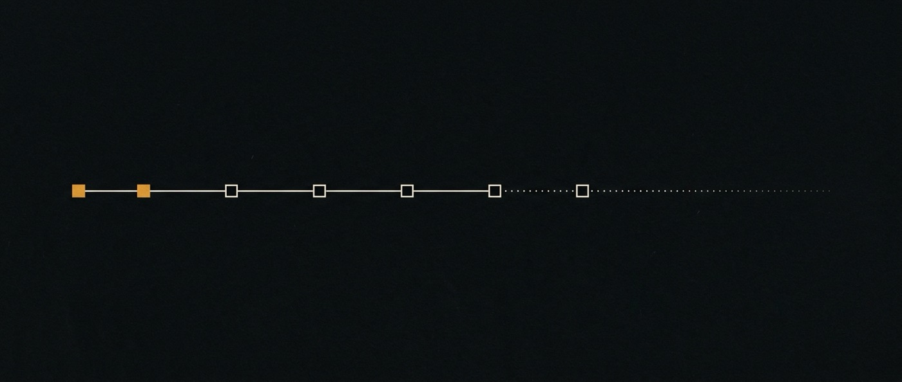

# 08 · Roadmap

Dos milestones sólidos, el resto todavía contornos.

> **Proyecto.** Milestones y bloqueos. Lo construido se dice en el documento de cada pilar.

> **El inglés es canónico.** Traducción de [`doc/08-roadmap.md`](../08-roadmap.md).

Milestones en orden de dependencia. Cada uno declara qué significa "listo" y qué
mostraría que no valía la pena. Sin fechas — las estimaciones de esta organización
no han sido informativas.

## M0 · Fundación — **hecho** (2026-08-01)

Repositorio, licenciamiento, y QM vendorizado como subtree con linaje.

- Apache 2.0 + `NOTICE`, MIT conservado textual en `ai-base/LICENSE`
- `ai-base` = `yc-software/qm@7f2c916`, agregado vía `git subtree` para que
  upstream siga siendo traíble
- Arquitectura verificada contra el código, no contra el README: tres seams
  usables (`MemoryService`, chassis de plugins, `Harness`) y cinco huecos
  confirmados

**Listo significa:** la pregunta de licenciamiento está zanjada por escrito
([06](06-licensing.md)) y cada afirmación sobre QM cita un archivo.

## M1 · ai-base corre localmente — **hecho** (2026-08-01)

Levantarlo llevó menos de una hora. Sin Postgres (stores en memoria), sin paso de
build, y la suite ya estaba verde: **3.712 tests, 3.580 pass, 0 fail**, más un
`tsc --noEmit` limpio.

> **"Sin Postgres" era un hecho sobre M1, no una propiedad permanente.** Queda acá
> porque es lo que pasó, pero deja de ser cierto en M2 — ver
> [Fase 0](#fase-0--durable-por-defecto--nuevo-y-no-es-opcional). Los stores en
> memoria son por proceso, así que un segundo proceso no puede ver el estado del
> primero y nada sobrevive a un reinicio, que es la mayor parte de lo que M2
> promete.

Turnos reales completados contra `deepseek/deepseek-v4-flash` vía OpenRouter en
`HARNESS=pi` — una respuesta de smoke, una escritura de memoria observada en
disco, y una llamada a herramienta que falló honestamente porque faltaba la imagen
del sandbox.

**Se pagó solo de inmediato.** Se encontraron y corrigieron siete errores
materiales en `doc/` — dos de ellos ya se habían endurecido en
[ADR-0002](adr/0002-flow-as-first-class-object.md), ahora reemplazado por
[ADR-0004](adr/0004-flows-and-the-subagent-record.md). El que vale nombrar: **la
delegación en subagentes y los modelos de OpenRouter viven en conjuntos disjuntos
de harness**, así que modelo barato y multi-agente no se pueden tener juntos.
Ninguna cantidad de lectura sacó eso a la luz; configurarlo sí.

**Ese hallazgo venció el 2026-08-06** — upstream le dio a `pi` delegación mediante
agentes markdown definidos en el workspace mientras conservaba OpenRouter, y la
disyunción desapareció (matriz corregida en
[01-architecture](01-architecture.md#la-matriz-de-capacidades-por-harness)). Vale
dejarlo acá en vez de borrarlo, porque afila la lección de M1 en lugar de
suavizarla: una afirmación **[ran]** sobre una dependencia que se trae cada semana
es una medición con fecha de vencimiento, y ésta ya estaba citada en cuatro
documentos cuando se pudrió. La regla que sale de ahí está en
[12-conformation](12-conformation.md#lo-que-costó-encontrarlo): una afirmación
sobre una capacidad de upstream nombra el archivo y la línea que tendrían que
cambiar para que deje de ser cierta.

**La regla permanente que sale de M1:** las afirmaciones en `doc/` se marcan
**[read]** o **[ran]**. Leer es cómo el flagship anterior llegó a 18.680 líneas
con tres funciones de test.

### Prerequisitos — todos cumplidos (2026-08-01)

- **Docker + imagen de sandbox** — construida (`qm-sandbox-local:latest`,
  1,31 GB). `execute` corre comandos reales, y `/workspace` persiste entre
  sesiones dentro del mismo scope. Ambas cosas verificadas.
- **Un cliente de requests firmadas.** HMAC-SHA256 sobre
  `v0:{segundos-unix}:{MÉTODO}\n{path}\n{body}`, ventana de replay de cinco
  minutos.

**Un costo que hay que planificar:** la imagen del sandbox es `linux/amd64`, así
que en Apple Silicon cada llamada a herramienta va emulada — ~47 s en frío, ~25 s
en caliente, contra ~4 s para un turno sin herramientas. El ciclo de iteración de
M2 es entonces de minutos por vuelta. O se presupuesta, o se construye una imagen
arm64 primero; no descubrirlo a mitad del milestone.

## El camino a una versión sobre la cual valga iterar — **agregado 2026-08-06**

Los milestones de abajo están en orden de dependencia pero no son un plan, porque
no dicen cuáles están *bloqueados* y por qué. Faltan cinco cosas para un sistema
que corre: el motor de flows, el canvas, la memoria por scope, la delegación de
profundidad 2, y los agentes-principal. **No son cinco ítems de trabajo
comparables**, y tratarlos como una lista para quemar es el error que esta sección
existe para prevenir.

Ordenados por lo que realmente está en el medio:

| Falta | Estado | Qué está en el medio |
|---|---|---|
| Stores durables | **prerrequisito, no declarado hasta ahora** | nada — es configuración |
| Motor de flows (M2) | **desbloqueado** | el cliente HTTP firmado, que nadie escribió |
| El canvas (M5) | **construido 2026-08-09, sin probar** | el cronómetro — una persona, un flow de tres días que no corrió ella, canvas contra transcripción. Construirlo no lo respondió |
| Memoria por scope (M4) | **con compuerta** | un test de headroom que no se corrió |
| Delegación profundidad 2 | **diferido** | [ADR-0008](adr/0008-conformation-is-projected.md) — su condición no se disparó |
| Agentes-principal | **diferido** | ADR-0008 — su condición no se disparó |

Sólo los dos primeros son trabajo. El tercero se sigue del segundo. Los últimos
tres son decisiones ya tomadas, y reabrirlas es un argumento distinto de
agendarlas.

### Qué tiene que significar "una versión sobre la cual iterar"

No completitud de features. El sistema más chico cuyo *loop cierra*: **trabajo que
sobrevive a la interrupción, y una forma de verlo.** Un OS de agentes que no se
puede dejar y retomar es una app de chat, y uno cuyo estado no se puede ver no se
puede dirigir. Eso es Fase 0 más Fase 1 más Fase 2. Todo lo demás es mejora sobre
una cosa que primero tiene que existir.

### Fase 0 · Durable por defecto — **nuevo, y no es opcional**

M1 registró "Postgres opcional (los stores en memoria funcionan)". Era cierto de M1
y es falso de todo lo que viene después, y correr el sistema el 2026-08-06 es lo
que lo mostró **[ran]**:

- Un proyecto creado en la UI web fue **invisible para el proyector de
  conformación** corriendo como segundo proceso contra el mismo `dataDir`. Con
  `store=memory` el `ProjectStore` vive dentro del proceso del core; otro proceso
  ve los archivos del workspace y nada del estado
  ([manual § Parte 4](manual.md#holes-live)).
- `SessionStore.distinctScopes()` devolvió 0 por la misma razón, así que la lista
  de scopes hubo que recuperarla decodificando nombres de directorio.
- Un flow que se retoma el miércoles no puede retomarse de un proceso que terminó
  el lunes. **La propia definición de "listo" de M2 es inalcanzable con stores en
  memoria.**

Entonces: `DATABASE_URL` seteado, `npm run test:pg` en verde, y los stores en
memoria degradados a lo que son — un fixture de tests unitarios. Chico, y es el
piso sobre el que se para todo lo demás.

### Fase 1 · El motor de flows (M2)

Sin cambios de fondo respecto de M2 más abajo. Dos cosas que el milestone no dice,
y las dos son las primeras tareas reales:

1. **El cliente HTTP firmado no existe.** [ADR-0006](adr/0006-ai-flows-lives-outside-core.md)
   decidió que `ai-flows` avanza un paso llamando a la API firmada en vez de
   importar core — HMAC-SHA256 sobre `v0:{unix}:{METHOD}\n{path}\n{body}`, ventana
   de replay de cinco minutos. Ese cliente es código propio de ai-os y **nadie lo
   escribió**. Es tal vez un día, está en el camino crítico, y todas las fases
   posteriores pasan por ahí.
2. **La primera rebanada es un flow, un paso, `Open`.** Crear un flow, avanzarlo con
   `POST /v1/turns?async=1`, pollear `GET /v1/runs/:id` hasta estado terminal,
   registrar el intento y su observación. Cualquier cosa más allá — formas, fork,
   diff — es M3 y M6 y no pertenece a la rebanada que prueba el seam.

**Falsificado por:** que el paso no se pueda hacer ejecutar por la API pública y
termine necesitando modificar core. Eso mata a ADR-0006, no al flow, y es mejor
enterarse en la primera rebanada que en el séptimo entregable.

### Fase 2 · Verlo — y la versión barata va primero

M5 es un canvas: Lit, `dockview-core`, layout espacial, un quinto plugin. Eso es un
trimestre de infraestructura para contestar una pregunta que se puede contestar en
una tarde, y este workspace tiene una regla permanente contra pagar el segundo
precio antes que el primero.

**Construir primero la vista de sólo lectura.** El proyector de conformación ya
emite un documento con scopes, agentes, rosters, el grafo de comunicación y sus
agujeros. Agregarle estado de flow y renderizarlo — una página, sin persistencia de
layout, sin drag, sin componentes generados. Y después correr **la propia
falsación de M5, sin cambios**: el test del cronómetro, un flow de tres días,
canvas contra transcript.

Si la vista plana de sólo lectura ya alcanza para que una persona retome un flow
después de tres días, **el canvas no es lo próximo a construir** y M5 hay que
reargumentarlo en vez de agendarlo. Si no alcanza, el cronómetro dice exactamente
qué faltaba, y eso es mejor especificación para un canvas que [04](04-ai-ui.md).

### Fase 3 · Las tres compuertas — **las tres corridas, 2026-08-06/07**

La fase nunca fue "construir estas tres". Era **correr sus compuertas**, para que
las decisiones se tomaran sobre evidencia. Las tres ya se corrieron y ninguna
produjo código. Dos produjeron decisiones y una produjo un callejón sin salida.

**Memoria por scope (M4) — la compuerta se abrió.** Extender el bench hasta que el
baseline de archivo plano baje a lo sumo a 7 en `staleness`, o M4 no procede. Sacó
**10,0** en una fixture que revisa un hecho seis veces en trece turnos, y **3,0** en
una que revisa una política una vez a lo largo de cuarenta y tres — la densidad no
rompe el archivo plano, el horizonte sí. La condición se cumple con margen, **M4
procede**, y el número a batir es 3,0. El detalle y los dos reparos están en
[§ M4](#m4). Construir M4 es un milestone, no esta fase.

**Delegación de profundidad 2 — el instrumento del plan no se puede construir.**
Esta fase decía que lo barato no era construir profundidad 2 sino *instrumentarla*:
registrar si la tarea de un hijo delegado contenía sub-trabajo separable, y si eso
nunca se dispara, el tope no cuesta nada. **Ese instrumento no es construible sobre
esta base [ran]:** `pi` no escribe filas en `tasks`, y los entries de sesión sólo
llevan `user` / `system` / `thinking` / `assistant` — no hay registro de tool calls
en ninguna parte, así que una delegación no deja rastro alguno. Nada puede observar
qué se le pidió a un hijo.

Así que el ítem no está pendiente: es **inejecutable como fue escrito**. La
profundidad 2 sigue diferida bajo
[ADR-0008](adr/0008-conformation-is-projected.md), y reabrirla ahora exige otra
señal (un harness respaldado por CLI sí escribe filas `tasks`) o un cambio upstream.
Registrarlo en vez de dejar el ítem abierto es el punto: un paso de plan que no se
puede ejecutar debe decirlo, no quedar sin tildar dando a entender que nadie llegó.

**Agentes-principal — la condición no se disparó, y sí se disparó algo más barato.**
Correr un flow compuesto en un scope de proyecto fue rechazado: *"you're not a
member of that context"*. Eso se registró primero como la condición de ADR-0008
disparándose — *un agente que deba aparecer en un roster* — y **esa lectura estaba
mal**.

Lo rechazado fue una cuenta de servicio. El arreglo que sugiere una cuenta de
servicio, meterla en el roster, no es lo que la situación pide: alguien creó ese
flow, esa persona ya está en el roster, y es a quien la auditoría debería nombrar.
Al sistema no le faltaba una identidad de agente. **Le faltaba la procedencia que ya
tenía y tiró** — `Flow` registra `scopeId` y nada sobre para quién es.

[ADR-0009](adr/0009-a-flow-records-who-it-acts-for.md) decide lo barato y correcto:
un flow registra el principal para el que actúa, un paso corre como ese principal,
`FLOWS_ACTOR` se elimina, y **no se agrega ningún `PrincipalType` nuevo**. También
afila la condición de ADR-0008 para que no se pueda malinterpretar dos veces igual
— un agente-principal necesita un derecho *que ningún solicitante humano tenga*, y
una cuenta de servicio rechazada no es eso.

**Decidido, todavía no construido.** El cambio de schema y las dos rutas no están
implementados.

### Lo que este plan deliberadamente no contiene

Más allá de [§ Deliberadamente no planeado](#not-planned): **ningún
intento de hacer las Fases 1 y 2 en paralelo.** La vista renderiza estado de flow;
construirla contra un motor de flows que todavía no existe significa diseñar para
estado imaginado, y lo único que este repositorio probó repetidamente es que el
estado imaginado es donde el instrumento empieza a halagar a su autor.

## M2 · El primer flow — **no arrancado, y lo que justifica el repositorio**

El `ai-flows` más chico y honesto: **una forma (`Open`), persistida, reanudable.**

1. Tablas `flow_`; un registro de flow con objetivo, estado, pasos
2. El intento de un paso ejecuta como un run existente (`ai-base/src/runs/`),
   reutilizando `src/core/turn-resume.ts` para recuperación ante caída dentro de
   un intento
3. Un flow sobrevive al reinicio del proceso y a la compactación de contexto
4. `forkedFrom { flowId, atStep }` registrado desde el primer commit — el hueco de
   las sesiones de upstream no se reproduce acá
5. Rutas de API para crear / avanzar / inspeccionar
6. **Completa sin subagentes y sin filas de tasks**
   ([ADR-0004](adr/0004-flows-and-the-subagent-record.md)) — el harness que hace
   cumplir esto ahora es `mock`, no `pi`; `pi` ganó delegación el 2026-08-06. El
   entregable no cambia: un flow que necesita hijos para terminar es un flow que no
   termina en todos lados
7. **Una observación por intento, capturada al cerrarlo**
   ([ADR-0007](adr/0007-observation-captured-not-derived.md)) — no un agregado a
   M2 sino el instrumento que la propia falsación de M2 ya exige. Sin él la
   comparación de §Cómo se falsifica es una anécdota, y la telemetría de upstream
   se borra una hora después del intento que la produjo

**Un número que M2 debía, ya pagado.** δ — la tasa a la que trabajo idéntico
produce estado distinto — es **0% sobre texto normalizado y 21.1% sobre el crudo**,
medido en `pi` / `deepseek-v4-flash` a lo largo de 22 turnos **[ran]**
([10 § Qué se midió](10-observability.md)). Toda afirmación del tipo "el flow
conservó su trabajo y la sesión lo perdió" es una afirmación de que dos estados
difieren, y vale lo que vale el instrumento que la hace. La tarde que costó no
invalidó la maquinaria de deriva — la corrigió: `digestOf` ahora normaliza, porque
los bytes crudos cargaban 21% de ruido a cambio de nada.

Fuera de M2: formas más allá de `Open`, merge, canvas, memoria nueva.

**Listo significa:** un flow arrancado un lunes se reanuda el miércoles, después
de un reinicio, con su estado intacto — **tanto en `pi` como en un harness con
CLI.** Probarlo en uno solo afinaría el diseño al que haya quedado configurado esa
semana.

**Se falsifica con:** una sesión común de QM haciendo lo mismo. Ver
[03](03-ai-flows.md#cómo-se-falsifica). Es el pilar que obliga al fork, así que
carga la mayor exigencia de prueba.

## M3 · Diff de flows — **no arrancado**

Bifurcar un flow, correr ambos, diffearlos: pasos que divergieron, artefactos que
difieren, conclusiones que chocan.

**Listo significa:** `diff` sobre dos flows bifurcados devuelve algo que una
persona usa para decidir qué rama conservar.

El diff se sostiene solo y sale antes que el merge. Si el merge nunca ocurre, esto
sigue siendo lo más útil de `ai-flows`.

## M4 · ai-storage v1 — **construido, y su primer benchmark salió negativo**

> **2026-08-24.** Ya no está sin empezar. El store, los cinco especialistas,
> scopes, promoción, historial y el benchmark de navegación están construidos
> alrededor de un modelo local — 119 tests — y el primer resultado del
> benchmark es que **la búsqueda léxica exacta le gana a la jerarquía** y el
> baseline plano no entra a ningún tamaño. El gate de abajo se abrió sobre
> `staleness`; ésta es otra medición y salió al revés. Las dos quedan
> registradas: [22 §59](../22-ai-storage-qwen.md#59) *(en inglés)*.
>
> Lo que la sección de abajo sigue describiendo bien es el *diseño*, que es
> por qué queda en pie en vez de reescribirse para que coincida con el
> resultado.

Cuatro niveles detrás del `MemoryService` de QM, recall ordenado por nivel,
promoción explícita. **Sin embeddings.** ([05](05-ai-storage.md))

**Listo significa:** se agrega una estrategia por niveles al harness **existente**
(`npm run bench:memory`, `src/memory/bench.ts`) y la puntúa el mismo juez que a
las tres de upstream — `staleness` primero, `signalToNoise` e
`inferenceVsObservation` como guardas. **El número se publica salga como salga.**

**Se falsifica con:** ninguna reducción de `staleness` contra el baseline del
archivo plano. Esa es la afirmación para la que existen los cuatro niveles; sin
ella gana el archivo plano de upstream y este pilar se descarta.

## M5 · ai-ui v1 — **no arrancado**

Un flow corriendo en un canvas, vivo, con layout persistido, como quinto plugin
sobre el chassis existente. ([04](04-ai-ui.md))

**Listo significa:** se corre y se reporta la prueba del cronómetro — estado de un
flow de 3 días, canvas contra transcripción.

**Depende de M2:** no hay nada que renderizar hasta que existan los flows.
Construir el canvas primero sería construir una interfaz para un sistema que no
tiene estado que proyectar.

## M6 · Formas de flow — **no arrancado**

`Sequence`, `Loop`, `Fan-out`, `Deliberation`, `Watch` — cada una se agrega sólo
cuando una pieza de trabajo real la necesita, con promoción desde `Open`.

## M7 · Merge de flows — **bloqueado en M3, y honestamente difícil**

Volver a unir un flow bifurcado. Artefactos distintos en archivos distintos es
mecánico. **Dos conclusiones distintas sobre el mismo archivo es el problema
abierto**, y necesita un reconciliador, no un merge de texto.

Sin agendar. Se vuelve tratable cuando M3 haya producido diffs reales para mirar —
el modelo de conflicto debería derivarse de divergencias reales, no diseñarse
antes.

## Upstream, en paralelo

No es un milestone; es continuo.

- **Semanal:** `git subtree pull` desde `yc-software/qm@main`
- **Primera propuesta a enviar:** registrar `forkedFrom { sessionId, upToSeq }` en
  el fork de sesión. Chica, autocontenida, útil para ellos sin nosotros. Texto
  escrito a mano en su formato `adrs/`, como pide su `CONTRIBUTING.md` — no un PR
  generado.

## Congelado, en paralelo

[07](07-freeze-policy.md). **Hecho el 2026-08-01:** 26 de 29 repos archivados. A
`evolving-agents` se le corrigieron el README y el `PLAN.md` antes de archivar,
porque 452 estrellas es la única distribución real que tiene el proyecto nuevo.

## Deliberadamente fuera del plan

**Un harness nuevo.** Upstream trae seis. Si falta un modelo, se agrega allá.

**Reemplazar `web-ui`.** `ai-ui` es un quinto plugin. Correr las dos es lo que
hace posible comparar el canvas en vez de afirmarlo.

**Un runtime de workflows general.** `ai-flows` secuencia *trabajo de agentes*. En
el momento en que empiece a acumular ejecución de código arbitrario, reintentos
con backoff y un DSL, se convirtió en Airflow, y Airflow ya existe.

**Reimplementar cualquier cosa de `ai-base`.** Identidad, ACL, sandbox,
credenciales, política, auditoría. Querer cambiar una es evidencia de que el
diseño de arriba está mal.
