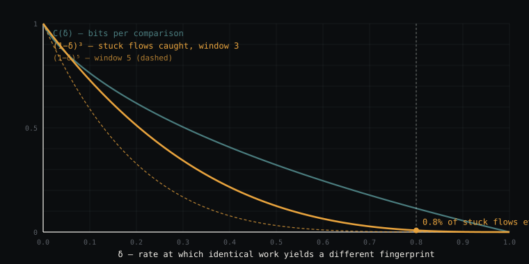
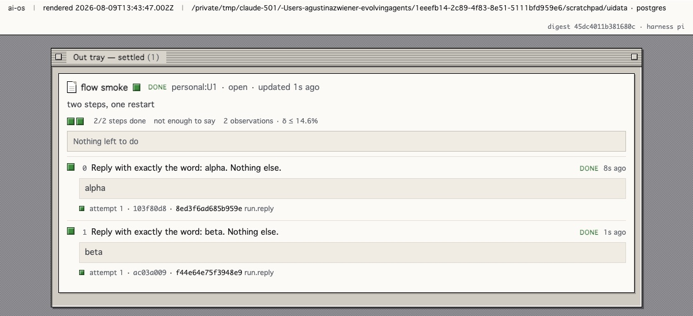

# 10 · Observabilidad — ¿el trabajo se puede mirar siquiera?


<sub>Una repetición destacándose del ruido. Hasta que el ruido gana.</sub>


> **Referencia.** Implementado, testeado, y δ medido una vez. `ai-flows/src/observability.ts`
> — 23 tests **[ran]**; 39 en todo `ai-flows`. La medición está abajo y cambió el
> código.

## Qué se midió **[ran]**

2026-08-04, sobre el harness objetivo y no sobre un proxy: `HARNESS=pi`,
`deepseek/deepseek-v4-flash` vía OpenRouter, en proceso con `app.turn`.
**22 turnos, todos `ok`** — tres tareas que representan tres tipos de paso: uno de
planificación (qué archivos hay que cambiar), uno de evaluación (un veredicto de
una palabra) y uno de herramienta (un comando en el sandbox). Cada uno repetido
desde un estado inicial idéntico, en un thread nuevo. Scripts:
`ai-flows/scripts/delta-probe.ts` y `delta-report.ts`, que importa las mismas
funciones que describe este documento, así el reporte no puede desviarse de la
implementación que reporta.

| Huella tomada sobre | δ agrupado | C(δ) | (1−δ)³ |
|---|---|---|---|
| texto crudo de la respuesta | **21.1%** | 0.604 | 49.1% |
| texto normalizado | **0%** | 1.000 | 100% |
| payload extraído | **0%** | 1.000 | 100% |

**Toda la divergencia era presentación.** El peor grupo fue el paso de
planificación, δ crudo = 53.6% — y la diferencia entera era que el modelo escribió
``​`src/types.ts`​`` cinco veces y `src/types.ts` tres veces. Backticks. Con
normalización los grupos colapsan a un solo valor cada uno: `src/types.ts` 8/8,
`YES` 8/8, `a-b-c` 6/6.

**Cero observado no es cero.** Con 8+8+6 muestras la cota superior al 95% sobre δ
es **14.6%**, así que la detección con *w* = 3 es en el peor caso **62.3%** —
cómodamente por encima del piso de 5% donde el instrumento deja de ver flows
trabados. El módulo sobrevive su primera prueba de falsación, y la sobrevive en el
extremo pesimista del intervalo, no solo en la estimación puntual.

### Qué cambió

`digestOf` ahora normaliza antes de hashear. Antes no lo hacía, y shippearlo así
habría metido 21% de ruido en cada comparación a cambio de nada — los bytes crudos
medían estilo de redacción, no trabajo. El caso de los backticks quedó como test de
regresión, con el dato medido en el comentario.

### Qué no establece esto

Dicho porque el resultado es lo bastante limpio como para leerse de más.

1. **Las tareas eran breves por instrucción** — "solo los paths", "exactamente una
   palabra". Un paso `Open` discursivo tiene muchísimo más margen para variar, y δ
   sobre uno de esos no está medido. Este número es honesto para observaciones
   *estructuradas*, que es sobre lo que conviene tomar `Observation.digest` de
   todos modos, y optimista para cualquier otra cosa.
2. **La tarea de evaluación tenía respuesta inequívoca**, y los 8 turnos la
   encontraron. Un veredicto al límite es donde una huella de eval se pondría
   realmente a prueba.
3. **δ depende del harness por definición.** Esto es un modelo sobre un harness.
   Otro modelo, o `claude`/`codex`, necesita su propio número — y por eso la sonda
   es un script commiteado y no un párrafo.

## La pregunta que esta hace y las otras no

Cada forma en [03](03-ai-flows.md) tiene un *Falla cuando*. El de `Open` es el
más vago y el más frecuente: *"el objetivo no se movió en N pasos — deriva, no
fracaso."*

Esa frase esconde dos problemas distintos con un solo síntoma:

- **Deriva.** El flow es legible y no se está moviendo. Más pasos podrían ayudar.
- **Ilegible.** No se puede saber si se mueve a partir de lo que registra. Más
  pasos seguro no ayudan — el instrumento está mal.

Colapsarlos es el mismo error que colapsar `waiting` y `blocked`, un nivel más
abajo. Un sistema que no distingue *trabado* de *no medido* va a contestar
"sigo trabajando en eso" para siempre, y va a tener razón en el único sentido
que puede verificar.

## Por qué esto es un problema de medición, no de diseño

Para decir "no se movió" hay que comparar el estado después del intento *n* con
el estado después del *n+1*. Corré dos intentos del *mismo* trabajo desde el
*mismo* estado inicial y el modelo no necesariamente produce lo mismo dos veces.
Así que la comparación tiene una tasa de cambio falso, y toda afirmación
construida sobre ella hereda esa tasa.

Llamémosla **δ**: la probabilidad de que trabajo idéntico dé una huella distinta.

La comparación es una observación binaria, pero no simétrica:

```
estado sin cambio ──(1−δ)──▶ huella igual
                  ──( δ )──▶ distinta        ← ruido
estado cambiado   ──( 1 )──▶ distinta
```

Nada fabrica una *repetición*. El no determinismo fabrica *diferencias*. De ahí
la asimetría que le da forma a todo el módulo:

> **Una repetición es prueba. Una diferencia es un rumor.**

Esto es un canal Z. Su capacidad, en bits por comparación:

$$C(\delta) = \log_2\left(1 + (1-\delta)\,\delta^{\frac{\delta}{1-\delta}}\right)$$

$C(0) = 1$: instrumento perfecto. $C(1) = 0$: uno que informa "distinta" pase lo
que pase, y por lo tanto no informa nada. Notar que $C(0.5) = \log_2 1.25 \approx
0.32$ — un canal *simétrico* estaría muerto con tasa de error de moneda, y este
no. La asimetría vale algo, y es la parte que conviene conservar.

## La curva que decide si esto vale la pena correrlo

Un flow trabado tiene exactamente una manera de delatarse: repetir su huella. El
ruido rompe repeticiones. Entonces la probabilidad de notarlo alguna vez, en una
ventana de $w$ intentos, es

$$P(\text{detectado}) = (1-\delta)^w$$

| δ | 0.0 | 0.1 | 0.2 | 0.3 | 0.5 | 0.8 | 0.9 |
|---|---|---|---|---|---|---|---|
| $C(\delta)$ bits | 1.000 | 0.763 | 0.618 | 0.504 | 0.322 | 0.114 | 0.055 |
| $(1-\delta)^3$ | 1.000 | 0.729 | 0.512 | 0.343 | 0.125 | **0.008** | 0.001 |



<sub>Las dos curvas están computadas, no dibujadas — los valores salen directo de <code>channelCapacity</code> y <code>detectionProbability</code>.</sub>

Con δ = 0.8, unos ocho flows trabados de cada mil se ven alguna vez. Un flow
puede estar muerto una semana mientras el sistema informa progreso, y **esperar
más lo empeora, porque esperar es justo lo que el ruido destruye.**

Ese es el argumento para medir δ antes de construir nada encima, y es el
argumento que este documento viene a hacer.

## Qué hace el módulo

`observabilityOf(digests, { floor })` toma las huellas de intentos sucesivos y δ,
y devuelve uno de cuatro veredictos. Informa; no decide nada.

| Veredicto | Significa | La respuesta correcta |
|---|---|---|
| `insufficient` | menos observaciones que la ventana | ninguna — no es un hallazgo |
| `drift` | huellas repitiéndose | el flow es legible y se detuvo. Escalar o redirigir |
| `progressing` | huellas moviéndose, **y** un flow trabado habría sido detectado | dejarlo correr |
| `unreadable` | δ es tan alto que un flow trabado se vería exactamente así | arreglar la huella, no la cantidad de pasos |

El orden de los chequeos lleva la asimetría: una repetición se cree **sea cual
sea δ**, porque el ruido solo fabrica diferencia. Solo la *ausencia* de
repetición es algo sobre lo que un instrumento ruidoso no es confiable.

Todo veredicto viaja con δ, la probabilidad de detección y la capacidad, así que
nunca se lee un veredicto sin el número que lo acota.



<sub>El veredicto donde lo cruza una persona. <code>not enough to say · 2 observations · δ ≤ 14.6%</code> — dos intentos está por debajo de la ventana, así que la página lo dice en vez de redondearlo a "todo bien". La cota viaja con el veredicto. <strong>[ran]</strong> 2026-08-09.</sub>

## El segundo eje, y por qué todavía no es un ADR

La observabilidad responde *si se puede ver*. No responde *si se puede mover*, y
esas dos fallas quieren personas distintas.

La controlabilidad siempre es relativa a un conjunto de entradas **nombrado**.
Upstream ofrece exactamente dos — `abort` y `steer` (`run-signal-store.ts:3`
**[read]**) — más las que agregue un motor de flows. Una afirmación sobre
controlabilidad que no nombra sus entradas describe un sistema que no existe.

|  | **Controlable** | **No controlable** |
|---|---|---|
| **Observable** | `autonomous` — corre solo | `escalate` — visiblemente trabado y ninguna entrada disponible lo alcanza. Pedirle a una persona algo *específico* |
| **No observable** | `instrument` — manejando a ciegas. Arreglar el registro | `abandon` — y dejar asentado qué mitad faltaba |

`quadrantOf` computa esto. **Nada lo consume.** No está cableado a `FLOW_STATES`
y no hay ADR proponiendo que lo esté, porque la proposición — que estas cuatro
celdas describen trabajo real — no fue testeada. La función existe para que la
afirmación se pueda medir, no para que se pueda asumir. Comparar con
[ADR-0007](adr/0007-observation-captured-not-derived.md), que *sí* es un ADR
porque upstream forzó la decisión y no dejó alternativa.

## Cómo se falsifica

**Dos mediciones, en orden. La primera puede matar todo el documento en una
tarde.**

**1 · ¿Es δ suficientemente chico para trabajar con él?** Correr el mismo trabajo
desde el mismo estado inicial, repetidamente, en `pi`. Registrar huellas.
Calcular δ con `divergenceRate`.

- **δ cerca de 1 — la huella nunca se repite.** Entonces $(1-\delta)^w \approx 0$,
  ningún flow trabado se detecta nunca, y todo veredicto que este módulo puede
  producir es `unreadable`. **Borrar el módulo.** El hallazgo igual vale
  publicarlo: dice que el estado de un agente no es huelleable por el método
  probado, lo que restringe cualquier esquema de detección de deriva que se
  construya después, incluidos los que nunca lo midieron.
- **δ chico.** El módulo es usable y la medición 2 pasa a tener sentido.

Una elección abierta dentro de este experimento: **sobre qué se toma la huella.**
Archivos tocados es lo más barato. Texto libre va a estar dominado por ruido de
redacción, y eso también es un resultado. Lo que se use queda asentado en
`Observation.source`, para que dos flows nunca se comparen a través de
instrumentos incompatibles.

**2 · ¿La división deriva / ilegible describe algo real?** Sobre flows `Open`
reales, contar los trabados que caen en cada veredicto.

**Si todo flow trabado resulta ser `drift`,** la división es una distinción sin
diferencia — **borrar este documento en vez de defenderlo**, y conservar la regla
original de una línea de `Open`.

**Portabilidad:** todo acá lee huellas de intentos secuenciales. Sin subagentes,
sin paralelismo, sin maquinaria específica de un harness. Corre en `pi`
([03 § La restricción de portabilidad](03-ai-flows.md)).

## Qué no es esto

- **No es una compuerta de convergencia.** Nunca se niega a arrancar un flow y
  nunca deriva un presupuesto. Responde si un flow se puede mirar.
- **No es un score.** `Observation.digest` responde *si se pueden distinguir*, que
  está definido para toda forma. `Observation.value` responde *por cuánto*, y hoy
  es `null` en todos lados porque ninguna forma declara una métrica — `Loop` lo
  hará, en M6, y la misma maquinaria gana resolución sin cambiar de forma.
- **No es filtrado.** Detrending, bandas de paso y diferenciación sobre una señal
  numérica son para cuando *haya* una señal numérica. Hasta entonces δ es todo el
  contenido, y es la parte que carga el peso.
