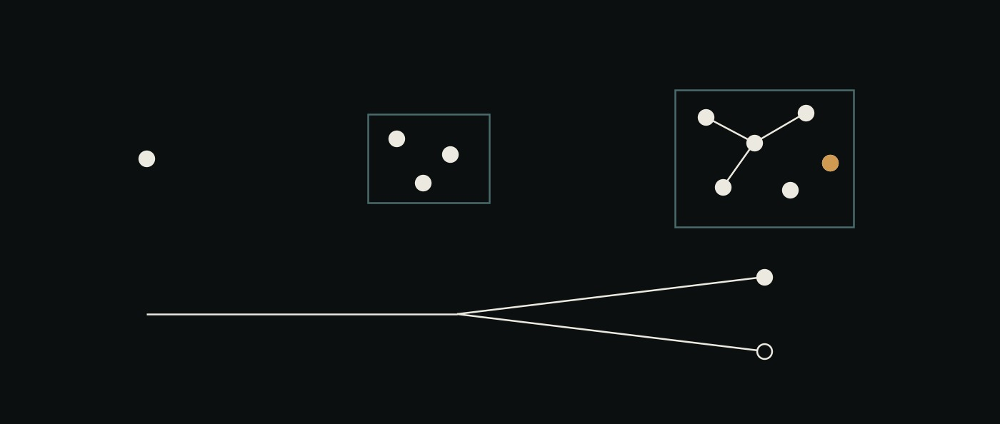

# 15 · Interacción generada — el escritorio después de la GUI

Un objeto, tres veces, cada una con más de él a la vista — y un fork cuyas dos ramas sobreviven, una sin resolver.

> **El inglés es canónico.** Traducción de [`doc/15-generated-interaction.md`](../15-generated-interaction.md).
>
> **En parte referencia, en parte especificación, y cada sección dice cuál.**
> Las fases 1–4 están construidas y testeadas (`ai-ui`, `ai-flows`). La fase 5
> está especificada y no construida. La falsificación de todo esto es
> [el cronómetro de 04](04-ai-ui.md#falsification), **que todavía no
> corrió** — así que nada de acá se afirma que ayude, solo que funciona.

## Qué hizo disruptiva a la GUI, y qué no

La lectura fácil de "hacelo como la GUI de Apple" es *que se vea mejor*, y eso
lleva directo a la decoración. La Lisa y la Macintosh cambiaron tres cosas, y
ninguna fue los gráficos:

1. **Recordar y escribir pasó a ver y señalar.** El estado del sistema dejó de
   vivir en la cabeza del usuario.
2. **El menú se auto-revelaba.** Una línea de comandos exige saber el verbo. Un
   menú te muestra lo que se puede hacer acá, ahora.
3. **Era reversible.** El deshacer es lo que hace racional experimentar. Sin él,
   cada acción es una apuesta, y la gente deja de intentar.

Y una cuarta, más del Alto y de Smalltalk que de la Mac: **la representación
*era* la cosa.** No estabas mirando un dibujo del sistema.

El escritorio tal como está tiene (1): documentos, cubos, posiciones que
persisten. No tiene (2) ni (3). Y (4) es donde ai-os se diferencia
estructuralmente de cualquier aplicación, porque acá **los agentes son archivos
markdown** — el sistema es editable con los mismos gestos que lo inspeccionan.

## La afirmación

> La GUI convirtió *recordar comandos* en *señalar objetos*. El movimiento
> disponible ahora es convertir **saber qué pedirle al sistema** en **ver lo que
> el sistema propone**. El modelo no dibuja la interfaz. Escribe el **resumen**,
> el **menú**, y la respuesta a **"esto"**.

Tres trabajos, todos imposibles para una GUI y posibles para un modelo. Todo lo
que sigue es uno de los tres, o la maquinaria que los deja existir sin violar una
regla que [04](04-ai-ui.md) ya había fijado.

## La regla que todo esto tuvo que sobrevivir

`04-ai-ui`:

> **Leer el escritorio nunca gasta una llamada de modelo.** El escritorio se
> auto-consulta, así que un canvas donde renderizar pueda disparar trabajo
> gastaría plata porque alguien dejó una pestaña abierta.

Un resumen escrito por un modelo parece romper esto. No lo rompe, y el arreglo es
una palabra: el disparador es el **cambio de estado**, no el render. Dos
consecuencias, ambas construidas:

- Todo lo computable **sin** modelo se computa en cada lectura, porque no cuesta
  nada — el digest y el menú son funciones puras del estado del flow.
- Todo lo que escribe un modelo pasa por [`projection.ts`](../../ai-ui/src/projection.ts),
  cuyo `get()` **no puede computar**. Un cache perezoso que genera en un miss
  reintroduciría el bug exacto: una pestaña nueva es un miss. El costo
  deliberado es que una proyección escrita por un modelo llega un poll tarde.

## Fase 1 · Zoom semántico — **construido** [ran]

`ai-ui/src/zoom.ts`, 11 tests.

No es un pedido de feature: `04` lo **deriva** del muestreo y después nadie lo
implementó. Una persona mira un flow una o dos veces por día; el flow produce
intentos varias veces por hora, así que el escritorio muestrea muy por debajo de
lo que dibuja. El cambio más rápido que eso no desaparece: **hace aliasing**, y
vuelve disfrazado de una tendencia que no existe.

Dos reglas, ahora sostenidas por tests y no por intención:

1. **Una proyección declara la ventana que representa.** Todo `Digest` lleva
   `covering`.
2. **El cambio más rápido que el muestreo se agrega, nunca se descarta.**
   `attemptsRepresented` se conserva en todos los niveles de zoom, y `conserves()`
   está exportada para que la propiedad sea chequeable y no solo descrita. Quince
   intentos se vuelven un objeto que dice *quince intentos, acá quedó*.

La segunda regla es la que tiene dientes. Un resumen que descarta un intento en
silencio se ve idéntico a un resumen limpio; nada lo detecta salvo que algo
cuente. Hay dos tests que existen solo para que el chequeo no sea vacío — uno
muta el conteo de un hijo y verifica que `conserves()` dé falso.

**Y separa "dónde quedó" de "qué pasó último".** Un step que falló cuatro veces y
después funcionó quedó en `done`; reportar el último intento sería tener razón de
casualidad. Un step que sigue corriendo no quedó en ningún lado, y llamar
`running` a un resultado es el aliasing que este módulo existe para frenar.

**Sin modelo adentro, a propósito.** *Cuántos intentos, dónde quedó, se está
moviendo, alguien no usó nada de lo que recibió* son todos computables desde la
traza, y son lo que el cronómetro efectivamente mide. Un modelo puede agregar
prosa encima; no puede ir abajo, o los conteos que sostienen la regla 2 vendrían
de un sampler y ningún test podría sostenerlos.

## Fase 2 · El menú que se auto-revela — **construido** [ran]

`ai-ui/src/actions.ts`, 13 tests.

El conjunto de cosas sensatas que hacer con un flow no es fijo, y por eso nadie
lo dibuja como menú y por eso toda interfaz de agentes es una caja de texto — una
línea de comandos con mejor tipografía. Así que el menú se deriva del estado de
*este* flow, y **cada propuesta lleva la evidencia que la produjo**. Una acción
ofrecida sin razón es una conjetura que el usuario tiene que auditar, y auditar
una conjetura es más lento que decidir sin ayuda.

Regla de orden, verificada: **lo que está mal va antes que lo que sigue.** Un
flow con un step fallado y un step siguiente ejecutable es uno donde avanzar
entierra la falla, así que un menú que lista "avanzar" primero es un menú que lo
recomienda.

Tres propiedades de seguridad, todas testeadas:

- **El costo es un campo de la acción**, no una decisión de renderizado. Una
  acción que no puede decir su costo no es ofrecible.
- **Un modelo agrega, nunca sustituye.** Las propuestas del modelo están topeadas
  en dos, marcadas `source: "model"`, dibujadas distinto, y llevan `route: null`
  — una sugerencia de apretar algo, nunca una licencia para gastar.
- **Degrada al menú computado** cuando el modelo no devuelve nada, que es lo que
  mantiene honestos al demo y a los tests.

## Fase 3 · Deixis — señalar y preguntar — **construido** [ran]

`ai-flows/src/ask.ts` + `POST /flows/:id/ask`, 9 + 6 tests.

Una caja de chat no tiene pronombres. Para preguntar por un step hay que
describirlo, lo que exige saber justo lo que estabas tratando de averiguar. **Un
canvas tiene selección, y la selección es el pronombre** — así que la pregunta
puede tener tres palabras. Es la ventaja estructural más barata que tiene un
escritorio sobre una transcripción, y estaba sin usar.

Lo interesante no es la llamada al modelo, es lo que va delante de la pregunta:

- **La respuesta sale de la traza, nunca del objetivo.** El objetivo de un flow
  es prosa bien escrita que describe lo que se *pretendía*; sus intentos son el
  registro sucio de lo que *pasó*. Un modelo que recibe los dos contesta desde el
  objetivo, porque el objetivo se lee como una respuesta — con fluidez, con
  plausibilidad, sobre trabajo que nunca se hizo. El prompt etiqueta uno como
  `INTENT`, el otro como `RECORD`, y dice cuál gana.
- **Tiene que poder negarse.** "La traza no muestra eso" está nombrada en el
  prompt como respuesta aceptable.
- **No compra un turno para no decir nada.** Con cero evidencia la ruta contesta
  con `answerWithoutEvidence` e informa `spent: false`. Pagarle a un modelo para
  que diga "acá no hay información" es pagar por una copia peor de una frase que
  ya se sabía verdadera.
- Sin modelo conectado responde **501**, no una conjetura.

El escritorio muestra `spent` en pantalla. Una superficie que gasta en silencio
le enseña a quien la usa a dejar de contar.

## Fase 4 · Fork como gesto, y movimiento que explica — **construido** [ran]

**Fork.** `POST /fork` en el escritorio, sobre la ruta del flow API que ya
existía. El deshacer es lo que hizo seguro explorar en una GUI; el trabajo de
agentes no se deshace — un step que corrió, corrió — y forkear es lo más parecido
que es cierto: la historia se conserva y la alternativa tiene la suya.
`forkedFrom { flowId, atStep }` está en el modelo desde el primer commit **sin
ningún gesto capaz de producir uno**. No gasta nada: copia registros, y la copia
no corre hasta que alguien la avanza.

**Movimiento.** Cada regla contesta una pregunta; ninguna es decoración. El
rectángulo que se expandía en la Mac no era adorno: te enseñaba de dónde venía la
ventana.

| Efecto | La pregunta que contesta |
|---|---|
| Los documentos propuestos transicionan; **los fijados no tienen transición** | "¿Mi disposición está a salvo?" |
| Un step que se asienta pulsa hacia afuera en vez de recolorearse | "¿Esto qué produjo?" |
| La cara de traza crece desde su documento | "¿Adentro de qué estoy?" |

El primero es el que carga peso y tiene su propio test. `layout.ts` garantiza que
el sistema nunca re-acomoda lo que una persona tocó — y hoy esa garantía es
**invisible**: no podés ver que tu disposición está a salvo, solo podés no notar
que la destruyen. Un nodo fijado que no puede animarse es cómo la página lo dice
sin leyenda. `prefers-reduced-motion` desactiva los tres.

## Fase 5 · El gesto que declara una relación — **construido a medias, 2026-08-23**

Arrastrás el cubo `ReviewAgent` sobre el cubo `MigrationAgent`. Eso *es*
declararlo subagente. El modelo escribe el diff a `MigrationAgent.md`, lo muestra,
y una persona lo acepta.

Esto es la propiedad (4), y es lo más profundo de esta página: un gesto que edita
**la definición del sistema**, no sus datos. Es posible acá y casi en ningún otro
lado, porque en ai-os los agentes son archivos markdown. El escritorio deja de ser
un visor de ai-os y pasa a ser un editor de ai-os.

### Qué se construyó, y qué deliberadamente no

El rediseño de [doc 20](20-everything-is-an-agent.md) construyó el **gesto** y dejó
la **escritura** en paz, que es una división real y no un compromiso.

**Construido:** arrastrar `INSPECTOR` sobre un flow declara una relación —*este
agente está leyendo este flow*— y el escritorio actúa sobre la declaración en vez
de agregar un paso. El soltar es la instrucción entera; no se tipea nada. Ésa es la
forma del gesto, funcionando, sobre un agente de sistema cuya única herramienta es
`read`.

**No construido:** la escritura a `MigrationAgent.md`. Es el único ítem de esta
lista donde equivocarse edita el sistema en vez de un registro del sistema,
necesita un camino al workspace de un scope que el escritorio no tiene, y debería
ir después del cronómetro y no antes. Nada cambió sobre ese argumento.

**Por qué `INSPECTOR` era el seguro para empezar.** Una relación que sólo *lee*
nunca puede corromper aquello sobre lo que se declara. Si el gesto resulta estar
equivocado —ambiguo, demasiado fácil de disparar sin querer, ilegible para alguien
a quien no se lo contaron— el costo de averiguarlo es un panel mostrando el
hallazgo equivocado, no un archivo de agente modificado. Construir primero la
versión peligrosa habría hecho que el gesto y la escritura fallaran juntos, sin
forma de saber cuál de los dos era el error.

## Lo que encontró correrlo — 2026-08-11 [ran]

Las fases 1–4 se construyeron, testearon y mergearon antes de que nada las corriera
contra un core vivo. Hacerlo llevó una tarde y encontró **cuatro defectos que todos
los tests pasaron por alto**, que es exactamente el argumento de la distinción que
este repositorio hace entre [read] y [ran].

| | Encontrado | Por qué ningún test lo agarró |
|---|---|---|
| **El seam de `ask` nunca estuvo cableado.** `POST /flows/:id/ask` tomaba una capacidad inyectada que `scripts/serve.ts` nunca proveía, así que un despliegue real contestaba 501 | al levantar la stack | Todos los tests inyectan su propio stub. El runner es el único llamador que nadie stubea |
| **El poll de cinco segundos destruía la respuesta.** Re-renderizar el panel reconstruía su innerHTML, así que una respuesta por la que alguien *pagó una llamada de modelo* desaparecía en cinco segundos — y una pregunta tipeada más lento que eso se borraba a mitad | al preguntar y esperar | El panel renderiza bien. Lo que pierde es el *segundo* render, y ningún test renderizaba dos veces |
| **El modelo contestaba en markdown**, así que el panel mostraba asteriscos y backticks literales | al leer la respuesta | Nada verificaba cómo se veía el texto, y verificar que el modelo obedezca habría sido medir fraseo |
| **El limpiador de markdown no matcheaba nada.** El cliente es un template `String.raw`, así que `\\*` enviaba un backslash escapado en vez de un asterisco escapado | el test escrito para el arreglo | El arreglo se veía bien en el fuente. El test evalúa el helper **tal como lo envía la página**, y por eso falló |

El último vale la pena conservarlo. Fue un defecto *en la reparación del tercero*,
cazado en un minuto porque el test extrae la función de la página renderizada y la
corre, en vez de testear el TypeScript que la produce. Un test escrito contra el
fuente habría pasado y habría enviado un limpiador que en silencio no hacía nada.

**Y el arreglo del markup va del lado del display, no del prompt.** El prompt sí
pide prosa plana y el modelo mayormente obedece — pero *mayormente* significa que
la página es correcta a una *tasa*, y depender de un sampler para que cumpla una
instrucción de formato es cómo una superficie se vuelve intermitentemente
incorrecta. Restringir la salida es una sugerencia; sacar los marcadores es una
garantía.

**Deixis verificada de punta a punta** contra `pi` en el core real: pregunté *what
did this actually produce?*, y la respuesta nombró el archivo que escribió
`MigrationAgent` y lo que confirmó `ReviewAgent` — nada de eso aparece en el goal
del flow. El camino sin evidencia contestó `spent: false` sin comprar un turno.
Los dos **[ran]**.

## Play — el demo manejándose solo, 2026-08-11 [ran]

Todo lo de arriba es invisible hasta que alguien hace un gesto, y quien visita un
sitio web no lo va a hacer. Así que el demo tiene un botón **Play** que recorre el
escritorio con su propio vocabulario: seleccionar un flow, leer el digest, señalar
el menú, tipear una pregunta y mandarla, arrastrar un cubo a un documento, avanzar
el step, abrir la cara de traza.

**Maneja el cliente real. No reproduce una película.** Cada beat despacha los
eventos que produce una mano — `pointerdown`, `pointermove`, `pointerup` sobre el
cubo real, `click` sobre el botón real — y después deja que el escritorio
reaccione como reaccione. Es la misma regla bajo la que vive
[simulate.ts](../../ai-ui/src/simulate.ts), un nivel más arriba, y compra la misma
propiedad: **si el escritorio se rompe, el tour se rompe.** Una animación
scripteada de un producto es una segunda implementación de él, y sigue pareciendo
correcta exactamente mientras nadie la chequee.

Verificado manejando a mano el beat más difícil contra la página construida: el
drag sintético agregó un step real, 1 → 2, con la instrucción de delegación que
habría escrito `compose.ts` **[ran]**.

Dos reglas bajo las que vive. **Nunca pelea con quien está mirando** — cualquier
evento *trusted* lo detiene donde está, y `isTrusted` es lo que separa a la persona
del tour, así que no puede detenerse a sí mismo. Y es **solo del demo**, inyectado
al lado de la simulación y verificado ausente del producto, porque una cosa que
mueve sola los documentos de alguien no es una función.

Un defecto que expuso de inmediato: los documentos del demo llevaban `updatedAt: 0`,
así que el digest declaraba su ventana como *"state as of 20370 days ago"*.
Correcto, e inútil — una proyección que anuncia una ventana absurda es la función
demostrando su propia falla. El demo ahora tiene un reloj fijo y sus flows tienen
edades plausibles.

## Cómo se falsea todo esto

**Sin instrumento nuevo.** La medición es la que `04` ya especifica: una persona,
un flow de tres días que no corrió ella, cronometrada sobre *cuál es el estado,
qué está trabado, qué produjo* — escritorio contra transcripción de `web-ui`.

Las fases 1 y 2 atacan esa pregunta directamente, que es por qué se construyeron
primero y por qué no necesitan un benchmark propio.

**El orden importa, y no es burocracia.** Correr el cronómetro sobre el
escritorio *como estaba* primero. Si una persona ya contesta en ocho segundos, el
zoom semántico no tiene margen, todos los brazos empatan, y un empate se lee como
éxito — la falla de instrumento exacta que este repositorio ya registró cuatro
veces. El cronómetro es a la vez lo que valida el escritorio y lo que dice dónde
hay lugar para construir.

**Qué falsearía cada fase**, dicho antes de correr:

| Fase | Falseada si |
|---|---|
| 1 · Zoom semántico | El tiempo hasta la respuesta no mejora en flows con más intentos de los que el lector miró |
| 2 · El menú | La gente lo ignora, o aprieta sus propuestas y después las deshace |
| 3 · Deixis | Se tipean preguntas que la traza no puede contestar — o sea que faltaba el panel, no el modelo |
| 4 · Fork | Nadie forkea. Que el gesto exista no hizo que valiera la pena probar la alternativa |

## Lo que deliberadamente no se construyó

**"Un modelo que genera la interfaz."** Es caro, deriva, se rompe en silencio, y
viola la regla de lectura. Lo que se gana el lugar es mucho más chico y mucho más
raro: el modelo escribe **el resumen, el menú y el pronombre**. Esa es la parte
que ninguna GUI podía hacer.

**Una consulta cuya respuesta es una disposición** — *"mostrame lo que está
trabado"* → el escritorio se reordena. Atractivo, y el mecanismo de seguridad ya
existe (`propose()` rodea lo `pinned`, así que una mala disposición no puede
destruir la tuya). Queda afuera porque necesita el seam de modelo que la fase 3
recién abrió, y porque debería discutirse contra un resultado del cronómetro y no
antes de tenerlo.
