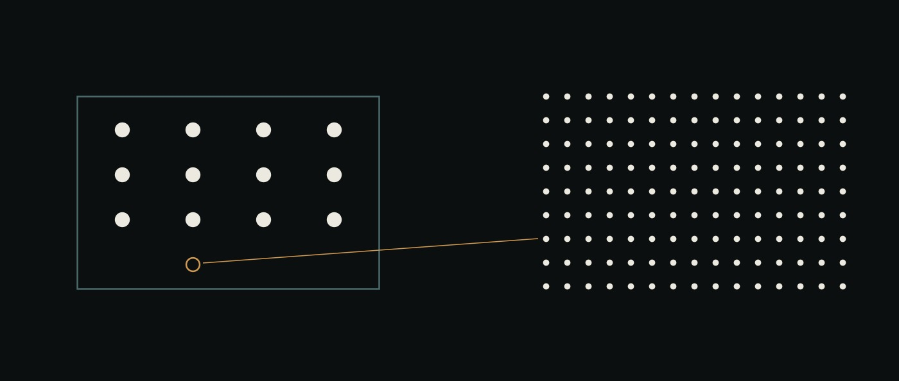

# 19 · Qué haría que esto importe

Un recinto con una docena de marcas ordinarias, una afirmación ámbar adentro, y el campo de 135 del que esa afirmación habla — sin nada dibujado alrededor.

> **Proyecto.** Una lectura del repositorio completo el 2026-08-23: qué corre,
> para quién es, qué es genuinamente distinto, qué lo mataría, y qué hacer
> después. Las §§1–6 se escribieron **sin correr nada**: cada número de ahí está
> citado de un documento que lo registró o **[read]** de un artefacto en disco, y
> los dos lugares donde esa distinción muerde están marcados en §1. **La §7 es lo
> que pasó cuando después se construyó y se corrió P0**, en una máquina que no
> era la del autor, y encontró cuatro cosas que leer no encuentra.

## La versión corta

1. **Tres de los cuatro pilares corren; uno no existe.** `ai-flows` y `ai-ui` son
   reales y están testeados. `ai-storage` son 0 líneas de código y 1
   especificación.
2. **La evidencia más fuerte del repositorio era la parte que CI nunca corría.**
   No había Python en ningún lado de `.github/workflows/ci.yml`, así que
   `projects/coclea-sr` — 28 gates, 135 chequeos — y `projects/hemo-verified`
   quedaban fuera de toda guarda automática que el repositorio tenía. Eso es lo
   que arregló P0, y la §7 es lo que encontró arreglarlo.
3. **Y ya se había podrido.** <!-- gate-count: superseded --> Trece lugares con la afirmación, en siete
   archivos, decían *26 gates / 125 chequeos* mientras los reportes en disco tenían
   **28 / 135**. Es exactamente la falla que `scripts/check-test-count.sh` fue
   escrito para frenar, aplicada a un número y no al siguiente.
4. **Lo distinto no es el motor de flows.** Es la regla de que la verdad la tiene
   que generar algo que no puede importar el código bajo prueba, más un ledger
   que hace un resultado reproducible por un extraño, más el hábito de publicar
   las mediciones que volvieron en contra del diseño.
5. **No hay usuario.** Dos estrellas, un autor, 54 commits en diecinueve días. El
   plan de §6 está ordenado por ese hecho y no por el roadmap.

## 1 · El estado, leído y no supuesto

| | tamaño **[read]** | qué existe | ¿en CI? |
|---|---:|---|---|
| `ai-base/` | 236.904 líneas | QM, vendorizado byte a byte, traído semanalmente | sí — más un job de ledger que falla un PR que lo toca sin una línea en `AI-OS-PATCHES.md` |
| `ai-flows/` | 16.867 líneas | motor de flows (`Open`), composición, gates, conformación, base de conocimiento, agentes de sistema | sí, en los dos backends |
| `ai-ui/` | 12.160 líneas | el escritorio, la cara de traza, la cara de gate, el generador del demo | sí |
| `ai-memory/` | 1.116 líneas | seis agentes de memoria como un árbol que corre como árbol | vía `ai-flows` |
| `ai-storage/` | **0 líneas** | [05](05-ai-storage.md), y nada más | — |
| `projects/coclea-sr/` | 14.433 líneas Python | 28 gates / 135 chequeos, todos `passed: true` | **no** → nightly, §7 |
| `projects/hemo-verified/` | 918 líneas Python | H0 sobrevive: AUC 0.906 contra un umbral de muerte de 0.80 | **no** → nightly, §7 |

Las dos últimas filas son por qué existe este documento, y la flecha es lo que
P0 hizo al respecto. Se leyeron de artefactos de reporte cuando se escribió la
§1; la §7 es lo que dijeron cuando se las corrió.

**Cadencia:** 54 commits, el primero `2026-08-04`, el último `2026-08-22`, un
autor. Diecinueve días. Ese número es la entrada más importante de §6 y es fácil
pasarlo de largo.

### Los tres números que habían derivado

| afirmación | dónde decía | qué dice el artefacto |
|---|---|---|
| gates / chequeos | <!-- gate-count: superseded --> **26 / 125**, en trece lugares de siete archivos | **28 / 135** en `projects/coclea-sr/gates/reports/` |
| tests propios | **605** en [18](18-from-a-hypothesis-to-a-therapeutic-surface.md), **626** en `README.md` | 626 — el README es el que CI chequea |
| el plan | `NEXT.md`, fechado 2026-08-09 en su propio encabezado, *"402 tests"* | tocado por última vez el 2026-08-11 y diecinueve pull requests atrás |
| la tabla de oráculos de H0 | A4 **0.706**, A5 **0.522**, A6 **0.521** | 0.652, 0.521, 0.522 — una transposición y un número que es una propiedad de la máquina (§7) |

Nada de esto es descuido en el sentido corriente. `doc/PLAN.md` tenía **28 / 135**
bien el día que cambió; el conteo simplemente vive en trece lugares y un solo
número de este repositorio — el de tests — tenía un script mirándolo. **Una regla
aplicada a un número y no al siguiente es un hábito, no un check**, y un hábito es
justo lo que la regla de la casa 4 dice que no hay que usar.

Dos de los tres quedan cerrados en este cambio: `scripts/check-gate-count.py` lee
los reportes, escanea todo archivo markdown buscando un conteo publicado en
cualquiera de los dos idiomas, y falla ante una discrepancia, ante una afirmación
en un archivo que nadie listó, y ante un archivo listado que dejó de declararlo
**[ran]** — más un job de CI para que corra en cada PR. `NEXT.md` está reescrito.
El caso 605/626 *no* estaba cerrado cuando se escribió este párrafo —
`check-test-count.sh` miraba solo los dos READMEs. Ahora sí lo está: el script
descubre todo documento que declare un conteo, y desde el 2026-08-24 chequea
además los tres READMEs de paquete contra sus propios suites, que es por donde
venía pasando de largo ante **267** y **114**.

### La asimetría que más importa

`scripts/check-gate-count.py` verifica que el conteo publicado coincida con los
reportes. **No puede verificar que los reportes estén al día**, porque `make gates`
son nueve minutos y necesita numpy, scipy y sympy — que es precisamente por qué
nadie lo puso en CI, y precisamente por qué el conteo derivó.

Así que el repositorio está en esta posición: su evidencia más barata (tests
unitarios de TypeScript) está guardada por nueve jobs de CI, y su evidencia más cara
— aquello sobre lo que descansa toda afirmación externa, aquello sobre lo que está
escrito [18](18-from-a-hypothesis-to-a-therapeutic-surface.md) — está guardada por
que alguien se acuerde de correrla. FRICTION F3 y F8 son las dos instancias de esa
misma forma, encontradas a mano, después del hecho. La lámina de arriba es esa
frase dibujada.

## 2 · Para quién es esto, y por qué nadie lo usa

**Costo hasta el primer valor, hoy.** Postgres en Docker, una imagen de sandbox
`linux/amd64` de 1,31 GB (emulada, y por lo tanto minutos por cada llamada a
herramienta, en Apple Silicon), una clave de OpenRouter, Node ≥ 24.18, tres
procesos y un script de seed. El [manual](manual.md) es honesto y completo sobre
todo eso, lo que hace el costo legible en vez de menor. El único camino a costo
cero es [el demo en el navegador](https://evolvingagentslabs.github.io/demo/), y su
backend es simulado — muestra la interfaz, no el sistema.

**Distribución.** `ai-os` tiene 2 estrellas. La distribución real de la
organización es `evolving-agents` con 453, y está archivado bajo
[la política de congelado](07-freeze-policy.md). Todos los demás repositorios de
la organización también están archivados. Así que el proyecto nuevo hereda la
reputación y nada del tráfico.

**Por lo tanto la afirmación honesta es que el único usuario es el autor**, y el
primer milestone de §6 que no es una medición es *una segunda persona saca un
resultado gateado*.

Hay tres audiencias plausibles. No están igualmente sostenidas por lo que hay en
el repositorio:

**(a) Quien construye una plataforma de agentes** — quiere flows, canvas, handoff
multijugador. Es la audiencia de [00-vision](00-vision.md) y hoy es el encaje *más
débil*: corre una sola forma de flow, el merge no está construido y es
honestamente difícil, el canvas no fue falsado, y todo producto bien financiado de
la categoría se mueve sobre el mismo terreno. Competir acá por features es
competir donde ai-os tiene un autor.

**(b) Quien tiene una carga de trabajo con un oráculo externo** — física,
numérica, simulación, cualquier cosa donde exista una respuesta correcta fuera de
la opinión del modelo. `coclea-sr` y `hemo-verified` son dos instancias
trabajadas, y [16](16-a-workload-with-an-oracle.md) es la costura que las hizo
posibles. Acá el repositorio tiene prueba y no argumento.

**(c) Quien construye entornos de RL y evals** — alguien que necesita que la
recompensa la calcule algo que no sea un juez. `projects/coclea-sr/environments/coclea_sr/`
ya tiene forma de entorno, y `physics-verifiers` es el repositorio hermano que
midió el argumento.

**(b) y (c) son la misma persona con suficiente frecuencia como para ser una sola
audiencia**, y es la audiencia que la evidencia sostiene. Apuntar primero a (a) es
lo que hicieron los últimos cuatro repositorios archivados de esta organización.

## 3 · Qué es realmente distinto

Cinco candidatos, cada uno con lo que haría falta para descartarlo.

**1 · Verdad que el código bajo prueba no puede producir.** `truth/` no puede
importar `src/`. Formas cerradas en sympy y mpmath de un lado, el solver del otro,
y un gate comparándolos. Cuatro palabras de política, y son la razón por la que un
gate verde significa algo distinto de consistencia consigo mismo.
*Se descarta si:* se muestra que la misma disciplina es práctica estándar. Es
estándar en análisis numérico y **no** lo es en sistemas de agentes, que es toda
la afirmación.

**2 · El reporte de gate como costura de kernel neutral al lenguaje.** Un proceso
Python escribe JSON; `ai-flows/src/gates.ts` parsea, resume y decide, y no ejecuta
nada. Esa es la respuesta que un sistema operativo debería dar a *"¿en qué lenguaje
está escrito el trabajo?"* — **no es asunto del kernel**. Es también la razón por
la que por fin se pudo declarar una métrica para un paso, cuando toda carga previa
corría sobre prosa.
*Se descarta si:* aparece un sistema que gobierna trabajo entre lenguajes sin un
formato compartido. Nadie mostró uno; la alternativa en la práctica es un modelo
juez, que es el problema del candidato 5.

**3 · "No corrió" no es "pasó".** `freezeVerdict` devuelve `blockers` y `unknown`
como listas separadas y se niega ante cualquiera de las dos. Una decisión de
diseño, tres líneas de consecuencia, y es la diferencia entre un gate de freeze
que se abre más justo cuando la suite está rota y uno que no.
*Se descarta si:* nada — pero es chico, y solo es portante porque F3 y F8
dispararon exactamente en ese borde.

**4 · Reproducción como atestación, no como afirmación.** Directorios de corrida
direccionados por contenido, un `ledger.jsonl` encadenado por hash, ids de corrida
en la metadata de los propios PNG, `verify_ledger.py` solo con stdlib, y
`make reproduce` chequeando que cada re-corrida caiga en su directorio
**existente** — mismo contenido, mismo hash, mismo camino. Atrapó a su propio
almacén una vez, y por eso F4 dice "suficientemente bien" y no "resuelto".
*Se descarta si:* se muestra que es ceremonia. La contra-evidencia es F8: dos
`result.json` atestados estaban íntegros y no eran JSON válido, y
`verify_ledger.py` lo encontró negándose a confundir *íntegro* con *válido*.

**5 · Un ledger de resultados que volvieron en contra del diseño.** El benchmark
de M4 se saturó. `dream` empató. El estudio de review no encontró nada y el
hallazgo de su primer borrador fue un artefacto de un punto final. Los brazos de
E7 empataron todos en el techo. `evolving-memory` midió 80% contra 80% y publicó
igual. Y `physics-verifiers` **falsó el argumento habitual para los gates** — un
juez frontier atrapó doce fabricaciones flagrantes y nueve defectos numéricos
sutiles, dos veces.
*Se descarta si:* nadie, y este es el activo. Es también la razón por la que el
pitch de §4 tiene que ser el angosto.

**En qué no es distinto.** El objeto flow es real y es una sola forma; la unidad
de trabajo durable es un buen argumento ([00-vision](00-vision.md)) con la
evidencia de M2 detrás y todavía no un diferenciador que un usuario sienta. El
escritorio está construido y sin probar. La memoria con scopes no existe. Agentes
como archivos markdown es una convención que ya comparten varios sistemas.

## 4 · Por qué debería importarle a la industria — dicho angosto

El cuello de botella en sistemas de agentes no es producir salida. Es saber cuándo
la salida está mal a un costo menor que producirla de nuevo. Todo stack de evals
de uso amplio responde eso con un modelo, y este repositorio contiene un
experimento que dice que un modelo lo responde **bien** — que es el resultado
incómodo, y el que el pitch tiene que sobrevivir.

Así que la afirmación que vale la pena hacer afuera es la angosta, y es la que
[18 §8](18-from-a-hypothesis-to-a-therapeutic-surface.md) ya declara:

- **Un modelo puede juzgar una tarea; no puede generar una con respuesta
  conocida.** No se crea verdad afirmándola, por buena que sea la afirmación.
  `truth/` es un mecanismo para tener una respuesta que nadie argumentó.
- **Un juez que acierta siempre igual no te entrega ledger, ni freeze, ni comando
  de reproducción.** Detección no es el mismo producto que atestación. Lo segundo
  es lo que necesita un regulador, un revisor, o un colega seis meses después.
- **El kernel no necesita estar escrito en el lenguaje del trabajo.** Esa es la
  afirmación de sistema operativo, y es la que tiene una costura corriendo detrás.

Lo que no hay que afirmar: que los agentes hicieron ciencia, que alguna
declaración de acá fue comparada contra datos de pacientes, o que los gates le
ganan a los jueces en detección. Las tres están contradichas por mediciones de
este repositorio.

## 5 · Qué falsaría el proyecto

| riesgo | qué lo resolvería |
|---|---|
| **Un autor, diecinueve días** | treinta días sin que se mueva ningún ítem de P0–P4. Entonces la restricción es capacidad y no priorización, y el plan se reescribe alrededor de una persona |
| **La evidencia no está guardada** | un gate se pone rojo en `main` y nadie lo nota hasta que se escribe un documento a partir de él |
| **El escritorio es decoración** | el cronómetro (P1). Si un explorador plano responde igual de rápido, 12.160 líneas se re-argumentan en vez de pulirse |
| **`ai-storage` es innecesario** | el archivo plano ya saca 10.0 en seis fixtures y 3.0 en uno. Si un segundo fixture de horizonte largo escrito por otra mano también vuelve cerca del techo, el pilar se cae |
| **Los gates solo ordenan errores que imaginamos** | el límite que H0 declara de sí mismo: las corrupciones y los oráculos comparten autor. H1 (P3) es la prueba |
| **Deriva de upstream** | una afirmación `[ran]` sobre QM tiene fecha de vencimiento; una de ellas estaba citada en cuatro documentos cuando venció. La regla existe; nada la hace cumplir |
| **Nadie quiere un OS de agentes de un lab de uno** | ningún segundo usuario después de P4 |

## 6 · El plan

Ordenado por lo que está en el camino, no por el roadmap. Cada ítem dice qué
significa terminado y qué diría que el ítem era el equivocado.

| | ítem | costo | por qué acá |
|---|---|---|---|
| **P0** | Frenar la podredumbre de la evidencia | horas | es el único activo, y nada lo mira |
| **P1** | Correr el cronómetro de M5 | una persona, y tres días de espera | la deuda impaga más vieja; puede borrar un pilar |
| **P2** | coclea §7.5 ruta B, precondición | una corrida | sin cambios respecto de [PLAN](../PLAN.md); dice si hace falta la ruta A |
| **P3** | hemo H1 — los errores que nadie diseñó | un surrogate, después la suite | el experimento de mayor valor del repositorio |
| **P4** | Un usuario que no sea el autor | una máquina limpia y un cronómetro | no hay evidencia de que nada de esto sea usable por una segunda persona |
| **P5** | Decirlo una vez, angosto | un día de escritura | (b) y (c) de §2 no pueden encontrar esto |
| **P6** | `ai-storage`, contra 3.0 | un milestone | es trabajo real y está detrás de cinco cosas más baratas |

### P0 · Frenar la podredumbre de la evidencia — **hecho, y correrlo es la §7**

Las tres partes están construidas y corridas **[ran]**:

1. **Los gates de Python corren en un schedule.**
   [`.github/workflows/projects.yml`](../../.github/workflows/projects.yml) —
   nightly, a demanda, y en cualquier PR que toque `projects/`, y **no
   cancelable por un push posterior** (quinto hallazgo de la §7). Construye los dos
   entornos desde sus manifiestos, corre `make gates`, `check_reports.py`,
   `verify_ledger.py` y `check_slack.py` para `coclea-sr`, y `make test` más
   `make reproduce` para `hemo-verified`. No todo por PR: nueve minutos y tres
   dependencias científicas serían un impuesto sobre cada PR no relacionado.
2. **`check-test-count.sh` escanea todo documento**, no los dos READMEs. La lista
   de archivos se descubre con `git ls-files` en vez de escribirse, así que un
   conteo en un archivo que nadie listó ya no puede ser invisible — que es
   exactamente cómo el doc 18 sostuvo 605 contra los 626 de los READMEs.
3. **`check_reports.py` corre en el mismo job**, sobre el intérprete del venv,
   porque el `python3` de ahí no tiene pytest y así estuvo documentado mal
   durante una semana (FRICTION F3).

Se agregaron dos cosas que esta sección no anticipaba, las dos porque correrla
las produjo: `hemo-verified` **no tenía ningún comando de reproducción**, así que
ahora lo tiene (`eval/reproduce.py`), y su tabla de oráculos publicada no
coincidía con su propio artefacto en dos celdas, así que
[`scripts/check-h0-table.py`](../../scripts/check-h0-table.py) lee la tabla desde
`h0.json` y rechaza la diferencia.

**El conteo ahora se chequea contra reportes producidos segundos antes**, no
contra lo que esté commiteado: el nightly corre `check-gate-count.py` dentro del
job de `coclea-sr` después de `make gates`, y otra vez en un job aparte contra
los artefactos commiteados. Que las dos respuestas difieran es en sí un hallazgo.

**Terminado significa:** un gate rojo, un reporte viejo, un número derivado y un
artefacto que no reproduce hacen fallar algo automáticamente. Eso ya es cierto.
**Ítem equivocado si:** el nightly resulta demasiado flaky o lento para
mantenerlo verde, en cuyo caso hay que decirlo y fijar una corrida atestada
mensual en vez de dejar un badge rojo que la gente aprende a ignorar.

### P1 · Correr el cronómetro de M5

Sin cambios respecto de [04-ai-ui](04-ai-ui.md) y [NEXT](../../NEXT.md): una
persona, y un flow **que no corrió**, de tres días. Tiempo hasta responder *cuál es
el estado, qué está bloqueado, qué produjo* — el escritorio contra la transcripción
de `web-ui`.

El flow tiene que tener tres días, así que **se siembra primero y se mide después
en la semana**, y por eso va arriba de ítems que parecen más urgentes. Dos sujetos
es una señal sobre si el instrumento sirve, no evidencia; el reporte dice cuál.

**Terminado significa:** el número se publica salga como salga.
**Ítem equivocado si:** no se consigue una segunda persona para hacerlo — en cuyo
caso P4 es estrictamente previo, y el escritorio queda sin probar con eso dicho en
su propio documento en vez de quedar implícito.

### P2 · coclea §7.5, ruta B, la precondición

Sin cambios y sin reordenar. [PLAN](../PLAN.md) lo argumenta y el argumento se
sostiene: es una corrida, y una corrida que diga *la ruta B no llega a
criticalidad* ahorró un milestone. La falsación se registra antes de comprar el
barrido, la regresión con `|mu_H|` grande tiene que reproducir la curva pasiva, y
el runner devuelve distinto de cero si no lo hace.

Este documento no tiene autoridad para re-planificar la tesis. Está acá para que
el orden sea visible contra todo lo demás.

### P3 · hemo-verified H1 — los errores que nadie diseñó

`H0` sobrevive con AUC 0.906, y su propio README declara el límite que importa:
**las corrupciones y los oráculos fueron diseñados por el mismo autor.** H0 muestra
que el portafolio ordena errores que alguien pensó. H1 es si ordena los errores que
un surrogate entrenado realmente comete.

Es el experimento de mayor valor del repositorio, porque es el que puede
generalizar todo el argumento arquitectónico más allá de dos cargas hechas a mano
— y porque puede fallar de una manera que vale la pena publicar.

**Terminado significa:** un AUC sobre errores de surrogate, publicado salga como
salga, al lado del de H0.
**Ítem equivocado si:** entrenar un surrogate resulta ser el milestone en vez de la
precondición. Entonces la versión barata es tomar errores reales de un surrogate ya
publicado en vez de construir uno, y esa decisión se toma antes de comprar el
entrenamiento — F5, aplicada antes del trabajo.

### P4 · Un usuario que no sea el autor

Dos cosas concretas, y ninguna es un feature:

1. **`make up` desde un clon limpio en una máquina limpia, cronometrado**, por
   alguien que no vio el repositorio. Cada falla se vuelve una entrada de FRICTION,
   arreglada con el hack más corto que funcione. El objetivo es un número, no un
   adjetivo: tiempo hasta un primer resultado gateado.
2. **Una tercera carga de trabajo elegida por otra persona.** Los dos proyectos
   existentes los eligió quien construyó la costura, que es la misma crítica que H0
   se hace a sí mismo.

**Terminado significa:** una persona que no lo escribió saca un resultado gateado,
y se registra el tiempo transcurrido.
**Ítem equivocado si:** el tiempo hasta el primer valor se queda arriba de una hora
después de los arreglos obvios. Entonces esto es un instrumento de investigación
privado que publica sus hallazgos, que es una cosa legítima y mucho más chica de
ser — y los READMEs deberían decir eso en vez de decir "sistema operativo".

### P5 · Decirlo una vez, angosto — **la mitad está construida, y no es la escritura**

El artefacto que pedía este ítem era un texto. Lo que se construyó en cambio es
[`/verify/`](https://evolvingagentslabs.github.io/verify/): artefactos reales
sacados de `projects/`, embebidos en una página, chequeados en el navegador del
propio lector sin red y sin servidor. La cadena de hashes re-derivada entrada por
entrada; directorios de corrida mostrados como los primeros doce dígitos del hash
de su propio contenido; seis oraciones publicadas resueltas contra las corridas
que las produjeron; y el estadístico que se movía entre versiones de librería
sentado en rojo entre siete que no. Editá una entrada del ledger desde la página
y se rompe exactamente un eslabón; re-encadená la cola y la rotura desaparece
mientras la cabeza se mueve.

**Por qué eso en vez del ensayo.** La §4 de este documento dice que la afirmación
que vale la pena hacer es que *un juez no te entrega ni ledger, ni congelado, ni
comando de reproducción*. Un ensayo que afirma eso es un ensayo. Una página donde
un desconocido aprieta un botón y mira verificarse el ledger es la afirmación en
la única forma con la que no se puede discutir — y llevó la misma tarde.

Es también la respuesta a una pregunta justa sobre la demo del escritorio. Esa
demo es el cliente real con un backend simulado, generada desde el código para
que no pueda derivar, y vale la pena conservarla. Pero muestra el pilar cuya
falsificación nunca se corrió, y **todos sus números son inventados**. En una
portada que dice que cada número está atado al artefacto que lo produjo, una
simulación es un primer apretón de manos raro. Las dos demos existen ahora y el
sitio dice cuál es cuál.

La lógica de la página es una segunda implementación, en un segundo lenguaje, de
`verify_ledger.py`, y `scripts/verify-page/test.mjs` la corre contra el crypto
propio de node y contra el veredicto del verificador de Python **[ran]** — doce
aserciones, incluida la de que editar una entrada rompe un eslabón sin mover la
cabeza, y la de que re-encadenar esconde toda rotura y la mueve.

**Lo que sigue sin hacerse:** la escritura. Las afirmaciones angostas de la §4
están ahora en la portada del sitio, pero no se mandó nada a ningún lado, y la
advertencia original de P5 sigue en pie — no debería atraer atención antes de que
se corra P1.

### P5 · Decirlo una vez, angosto — el ítem original

Un solo artefacto apuntado a la audiencia (b)+(c) de §2: la regla de que `truth/`
no puede importar `src/`, la costura JSON de gates, la cadena de atestación, y — de
manera prominente, no en una nota al pie — el resultado de `physics-verifiers` que
mató la versión fuerte del argumento. Un pitch que abre con su propia
contra-evidencia más fuerte es el único tipo que este repositorio tiene derecho a
hacer, y es también el más difícil de descartar.

**Terminado significa:** publicado, con las afirmaciones angostas de §4 y ninguna
de las anchas.
**Ítem equivocado si:** atrae atención antes de que P0 y P1 estén hechos, y el
primer lector serio encuentra un número viejo o un canvas sin probar. Esa es la
falla que la política de congelado existe para prevenir, llegando desde el otro
lado.

### P6 · `ai-storage`, contra 3.0

M4 procede — el gate se abrió con `long-horizon-eviction` — pero las dos salvedades
viajan con el número: un fixture no es un benchmark, y el juez es deepseek
corrigiendo al summariser de deepseek. Así que el primer movimiento sigue siendo el
que nombró [NEXT](../../NEXT.md): **un segundo fixture de horizonte largo escrito
con otra forma, por otra mano**, y la pregunta abierta contestada en papel contra
dos flows reales — *cuando dos notas dicen lo mismo, ¿cuál sobrevive?* — antes de
construir cualquier store.

Va último porque es un milestone y los cinco ítems de arriba son horas, una corrida
y una persona.

### Qué no hacer

Sin cambios respecto de [08-roadmap § Deliberadamente no planificado](08-roadmap.md),
más tres que se siguen de este documento:

- **Nada más de escritorio antes del cronómetro.** `gate-face.ts` se construyó
  mientras H9 seguía sin ejecutarse, y [PLAN](../PLAN.md) registra eso como el patrón
  que FRICTION.md existe para reemplazar.
- **Ningún tercer proyecto antes de un segundo usuario.** Una tercera carga elegida
  por el mismo autor es una tercera instancia del mismo fixture.
- **No repetir el argumento de los gates en su forma fuerte.** "El modelo no puede
  darse cuenta" está medido como falso, dos veces, por esta organización.

## 7 · Qué encontró correr P0, el mismo día

P0 estaba escrito como tarea de mantenimiento — cablear la evidencia a CI para
que deje de pudrirse. Construirlo requirió un clon limpio en una máquina que no
es la del autor, que son *las primeras dos líneas de P4*, llegando temprano y
gratis. Produjo cinco hallazgos, y ninguno era alcanzable leyendo — el último, sobre el
instrumento mismo.

**1 · Ninguno de los dos proyectos se podía arrancar desde su propia
documentación.** `projects/coclea-sr/.venv` era un **symlink commiteado a una
ruta absoluta de una laptop** — gitigonorado y trackeado igual — así que un clon
fresco recibe un link colgado y `uv venv .venv` se niega con *File exists*.
`projects/hemo-verified` **no tenía manifiesto alguno**: el `Makefile` llamaba a
`.venv/bin/python`, el README decía `make test`, y nada decía qué instalar. Los
dos están arreglados; los dos son FRICTION F9.

**2 · El reporte atestado de HEMO-VERIFIED no fue producido por el código de
HEMO-VERIFIED.** `eval/h0.py` escribe `runtime: {seconds}`; el `h0.json`
commiteado tenía un `seconds` en la raíz y ningún `runtime`. Ese anidado lo
introdujo **el #59, el commit titulado *"H0 was not reproducible, and it looked
like it was"***. El artefacto se regeneró en medio de ese cambio y nunca más, así
que la atestación del repositorio no pudo haber salido del código del
repositorio. Ahora tiene `make reproduce`, y falla exactamente con esto.

**3 · Un estadístico reportado es frágil de un modo que los otros no.** Contra el
artefacto commiteado, el AUC compuesto, el coeficiente de Spearman, los conteos
ACCEPT/ESCALATE/REJECT y la tasa de falso-aceptado volvieron **bit a bit
idénticos**, y `A4 alone` se movió **0.706 → 0.652**. 66 de las 98 mediciones de
A4 son exactamente `0.0`, así que un caso sin corromper que estaba en `1.03e-13`
en un build y en `0.0` en otro cruza a un bloque de 66 empates y arrastra 0.054
al estadístico de rangos. El resultado de titular no se toca, porque A4 es `HARD`
y aporta un pasa/no-pasa contra un umbral muy por encima del piso de ruido, nunca
su score.

**La primera línea de este hallazgo era demasiado fuerte, y lo corrigió CI.**
"Una propiedad de la máquina" era una inferencia sacada de una sola comparación.
Después el nightly corrió en un runner de GitHub — un *tercer* entorno, Python
3.12.3 contra 3.13.12 — y reportó **1207 de 1207 campos bit a bit idénticos
[ran]**. Mismo numpy, mismo scipy, mismo OpenBLAS; otra máquina, otro Python, ni
un bit se movió. Así que los números son reproducibles entre máquinas que
comparten su stack numérico, y A4 es el único estadístico lo bastante fino como
para moverse cuando ese stack cambia. Ese es un resultado *mejor* que el que se
escribió primero, y también la preocupación más filosa: un estadístico cuyo valor
depende de una versión de biblioteca se va a mover en silencio en el próximo
upgrade. El README dice 0.652 y dice que esa fila se mueve.

**4 · La tabla de oráculos publicada tenía un segundo error, ordinario.** A5 y A6
estaban transpuestos contra el artefacto del que se copiaron. Nada los había
comparado nunca; `scripts/check-h0-table.py` sí lo hace ahora.

**5 · Y el instrumento tenía un defecto propio, encontrado al usarlo.** La
primera corrida del nightly llegó a quince minutos dentro de `make gates` y la
**canceló un push que tocaba tres archivos markdown**. `cancel-in-progress` está
bien para `ci.yml`, que son dos minutos: cancelar una corrida superada no cuesta
nada y la respuesta vuelve enseguida. Está mal para una corrida de evidencia de
45 minutos, porque cada push la reinicia desde cero, y una rama con trabajo
activo entonces nunca llega al final de ninguna.

Un filtro `paths` no te salva de esto, y creer que sí fue el error de este propio
documento durante unos diez minutos: en `pull_request`, `paths` se evalúa contra
**el diff completo del pull request**, no contra el del push — así que un PR que
toque `projects/` aunque sea una vez re-dispara la corrida de evidencia en cada
commit posterior, por más ajeno que sea. Ahora `cancel-in-progress` está en
`false`, así que una corrida posterior hace cola detrás de la actual en vez de
matarla. Un workflow cuyo propósito es producir evidencia no puede ser
interrumpible por trabajo que no puede cambiar lo que mide.

### Qué dice eso de la tabla de riesgos de la §5

Dos filas dejaron de ser hipotéticas en el momento en que alguien que no era el
autor corrió el código:

- *"La evidencia no está guardada"* — no lo estaba, y lo que pasó por el agujero
  no fue un gate rojo sino algo peor de encontrar tarde: una atestación cuya
  procedencia nadie había chequeado nunca.
- *"Nadie quiere un OS de agentes de un lab de uno"* — ahora el mecanismo es
  visible. No es cuestión de gusto. Es que un proyecto de un solo autor no puede
  hacer la única prueba que encuentra estas cosas, porque el autor siempre ya lo
  tiene funcionando.

**Y una fila se fortaleció, no se debilitó.** En la misma máquina desconocida, el
`verify_ledger.py` de `coclea-sr` re-derivó su cadena de hashes,
`check_reports.py` encontró que todo reporte tiene un test detrás, y
`check_slack.py` reportó 25 gates con slack de 1.08× a 760.977× **[ran]**. Y
después el workflow corrió en un runner de GitHub y **los 135 chequeos volvieron
verdes en 23 minutos 27 segundos [ran]** — la primera vez que el suite completo se
ejecuta en otro lado que no sea la máquina del autor, seguido en el mismo job por
`check_reports.py`, `verify_ledger.py`, `check_slack.py`, y el conteo publicado
chequeado contra reportes producidos segundos antes. Contra nueve minutos en la
máquina del autor, así que el runner es unas 2,6× más lento y el job es
cómodamente un nightly y no uno por PR.

Antes de eso un intento local se detuvo en 67 de 135, verde hasta ahí, y los
reportes que había reescrito diferían de los commiteados solo en sus últimos
decimales con `passed: true` en todos. Esos deliberadamente **no** se commitean:
son los últimos bits de una máquina, y los artefactos del autor siguen siendo los
autoritativos hasta que una máquina que alguien haya elegido produzca unos
mejores.

La maquinaria de atestación de la que este repositorio está más orgulloso hizo su
trabajo en hardware que nunca había visto; el proyecto que no la tenía es el que
tuvo el problema. Ese es el argumento más limpio a favor del cuarto diferenciador
de la §3 que hay en todo el repositorio, y lo produjo un check, no una
afirmación.

## 8 · Todo número publicado, y qué lo chequea

Cuatro hallazgos en un día, todos con la misma forma, sugirieron una pregunta que
convenía contestar exhaustivamente en vez de de a una instancia por vez: **qué
números publica este repositorio, y cuáles verifica algo?**

| número | publicado en | productor | chequeado por |
|---|---|---|---|
| 851 tests propios, y 425 / 303 / 123 por paquete | 5 archivos, más 3 READMEs de paquete | los suites | `check-test-count.sh` |
| 28 gates / 135 chequeos | 13 lugares, 7 archivos | `gates/reports/*.json` | `check-gate-count.py` |
| H0: compuesto, tabla, decisiones, falso-aceptado | `hemo-verified/README.md` | `gates/reports/h0.json` | `check-h0-table.py` |
| los resultados de titular de coclea — 11.6%, 24 de 24, −1.22 dB CI [−1.58, −0.87], Q 2.2–2.7, CF ≈ 1 kHz | doc 16, doc 18, PLAN, `coclea-sr/README.md`, los dos espejos, NEXT | `runs/<id>-<hash>/result.json`, encadenado por hash | `check-coclea-results.py` |
| el conteo de tests de upstream | `README.md`, `README.es.md` | los suites propios de `ai-base` | `check-upstream-test-count.sh` |
| δ 0% / 21.1% | doc 08, 10, 12 | una medición fechada | nada, y está fechada, que es la forma honesta |
| skills perezosas 95.8%, índice 4.397 vs 105.423 chars | doc 17, índice de doc | una corrida que nadie guardó | nada |
| el índice de conocimiento en 4.523 de 8.000 tokens | `README.md`, doc 05 | una corrida que nadie guardó | nada |
| bench de memoria 10.0 / 3.0 | doc 05, 08 | `bench:memory`, necesita una clave | nada |

**Ahora hay cinco de nueve guardados.** Los dos que no lo estaban, y cuyos
productores ya estaban en el repositorio, se construyeron el mismo día en que se
escribió esta tabla — porque el barrido es lo que hizo obvio que eran los dos
únicos construibles que quedaban. Los resultados de titular de coclea eran el más
filoso de los dos: son los números por los que se cita al proyecto entero, viven
en directorios direccionados por contenido con una cadena de hashes verificada, y
la distancia entre el artefacto y la frase del doc 18 era una persona copiando un
número. Es exactamente el hueco que produjo *26 / 125* y la transposición de
A5/A6.

**Cuál corrida cuenta no es "el directorio más nuevo".** `ledger.jsonl` lleva un
`state` por entrada y una entrada posterior puede marcar un artefacto
`superseded`, así que el checker deriva la corrida vigente del ledger — el último
`result.json` no superseded de cada prefijo de experimento — en vez de ordenar
por nombre. Hoy hay dos artefactos superseded y resultan ser los malformados de
abajo, coincidencia en la que conviene no apoyarse.

**Una trampa que hay que contemplar en el diseño, y ya está registrada.** Dos de
los veinte artefactos de corrida son *íntegros y no son JSON válido* — el `NaN` y
el `-Infinity` desnudos de FRICTION F8. El `json.load` de Python **acepta los
dos**, así que un checker escrito de la manera obvia leería un artefacto
malformado y reportaría acuerdo. Le pasa a `parse_constant` una función que
levanta excepción, que es la lección de F8 convertida en restricción sobre el
instrumento que la haría cumplir.

**Y la regla de parada del propio plan había que aplicarla, no citarla.**
[NEXT.md] decía frenar si esto necesitaba una tabla mantenida a mano por
afirmación, porque "el instrumento es una segunda cosa que mantener sincronizada,
que es la enfermedad y no la cura". **Es** una tabla por afirmación — seis
entradas. Lo que la hace valer es una distinción que la regla no trazaba: la
tabla no se mueve cuando se mueve un *número*. Re-corré E3, obtené 11.4%, y el
check falla y se edita el documento; la tabla queda intacta. Solo cambia cuando
alguien publica una afirmación **nueva**, que es el mismo costo que `CLAIMANTS`
en los otros tres checkers. Una tabla que hay que editar cada vez que se mueve lo
que describe es la enfermedad. Una tabla que hay que editar cuando alguien agrega
una afirmación es simplemente la lista de afirmaciones.

**El sitio es un repositorio aparte, y era la última superficie sin vigilar.**
Traía <!-- gate-count: superseded --> *26 gates / 125 chequeos* en dos páginas después de que este repositorio ya
estaba corregido — y `check-gate-count.py` venía *imprimiendo* "actualizá la copia
en el repositorio del sitio" sin ninguna forma de saber si alguien lo había hecho.
Los dos escáneres aceptan ahora `--also <dir>` y leen `.html` además de `.md`, así
que el sitio se chequea contra los mismos artefactos antes de publicarse. CI sigue
sin poder verlo; una persona corriendo dos comandos, sí.

**Y el resto de la tabla es el límite honesto.** Cuatro de estos números salieron
de corridas que nadie guardó. No se les puede construir un checker, y el
movimiento útil no es construirlo — es dejar de citarlos como mediciones en
presente, o re-correrlos hacia un artefacto. Cuál de las dos corresponde es una
decisión por número, no una política.

### La afirmación que no es un número, y era la más podrida — 2026-08-24

Todo lo de arriba son cifras. La afirmación más barata que hacen estos documentos
no es una cifra: **un link dice dónde está algo.** `scripts/check-doc-links.py`
resolvió los 697 links internos y **once no apuntaban a nada** — no porque se
hubiera borrado un archivo, sino porque el slug de un título es su redacción, así
que `### P0 · Frenar la podredumbre de la evidencia` cambió de dirección el día en
que le creció `— **hecho, y correrlo es la §7**`. Los once habían sido correctos
cuando se escribieron. Es la misma podredumbre que la tabla de arriba existe para
atrapar, en la única forma que no cuesta nada chequear.

La reparación no fue perseguir los slugs. Diez anclas `` viven ahora
encima de los títulos a los que se linkea, así que la redacción queda libre de
moverse; el checker corre en `projects.yml` e informa cuál de las dos fallas
encontró — una ruta que no existe, o una sección que no existe. Tiene un límite
honesto que conviene decir: chequea solo links internos. Un link `https://` a una
página reescrita es exactamente la misma falla y acá no la ve nadie.

**El mismo barrido encontró una peor, en la mitad de la documentación que nadie
lee.** El `README.md` cierra afirmando que cada documento tiene su espejo en
español. Dos no tenían ninguno. Otros cinco tenían un espejo *atrasado* — a
`doc/es/05` le faltaban los tres experimentos, catorce secciones incluidos dos
resultados **[ran]** y una afirmación falsificada, y `doc/es/01` todavía le decía
al lector en español que `ai-flows` exige cortar dentro del core, cosa que el
documento en inglés retractó el 2026-08-02 con un ADR al lado. Un espejo atrasado
es peor que uno ausente: el ausente te manda al inglés, el atrasado contesta con
confianza y mal.

Los siete están escritos o emparejados, y `check-doc-mirrors.py` compara conteos
de secciones para que la próxima divergencia rompa un build en vez de quedarse
ahí. Su límite es el más filoso de esta página: **nada en este repositorio lee
español.** Un conteo que coincide dice que al espejo no le faltó una sección. No
dice nada sobre si los dos documentos coinciden, y ningún chequeo mecánico lo va
a decir.

**Y después el mismo barrido atrapó a la primera fila de esta misma tabla
mintiendo por omisión.** El agregado —828— estaba en verde, y
`ai-flows/README.md` decía **267 tests** mientras `ai-ui/README.md` decía **114**.
Los suites reportan 409 y 300. `check-test-count.sh` pasó de largo por los dos,
porque su patrón exige las palabras *of our own* y un README de paquete no tiene
razón para decirlas. El check escrito para frenar exactamente esto tenía un punto
ciego del ancho de toda una clase de afirmaciones, un directorio más abajo de
donde estaba mirando. La redacción ahora es fija y mecánica —un paquete que
publica un conteo escribe *N tests in this package*, se compara cada aparición, y
un paquete con suite que no publica ninguno falla— y las dos cosas que sigue sin
chequear están nombradas en el script en vez de barridas debajo de la alfombra.

## Qué cambió este documento

- `scripts/check-gate-count.py`, y un job de CI que lo corre. **[ran]** — falló en
  trece lugares con la afirmación, y ahora pasa.
- <!-- gate-count: superseded --> **26 gates / 125 chequeos → 28 / 135** en `README.md`, `README.es.md`, `doc/16`,
  `doc/18`, sus espejos en español, y `projects/coclea-sr/README.md`. La fuente son
  los artefactos de reporte, **[read]**, no una re-corrida.
- **605 tests → 626** en `doc/18` y su espejo.
- `README.md` y su espejo nombran los dos proyectos; `hemo-verified` estaba
  mergeado y no figuraba en la tabla de layout.
- `plate_19()` en `doc/assets/make-illustrations.py`, para que la convención de
  ilustraciones cerrada en 18 §8 siga cerrada **[ran]**.
- `NEXT.md`, reescrito contra este plan.
- El conteo viejo sigue apareciendo en tres lugares a propósito — este
  repositorio supersede en vez de editar — y cada uno lleva un
  `<!-- gate-count: superseded -->` invisible para que el check distinga un
  registro de un número anterior de un número viejo sin corregir.

### Y después se construyó P0, que cambió el resto

- [`.github/workflows/projects.yml`](../../.github/workflows/projects.yml) — el
  nightly que corre la evidencia de los dos proyectos. **[read]**: el archivo de
  workflow todavía no corrió en GitHub, pero cada comando de adentro se corrió
  acá primero.
- `scripts/check-h0-table.py` **[ran]** — falló en tres celdas y ahora pasa.
- `scripts/check-coclea-results.py` **[ran]** — verde, y falló correctamente
  cuando se perturbaron a propósito el 11.6% y el −1.22 dB. Sus dos primeras
  versiones estaban mal de maneras que vale registrar: una se comía el signo menos
  dentro del patrón y llamaba discrepancia a toda afirmación con signo, y otra
  matcheaba un "N de N" pelado y reportaba un ADR que contaba nueve flows como un
  desacuerdo sobre 24 curvas.
- `scripts/check-upstream-test-count.sh` **[ran]** — contra la salida real del
  suite de `ai-base`, en las dos ramas: 3.768, coincidiendo con los dos READMEs, y
  la rama de suite roja reportando `tests 3768 / pass 3634 / fail 3`. Lo único que
  el nightly ejecuta por primera vez es la invocación de `npm test` en sí.

  **Escribirlo encontró un bug latente en el check de al lado.** `node --test`
  imprime `ℹ tests 3768`, y `check-test-count.sh` matcheaba eso con `^. tests` —
  que funciona solo donde el locale del shell es UTF-8, porque en el locale C el
  `.` matchea un *byte* y el glifo son tres. Los runners de GitHub ponen locale
  UTF-8, así que ahí pasaba y en un contenedor pelado no devolvía nada: el conteo
  volvía vacío, bash lo leía como cero, y toda afirmación fallaba contra un total
  de 0. Falla cerrado, que es la única razón por la que esto salió barato. Los dos
  scripts ahora anclan al final de la línea en vez de a un glifo.
- `check-test-count.sh` ahora escanea todo documento en vez de dos, verificado
  contra un doc 18 derivado a propósito **[ran]**.
- `projects/hemo-verified/eval/reproduce.py` y `make reproduce` **[ran]** —
  REPRODUCED contra un artefacto regenerado, y falla contra el que estaba
  commiteado, que es el segundo hallazgo de la §7.
- `eval/h0.py` registra el entorno en el que se produjo un reporte, para que una
  comparación pueda distinguir *no coincide* de *se produjo en otro lado*.
- `projects/hemo-verified/pyproject.toml`, y `projects/coclea-sr/.venv` borrado y
  destrackeado — FRICTION **F9**.
- La tabla de oráculos corregida desde su propio artefacto, con A4 marcada como
  que se mueve entre máquinas — FRICTION **F10**.

**Qué siguió sin hacerse:** P1 a P6. P1 necesita una segunda persona y tres días
de espera, P3 necesita un surrogate entrenado, P4 necesita una máquina que acá no
hay, P5 está deliberadamente bloqueada detrás de P0 y P1 por el propio argumento
de este documento, y P2 es la próxima corrida de la tesis y le pertenece a quien
esté corriendo la tesis. Decir cuáles de esas están *bloqueadas* y cuáles
simplemente *no empezadas* es todo el punto de ordenarlas.

---

**La falsación de este propio documento.** Si pasan treinta días y ningún ítem de
P0–P4 se movió, la restricción nunca fue la priorización y este plan era el
artefacto equivocado. Reescribirlo alrededor de una persona, con un solo ítem.
