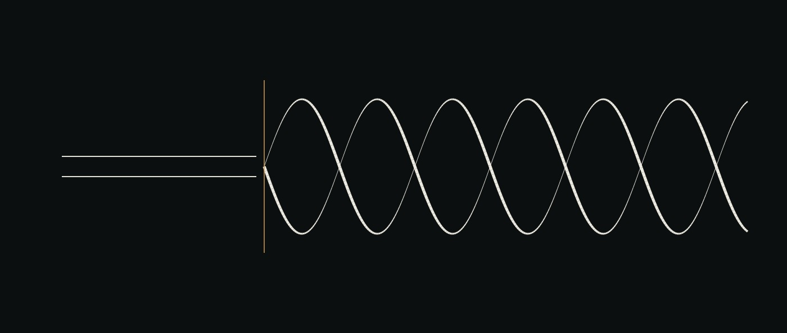

# Hilos de pensamiento

A la derecha, la trenza: dos hebras enrolladas alrededor de un eje, con el grosor cargando la profundidad. A la izquierda, las mismas dos hebras en paralelo — pasado ese ancho una vuelta sería más fina que las marcas que la dibujan, así que la espiral no se dibuja.

*Una propuesta, en qué es mejor, qué costaría y en qué orden construirla. Escrito
al lado de un boceto que funciona, no en lugar de uno.*

---

## 0. La propuesta

> Un flujo horizontal de hilos de pensamiento entre los agentes y el humano,
> donde te podés parar sobre una cuerda o sobre un agente e inspeccionarlo y
> trabajar ahí. Eso imita la idea de un flow. Podría tener colores vivos, y quizá
> una implementación en three.js o similar.

Tres afirmaciones separables: **una metáfora**, **una paleta** y **un motor**.
Tienen respuestas muy distintas, y tomarlas como un solo paquete es el error.

---

## 1. La metáfora es mejor, y ésta es la propiedad que la hace mejor

**El escritorio no tiene eje de tiempo.** Las tarjetas viven en una grilla. El
orden en que pasó un flow sólo se infiere siguiendo los cables, y la disposición
misma es lo que decidió el motor de layout o la mano de alguien. Un flow *es* una
secuencia, y la superficie que lo dibujaba tiraba a la basura su única dimensión
intrínseca.

En la vista de hilos, **X es tiempo e Y es quién sostiene el pensamiento**. Un
flow es una sola cuerda continua: arranca en tu carril, baja al de `DERIVADOR`,
sube al de `CONSTRUCTOR` y —si termina— vuelve a vos.

Cuatro cosas que muestra la cuerda y que un cable no puede:

| | la cuerda | el cable del escritorio |
|---|---|---|
| **Duración** | un tramo largo de cuerda | nada |
| **Simultaneidad** | dos cuerdas cruzando un carril en la misma X | un badge `×2` en un cubito |
| **Ausencia** | *no hay cuerda* — se ve el fondo a través | una línea punteada, que es una línea |
| **Entrega** | vuelve a casa, o no vuelve | nada |

Esa última fila es la que me sorprendió mientras la construía. Un flow terminado
**le entrega algo a alguien**, y uno bloqueado no. El escritorio no podía decir
eso en absoluto, y una vez que la cuerda lo dice no podés dejar de leerlo: en
`coclea-sr`, dos cuerdas corren lado a lado, idénticas todo el camino, y después
una se frena contra una barra mientras la otra sube a casa. Ése es el argumento
entero de ese proyecto en un vistazo — y al escritorio le llevaba un panel, una
pestaña y un párrafo.

---

## 2. La paleta puede ser fuerte acá, y no podía serlo en el escritorio

La regla a la que llegó [doc 04](04-ai-ui.md) es **el color es estado y
evidencia, y nada más en la superficie está coloreado**. Eso se lee como "sé
discreto", y no lo es — es *un canal, un significado*. Un fondo oscuro compra un
segundo canal:

- **El tono es identidad.** Qué hilo. Cinco colores saturados, suficientes para
  seguir una cuerda a través de ocho carriles entre otras cuatro.
- **La luminancia y la textura son estado.** Lo que se llevó adelante está
  iluminado. *No llevó nada adelante* se oscurece desde donde aterrizó. *No pasó*
  corre a brillo pleno hasta una barra — un resultado negativo es un resultado, y
  atenuarlo escondería lo más informativo de la página. *Todavía sin veredicto*
  se deshilacha. *Sin registrar* no se dibuja: un hueco por el que se ve el fondo.

Dos canales ortogonales, cada uno significando exactamente una cosa, y una
leyenda que dice los dos. Sobre una grilla de tarjetas beige una paleta saturada
es ruido; sobre un campo oscuro es la información. **Así que: vivo, sí — y el
fondo se va a oscuro primero, o no es.**

---

## 3. El motor es la segunda movida correcta y la primera equivocada

Acá es donde yo empujaría en contra, y no por gusto.

**La pregunta que vale la pena contestar primero es si pararse sobre una cuerda
te ayuda a decir qué pasó.** Esa pregunta se contesta en un día con paths y
transforms. El boceto al lado de este documento es ese día. Si la respuesta es
sí, un motor compra cosas reales — profundidad de campo, una cámara que podés
volar, mil cuerdas en vez de cinco, partículas sobre el cable — y habrá estado
pago. Si la respuesta es no, un motor hizo que el fracaso sea **caro, hermoso y
mucho más difícil de abandonar**, que es la peor combinación disponible.

Hay además una propiedad específica que se gastaría en el camino, y este
repositorio ya discutió sobre ella. La demo es **un solo archivo autocontenido
que se abre desde el disco, sin servidor y sin red**. Por eso cualquiera puede
chequearla, por eso el script de procedencia puede leerla, y por eso sobrevive a
que la manden por mail. Una librería de 600 kB y un bundler es justamente la
cuota que [doc 08](08-roadmap.md) dice que este pilar no debe contraer antes de
haberse ganado una.

**El orden:** boceto SVG → correrle el cronómetro → *después* decidir si lo que
le falta es profundidad.

---

## 4. Qué encontró construirlo

Tres cosas, todas argumentos sobre la metáfora más que bugs.

**Las dos cuerdas estaban exactamente una encima de la otra.** Las dos cadenas de
membrana usan los mismos seis agentes en el mismo orden, así que el primer render
dibujó una sola cuerda. Cierto, e inútil — el punto entero es que hay dos,
construidas igual, y una está mal. Un pequeño desplazamiento por hilo hace que
"éstas son idénticas" sea *visible* en vez de afirmado.

**El orden de los carriles es una decisión de diseño, no un detalle.** Ordenar
por primera aparición hacía que el dibujo dependiera de qué flow estuviera
listado primero: reordenás la entrada y todas las cuerdas cambian de forma. Los
carriles se ordenan por dónde *tiende* a actuar cada agente, así que una cuerda
tiende hacia abajo y seguir una es seguir una pendiente en vez de hacer una
búsqueda. Un test afirma que el ordenamiento no depende del orden de los
argumentos — un layout que se rebaraja por una razón que el lector no puede ver
es uno que nadie puede aprender.

**La guarda de citas se disparó otra vez, en el navegador, correctamente.** Un
cruce con veredicto y sin fuente pegó contra `assertCited` y tiró excepción. El
mismo caso que pegó el escritorio, la misma resolución: citar el registro que el
flow store tiene del paso, que es una dirección real que la página resuelve.
Relajar la regla nunca estuvo disponible. El único caso especial honesto es el
primer cruce — *vos pediste esto* — que es el único handoff del sistema que no
está en cuestión, y cita al flow.

---

## 5. Qué preguntaría Ive antes de dejar que algo de esto salga

Seis preguntas, y el boceto contesta cuatro.

1. **¿Cuál es el gesto?** — Arrastrar a lo largo de la cuerda. Estás parado en un
   momento, y el panel dice qué sostenía cada carril entonces. *Contestada.*
2. **¿Cómo se ve quieto?** — Está quieto el 99% del tiempo, y una superficie que
   sólo funciona mientras anima es un protector de pantalla. *Contestada: no se
   mueve nada salvo que lo muevas vos.*
3. **¿Sobrevive a una captura de pantalla?** — La evidencia tiene que ser
   citable, y un cuadro quieto de esto carga lo que carga la página. *Contestada.*
4. **¿El vocabulario se transfiere, o esto es una reescritura?** — Los cinco
   estados de cable pasan sin cambios, incluida la división entre *no pasó* y
   *todavía sin veredicto*. Es un rediseño. *Contestada, y afirmada por un test.*
5. **¿Qué pasa con cien hilos?** — Sin contestar. Cinco cuerdas y ocho carriles es
   un dibujo; doscientas cuarenta es una madeja, y el arreglo honesto es
   probablemente agregación y no renderizado, que es un problema distinto del que
   resuelve un motor.
6. **¿Es más rápida que el escritorio en la tarea que mide el cronómetro?** — Sin
   contestar, y es la única pregunta que decide algo. Ninguna de las dos
   superficies fue medida contra una persona y un flow de tres días.

---

## 6. El reloj ya estaba, y la proyección lo estaba tirando

Lo más fuerte que encontró este boceto no es sobre el boceto.

El store de `ai-flows` viene grabando `Attempt.startedAt` y `Attempt.finishedAt`
desde el principio. **`trace.ts` tiraba los dos.** Toda superficie construida
sobre esa proyección no tenía entonces reloj alguno — así que "el escritorio no
tiene eje de tiempo" nunca fue un límite de los datos. Era un salto con pérdida
entre el store y la pantalla, y no falló nada cuando ocurrió.

Ése es el tipo caro de agujero: el escritorio disponía documentos en una grilla
porque no tenía otra opción *disponible para él*, mientras la respuesta estaba a
una llamada de distancia hacia arriba. Llevar los dos campos son cuatro líneas.
Qué cambia:

- **El ancho de un paso es cuánto tardó.** No un casillero.
- **El espacio entre dos pasos es tiempo en que nadie trabajó**, que suele ser el
  ancho más interesante de la página.
- **Las dos cadenas de membrana corrieron con treinta horas de diferencia.** En el
  escritorio parecían un par. No son un par; son una corrida y una re-corrida un
  día después, y ninguna superficie lo había dicho nunca.
- **Un test mío estaba afirmando algo falso.** Decía que las dos cadenas compiten
  por los mismos agentes "en los mismos pasos" — cierto sobre un eje de secuencia,
  y falso sobre el mundo. El reloj lo borró. Ése es el argumento de la propia
  superficie aplicado a su propia suite de tests, que es el único lugar donde
  cuenta.

Hubo que escribir dos reglas para que se mantenga honesto:

**La base es todo o nada y se dice.** Si a cualquier intento asentado le falta un
inicio, el mundo entero cae de vuelta a secuencia y el panel lo dice con todas
las letras. Mezclar un hilo dibujado con reloj y uno dibujado con secuencia sobre
un mismo eje pone dos cosas incomparables en un dibujo e invita al lector a
comparar sus anchos.

**Un paso que no arrancó no tiene tiempo, y no se le da uno.** La primera versión
caía al inicio del mundo para un paso sin intentos, así que GATE-D1 —cuyos dos
últimos pasos están pendientes— se dibujaba abarcando toda la ventana de setenta
y dos horas: un flow que arrancó hace cuarenta minutos, dibujado como tres días
de trabajo. Un paso que no arrancó pertenece justo después del último que sí. Eso
es una afirmación sobre el *orden*, que sí se conoce, y se dibuja tenue y hueco
para que no pueda leerse como una afirmación sobre el tiempo.

---

## 7. El movimiento, y la única regla que hace que valga la pena

> **Todo lo que se mueve es una medición. Si no se mueve nada, no está pasando
> nada.**

Esa regla es lo que separa esto de un protector de pantalla, y es cara de
mantener. Exactamente una cosa en la superficie anima por su cuenta: un segmento
cuyo paso está `running` — un intento que arrancó y nunca cerró, que es un hecho
en el store. El loop de animación **se cancela solo** cuando no encuentra
ninguno, así que una superficie quieta es una afirmación verdadera y no una
ociosa. Verificado en un navegador: en el scope con un paso abierto el offset del
guión avanza; en los scopes asentados `requestAnimationFrame` no se agenda nunca.

También produjo un bug que vale la pena registrar, y el bug es la regla
funcionando. Hacer zoom resuelve una banda colapsada en sus pasos y por lo tanto
*crea* una cuerda corriendo — y no había nada despertando el loop. El único paso
abierto de la demo quedaba inmóvil, así que la superficie decía *no está pasando
nada* sobre algo que sí estaba pasando. Despertar en cada redibujo es el único
lugar que lo atrapa, porque todos los casos terminan en un redibujo.

**El zoom es la respuesta a cien hilos, y tiene que agregar en vez de encoger.**
Por debajo de cincuenta y ocho píxeles un hilo no se dibuja paso a paso: no hay
nada que ver, y las marcas estarían mintiendo sobre su propia precisión. Colapsa
a una banda que dice qué representa — *6 pasos · 58m*. Ésa es la regla que ya
tenía `zoom.ts`, que existe porque un observador que muestrea a una tasa no puede
observar fielmente un cambio más rápido que la mitad de ella, y un dibujo que
pretende lo contrario invita al lector a encontrar estructura en el aliasing.

**Sobre el color: el tono es identidad, y se usa para eso la paleta oscura del
sistema de Apple.** `systemBlue`, `systemOrange`, `systemGreen`, `systemPurple`,
`systemPink` y el resto, en un orden fijo para que un hilo conserve su color a
través de un zoom, un paneo y un cambio de escena. El estado nunca mueve el tono
— mueve luminancia y textura. Dos canales, dos significados, una leyenda que dice
los dos.

**Y la biología, ya que se planteó.** Los archivos de agente son el ADN:
guardados, inertes, y de los que se copia. Un hilo es el transcripto — una hebra,
llevando una tarea a través de la maquinaria, plegándose donde debe. Los agentes
son las proteínas que actúan sobre él. La trenza es el único lugar donde la doble
hélice es literalmente correcta: dos transcriptos sostenidos por una máquina en
un momento. En estos datos no existe tal momento — la superficie lo dice en vez
de dibujar la marca sin explicación — y la marca existe, testeada, para la
primera vez que lo haya.

---

## 8. Estado

**El bundle es la demo, al 2026-08-23.** `/demo/` es `build-helix.ts`: un eje que
es tiempo, cada flow una hebra enrollada alrededor, y la profundidad
representando atención. La vista de carriles de este documento y el escritorio
anterior siguen construidos, siguen testeados, y ya no se publican — el
escritorio es lo que sirve `make up`.

El bundle no es una idea distinta de los carriles; son los mismos datos con la
segunda dimensión gastada de otra manera. Los carriles gastan Y en *qué agente lo
sostiene*, que es legible y no escala: once agentes son once filas. El bundle
gasta Y y Z en *qué hebra*, y pone al agente sobre la hebra como un cuerpo que la
cabalga — que es a la vez el dibujo del ARN y la polimerasa, y el sentido
correcto, porque un agente sostiene una tarea un rato y la pasa, y es la tarea la
que persiste.

Lo que el bundle puede y los carriles no: **girar**. La rotación es una forma de
prestar atención — una hebra viene al frente sin que nada más se corra del camino
— y como es una afirmación sobre qué merece ser mirado, carga la misma regla de
direcciones que todo hallazgo de la superficie. `assertJustified` tira excepción
ante una razón sin dirección.

Lo que cuesta: hebras a 2π/n son legibles como bundle hasta quizá ocho, y pasado
eso el mismo problema de agregación vuelve con otra forma. Ésa fue la decisión
del autor, tomada con el boceto funcionando y el escritorio vivo al lado, y el
razonamiento vale la pena registrarlo porque no es obvio:

Las dos superficies contestan preguntas distintas. El escritorio contesta *cuál
es el estado y qué puedo hacer* — tiene arrastrar, soltar, avanzar, el gesto que
pone un agente sobre un flow. La vista de hilos contesta *qué pasó, cuándo, y qué
está pasando ahora*. Para un visitante que tiene treinta segundos y ninguna
cuenta, la segunda pregunta es la que vale la pena contestar, y la primera
pantalla es la única pantalla que ve la mayoría.

Lo que se pierde por no publicar el escritorio es real y hay que decirlo: el
gesto de la fase 5 —arrastrar `INSPECTOR` sobre un flow— todavía no tiene
equivalente acá. Seleccionar un segmento y apretar *Preguntarle a un agente* da
el mismo hallazgo con la misma regla de citas, pero es un click en un panel y no
una cosa que hacés con las manos, y esa diferencia es el `doc/15` entero.

**Todavía no fue medido contra nada.** `ai-ui/src/threads.ts` es el layout, con
catorce tests afirmando las propiedades de arriba;
`ai-ui/scripts/build-threads.ts` lo renderiza a un archivo autocontenido sobre
los dos proyectos reales.

La próxima movida no es más superficie. Es el cronómetro de [doc 04](04-ai-ui.md#falsification),
corrido sobre las dos con la misma persona y el mismo flow — que es lo que
[NEXT.md](../../NEXT.md) viene pidiendo desde antes de que existiera cualquiera de
las dos, y que ahora tiene dos candidatas para comparar en vez de una para
defender.

## 9. Hacer que se lea como una hélice, que fueron cuatro errores y ninguna decoración

Referencia ofrecida: una ilustración de una horquilla de replicación — dos
esqueletos, pares de bases llenando el tubo, la polimerasa cabalgándola. La
instrucción era tomar la idea como la tomaría Ive, que quiere decir tomar los
*principios* y rechazar el artefacto: una proyección, oclusión dura, y una
escalera cuyo ritmo es lo que convierte dos curvas en un objeto. Nada tomado
prestado por cómo se ve.

Lo que eso levantó fueron cuatro errores separados, ninguno de estilo.

**El paso de rosca era más largo que el trabajo.** `PITCH` era una constante de
noventa minutos. Un flow en estos proyectos corre alrededor de una hora, así que
una hebra existía por menos de una vuelta y *no podía enrollarse*: cinco flows,
cinco arcos lentos, cruzándose. Un paso fijado de antemano es honesto justo hasta
que es más largo que aquello que se supone que mide, y ahí no mide nada. Ahora es
un cuarto —digamos dos vueltas y media— de cuánto corre realmente un flow típico
en *este* scope, y el indicador dice cuánto dura una vuelta, como un mapa dice
cuánto vale una pulgada. El número está en pantalla de cualquier forma; éste es
verdadero de lo que estás mirando.

**La ventana abría sobre una cerradura.** `resetWin` ajusta el cuadro al cúmulo de
trabajo más reciente, que era el arreglo correcto para dos tercios de canvas
vacío y el equivocado acá: abría veintiocho minutos recortados de tres días, y
una cerradura sobre una espiral muestra una curva. `TWIST_FLOOR_PX` ya se niega a
dibujar una vuelta más angosta que las marcas disponibles para dibujarla. Una
vuelta *más ancha que el cuadro* es la misma falla al revés, y ahora tiene la
misma guarda — la ventana de apertura es al menos lo bastante ancha como para que
una vuelta no sea más ancha que el grosor de la cuerda. Hacer zoom más allá sigue
permitido, porque de cerca una hélice de verdad es un arco largo y lento.

**La profundidad estaba cuantizada por paso.** El ancho y la opacidad salían de la
profundidad *media* de cada segmento, así que una hebra cambiaba de grosor de un
salto en el borde de un paso y quedaba plana en el medio. Una espiral no se lee
por brillo; se lee por un grosor que cambia continuamente a medida que la curva
se aleja. La hebra se dibuja ahora en tramos de tres muestras —unas cinco por
vuelta— cada uno con el ancho que pide su propia profundidad, y el patrón de
guiones lleva su longitud acumulada como offset para que *no llevó nada adelante*
y *todavía sin veredicto* sobrevivan a ser cortados. La opacidad quedó fuera del
negocio de la profundidad por completo: lo que dice ahora es qué pasó.

**El afinado era cuatro a uno, que la proyección dice y la pantalla rechazó.** A un
píxel la mitad lejana de cada vuelta dejaba de ser cuerda y se volvía alambre, y
un alambre cruzando toda la amplitud se lee como un objeto recto y separado
apoyado sobre la espiral. En cualquier dibujo de una hélice el lado lejano es
apenas más angosto; lo que te dice que está atrás es que el lado cercano lo tapa.
La oclusión es la clave de profundidad, el ancho es la confirmación, y la
relación bajó a menos de dos a uno.

Los travesaños fueron el único elemento prestado, y tuvieron que ganárselo. Un
travesaño es el borde de un paso — un momento en que se registró que algo arrancó
o terminó — así que la densidad de travesaños es la densidad de eventos
registrados, y un tramo de hebra sin travesaños es un tramo donde no se anotó
nada. Dibujados a lo ancho de todo el tubo parecían líneas de grilla, porque un
par de bases tiene un segundo esqueleto que lo sostiene del otro lado y acá no
hay nada ahí. Así que un travesaño frena en el eje, donde algo realmente hay, y
es además la segunda cosa que siempre fue: una marca contra la línea de tiempo,
dejada caer desde el momento que señala.

Todo lo de arriba cambió geometría o quitó un canal. Ni una sola cosa agregó una
marca que no sea una medición.

## 10. La grilla, y aquello en que el bundle era malo

> Creo que la UI es la cuadrícula de progreso de GitHub, con colores, donde cada
> cuadradito es un agente, un humano o una tarea, y las trazas o flujos son
> carriles horizontales — y es más fácil de manipular, y termina siendo realmente
> un canvas de actividad.

El bundle era lo más lindo de este repositorio y lo peor de usar, y la propiedad
que lo hacía así vale la pena decirla con exactitud, porque no es sobre gusto.

**En el bundle nada tenía una dirección.** Un paso era un tramo de curva cuya
posición en pantalla era función de la rotación, del zoom, de la fase de su
propio flow y de las fases de otros cuatro. Para leer uno primero había que
*apuntar*: girar el objeto hasta que el paso viniera al frente, y después atrapar
una curva de dos píxeles de ancho. Eso es una superficie que se pilotea. En la
grilla un paso está en una fila y una columna: un flow y un momento, dos cosas
que la persona ya tiene en la cabeza antes de mirar. Las áreas de click son
rectángulos. Apuntar es gratis.

El bundle era mejor en una cosa y la grilla la resigna: mostraba la *trenza* —
los flows como un objeto que se mueve junto. La grilla lo dice como una columna,
dos cuadrados llenos en la misma x siendo dos flows sostenidos en el mismo
momento. Menos hermoso, mucho más fácil de chequear, y chequeable es para lo que
existe este proyecto.

### Qué tuvo que ganarse un cuadrado

Un cuadrado es un flow, en un bucket de tiempo, sostenido por alguien. El color es
**quién lo sostuvo** — el tono es identidad acá como en todas estas superficies,
así que un fracaso y un éxito del mismo agente son del mismo color y se leen
distinto. La textura es **qué pasó**: lleno lo llevó adelante, tenue no llevó nada
adelante, hueco lo sostuvo sin veredicto, punteado no arrancó, barrado corrió y
no pasó. La barra es una resta y no un segundo tono, porque el rojo significaría
*malo* en una superficie donde el color ya significa *quién*.

### El único lugar donde una cuadrícula de contribuciones no se puede copiar

GitHub pinta su verde más pálido para un día sin commits. Tiene derecho: un
repositorio sabe qué no contiene, así que el cero es una medición. Acá 'no se
anotó nada en este bucket' y 'no pasó nada en este bucket' son afirmaciones
distintas y sólo la primera es nuestra para hacerla. Así que un bucket vacío
dibuja **ningún cuadrado** — `cellsOf` nunca emite uno, y hay un test que lo dice.
Lo que sí dibuja es un *casillero* vacío, un contorno, que dice solamente que
esto es un bucket de tiempo al que podés apuntar. Sin los casilleros los vacíos
son invisibles y el canvas es una dispersión de puntos; con ellos es una red que
podés ir contando, y los agujeros se vuelven el hallazgo que deberían ser.

Una fila cuyo trabajo registrado continúa más allá del borde de la ventana recibe
un chevrón de ese lado, porque una fila sin cuadrados a la vista se ve, si no,
exactamente igual que un flow del que nunca se registró nada, y ésos son hechos
distintos — uno de ellos es *estás mirando en el lugar equivocado*.

### Qué encontró construirla

**Una palabra significaba dos cosas opuestas, y la superficie casi publica la
equivocada.** En el vocabulario de flows, un *paso* cuyo estado es `blocked` es
trabajo que fue enunciado y no puede avanzar — el A4 de hemo lleva la nota
*"enunciado como trabajo abierto, porque un scope sin nada rojo adentro se lee
como uno terminado"* y su observación es `null`. No corrió nada; nada dijo que no.
Un *handoff* cuyo estado es `blocked` es la otra cosa por completo: llegó, el paso
receptor corrió, y no pasó. El primer borrador mapeaba los dos al mismo cuadrado,
lo que dibujaba treinta y ocho de los cuarenta y dos cuadrados de hemo como
fracasos. Ése es el error insignia de este proyecto cometido por su propia
superficie: reportar la ausencia de un resultado como uno negativo. Un paso que
el flow llama bloqueado es `open` acá, y ahora hay un test que lo fija.

**El cuadro estaba mal antes que las marcas.** La primera versión abría sobre toda
la historia, y a ese ancho el bucket tiene que ensancharse hasta que una columna
sea lo bastante ancha como para apuntarle — punto en el cual un flow que corrió
una hora es un cuadrado. Un cuadrado es exactamente lo que dibujaba el
escritorio. Así que abre sobre el cúmulo de trabajo más reciente, donde los
handoffs son cuadrados separados, y `All` está a un botón de distancia y dice
cuánto cubre un cuadrado una vez que lo apretás.

**Una grilla de cuadrados quiere decir que las filas están tan separadas como
anchas son las columnas.** Estirar las filas para llenar el alto daba cinco líneas
ralas separadas por sesenta píxeles: un gráfico de dispersión, no un canvas. Paso
uniforme en las dos direcciones es lo que hace contable una cuadrícula de
contribuciones.

**Estado: la grilla es la demo, al 2026-08-24.** El bundle, la vista de carriles y
el escritorio siguen todos construidos, siguen testeados, y ya no se publican — el
escritorio es lo que sirve `make up`. Y el cronómetro de
[doc 04](04-ai-ui.md#falsification) sigue sin correrse sobre ninguna de las
cuatro, que es lo único que decide si alguna de ellas vale la pena.
