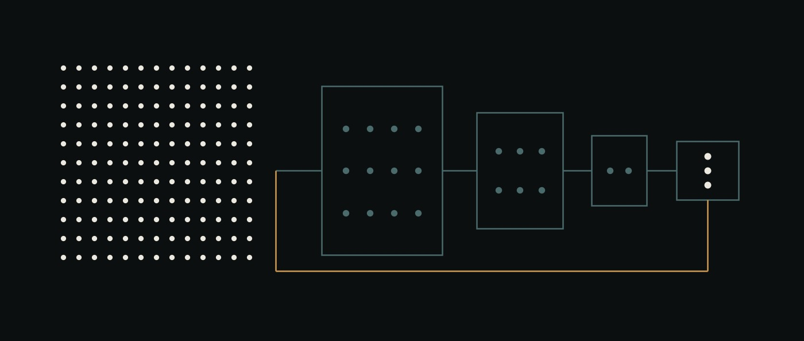

# 22 · ai-storage sobre un modelo local — la especificación, y qué está construido



<sub>Un corpus, una ventana y la ruta más corta. El teal se angosta a través de tres recintos, cada uno con menos marcas que el anterior; el ámbar sale del mismo punto, no entra en ninguno, y llega a la misma ventana. Eso es lo que midió el primer benchmark, no lo que el componente fue diseñado para hacer.</sub>


> **Estado, 2026-08-24.** Las fases 1–8 están construidas y testeadas — 119 tests.
> El límite del modelo, la garantía de que todo es local, el invariante de
> contexto, el esquema de notas, el pipeline de procedencia, el progreso
> derivado, el índice acotado en tokens, el store en disco, la búsqueda léxica,
> los cinco especialistas, los scopes, la promoción y el historial, y el
> benchmark de navegación.
>
> El benchmark **se corrió sólo en el techo** — un navegador perfecto, sin pesos,
> sin servidor. Su primer resultado está en [§59](#59) y no es el que quería el
> diseño: la jerarquía pierde contra grep. Nada de esto se corrió contra un
> modelo — ver [§0](#0).

<a id="0"></a>

## 0. Qué no fue chequeado, antes que ninguna otra cosa

El modelo que nombra este documento es `qwen3.8-27b`, y **este repositorio no
verificó que exista.** La especificación llegó con tamaños, una licencia, un
máximo de contexto y un repositorio GGUF; todo eso fue transcripto en una máquina
cuyo proxy de salida responde `403` a `CONNECT huggingface.co`. Entonces:

- cada campo de [`MODEL.json`](../../MODEL.json) lleva `verified: false`;
- un test afirma que todos siguen así, para que la bandera no pueda derivar a
  true por accidente;
- [`ai-storage/scripts/verify-model.ts`](../../ai-storage/scripts/verify-model.ts)
  es lo único que puede reportar otra cosa, y lo hace preguntándole a un servidor
  corriendo qué está sirviendo.

Ésta es la misma regla sobre la que corre el resto del repositorio —una
afirmación lleva la dirección de donde se leyó— aplicada a la afirmación que
decide qué significa cualquier otro número. Un resultado de benchmark registrado
bajo los pesos equivocados es peor que uno que no existe, porque parece
evidencia.

Si el identificador resulta estar mal, cambia un solo archivo.

<a id="1"></a>

## 1. La pregunta

No *qué tan grande puede ser el contexto que sostiene el modelo*. Ésta:

> ¿Cuánta capacidad puede recuperar un buen sistema operativo dándole a un modelo
> local relativamente chico mejor memoria, navegación y herramientas?

La arquitectura existe para hacer contestable la pregunta:

```text
             conocimiento del proyecto
              100K / 1M / 10M tokens
                       │
                       ▼
                  ai-storage
                       │
              jerarquía navegable
                       │
          ┌────────────┴────────────┐
          ▼                         ▼
       ÍNDICE                    fragmentos
          │                         │
          └──────────┬──────────────┘
                     ▼
              notas seleccionadas
                     │
                  ~2-4K
                     │
                     ▼
                  el modelo
                    LOCAL
                     8K
```

Éste es el argumento de [doc/11](11-choosing-a-model.md) una capa más abajo. Ese
documento dice que el número que decide algo es el **término de interacción** —
cuánto más levanta el harness al modelo chico que al de frontera— y que un solo
lift agrupado no es un hallazgo. ai-storage es un término de ese harness, y la
§18 de abajo es el benchmark que lo aísla.

<a id="2"></a>

## 2. El modelo, y por qué el contexto se limita igual

`qwen3.8-27b`: 27B de parámetros densos, pesos abiertos, Apache 2.0 sobre la
distribución GGUF, tool calling nativo, salida estructurada, un contexto nativo
reportado de hasta 1.000.000 de tokens, y cuantizaciones locales practicables.
Pesos de referencia `ggml-org/Qwen3.8-27B-GGUF`, `Q4_K_M` en aproximadamente
19 GB.

**Cada oración de ese párrafo está transcripta y ninguna está verificada.** Ver
[§0](#0).

ai-storage no debe depender del contexto de un millón de tokens. El benchmark
limita el modelo a

```text
8.192 tokens
```

porque el almacenamiento debería resolver la escasez de contexto en vez de
esconderla. Corré el benchmark en el máximo nativo y habrás medido la ventana de
contexto del modelo sin haber aprendido nada sobre la capa de almacenamiento.

<a id="3"></a>

## 3. Perfil — restringido

Para una máquina de 16 GB. **No es la referencia de calidad**; existe para
contestar una pregunta aparte, en la [§18](#18).

```yaml
quantization: IQ2_M          # ~10,87 GB
context:
  physical_max: 8192
  effective_max: 8192
```

<a id="4"></a>

## 4. Perfil — referencia

Apple Silicon ≥ 32 GB, o una GPU NVIDIA con ≥ 24 GB de VRAM.

```yaml
quantization: Q4_K_M         # ~19 GB
context:
  physical_max: 32768
  effective_max: 8192
```

El hardware permite más contexto y el benchmark igual lo rechaza. **Un resultado
que no nombra un perfil quiere decir éste** — dicho en vez de inferido, porque un
número de benchmark cuya cuantización se desconoce no se puede comparar con nada.

<a id="5"></a>

## 5. Perfil — calidad

48–64 GB. Q6, Q8, BF16 donde sea practicable. Su propósito es distinguir dos
fallas: *la capa de almacenamiento está mal* y *la compresión rompió el modelo*.
La misma implementación de almacenamiento corre sin cambios en los tres.

<a id="6"></a>

## 6. La regla sobre la que está construido todo el componente

> **El modelo decide el significado. El código decide la mecánica.**

El modelo decide qué importa, qué significa un pasaje, si una observación es una
decisión, si dos notas dicen lo mismo, qué directorio es probable que tenga la
respuesta, y qué abrir después.

El modelo no decide ids, hashes, offsets, ACLs, la existencia de un archivo,
conteos de tokens, semántica de transacciones, rutas permitidas, tamaño de
contexto, revisiones, ni si una escritura tuvo éxito.

**Y el cumplimiento es estructural, no textual.** Un prompt que dice *no inventes
ids* es un pedido. Que `KnowledgeProposal` no tenga campo de id es una pared —
ver [`knowledge/schema.ts`](../../ai-storage/src/knowledge/schema.ts), donde
`noteFrom` es la única forma de producir un `KnowledgeNote` y su firma pone la
salida del modelo de un lado y la mecánica acuñada del otro.

<a id="7"></a>

## 7. El modelo nunca es la base de datos

No un system prompt sosteniendo la historia del proyecto. No un blob JSON grande.
No un `MEMORY.md` de 100K tokens. En cambio: `memory_index`, `memory_open`,
`memory_find`, `memory_source`.

La memoria es externa. El contexto es temporal.

<a id="8"></a>

## 8. Jerarquía y orden de recuperación

```text
.ai/storage/{system,users,projects,flows}/…
```

Cuatro niveles — `SYSTEM`, `USER`, `PROJECT`, `FLOW` — y la recuperación corre
`FLOW → PROJECT → USER → SYSTEM`. El conocimiento local le gana al distante,
porque una restricción que este flow registró sobre esta corrida fue escrita
sabiendo de esta corrida y la generalidad de todo el sistema no.

<a id="9"></a>

## 9. Una nota, y qué no es una nota

Una nota es una pieza coherente de conocimiento reutilizable — recuperable,
citable, verificable, superable, promocionable por sí sola.

Una nota **no es un chunk**. Los chunks existen porque el modelo tiene contexto
finito; son un artefacto del lector, no una unidad de conocimiento, y nunca deben
convertirse en registros automáticamente. El Archivista lee chunks y propone
conceptos.

<a id="11"></a>

## 11. El esquema de una nota

Ver [`knowledge/schema.ts`](../../ai-storage/src/knowledge/schema.ts). Ocho tipos
(`fact`, `decision`, `constraint`, `procedure`, `failure`, `experiment`,
`preference`, `observation`), una afirmación, palabras clave, evidencia,
relaciones, un estado, timestamps, una revisión.

<a id="12"></a>

## 12. Qué puede proponer el modelo

```typescript
interface KnowledgeProposal {
  title: string;
  type: NoteType;
  claim: string;
  keywords: string[];
  source: { artifact: string; from: number; to: number };
}
```

Sin id. Sin hash. Sin scope. Sin estado. Sin timestamp. Sin revisión. No es "el
modelo no debería completar esto" — no hay dónde ponerlo.

<a id="13"></a>

## 13. La salida estructurada resuelve la sintaxis, no la verdad

Todos los especialistas devuelven salida restringida por esquema, y cada
respuesta se vuelve a validar de este lado. La decodificación restringida
produce con toda felicidad:

- un rango de bytes que corre hacia atrás, o de ancho cero;
- una ruta de artefacto que se trepa fuera del store;
- una cita hacia un archivo que no existe;
- una afirmación sobre los bytes 1100–2450 de un archivo de 400 bytes.

Los cuatro son válidos según el esquema. Los cuatro se rechazan, y
[`test/knowledge.test.ts`](../../ai-storage/test/knowledge.test.ts) y
[`test/evidence.test.ts`](../../ai-storage/test/evidence.test.ts) arrancan desde
propuestas que un esquema habría aceptado, porque ése es el único caso
interesante.

<a id="14"></a>

## 14. Procedencia

```text
propuesta → ¿existe la fuente? → ¿el rango está adentro? → extraer → sha256 → ACL → persistir
```

**El hash es de la rebanada, no del archivo.** Un digest del archivo entero dice
*este archivo no cambió*, que es la afirmación equivocada: regenerá un artefacto
y toda nota que citó cualquier parte de él se vuelve inverificable de golpe,
incluidas aquellas cuyos bytes son idénticos. Un digest de `[desde, hasta)` dice
*los bytes de los que se leyó esta afirmación siguen diciendo lo que decían*.

Re-chequear da tres respuestas — `intact`, `changed`, `gone` — y `changed` nunca
se repara. Re-hashear convertiría *esta afirmación ahora es inverificable* en
*esta afirmación está verificada*, que es exactamente la inversión que este
componente existe para prevenir.

<a id="15"></a>

## 15. El índice contesta una pregunta

> ¿Dónde debería mirar?

No *de qué se trata este proyecto*. La prosa cuesta seiscientos tokens y no
angosta nada; un listado de directorio cuesta cuarenta y elimina nueve décimos
del store. El lector tiene dos mil tokens de navegación para todo el descenso.

<a id="16"></a>

## 16. Acotado en tokens, y hecho cumplir

`root_max_tokens: 1200`, `node_max_tokens: 1400`, `maximum_depth: 8`. Un nodo
por encima del presupuesto **se parte**, y `assertWithinBudget` se niega a
renderizar uno que no lo hizo — un presupuesto que nadie hace cumplir es un
comentario.

Partir es mecánica, así que es determinista: agrupado por prefijo, con caída a
buckets. Preguntarle a un modelo dónde se divide un directorio desbordado haría
que el mismo store se partiera distinto en dos corridas, y un índice
irrepetible hace un benchmark irrepetible. *Dónde va una nota nueva* es una
pregunta semántica y va al Indexador; *dónde se divide un cajón lleno* no.

Construirlo encontró un bug real: agrupar por prefijo puede producir tantos
grupos como notas había —cuatrocientos nombres, cuatrocientos prefijos— dejando
al listado padre con cuatrocientos directorios, que es el nodo que estaba por
encima del presupuesto con un nivel de indirección adelante. Una partición ahora
se acepta sólo una vez que se midió el padre que produce.

<a id="17"></a>

## 17. El invariante de contexto, y el número que protege

```text
  Sistema / harness          1.500
  Tarea actual                 600
  Navegación                 2.000
  Conocimiento recuperado    2.300
  Razonamiento + salida      1.792
                           -------
                             8.192
```

Carriles en vez de una sola bolsa, porque la falla que previenen es la que se
parece al éxito: un Bibliotecario que gasta seis mil tokens caminando el índice y
después no tiene lugar para leer la nota que encontró navegó hermosamente y no
contestó nada.

**Una lectura que no entra se rechaza. Nunca se trunca.**

```json
{ "error": "MEMORY_CONTEXT_LIMIT", "requestedTokens": 2841, "availableTokens": 1719 }
```

Un rechazo es un evento que el harness puede ver y sobre el que puede actuar —
angostar la consulta, abrir menos notas, partir el nodo. Un truncado es
invisible, y un truncado invisible es un modelo contestando desde media nota
mientras el registro de la corrida dice que leyó la entera. Todo número insignia
que produce este componente es un cociente cuyo denominador es *tokens que el
modelo realmente tuvo que ver*; un recorte silencioso en cualquier lado y ese
denominador es ficción.

Los cinco números son configuración que los resultados pueden mover, no física.

<a id="18"></a>

## 18. Qué hay que medir

**Cociente de Eficiencia de Navegación** = tokens del corpus ÷ tokens que el
modelo realmente cargó, a exactitud estable. **Amplificación de Almacenamiento** =
corpus buscable ÷ contexto efectivo.

Contra baselines, porque un candidato sin baseline es una demo:

- **A** — el modelo con un `MEMORY.md` plano
- **B** — el modelo con grep/FTS
- **C** — el modelo con la navegación de ai-storage
- **D** — más adelante, C más embeddings

C sale sólo si le gana a A y a B donde ellos fallan. D sale sólo si le gana a C.
**Sin base de datos vectorial en v1** — primero navegación jerárquica y búsqueda
léxica exacta, para que el benchmark pueda decir si la recuperación semántica
hacía falta en vez de suponerlo.

Y la pregunta de la cuantización, que es la versión propia de este componente de
la de doc/11:

> ¿Puede mejor infraestructura compensar una cuantización agresiva del modelo?

Q8/Q6 → Q4 → IQ2, midiendo exactitud de navegación, corrección de tool calls,
cumplimiento de esquema, tasa de loops. Las corridas a 8K son las que importan.

**Nada de esto se corrió.** `ai-storage/bench/` está vacío a propósito: un
directorio de benchmark con scripts sin correr adentro se lee como un resultado.

<a id="21"></a>

## 21. Sólo local, y por qué se chequea en la construcción

`AI_STORAGE_LOCAL_ONLY` viene en true por defecto y quiere decir sin OpenRouter,
sin Anthropic, sin OpenAI, sin Google, sin telemetría que contenga prompts, sin
API de embeddings externa, sin reranker en la nube.

Una URL base que no sea loopback se rechaza cuando el objeto del modelo se
**construye**, no cuando se hace un request — para entonces ya existe un prompt y
algo decidió mandarlo, y una garantía de privacidad que falla en el primer
request ya falló.

Sólo loopback, no rangos privados. `10.0.0.7` es la máquina de otro incluso
cuando está sobre tu escritorio; la garantía es que el prompt no salió de *esta*
computadora.

<a id="22"></a>

## 22. Especialistas — un modelo, varias capacidades

Los mismos pesos; distintos prompts, herramientas, esquemas y presupuestos.

| Rol | Decide | Herramientas | Pensamiento |
|---|---|---|---|
| Bibliotecario | qué leer después | index, open, find, done | apagado |
| Archivista | qué significa una fuente | source open/slice, propose | encendido |
| Indexador | dónde va una nota | sólo ubicación | apagado |
| Reconciliador | nueva / igual / supera / conflicto | sólo lectura | encendido |
| Auditor | qué falta | sólo lectura | encendido |
| MemoryKeeper | nada; coordina | ninguna | apagado |

**La seguridad es estructural.** El Bibliotecario no tiene herramienta de
escritura — no un prompt diciéndole que no escriba. Un `write_file` alucinado
falla porque la operación no existe de su lado del límite. El MemoryKeeper no
puede tocar el almacenamiento directamente, así que no puede esquivar a sus
propios especialistas.

El razonamiento se gasta donde hace falta juicio y no donde alcanza la navegación
determinista, y esa suposición es una hipótesis para `bench/agent-tools` y no una
configuración permanente.

Temperatura 0,0 para el Bibliotecario y el Indexador, 0,1 para el resto. El
almacenamiento prefiere consistencia antes que creatividad.

<a id="41"></a>

## 41. Loops acotados, reintentos acotados

Los modelos locales se traban. Topes de pasos por rol (Bibliotecario 12,
Archivista 20, Reconciliador 8, Indexador 8), y la misma herramienta con los
mismos argumentos devolviendo el mismo resultado dos veces es `REPEATED_TOOL_LOOP`.

Las fallas de esquema tienen **dos** reintentos semánticos y después
`MEMORY_AGENT_FAILURE`. No muestrear hasta que algo valide: con qué frecuencia
una cuantización falla en producir salida válida es uno de los resultados, y un
loop de reintentos lo borra antes de que nada pueda registrarlo. Los transportes
no reintentan en absoluto.

<a id="54"></a>

## 54. Fases, y dónde está la línea ahora

| Fase | Qué | Estado |
|---|---|---|
| 1 | límite del modelo, motores, salida estructurada, tool calls, medición de tokens | **construida** |
| 2 | notas, procedencia, progreso derivado, presupuestos de tokens, árbol de índice | **construida** |
| 2b | backend de filesystem, transacciones, búsqueda léxica | **construida** |
| 3 | Bibliotecario, y el benchmark | **construida; corrida sólo en el techo** |
| 4 | Archivista | **construida** |
| 5 | Reconciliador, Indexador | **construida** |
| 6 | MemoryKeeper | **construida** |
| 7 | scopes y cumplimiento de ACL | **construida** |
| 8 | promoción, revisión, restauración | **construida** |
| 9 | la corrida restringida en Mac, reportada aparte | sin correr — necesita pesos |

La fase 3 es donde la hipótesis central se encuentra por primera vez con
evidencia: 8K de contexto, cincuenta mil notas, una respuesta plantada en una de
ellas. Se encontró con ella en el techo, y la [§59](#59) es lo que volvió. Todo lo
posterior a la fase 3 se construyó igual, y conviene ser honesto al respecto: el
argumento a favor es que el store tiene que existir antes de que se pueda medir
un modelo contra él, y el argumento en contra es que un resultado negativo en el
techo es una razón para frenar. Los dos son ciertos. Lo que no es defendible es
publicar las partes sin el resultado, así que el resultado está en el README.

<a id="56"></a>

## 56. Qué contaría como resultado

No *el modelo soporta un millón de tokens*. Esto:

> Un modelo de 27B con 8K de contexto de trabajo efectivo opera de forma
> confiable sobre conocimiento de proyecto órdenes de magnitud más grande que su
> contexto, porque ai-storage le da una memoria externa navegable.

Y la forma honesta de la misma oración, que es la que este repositorio está
obligado a publicar en cualquier caso:

> …o no lo hace, y el baseline de archivo plano era igual de bueno, y lo decimos.

El proyecto predecesor midió una idea muy relacionada —indexar la memoria sobre un
segundo eje— y volvió plana con 80% de acc@1 en las dos ramas, con el segundo eje
cargando información real que no cambiaba la respuesta. Ése es el resultado que
hay que esperar y estar listo para publicar. La carga de la prueba está sobre la
jerarquía.

<a id="59"></a>

## 59. El primer resultado, que no es el que quería el diseño

**Corrida: 2026-08-24, el oráculo, sin pesos.** `bench/results/oracle-ceiling.json`.

El oráculo es un navegador que juega perfecto — lee el listado que le muestran,
desciende primero-el-mejor, abre sólo entradas que coinciden con la pregunta tan
bien como cualquier cosa del listado, y frena en la respuesta. Hace trampa
conociendo la cadena de la respuesta, que es el punto: lo que mide es lo que la
*forma del store* permite, no lo que puede hacer un modelo cualquiera. Es el
techo.

Tres ramas, un corpus, un hecho plantado e inadivinable por pregunta, 8.192
tokens de contexto efectivo:

```text
rama     notas  corridas  correctas  citadas  cociente  cargados  pasos  finales
-------  -----  --------  ---------  -------  --------  --------  -----  -----------------
flat       200  3         0/3        0/3      —                0      1  context_limit:3
flat     50000  3         0/3        0/3      —                0      1  context_limit:3
search     200  3         3/3        3/3      54x            243      3  done:3
search   50000  3         3/3        3/3      13158x         243      3  done:3
storage    200  3         2/3        2/3      35x            369      7  done:2 step_cap:1
storage  50000  3         1/3        1/3      2391x         1337     12  done:1 step_cap:2
```

### Qué dice

**El archivo plano no entra, a ningún tamaño.** No "contesta peor" — rechaza.
Doscientas notas ya son 12.566 tokens contra un carril de memoria de 2.300, y la
corrida termina en `context_limit` antes de que se haga una pregunta. Ésa es la
versión honesta de lo que hace hoy la memoria upstream, donde el mismo archivo se
trunca en silencio a sus últimos trescientos bullets y el modelo contesta desde
lo que haya sobrevivido.

**La búsqueda léxica exacta le gana a la navegación jerárquica, en el techo.**
3/3 contra 1–2/3, y un mejor cociente a cada tamaño. Las fallas de la navegación
son `step_cap` — se queda sin *pasos*, no sin contexto — y cada listado que lee
cuesta tokens que la rama de búsqueda nunca gasta.

**La carga de la prueba estaba sobre la jerarquía y no la cumplió.**
[doc/05](05-ai-storage.md) decía que el predecesor midió una idea muy relacionada
y obtuvo un resultado plano; éste es un segundo resultado plano, en la misma
dirección, desde otro ángulo.

### Qué no dice

No es un resultado sobre ningún modelo. Nada se corrió contra pesos.

Y hay un confundidor que conviene decir de frente en vez de ajustarlo hasta que
desaparezca: la pregunta comparte sus palabras raras con exactamente una nota,
así que a la búsqueda sólo le hace falta hacer coincidir las palabras. Se
agregaron señuelos —ocho por hecho plantado, mismo título, mismas palabras clave,
desperdigados por otras áreas, ninguno con la respuesta— y la búsqueda igual fue
derecho al correcto, porque el objetivo genuinamente coincide con más términos de
la consulta que cualquier señuelo. Eso es la búsqueda andando bien, no el
benchmark siendo injusto. Una familia de preguntas más difícil, cuya redacción no
aparezca para nada en la nota objetivo, es el próximo diseño obvio y no está
construido.

Dos cosas más que la tabla subestima:

- **Las ramas no son excluyentes.** `storage` incluye `memory_find_exact`, así que
  un modelo en esa rama puede hacer todo lo que hace la rama de búsqueda y algo
  más. Lo que mide la corrida es un navegador que *prefiere* el índice; un modelo
  libre de elegir presumiblemente puntuaría al menos tan bien como la columna de
  búsqueda.
- **El oráculo está afinado para navegar, no para buscar.** Su consulta de
  búsqueda son las palabras mismas de la pregunta, que es casi óptimo; su
  descenso es una heurística que se reescribió dos veces mientras se construía
  esto y presumiblemente no lo es.

### Qué encontró la corrida en el camino

Cuatro bugs, cada uno de los cuales habría hecho que un número publicado fuera
falso:

1. El hecho plantado estaba archivado en un directorio cuyo nombre contradecía su
   contenido, así que la navegación no podía encontrarlo por construcción y la
   corrida habría medido la herramienta de búsqueda mientras reportaba un
   resultado sobre jerarquías.
2. Los ids de nota eran hex opaco. Un índice de ids opacos no se puede navegar:
   partir por prefijo produce buckets sin sentido y la pista de una línea hace
   todo el trabajo. Los ids llevan ahora las palabras del título.
3. `groupByPrefix` partía por el primer segmento, que compartían todos los ids,
   produciendo directorios llamados `kn` y `kn-kn-2`.
4. La rama plana no contestaba nada y quedaba registrada como `done` con cero
   tokens cargados — una columna vacía, que en silencio halaga a todo lo que
   tiene al lado.

### La próxima medición

Si un modelo de 27B a 8K puede alcanzar siquiera los números del oráculo, por
cuantización. Eso necesita pesos y un servidor, y hasta entonces la única
afirmación honesta sobre este componente es la de arriba: **en el techo, sobre
este benchmark, la jerarquía pierde contra grep y el archivo plano no entra.**
