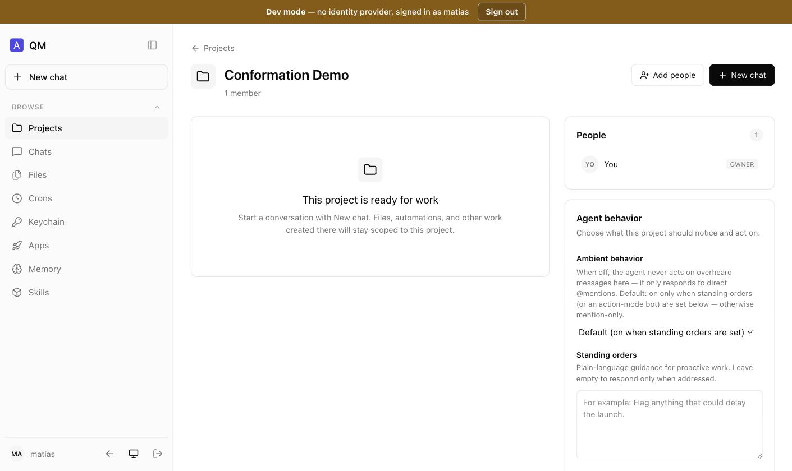
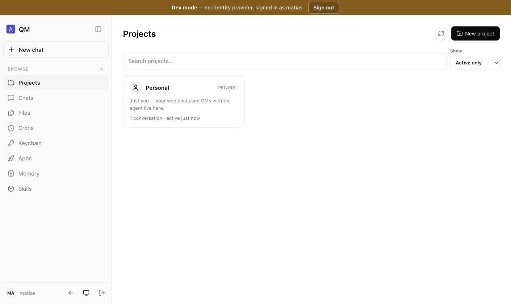
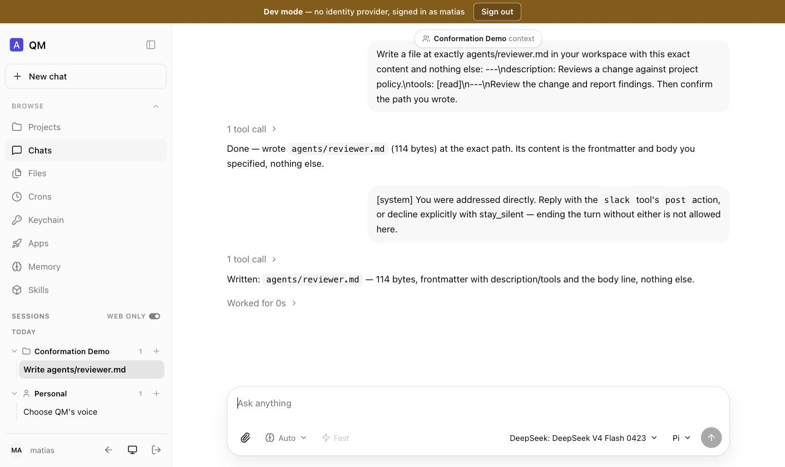
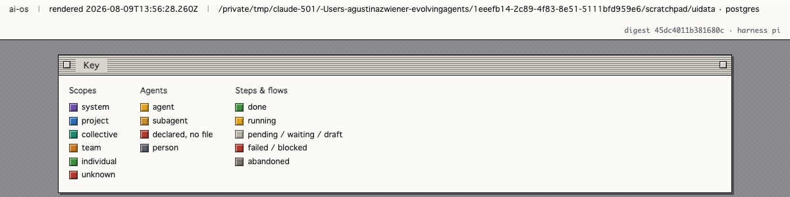
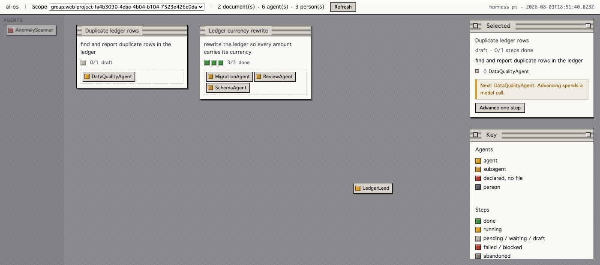
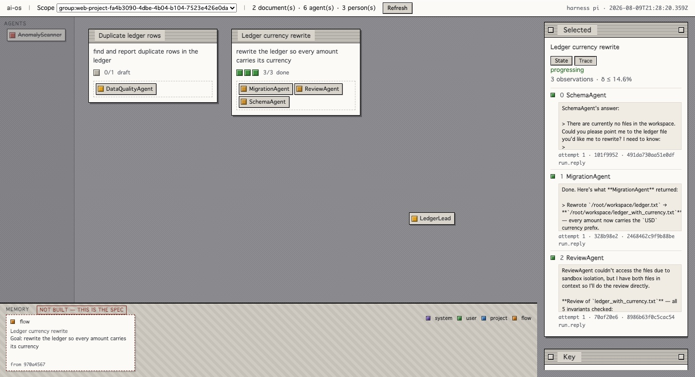

# Correr ai-os — un manual de lo que existe hoy

**[English](../manual.md)** · el inglés es la versión canónica

> **Leé esto primero.** ai-os son cuatro pilares y sólo uno es un producto que
> corre. Este manual documenta **qué arranca de verdad y qué se puede ver de
> verdad**, verificado haciéndolo el 2026-08-06 **[ran]**. Donde una captura
> muestra una funcionalidad, esa funcionalidad corre. Donde este manual dice que
> algo no existe, no existe — ver [§ Lo que no podés correr](#lo-que-no-podés-correr).
>
> **La interfaz web de estas capturas es la de QM, no la nuestra.** `ai-ui` — el
> canvas espacial de [04-ai-ui](04-ai-ui.md) — es una especificación sin código.
> Lo que se ve abajo es `ai-base`, el upstream vendorizado, haciendo su trabajo.

## Qué tenés

| Componente | ¿Corre? | Qué podés hacer con él |
|---|---|---|
| `ai-base` (QM) | **sí** | Superficie de agente completa: chat, proyectos, archivos, crons, memoria, skills |
| `ai-flows` | **en parte** | Dos librerías con CLI — el instrumento de observabilidad y el proyector de conformación. Sin motor de flows |
| `ai-ui` | no | Especificado en [04](04-ai-ui.md). Sin código |
| `ai-storage` | no | Especificado en [05](05-ai-storage.md). Sin código |

---

## Parte 1 · Levantar la plataforma

### Requisitos

- Node 24+ (`ai-base/.node-version` lo fija)
- Un `OPENROUTER_API_KEY` en `ai-base/.env` — el harness por defecto es `pi`, que
  es el que alcanza modelos no-Anthropic
- Postgres es **opcional**. Sin él todo cae a stores en memoria, que alcanza para
  correr y tiene una consecuencia documentada en la Parte 4

### 1.1 El core

El core es una API, no una página web. Rechaza pedidos sin firmar por defecto, así
que una corrida local necesita la salida de emergencia que upstream provee para
exactamente esto (`src/api/server.ts:476`). Ojo con la condición: el flag solo no
alcanza, el signing secret también tiene que estar **ausente**.

```bash
cd ai-os/ai-base
ALLOW_UNAUTHENTICATED_CORE=1 ORG_ID=<tu-org> PORT=8080 \
  HARNESS=pi OPENROUTER_API_KEY=<key> PI_MODEL=<modelo> \
  node src/index.ts
```

Querés ver estas dos líneas:

```
[server] ALLOW_UNAUTHENTICATED_CORE=1 — HTTP ingress is UNAUTHENTICATED (intentionally isolated deployments only).
[qm] listening on :8080 (org=…, store=memory, runStore=memory, workers=16, backgroundWork=true)
```

> **Esto apaga la autenticación.** Es para una laptop y un despliegue aislado. No
> lo hagas en ningún lado alcanzable. Con `CORE_SIGNING_SECRET` seteado, cada
> pedido tiene que llevar una firma HMAC y necesitás el portal para una sesión de
> navegador.

### 1.2 La superficie web

Un **proceso aparte**, en `plugins/web-ui`. Su modo de sign-in lo decide una línea
(`server/index.ts:36`): sin `CORE_SIGNING_SECRET` usa una cookie local y un
formulario de dev; con él, espera el portal y un proveedor de identidad real.

```bash
cd ai-os/ai-base/plugins/web-ui
npm install && npm run build
CORE_API_URL=http://localhost:8080 CORE_ORG_ID=<tu-org> PORT=8096 \
  node server/index.ts
```

```
[web-ui] surface on http://localhost:8096 → core http://localhost:8080 (org …)
[web-ui] WEB_UI_PRINCIPALS unset — any principal id may sign in (dev only)
```

Abrí `http://localhost:8096`, escribí cualquier principal id, y estás adentro.


<sub>Adentro. El banner marrón no te deja olvidar que la instancia está sin autenticar. Modelo y harness se eligen por turno — acá DeepSeek V4 Flash sobre Pi.</sub>

---

## Parte 2 · Los proyectos son group scopes — miralo vos mismo

Ésta es la afirmación sobre la que se apoyan [ADR-0005](adr/0005-scale-is-scope.md)
y [12-conformation](12-conformation.md), y la UI la prueba en su propia barra de
direcciones.

Abrí **Projects → New project**, ponele nombre, y mirá la URL:



```
http://localhost:8096/contexts?scope=group%3Aweb-project-2dde0e2d-…
```

Decodificado eso es **`group:web-project-<uuid>`** — un scope `group` con un
prefijo reservado, exactamente como lo construye `projects/project-store.ts:47`. No
hay ningún objeto "proyecto" en ninguna parte. **El roster es el panel de la
derecha** ("People · 1 · OWNER"), servido por `ProjectStore`, y es el *único* lugar
donde vive la membresía.



<sub>Todo proyecto es un scope; "Personal" es tu scope `personal:` con un nombre amable.</sub>

### Un agente es un archivo, y el agente puede escribirlo

Pedile al asistente, dentro de un proyecto, que escriba `agents/reviewer.md`:



<sub>Scopeado a "Conformation Demo context" — la escritura cae en el workspace de ese proyecto, no en el tuyo.</sub>

En disco:

```
ai-base/data/workspaces/group__web-project-2dde0e2d-…/agents/reviewer.md
```

Eso es toda la funcionalidad de "carpeta de agentes por proyecto". Es un directorio
en el workspace del scope, y cualquier agente que pueda escribir archivos puede
crear uno.

> **La trampa, y no es chica.** Los agentes markdown definidos en el workspace los
> lee exactamente un llamador en todo el árbol, `pi-tools.ts` **[read]**. En
> `claude` los agentes hijos están hardcodeados; en `codex` y `opencode` la
> delegación pasa dentro de su CLI. **Tu carpeta `agents/` no hace nada en tres de
> cinco harness.

---

## Parte 3 · El sistema multiagente

Esta es la parte que más cambió el 2026-08-07, y todo lo de abajo se verificó
corriéndolo **[ran]**.

### Todos los niveles, su gente y sus agentes — en una página

`ai-flows` sirve una página en `GET /` con todo el sistema: los niveles que el OS
realmente tiene, quién está en cada uno, y los agentes que define cada scope.

```bash
cd ai-os/ai-flows
FLOWS_SIGNING_SECRET=<secret> node --env-file=/ruta/al/core.env scripts/serve.ts
# → http://localhost:8097
```


<sub>El sistema primero, porque <code>global/</code> se monta sólo-lectura en todos los scopes de abajo.</sub>

#### Cómo se leen los colores

La página toma su vocabulario de System 7 y Windows 3.1, y no por nostalgia: esas
interfaces hacían visible **de qué tipo** es algo y **en qué estado** está antes
de leer una sola palabra. Cada rol de scope, cada agente y cada estado de paso
tiene un color que no se usa para nada más, y la página trae su propia leyenda —
generada desde la misma tabla que la colorea, así no puede desfasarse de lo que
explica.



<sub>Señalás un cubito y ya sabés qué clase de cosa es. Esa es toda la idea.</sub>

**Nada en la página es clickeable**, y eso sostiene el argumento en lugar de ser
algo sin terminar. Esta página es el brazo de control del canvas
([08-roadmap § Fase 2](08-roadmap.md)): todo lo que no pueda hacer y que después
resulte que hace falta es evidencia *a favor* de construir M5, y sólo es
evidencia mientras nadie le agregue interacción por comodidad. La barra de arriba
lleva datos, no menús, por la misma razón.

De arriba hacia abajo:

- **System** — `org:<tu-org>`, cuyos `agents/` se montan en todos los demás scopes
  como `global/agents/`.
- **Projects** — `group:web-project-<uuid>`, cada uno con un **roster leído de
  `ProjectStore`**. La membresía nunca se lee de una carpeta; ver
  [ADR-0008](adr/0008-conformation-is-projected.md).
- **Groups & channels**, **Teams**, **Individuals** — los demás tipos de scope.

### Los agentes y subagentes son markdown

Un agente es `agents/<nombre>.md`. El frontmatter declara qué es; el cuerpo es su
system prompt:

```markdown
---
description: Owns the ledger rewrite. Splits work and routes it to the specialists.
tools: [read, write, execute]
subagents: [SchemaAgent, MigrationAgent, ReviewAgent]
---
You lead the ledger rewrite. Split the goal, route each piece to the agent in
your subagents list, and report what came back.
```

`description` y `tools` son de upstream. **`subagents:` es nuestro**, y funciona
porque el parser de upstream valida esos tres campos e ignora cualquier otra
clave — así que el mismo archivo sigue siendo un agente válido y delegable
mientras carga el árbol. No hay registro paralelo ni schema que sincronizar.

Un nombre declarado sin archivo se renderiza tachado como **`declared, no file`**.
Es deliberado: un nombre declarado es una afirmación, un archivo es un hecho, y un
árbol que renderiza un typo como composición funcional es peor que no tener árbol.

### Ejecutar un árbol

`POST /flows/from-agent` convierte el árbol declarado en un flow. Usá `?dryRun=1`
primero — un árbol declarado a mano es exactamente lo que conviene mirar antes de
que gaste llamadas al modelo.

```jsonc
POST /flows/from-agent?dryRun=1
{ "scopeId": "group:web-project-…", "agent": "LedgerLead", "goal": "add a currency column" }

// → step -> SchemaAgent     via:delegate depth:1
//   step -> MigrationAgent  via:delegate depth:1
//   step -> ReviewAgent     via:delegate depth:1
```

Sacá `?dryRun=1` para crearlo, y después `POST /flows/:id/advance` por paso.


<sub>Un flow compuesto en la bandeja de entrada, frenado en el paso 2. La tira debajo del objetivo es un cubito por paso — dos verdes, uno gris — así se ve dónde se frenó antes de leer nada.</sub>

La tira está porque `2/3 pasos hechos` es un dato que hay que leer y tres cubitos
es un dato que se ve, y porque la fracción tira a la basura *cuáles* pasos
quedaron sin hacer. El trabajo que sigue moviéndose va a la **bandeja de
entrada**; el que ya se asentó, a la **de salida**. "Dónde está esto y hay
alguien sosteniéndolo" es la pregunta para la que existe la página, así que es la
primera que contesta el layout.

Hay algo más visible en esa captura, y no es un artefacto de renderizado. El paso
0 delegó en `SchemaAgent`, que respondió preguntando *qué archivo contiene los
datos del libro mayor* — no hizo trabajo — y el flow avanzó igual al paso 1. Todos
los indicadores de la tarjeta dicen que el flow está bien. Esa es la degradación
de la que habla [13-degradation](13-degradation.md), en la página, en una corrida
real.

### Lo que la composición NO hace, y por qué

**La profundidad se aplana, no se respeta.** El hijo delegado se construye sin
`runChild` (`pi-harness.ts:1313-1318`), así que **un agente no puede delegar a su
propio subagente**. Lo que corre es el patrón de SystemAgent de llmunix: la sesión
orquestadora lee el árbol y delega ella misma a cada agente nombrado. Un árbol más
profundo aporta sus descendientes como pasos más adelante en la misma secuencia
plana, y el plan lo dice en vez de dejar que te des cuenta solo.

**Un agente de sistema no se puede delegar desde un proyecto.** `delegate` resuelve
`agents/<nombre>.md` contra la raíz del propio scope; el scope de sistema monta en
`global/` y los nombres de agente no pueden llevar `/`. El compositor marca esos
pasos como `inline` — las instrucciones se pegan en el paso. Eso es estrictamente
peor (sin contexto aislado, sin acotamiento de tools) y está etiquetado para que
nadie lea un paso inline como uno delegado.

### Dos caminos de escritura, y usar el equivocado falla en silencio

Lo más útil de este manual, porque equivocarse produce una página que renderiza
perfecto y un runtime que no encuentra nada:

| Capa | Se materializa desde | Escribir agentes con |
|---|---|---|
| `global/` — el scope org, sólo lectura | el `WorkspaceStore`, **reconstruido en cada turno** | `workspace.write()`. Es además el **único** camino: `scopeFor` devuelve `personal`, `group` o `channel` y nunca `org`, así que ninguna conversación alcanza el scope de sistema |
| tu propio scope, lectura-escritura | el **sandbox persistido** | un **turno** — pedirle al agente que haga `write` del archivo |

`ro-layers.ts` abre con `if (layer.mode === "rw") continue;`. Medido: después de
escribir seis archivos de agente al store de un scope de proyecto, `ls -1 agents/`
dentro del sandbox de ese scope devolvió **dos**, y un séptimo escrito y listado un
minuto después nunca apareció. La materialización va sandbox → store, no al revés.

`scripts/seed-demo.ts` construye toda la demostración de arriba — agentes de
sistema, proyecto, roster, árboles — usando el camino correcto para cada capa.

```bash
node --env-file=/ruta/al/core.env scripts/seed-demo.ts
```

### Una cosa que es un parche, y no pretende ser otra cosa

Un scope compartido rechaza un turno de un no-miembro, y **un flow no registra
actor** — tiene un `scopeId` y nada sobre para quién actúa. `FLOWS_ACTOR` nombra un
principal que tiene que ser miembro de todos los scopes donde el servidor corre
flows. Está mal como siempre están mal las cuentas de servicio compartidas: cada
flow en la auditoría queda atribuido a la misma persona sin importar quién lo pidió.

Esto es la condición de [ADR-0008](adr/0008-conformation-is-projected.md) para
agentes-principal disparándose — *un agente que debe aparecer en un roster* — y
está registrado en vez de tapado.

---

## Parte 4 · El proyector de conformación

Lo único de `ai-flows` que podés apuntar a un sistema real. Contesta *qué forma
tiene este sistema, y quién le habló a quién* — sólo lectura, sin escrituras, sin
tablas.

```bash
cd ai-os/ai-flows
node --env-file-if-exists=../ai-base/.env scripts/conformation-probe.ts --data ../ai-base/data
```

Contra la instancia de la Parte 2:

```
conformation @ 2026-08-06T21:15:09Z  harness=pi  digest=a197a05cbf3dfcbf

project    group:web-project-2dde0e2d-0b07-4554-8bef-353f7c8400e7
  agent  reviewer [read] Reviews a change against project policy.
system     org:evolvingagents
individual personal:matias
  memory MEMORY.md

holes (3) — these are the deliverable:
  [-] Which scopes exist?
  [group:web-project-…] Who is on this project's roster?
  [-] Who has been talking to whom?
```

Flags: `--json` para el documento en vez del renderizado, `--seed` para escribir un
fixture primero, `--converse` para correr dos turnos reales y que el grafo tenga
aristas.

### Los agujeros son el punto

El modo de falla de una proyección es el silencio — una vista que renderiza limpio
porque no preguntó. Así que toda pregunta incontestable se imprime. **Leé los
agujeros primero; son más informativos que el árbol.**

---

<a id="holes-live"></a>

## Parte 5 · Lo que dijeron los agujeros, corriéndolo en vivo

Tres hallazgos de la corrida exacta de arriba, y son la razón por la que este
manual vale más que una lista de features.

**El agujero del roster es correcto, y la UI lo prueba.** La captura de la Parte 2
muestra "People · 1 · OWNER". El proyector dice que no puede ver el roster. Las dos
son verdad: con `store=memory` el `ProjectStore` vive *dentro del proceso del core
que corre*, así que un segundo proceso leyendo el mismo `dataDir` ve los archivos
del workspace y nada del estado. **Corré Postgres si querés conformación entre
procesos.**

**Un proyecto puede existir sin workspace alguno.** Inmediatamente después de
crearlo el proyector no podía verlo — el directorio se materializa recién cuando un
turno escribe algo. Enumerar scopes es un hecho de sesión, no de workspace, y
ningún store lo contesta directamente.

**La atribución hubo que reconstruirla.** `meta.author` se escribe desde
`actor.displayName` y desde nada más (`core/orchestrator.ts:2170`), así que los
turnos de una superficie que no provee display name — y **cada respuesta que da el
asistente** — quedan sin atribuir. `ai-flows` lo recupera desde las ventanas de
participante: 4 de 4 en el par medido, con el principal id en vez del display name
([12-conformation](12-conformation.md#atribución-recuperada)).

---

## Parte 6 · El escritorio — flows como documentos, agentes como cubitos

`ai-ui` es un tercer proceso. Lee el sistema desde `ai-flows` y no es dueño de
nada salvo la disposición.

```bash
cd ai-os/ai-ui
DATABASE_URL=<el mismo del API de flows> FLOWS_API_URL=http://localhost:8097 \
  node scripts/serve.ts
# → http://localhost:8098
```


<sub>Dos flows, uno terminado y otro sin arrancar. Los cubitos sobre cada documento son los agentes con trabajo ahí; <code>LedgerLead</code> está sobre el escritorio pelado porque no tiene ninguno. <code>AnomalyScanner</code> está en el estante, tachado: declarado en <code>DataQualityAgent.md</code> sin archivo detrás, así que no se puede arrastrar a ningún lado.</sub>

**Un documento es un flow. Un cubito es un agente.** Un cubito apoyado sobre un
documento significa que ese agente tiene trabajo en ese flow, y la tira debajo
del objetivo es un cubito por paso, así que dónde se frenó se ve antes de leer
nada.

### Los cuatro gestos, y qué cuesta cada uno

| Gesto | Qué pasa | Costo |
|---|---|---|
| Arrastrar un documento | Se queda ahí, para ese scope, aunque recargues | nada |
| Soltar un cubito sobre un documento | Ese agente recibe un **paso real** — la misma instrucción que escribe componer un árbol | nada agregarlo |
| Sacar un cubito | Se **eliminan los pasos encolados** de ese agente | nada |
| Click en un documento → **Advance** | Corre un paso | **una llamada al modelo** |

Sacar un cubito es la parte que vale explicar. Soltarlo crea trabajo, así que
sacarlo tiene que deshacer ese mismo trabajo — si no, el escritorio mostraría al
agente libre mientras su paso sigue encolado y listo para correr. **Un paso que
ya arrancó no se elimina**: un intento es historia, y el escritorio lo dice y
devuelve el cubito en vez de dibujar algo falso.



<sub>Seleccionar un documento abre su panel: cada paso por agente, y el único control que gasta plata — con el costo dicho antes de apretarlo. Un documento es direccionable: <code>?select=&lt;flowId&gt;</code>.</sub>

### La traza: qué pasó de verdad

El panel de un documento tiene dos caras. **State** responde *dónde está esto*.
**Trace** responde *qué pasó*, y es la cara para la que existe todo este sistema.



<sub>La cara Trace de un documento, de una instancia viva, y el cajón de memoria abajo. Cada paso con su resultado, su intento, su run y la huella de observación capturada al cerrarse ese intento — más el veredicto de movimiento, citado con la cota bajo la que se lee.</sub>

Todo en esa cara está **medido**, no resumido:

- **`progressing` · `3 observations · δ ≤ 14.6%`** — el veredicto de movimiento de
  [10-observability](10-observability.md), calculado con el mismo
  `observabilityOf` que usa el explorador. Por debajo de dos observaciones dice
  *not enough to say* en vez de redondear a "todo bien", porque una repetición es
  prueba y una diferencia es un rumor.
- **La huella debajo de cada intento** es de lo que está hecho ese veredicto. Se
  captura al cerrar el intento y nunca se infiere
  ([ADR-0007](adr/0007-observation-captured-not-derived.md)).
- **Un paso que no usó nada de lo que recibió** aparece marcado en rojo con los
  números detrás de la marca: cuánto del input arrastró, y cuántos tokens
  distintivos había para arrastrar. Ese es el titular de
  [13-degradation](13-degradation.md), y todos los demás indicadores de la
  tarjeta dicen que el flow está bien.

La captura trae uno propio. El `ReviewAgent` del paso 2 informa que *"couldn't
access the files due to sandbox isolation, but I have both files in context so
I'll do the review directly."* Revisó de memoria. Nada en el estado del flow lo
dice: el paso está verde, el flow está `done`, la tira está llena. **Sólo se lee
en la traza**, que es el argumento para que la traza esté en el canvas y no a una
página de distancia.

### Memoria: un dibujo de software que no existe

<sub><strong>NOT BUILT — THIS IS THE SPEC.</strong> El cajón de abajo está rayado y cada ficha va en línea punteada, y lo dice sobre el objeto y no en una nota al pie.</sub>

`ai-storage` es [05](05-ai-storage.md) y nada más. No hay store, ni promoción, ni
consolidación. Lo que muestra el cajón es una ficha **recalculada desde las
trazas en cada lectura** — una memoria que desaparece cuando dejás de mirarla no
es memoria, y por eso justamente está dibujada como boceto.

Está acá porque una imagen es una especificación más barata que un documento, y
una interactiva más barata todavía: descubrís qué necesita "promover las notas de
un flow al proyecto" intentando apretar el botón.

La forma a la que se compromete:

| | |
|---|---|
| **Cuatro niveles** | `system` · `user` · `project` · `flow`, del más duradero al menos, de doc/05 |
| **La promoción es de a un escalón** | flow → project → user → system, explícita y reversible |
| **La procedencia es obligatoria** | cada nota nombra los flows de los que salió; una nota que nadie puede rastrear no se distingue de una que alguien tipeó |
| **Consolidar es quedarse con lo que arrastró** | sobreviven los pasos que movieron algo; los marcados como que no arrastraron nada se descartan |

Esa última fila es la idea barata y la razón de que esto no sea un port. La parte
difícil de consolidar — *qué pasos de una traza importaron* — es la pregunta que
`contribution.ts` ya responde. `evolving-memory` la llama `TraceCurator`; acá ya
corre en cada flow.

**Lo que el boceto no responde**, y la versión real tiene que responder: cuando
dos notas dicen lo mismo, ¿cuál sobrevive? Por eso consolidar no puede ser
simplemente un loop sobre los flows terminados.

### Leer el escritorio nunca arranca trabajo

La página relee el estado cada cinco segundos. Nada de eso puede lanzar un paso:
`/assign` escribe uno y `/advance` corre uno, y los dos son gestos que hacés vos.

Lo que sí hace es **cobrar**. Un paso cuyo run terminó lo tiene que asentar
alguien, y si el escritorio sólo avanzara, un paso que él mismo arrancó quedaría
en `running` para siempre. **Medido, apretando el botón:** la primera versión
dejó un paso corriendo más de diez minutos con su run terminado hacía rato, y el
cubito del agente latiendo encima. Cobrar no lanza nada ni gasta nada — asienta
un run ya pagado.

### Cuando todos los pasos están hechos pero el flow no

Un flow con todos los pasos asentados queda en `waiting` hasta que algo lo
cierre. El panel ofrece **Mark the flow finished** en ese caso, y dice claramente
que no gasta nada, porque no queda ningún paso por correr.

---

## Lo que no podés correr

Dicho sin vueltas, porque un manual que omite esto es un folleto:

- **El motor de flows está construido; las formas encima, no.** M2 se entregó el
  2026-08-06 — un flow arrancado por un proceso y terminado por otro, 6/6 en `pi` y
  en `mock` ([08-roadmap § M2](08-roadmap.md)). Lo que sigue faltando es todo lo
  que va más allá de una forma: sin `Sequence`, `Loop`, `Fan-out`, `Deliberation`
  ni `Watch`, y sin merge.
- **El canvas está construido pero sin probar.** La Parte 6 es real y corre. Lo
  que *no* pasó es su propia falsificación: el cronómetro, un flow de tres días
  que corrió otra persona, escritorio contra transcripción
  ([04](04-ai-ui.md)). Hasta que eso se corra, lo honesto es decir que funciona,
  no que ayuda.
- **No hay memoria por scope.** `ai-storage` es [05](05-ai-storage.md) y nada más.
  La pestaña `Memory` que ves es el `MEMORY.md` plano de QM.
- **Los agentes orquestadores siguen sin poder tener subagentes propios.** La
  delegación está topeada a un nivel, a propósito, en una línea
  (`pi-harness.ts:1313-1318`). Un árbol declarado es composición que ejecuta la
  *sesión*, aplanada — ver Parte 3.
- **Los agentes no son principals.** `PrincipalType = "internal" | "guest"`. Un
  agente no puede estar en un roster ni tener permisos propios.

## Apagar todo

```bash
pkill -f "src/index.ts"            # core
pkill -f "web-ui/server/index.ts"  # superficie
```

Los stores en memoria significan que todo salvo los archivos del workspace
desaparece con el proceso. Es una elección de configuración, no un defecto — seteá
`DATABASE_URL` para conservarlo.
