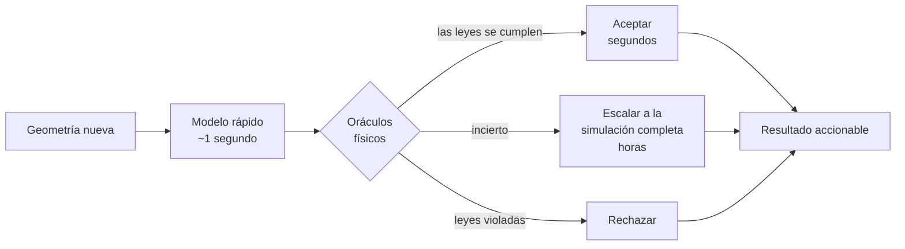

# Podemos hacer la simulación mil veces más rápida. Hasta esta semana no sabíamos cuándo se equivocaba.

Simular cómo se mueve la sangre dentro de una cavidad del corazón es algo que las
computadoras hacen bien y despacio. Horas por caso. Hoy existen redes neuronales
que aprenden a imitar esas simulaciones y responden en aproximadamente un
segundo, lo que parecería ser el final de la historia.

No lo es, y el motivo es incómodo: **cuando estos modelos se equivocan, se
equivocan con exactamente la misma cara de seguridad que cuando aciertan.**

Todos los trabajos informan el error promedio sobre un conjunto de prueba. Un
promedio es una cifra razonable para publicar e inútil para actuar. Nadie trata un
promedio. Tenés una geometría adelante, una predicción, y ninguna respuesta
correcta contra la cual compararla — porque si tuvieras la respuesta correcta no
habrías necesitado el modelo.

Así que lo que falta no es un modelo mejor. Es un árbitro.

## Verificar una respuesta sin conocer la respuesta

Acá está lo que vuelve tratable el problema. La física impone reglas que se pueden
chequear sobre la predicción sola.

La sangre no puede aparecer ni desaparecer: lo que entra tiene que salir. No puede
deslizarse sin fricción pegada a una pared; tiene que frenarse contra ella. La
energía tiene que cerrar. Ninguna de esas cosas requiere saber cuál era la
respuesta verdadera.

Es la misma razón por la que podés detectar un resumen bancario adulterado sin
tener idea de qué compró la persona. Las cuentas tienen que cerrar. Si no cierran,
algo está mal, y eso lo aprendiste de la estructura del documento y no de la
verdad que hay detrás.

Esa es la idea completa: un conjunto de chequeos físicos independientes —los
llamamos oráculos— que leen una predicción y la puntúan sin haber visto jamás la
respuesta correcta.

## El producto es el circuito, no el modelo



Lo que estás comprando no es velocidad. Es **velocidad donde es seguro y precisión
donde no lo es**, con algo distinto del optimismo decidiendo cuál es cuál.

## El primer resultado

Existen flujos clásicos cuya solución exacta se conoce por fórmula desde hace un
siglo: flujo estacionario en un tubo, y flujo pulsátil en un tubo. Entonces el
primer experimento toma esas respuestas exactas, las rompe a propósito en
cantidades que elegimos nosotros, y pregunta si el puntaje del árbitro sigue el
nivel de rotura. Si no puede ordenar errores cuyo tamaño ya conocemos, no va a
poder con los que no.

El umbral para declararlo un fracaso quedó escrito **antes** de correr el
experimento: por debajo de 0,80, la idea está muerta y se publica muerta.

```
98 predicciones, 32% equivocadas por más de 5%

  calidad del orden   0,906     muere por debajo de 0,80
  falsos aceptados    2,1%      de todo lo que dejó pasar
```

Toda clase de corrupción por encima del umbral de error fue detectada. Y la suite
no es un buen chequeo con sombrero: el oráculo más fuerte llega a 0,838 por su
cuenta, pero sacando los dos más fuertes todavía queda 0,896 — chequeos que
individualmente están cerca de ser inútiles cubren fallas distintas, y la cartera
le gana a cada uno de sus miembros.

Una tarde de trabajo, en una laptop, y superó la barrera detrás de la cual
esperaban miles de horas de cómputo.

## Tres formas en que casi me miente

Más interesante que el resultado es lo que costó confiar en él. Aparecieron tres
defectos mientras lo construía, y cada uno habría producido un número hermoso y
completamente vacío:

- **La integración tenía un sesgo del 2,6%.** Una forma rutinaria de sumar sobre
  una sección circular cuenta ambos extremos completos y se pasa. Ese sesgo es
  **mayor que el umbral del 1%** del propio chequeo de conservación de masa — así
  que ese oráculo habría estado midiendo mi aritmética en vez de la física.
- **Una de las soluciones exactas tenía un signo invertido.** Se veía
  perfectamente plausible. Lo atrapó un control: a frecuencia muy baja, el flujo
  pulsátil tiene que colapsar sobre el estacionario. No lo hacía. Nada de leer el
  código habría mostrado esto.
- **Un chequeo disparaba sobre un campo perfecto.** Yo le había puesto el umbral
  a ojo. La solución verdadera cambia genuinamente un 18% entre instantes
  muestreados, porque a esa frecuencia el flujo realmente se invierte dentro de un
  latido — física, no error. Una compuerta que reprueba una respuesta perfecta no
  es estricta, está mal. El reemplazo se **deriva** de la ecuación de momento en
  vez de elegirse, y ahora conserva el mismo significado a lo largo de un rango de
  dieciséis veces en la tasa de muestreo.

Llegué a pensar que esta es la parte del método que más importa y sobre la que
menos se escribe: no qué harías si funciona, sino cuál es la cosa más barata que
te diría que no funciona — y después desconfiar también de la primera versión de
eso.

## No examines al alumno sobre las preguntas que estudió

La tentación siguiente es entrenar al modelo para que respete las leyes físicas
—meter la ley como penalización en la función de pérdida— y después usar esas
mismas leyes como examen. Se siente riguroso. Es casi circular.

Un modelo entrenado para minimizar un residuo va a minimizar ese residuo. Puede
empujar ese número hacia abajo sin que el campo subyacente esté bien donde importa,
y el chequeo queda satisfecho por construcción. **Un examen sobre exactamente lo
que alguien estudió deja de medir si aprendió.**

Así que el proyecto deja escrita una predicción antes de correr nada: los chequeos
que duplican el objetivo de entrenamiento van a ser los *peores* detectando las
fallas de ese modelo, y los útiles van a ser los que el entrenamiento nunca tocó.
Si se cumple, es una regla de diseño para cualquiera que construya verificación
automática:

> Un verificador que chequea aquello para lo que el generador fue optimizado está
> midiendo al optimizador, no al generador.

## Por qué esto pertenece a un sistema operativo para agentes

Este proyecto no es realmente sobre corazones. Es una carga de trabajo para otra
cosa que estamos construyendo: un entorno donde los agentes hacen el trabajo
—proponen, implementan, corren el experimento, lo escriben— y donde la pregunta
que decide si algo de eso vale es *quién controla al agente*.

Hoy la respuesta es: una persona, volviendo a derivar el resultado. Eso no escala,
y es la razón por la que "el agente hizo la investigación" sigue siendo mayormente
una demo.

Medimos la alternativa fallando, en el mismo espacio de trabajo, la misma semana.
Un modelo chico al que se le pidió juzgar su propio trabajo en prosa se declaró
terminado en seis episodios de seis — y estaba equivocado en los seis. Con la
tarea idéntica a través de una interfaz estructurada donde detenerse es una
instrucción explícita con ejecutor externo, no reclamó estar listo ni una sola
vez. Mismo modelo, mismo problema, mismo día. **Un circuito de agentes construido
sobre "el agente dice que terminó" está construido sobre nada.**

Así que la regla que un SO agéntico tiene que hacer cumplir es la misma que este
proyecto está probando en dinámica de fluidos: **la aceptación se delega en algo
que no es el agente.** La sangre no negocia. Un residuo es un residuo.

Y la segunda mitad de esa idea es que los instrumentos de control tienen que ser
*portables*, o cada proyecto los reconstruye y ninguno llega a ser bueno. La
herramienta de auditoría que se usó acá —la que le pregunta a cada umbral "¿cuánto
margen dejaste realmente?"— se escribió días antes para un proyecto completamente
distinto, sobre la mecánica del oído interno. Corrió sobre dinámica de fluidos
**sin cambiarle una sola línea**. Eso es lo que parece un sistema operativo para
trabajo agéntico en la práctica: no una ventana de chat, sino un conjunto de
instrumentos que atraviesan dominios — compuertas que registran cuán ajustadas
están, verificadores de solo lectura y con huella digital, una suite de
precondición que tiene que estar verde antes de que un experimento pueda empezar,
y decisiones escritas en el momento en que se toman en vez de reconstruidas
después.

Las herramientas de capacidad son la mitad fácil. Las escasas son las de
honestidad.

## Lo que esto no es, y lo que todavía no demuestra

No es diagnóstico. No produce ningún puntaje de riesgo ni ninguna salida a nivel
paciente. Trabaja con formas y campos de flujo sobre un tubo simple; la geometría
cardíaca entra después, como prueba de si el árbitro sigue funcionando fuera del
laboratorio.

Y el límite honesto del resultado de arriba: **las corrupciones y los oráculos
tienen el mismo autor.** Esto demuestra que las compuertas ordenan errores de un
tipo que se nos ocurrió. Todavía no demuestra que ordenen los errores que un
modelo entrenado realmente comete, porque no se entrenó ningún modelo. Esa es la
compuerta siguiente — una pregunta distinta, no un pulido de esta.

Todo se apoya en dos fuentes públicas con licencia MIT, y el conjunto entero corre
en una laptop.

---

*Parte de un proyecto abierto de investigación sobre agentes cuyo trabajo es
verificado por algo externo a ellos mismos. La especificación —incluidas las
condiciones de muerte escritas antes de correr nada— vive junto a este artículo.*

---

### Notas para publicar

LinkedIn no renderiza Mermaid. Exportá el diagrama como imagen antes de publicar;
el fuente queda acá para que el artículo y el repositorio no se separen. El
original en inglés es `ARTICLE.md`.
