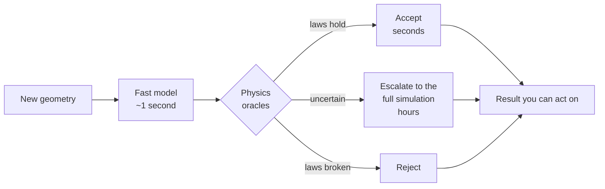

# We can make the simulation a thousand times faster. Until this week we couldn't tell when it was wrong.

Simulating how blood moves inside a chamber of the heart is something computers
do well and slowly. Hours per case. There are now neural networks that learn to
imitate those simulations and answer in about a second, which sounds like the end
of the story.

It isn't, and the reason is uncomfortable: **when these models are wrong, they are
wrong with exactly the same confident face they wear when they are right.**

Every paper reports the average error over a test set. An average is a fine thing
to publish and a useless thing to act on. Nobody treats an average. You have one
geometry in front of you, one prediction, and no correct answer to compare it
against — because if you had the correct answer you wouldn't have needed the
model.

So the missing piece isn't a better model. It's a referee.

## Checking an answer without knowing the answer

Here is the part that makes this tractable. Physics imposes rules that can be
checked on the prediction alone.

Blood cannot appear or disappear: whatever flows in has to flow out. It cannot
slide frictionlessly along a wall; it has to come to rest against it. Energy has
to balance. None of these require knowing what the true answer was.

It's the same reason you can catch a doctored bank statement without knowing what
anyone actually bought. The transactions have to add up. If they don't, something
is wrong, and you learned that from the structure of the document rather than
from the truth behind it.

That's the whole idea: a set of independent physical checks — we call them
oracles — that read a prediction and score it, having never seen the right
answer.

## The product is the loop, not the model



What you are buying is not speed. It's **speed where it is safe, and accuracy
where it isn't**, with something other than optimism deciding which is which.

## The first result

There are classical flows whose exact solution has been known by formula for
about a century: steady flow in a tube, and pulsating flow in a tube. So the
first experiment takes those exact answers, breaks them on purpose by amounts we
choose, and asks whether the referee's score tracks how badly they were broken.
If it can't rank errors we already know the size of, it will not rank the ones we
don't.

The threshold for calling it a failure was written down **before** the experiment
ran: below 0.80, the idea is dead and gets published as dead.

```
98 predictions, 32% of them wrong by more than 5%

  ranking quality   0.906     dead below 0.80
  false accepts     2.1%      of everything waved through
```

Every kind of corruption above the error boundary was caught. And the suite is
not one good check wearing a hat: the strongest single oracle reaches 0.838 on
its own, but removing the two strongest still leaves 0.896 — individually
near-useless checks cover different failures, and the portfolio beats every
member of it.

An afternoon of work, on a laptop, and it cleared the bar that thousands of
compute-hours were waiting behind.

## Three ways it nearly lied to me

More interesting than the result is what it took to trust it. Three defects
turned up while building, each of which would have produced a beautiful and
completely meaningless number:

- **The integration was biased by 2.6%.** A routine way of summing over a circular
  cross-section counts both endpoints in full and overshoots. That bias is larger
  than the 1% threshold of the mass-conservation check itself — so that oracle
  would have been measuring my arithmetic rather than the physics.
- **One of the exact solutions had a sign error.** It looked perfectly plausible.
  It was caught by a control: at very low frequency, pulsating flow must collapse
  onto steady flow. It didn't. Nothing about reading the code would have shown
  this.
- **One check fired on a perfect field.** I had set its threshold by eye. The true
  solution genuinely changes by 18% between sampled instants, because at that
  frequency the flow really does reverse within a beat — physics, not error. A
  gate that fails a perfect answer isn't strict, it's wrong. The replacement is
  derived from the momentum equation instead of chosen, and it now holds the same
  meaning across a sixteen-fold range of sampling rates.

I've come to think this is the part of the method that matters most and gets
written about least: not what you'd do if it works, but the cheapest thing that
would tell you it doesn't — and then distrusting the first version of that too.

## Don't examine the student on the questions they studied

The tempting next move is to train the model to respect the physical laws — add
the law as a penalty in the loss function — and then use those same laws as the
exam. It feels rigorous. It is close to circular.

A model trained to minimise a residual will minimise that residual. It can push
that number down without the underlying field being right where it matters, and
the check is then satisfied by construction. **An exam on exactly what someone
studied stops measuring whether they learned.**

So the project writes a prediction down before running anything: the checks that
duplicate the training objective will be the *worst* at detecting that model's
failures, and the useful ones will be the checks the training never touched. If
that holds, it's a design rule for anyone building automated verification:

> A verifier that checks what the generator was optimised for is measuring the
> optimiser, not the generator.

## Why this belongs to an operating system for agents

This project isn't really about hearts. It's a workload for something else we're
building: an environment where agents do the work — propose, implement, run the
experiment, write it up — and where the question that decides whether any of it
is worth anything is *who checks the agent*.

Today the answer is: a human, by re-deriving the result. That does not scale, and
it is why "the agent did the research" is still mostly a demo.

We measured the alternative failing, in the same workspace, the same week. A
small model asked to judge its own work in plain prose declared itself finished
in six episodes out of six — and was wrong in all six. Given the identical task
through a structured interface where stopping is an explicit instruction with an
external executor, it never once claimed to be done. Same model, same problem,
same day. **An agent loop built on "the agent says it's finished" is built on
nothing.**

So the rule an agentic OS has to enforce is the same one this project is testing
in fluid dynamics: **acceptance is delegated to something that is not the agent.**
Blood doesn't negotiate. A residual is a residual.

And the second half of that idea is that the checking instruments have to be
*portable*, or every project rebuilds them and none of them get good. The audit
tool used here — the one that asks of every threshold "how much room did you
actually leave?" — was written days earlier for an entirely different project
about the mechanics of the inner ear. It ran on fluid dynamics **without a single
line changed**. That is what an operating system for agentic work looks like in
practice: not a chat window, but a set of instruments that carry across domains —
gates that record how tightly they bind, verifiers that are read-only and
fingerprinted, a precondition suite that must be green before an experiment may
start, and decisions written down at the moment they are made rather than
reconstructed later.

The capability tools are the easy half. It's the honesty tools that are scarce.

## What this is not, and what it doesn't show yet

It is not diagnostic. It produces no risk score and no patient-level output of
any kind. It works with shapes and flow fields on a simple tube; cardiac geometry
enters later, as a test of whether the referee still functions outside the
laboratory.

And the honest limit of the result above: **the corruptions and the oracles have
the same author.** This shows the gates rank errors of a kind we thought of. It
does not yet show they rank the errors a trained model actually makes, because no
model has been trained yet. That's the next gate — a different question, not a
polish of this one.

Everything rests on two public MIT-licensed sources, and the whole thing runs on
a laptop.

---

*Part of an open research project on agents whose work is checked by something
outside themselves. The specification — including the kill conditions written
before anything ran — lives beside this article.*

---

### Notes for publishing

LinkedIn does not render Mermaid. Export the diagram above as an image before
posting; the source stays here so the article and the repository cannot drift
apart. The Spanish mirror is `ARTICLE.es.md`.
