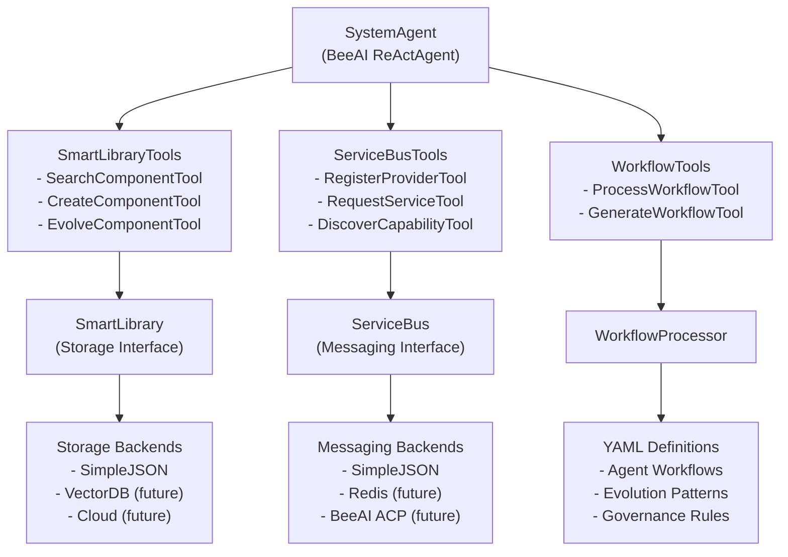
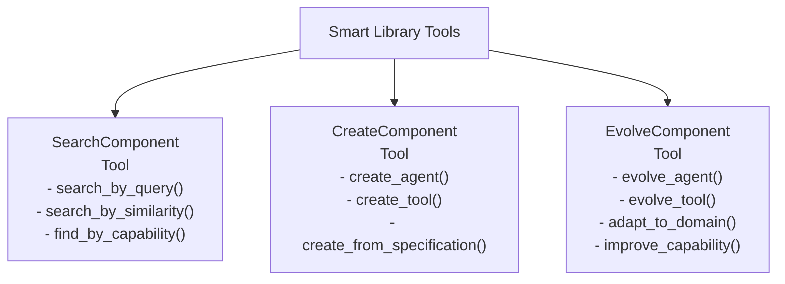
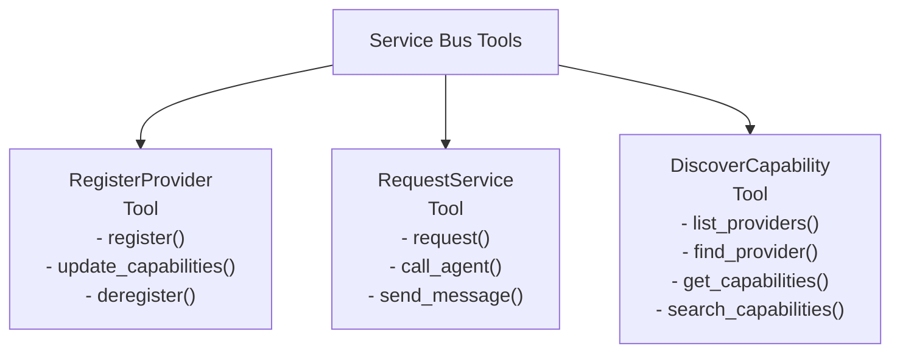
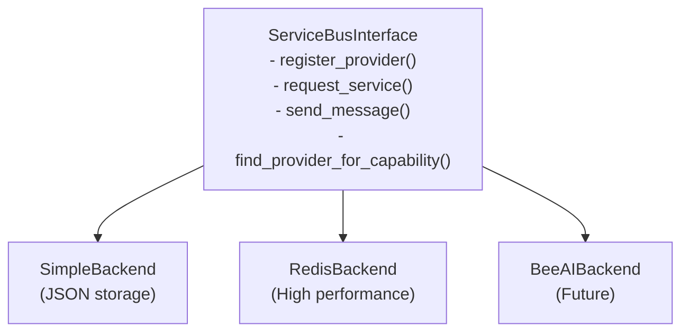
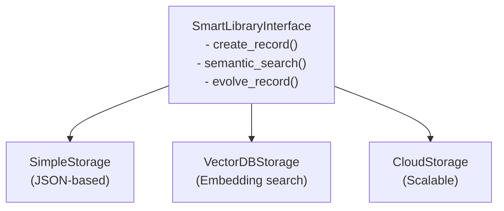
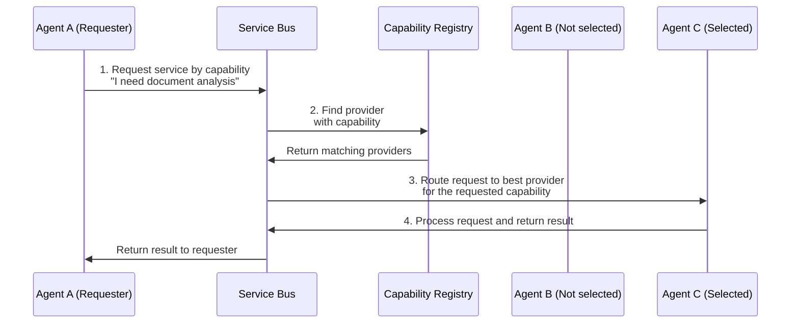

# Evolving Agents Framework - Architecture

This document details the architectural design of the Evolving Agents Framework.

## Agent-Centric Architecture

The Evolving Agents Framework is built on a true agent-centric architecture. The SystemAgent itself is implemented as a BeeAI ReActAgent that uses specialized tools to manage the agent ecosystem:



This architecture ensures that the system itself follows the "by agents, for agents" philosophy, with the SystemAgent making decisions and using specialized tools to interact with the underlying infrastructure.

### Smart Library Tools

The SmartLibrary provides three specialized tools for component management:



### Service Bus Tools

The Service Bus provides three specialized tools for inter-agent communication:



### Service Bus: Communication Layer

The Service Bus provides a unified communication layer with pluggable backends:



### Smart Library: Component Storage

The Smart Library stores agent and tool definitions with pluggable storage backends:



### Agent-Centric Communication Flow

The Service Bus enables powerful capability-based communication between agents:



## Understanding the Comprehensive Example

The framework includes a comprehensive example (`examples/simplified_agent_communication.py`) that demonstrates four key capabilities. This example shows in detail how the Evolving Agents Framework creates, manages, and evolves AI agents to handle real-world tasks.

### Step 1: Setting Up the Agent Library

Before running the main example, we need to set up an initial library of agents and tools:

```bash
python examples/setup_simplified_agent_library.py
```

This script creates a foundation of BeeAI-compatible agents and tools:

- **DocumentAnalyzer Tool**: A real BeeAI tool that uses an LLM to analyze documents and identify their type
- **AgentCommunicator Tool**: A real BeeAI tool that facilitates communication between agents
- **SpecialistAgent**: A BeeAI agent specialized in detailed document analysis
- **CoordinatorAgent**: A BeeAI agent that orchestrates the document processing workflow

### Step 2: Demonstrating the System Agent's Decision Logic

The first part of the example demonstrates how the System Agent intelligently decides whether to reuse, evolve, or create a new agent based on semantic similarity:

```python
# The System Agent dynamically decides what to do based on your request
invoice_agent_result = await system_agent.decide_and_act(
    request="I need an agent that can analyze invoices and extract the total amount",
    domain="document_processing",
    record_type="AGENT"
)

print(f"System Agent Decision: {invoice_agent_result['action']}")  # 'create', 'evolve', or 'reuse'
```

The System Agent implements a sophisticated decision mechanism:
- If similarity ≥ 0.8: Reuse an existing agent/tool
- If 0.4 ≤ similarity < 0.8: Evolve an existing agent/tool 
- If similarity < 0.4: Create a new agent/tool

In the example, when we ask for an invoice analysis agent, it creates a new one. When we ask for a medical record analyzer, it evolves the existing SpecialistAgent (since it has a similarity score of around 0.46).

### Step 3: Agent-to-Agent Communication with Workflows

The second part demonstrates how agents communicate with each other through workflows defined in YAML:

```yaml
# A workflow where agents communicate with each other
workflow_yaml = """
scenario_name: "Document Processing with Agent Communication"
domain: "document_processing"
description: "Process documents by delegating specialized tasks to expert agents"

steps:
  # Create the tools from the library
  - type: "CREATE"
    item_type: "TOOL"
    name: "DocumentAnalyzer"

  - type: "CREATE"
    item_type: "TOOL"
    name: "AgentCommunicator"

  # Create the agents from the library
  - type: "CREATE"
    item_type: "AGENT"
    name: "SpecialistAgent"
    config:
      memory_type: "token"

  # Create the coordinator agent with the tools
  - type: "CREATE"
    item_type: "AGENT"
    name: "CoordinatorAgent"
    config:
      memory_type: "token"

  # Execute with an invoice document
  - type: "EXECUTE"
    item_type: "AGENT"
    name: "CoordinatorAgent"
    user_input: "Process this document: {invoice}"
"""
```

In this workflow, the CoordinatorAgent delegates specialized tasks to the SpecialistAgent through the AgentCommunicator tool. The example shows a complete workflow execution for both an invoice and a medical record.

### Step 4: Agent Evolution

The third part demonstrates how agents can be evolved to create enhanced versions:

```yaml
# Evolution workflow
evolution_workflow = """
scenario_name: "Enhanced Invoice Processing"
domain: "document_processing"
description: "Evolve the specialist agent to provide better invoice analysis"

steps:
  # Define an evolved version of the specialist agent
  - type: "DEFINE"
    item_type: "AGENT"
    name: "EnhancedInvoiceSpecialist"
    from_existing_snippet: "SpecialistAgent"
    evolve_changes:
      docstring_update: "Improved with enhanced invoice analysis capabilities including line item detection"
    description: "Enhanced specialist that provides more detailed invoice analysis with line item extraction"

  # Create and execute the evolved agent
  - type: "CREATE"
    item_type: "AGENT"
    name: "EnhancedInvoiceSpecialist"
    config:
      memory_type: "token"

  # Test the evolved agent with an invoice
  - type: "EXECUTE"
    item_type: "AGENT"
    name: "EnhancedInvoiceSpecialist"
    user_input: "{invoice}"
"""
```

This evolution process takes an existing agent (SpecialistAgent) and creates an enhanced version (EnhancedInvoiceSpecialist) with improved capabilities specific to invoice analysis.

### Step 5: Semantic Search with OpenAI Embeddings

The final part demonstrates how to find semantically similar components in the library:

```python
# Search for document processing agents
search_results = await library.semantic_search(
    query="agent that can process and understand documents",
    record_type="AGENT",
    threshold=0.3
)
```

This shows how the framework uses OpenAI embeddings to find the most relevant agents for a given task, allowing you to discover and reuse existing components based on their semantic meaning rather than just exact keyword matches.

## Service Bus and Capability-Based Communication

The Service Bus enables agents to communicate based on capabilities rather than explicit agent references:

```python
# Initialize the Service Bus with simple JSON backend
await system_agent.initialize_service_bus(backend_type="simple")

# Register components with capabilities using RegisterProviderTool
document_analyzer_id = await system_agent.tools["register_provider"].run(
    name="DocumentAnalyzer",
    capabilities=[{
        "id": "analyze_document",
        "name": "Document Analysis",
        "description": "Analyzes documents to determine their type",
        "confidence": 0.9
    }]
)

# Process a document using capability-based routing with RequestServiceTool
document_text = "INVOICE #12345\nDate: 2023-05-15\nTotal: $1,822.80"
analysis_response = await system_agent.tools["request_service"].run(
    capability="analyze_document",
    content=document_text
)

# Discover available capabilities with DiscoverCapabilityTool
available_analysis_tools = await system_agent.tools["discover_capability"].run(
    capability_type="document_analysis"
)

# The Service Bus automatically finds the most appropriate provider
print(f"Document type: {analysis_response['content']['document_type']}")
```

This capability-based communication enables:
1. **Dynamic Discovery**: Agents can find services without knowing provider details
2. **Loose Coupling**: Agents depend on capabilities, not specific implementations
3. **Graceful Evolution**: Providers can be upgraded without disrupting consumers
4. **Automatic Routing**: Requests are sent to the most appropriate provider

## Core Components

### SystemAgent as a BeeAI ReActAgent

The SystemAgent is implemented as a BeeAI ReActAgent with specialized tools:

### Smart Library Tools

The Smart Library tools allow the SystemAgent to manage components in the library:

```python
class SearchComponentTool(Tool):
    """Tool for searching components in the Smart Library."""
    
    name = "SearchComponentTool"
    description = "Search for agents and tools by query, similarity, or capability"
    
    # Tool implementation...
    async def search_by_query(self, query, record_type=None, domain=None, limit=5):
        """Search by natural language query."""
        # Implementation...

class CreateComponentTool(Tool):
    """Tool for creating components in the Smart Library."""
    
    name = "CreateComponentTool"
    description = "Create new agents and tools from specifications"
    
    # Tool implementation...
    async def create_agent(self, name, description, domain, code=None):
        """Create a new agent from specification."""
        # Implementation...

class EvolveComponentTool(Tool):
    """Tool for evolving components in the Smart Library."""
    
    name = "EvolveComponentTool"
    description = "Evolve existing agents and tools for new requirements"
    
    # Tool implementation...
    async def evolve_agent(self, agent_id, changes, new_requirements):
        """Evolve an existing agent with new capabilities."""
        # Implementation...
```

### Service Bus Tools

The Service Bus tools enable the SystemAgent to manage inter-agent communication:

```python
class RegisterProviderTool(Tool):
    """Tool for registering providers with the Service Bus."""
    
    name = "RegisterProviderTool"
    description = "Register agents and tools as service providers"
    
    # Tool implementation...
    async def register(self, name, capabilities):
        """Register a provider with its capabilities."""
        # Implementation...

class RequestServiceTool(Tool):
    """Tool for requesting services through the Service Bus."""
    
    name = "RequestServiceTool"
    description = "Request services by capability"
    
    # Tool implementation...
    async def request(self, capability, content):
        """Request a service by capability."""
        # Implementation...

class DiscoverCapabilityTool(Tool):
    """Tool for discovering capabilities in the Service Bus."""
    
    name = "DiscoverCapabilityTool"
    description = "Discover available capabilities and providers"
    
    # Tool implementation...
    async def find_provider(self, capability):
        """Find a provider for a specific capability."""
        # Implementation...
```

### Workflow Tools

Tools for workflow management:

```python
class ProcessWorkflowTool(Tool):
    """Tool for processing workflows."""
    
    name = "ProcessWorkflowTool"
    description = "Define and execute workflows in YAML format"
    
    # Tool implementation...
    
class GenerateWorkflowTool(Tool):
    """Tool for generating workflows from natural language."""
    
    name = "GenerateWorkflowTool"
    description = "Generate workflow YAML from requirements"
    
    # Tool implementation...
```

## Advanced Features

- **Firmware Injection**: Enforce governance rules and constraints across all agents
- **Version Control**: Track the evolution of agents over time
- **Cross-domain Collaboration**: Enable agents from different domains to work together
- **Observability**: Monitor agent communications and decision processes

## Final Note
We’re in the midst of an active refactoring process. The existing example is deprecated, but we’ll be publishing an updated version aligned with the architecture diagrams in the coming days! 🚀