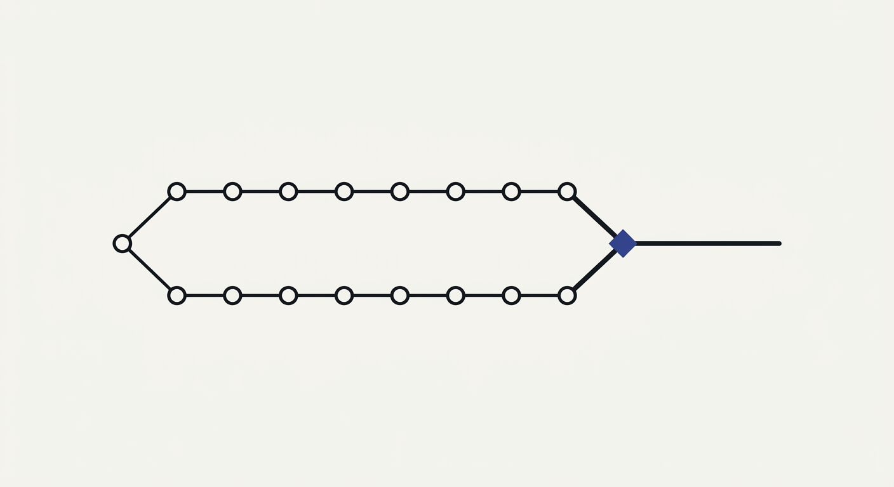

# agentvcs

<p align="center">
  
</p>

[](https://github.com/EvolvingAgentsLabs/agentvcs/actions/workflows/ci.yml)


[](LICENSE)

**Version control for software that *evolves while it runs*.**

> The open-source **"git for agents"**: version an agent's **code, skills, goals, models,
> traces & sub-agent swarm together** — and merge its **autonomous evolution back into
> your releases, intelligently.**

## The problem: your agent evolves, git never sees it

An autonomous agent doesn't just *run* your system. In the field it **rewrites** it — a new
skill, an edited tool, a spawned sub-agent, a redirected goal, a prompt tuned against
production experience. Git tracks static text, so none of that exists as far as your
repository is concerned.

Then the team ships the next release, and it **overwrites every field-learned adaptation and
the reasoning behind it.** The agent starts over.

**agentvcs's goal is to make that run-time evolution first-class and trustworthy:**

1. **Capture** every iteration as one commit across code + goal + models + trace + swarm.
2. **Prove & freeze** what works into a deterministic, replayable recipe.
3. **Reconcile** the agent's run-time line back into your git releases instead of losing it.
4. **Measure** whether the self-modification is actually improving — not just changing.

It **complements** git — it doesn't replace it ([how it compares](docs/COMPARISON.md)). Git
stays the system of record for what your team designs; agentvcs is the persistent episodic
memory of what the agent became at run-time.

```
 design-time line   ●──────●──────●   what your team develops & releases under git
                     \              \
                      \              ▼  agentvcs merge --reconcile <agent>
                       \            ◆  one reconciled history
                        \          ▲
 run-time line          ●────●────●   what the autonomous system changed about itself
```

## One commit: four dimensions plus a state

A commit here is not a text diff. It is an atomic snapshot of four simultaneous dimensions —
and, when the agent has them, a sub-agent **swarm** and the runtime **frame**:

| Dimension | What it holds |
|---|---|
| **code** | the files as usual — tools, scripts, markdown skills |
| **goal** | the intent or directive the agent was pursuing |
| **models** | which LLM ran, with which params (temperature, …) |
| **trace** | the chain of thought, tool calls and real results that *caused* the change |

```
            ┌─────────── one commit ───────────┐
   code  →  │  tree     goal     models   trace │   state: fluid | crystallized
            └───────────────────────────────────┘
```

And every commit carries a **state**:

- **`fluid`** — the agent is still iterating, searching probabilistically: high-temperature
  models, code/skills/prompts/goals mutating between iterations. Powerful, expensive,
  non-deterministic. This is where new problems get solved.
- **`crystallized`** — a solution you trust, *frozen*. Once the agent passes its evaluation
  (`agentvcs eval`), `agentvcs freeze` pins the models to temperature 0 and compiles the
  iteration into a replayable **recipe**: cheap, stable, deterministic.

`agentvcs diff` tells you *which dimension* moved — a goal redirect and a code change are
distinguishable events, not one opaque text diff:

```
705b2fb..1d4bd90
  code
    ~ app.py
  goal
    from: Resolve refund requests autonomously
    to:   Resolve refund requests with fraud checks
```

## What it does that a code VCS can't

### Semantic merge — `merge --reconcile`

The flagship feature. When the design-time line (your team's codebase) and the run-time line
(what the agent learned in production) diverge, a plain `git merge` clobbers the field
adaptations or buries them in conflict markers — and it has no idea what the *goal* or the
*reasoning* should become.

agentvcs merges each dimension appropriately: three-way merge for code/skills (the
eval-winner auto-resolves conflicting hunks first), union for model pins, node-by-node for
the swarm — then hands the **semantic** decision to an agent you trust. It writes
`{base, ours, theirs}` goals, traces, code diffs and eval/cost metrics to a subprocess's
stdin and reads back `{goal, trace, notes, resolved_files}`:

```bash
agentvcs merge runtime/main --reconcile "nanoloop reconcile"
```

That is the whole interface. The core has no LLM dependency and no opinion about what sits on
the other end — the reconciler synthesizes unified knowledge and can even return the
conflict-free files agentvcs then writes.

### Multidimensional rollback — the panic button

When an iteration goes wrong, `agentvcs rollback` restores not just the code but the exact
prior goal, model pins and memory, and records *why* in a durable ledger:

```bash
agentvcs rollback --reason "v3 collapsed routing; urgency flag regressed"
```

It is itself reversible.

### Evolutionary diagnostics — is the self-modification working?

AI-generated code suffers regressions a code review won't see. Because agentvcs owns the
whole *recorded lineage* — a population of variants over time, each with an eval score — it
can measure things a code VCS can't. These are exact, standard-library computations over the
commit graph, with **no extra LLM calls**:

| Diagnostic | Model | Question it answers |
| --- | --- | --- |
| `price` | **Price equation** `w̄·Δz̄ = Cov(w,z) + E[w·Δz]` | Is improvement from *selecting* between branches, or *editing* within a lineage? |
| `price` (threshold) | **Eigen error catastrophe** (`μL < ln σ`) | Is self-editing losing information faster than selection recovers it? |
| `health` | **Critical slowing down** (lag-1 autocorrelation + variance) | Is a collapse coming *before* the mean score moves? |
| `health` / `branch` | **Muller's ratchet** | Is an unmerged branch a decaying asexual lineage that needs recombination (`merge`)? |
| `infobits` | **Kelly / Kussell–Leibler & channel capacity** (`I(context; action)` in bits) | How much can more context retrieval actually buy — where's the compression headroom? |
| `contain` | **Branching process** `R₀ = n·p` | Will one poisoned entry in shared memory spread across the swarm, or die out? What verification rate contains it? |

The honest scope: these measure a population of variants across time — the object a **version
control system** owns. Controller/fleet math (throughput control, sampling, scheduling)
belongs to a live harness and is deliberately *out of scope*. Full derivations, mappings and
the scope boundary: [`docs/EVOLUTIONARY_DYNAMICS.md`](docs/EVOLUTIONARY_DYNAMICS.md).

## Real demos

Runnable, narrated, and on the web — every number comes from a real `agentvcs eval`, nothing
faked. **[Live demos ↗](https://evolvingagentslabs.github.io/agentvcs/demos/)** ·
reproduction guide [`docs/DEMOS.md`](docs/DEMOS.md).

- **Business cases — plain English, no math on screen**
  (`bash examples/business-cases/run.sh`). Five everyday situations, each ending in a
  one-line call: a support bot that quietly gets worse every week (*roll back*), a client
  fork nobody merged (*merge it before it rots*), a prompt stuffed with context that changes
  nothing (*trim it, save cost*), one bad fact poisoning a shared-memory fleet (*verify N% of
  reads*).
- **Evolution diagnostics — the technical companion**
  (`bash examples/evolution-diagnostics/run.sh`). The same five with the real numbers and
  the theory; every claim asserted against `--json`.
- **Self-evolving eve merge** (`bash examples/eve-evolve-merge/demo.sh`). A
  [Vercel **eve**](https://vercel.com/eve) agent rewrites its own skill and spawns a
  sub-agent at run-time while the team evolves the same files in git — and `merge` fuses
  both. Offline, no API key.
- **The full agent loop** (`bash examples/agent-loop-demo/run.sh`). A simulated autonomous
  agent driving commit → eval → **rollback (with a recorded reason)** → freeze end to end.

More in [`examples/README.md`](examples/README.md).

## Architecture & ecosystem

**Zero dependencies.** Everything is built on the Python standard library alone — deliberate,
for maximum auditability and drop-in integration. The data model underneath is a git-style
content-addressed object store with typed objects (`commit` / `tree` / `goal` / `modelpin` /
`trace` / `crystal`), a per-commit `fluid ↔ crystallized` state machine, and a three-way
*semantic* merge over the merge-base ([`docs/SPEC.md`](docs/SPEC.md)). Model pins are
provider-agnostic (Anthropic, Google, Qwen, …); `"auto"` fills the pin from the model that
actually ran, so it can't drift.

**Passive trace capture (providers).** You don't instrument your code to record traces.
agentvcs reads what the runtime already writes — local session files or events — through
built-in providers: `claude-code`, `qwen-code`, `anthropic-managed`, `vercel-eve` and
`odyssey`. Declare one in `agent.json` and commits capture reasoning automatically. Secrets
are `[REDACTED]` by default.

**Built for agents.** Every command accepts `--json` and emits a single parseable object with
stable `error.code`s, so an agent recovers programmatically instead of parsing English. An
**MCP server** ships too — `claude mcp add agentvcs -- agentvcs-mcp` (zero-dependency, stdio
JSON-RPC) — exposing the same capabilities to Claude, Cursor or any MCP client so the agent
can version itself autonomously. `agentvcs new` scaffolds an `AGENTS.md` so the next agent
learns the workflow.

**Optional Web3 identity — Souls of Silicon.** Off by default, zero crypto surface otherwise.
`agentvcs init --with-soul` gives each instance an **Ed25519 Soul**, signing every commit
(forge-proof provenance). Every verified `freeze` mints a **Soulbound Token**, building a
verifiable CV of what the agent has actually proven — reputation that can't be cloned. Fleets
are selected with DeSoc correlation discounting for maximum diversity. Full vision:
[`docs/papers/souls-of-silicon.md`](docs/papers/souls-of-silicon.md). A separate opt-in
**corporate/legal layer** (`agentvcs init --corporate`) adds an audit log and signed human
approvals for governed deployments.

## Install

```bash
git clone https://github.com/EvolvingAgentsLabs/agentvcs
cd agentvcs && pip install -e .   # not on PyPI yet
```

> `avcs` is a built-in shorthand for `agentvcs` — every command works with either name.

## Quickstart

```bash
agentvcs new my-agent          # scaffold a project pre-wired for agents (agent.json, AGENTS.md, CC skill, MCP)
cd my-agent
agentvcs commit -m "initial fluid agent"
agentvcs diff                  # dimensional diff: code vs goal vs models vs trace
agentvcs eval && agentvcs freeze   # prove it, then crystallize (freeze is gated on the eval)
agentvcs price                 # is the self-modification net-positive?
```

Declare the non-code dimensions in `agent.json`:

```json
{
  "goal": "Resolve refund requests autonomously",
  "models": [{ "provider": "anthropic", "model": "claude-opus-4-8", "params": { "temperature": 1.0 } }],
  "trace": { "provider": "claude-code", "auto": true },
  "swarm": { "refund-verifier": { "role": "verify a refund", "skill_file": "agent/subagents/refund-verifier.md" } },
  "eval": { "command": "pytest -q", "runs": 3 },
  "state": "fluid"
}
```

`freeze` refuses to crystallize a commit that hasn't passed its `eval` (`EVAL_FAILED`);
`freeze --force` past a failure marks the recipe `verified: false` — never a silent lie.
"Crystallized" means "proven", enforced in code rather than in the README.

## Commands

| command | what it does |
|---|---|
| `agentvcs new DIR` / `init` | scaffold / create a repository (`--claude-code` / `--qwen-code` / `--eve` wire trace capture) |
| `agentvcs commit -m MSG` | snapshot code + goal + models + trace |
| `agentvcs log` / `status` / `show` / `diff` | history / working-tree changes / one commit / dimensional diff |
| `agentvcs branch` / `checkout REF` | list/create a live branch / restore the working tree |
| `agentvcs merge BRANCH` | multidimensional merge; `--reconcile CMD` hands goal+trace+conflicts to an agent; `--target-goal` directs it |
| `agentvcs rollback [REF] --reason TEXT` | undo: restore the full prior state, with a recorded justification (the panic button) |
| `agentvcs eval` / `freeze` / `replay` / `recall` | the trust gate: prove → crystallize → re-run → find |
| `agentvcs price` / `health` | is the evolution *working*: selection-vs-transmission + error-catastrophe & ratchet warnings |
| `agentvcs infobits` / `contain` | information value of context (bits) · shared-memory poisoning containment (R₀) |
| `agentvcs runtime` / `budget` / `context` / `statusline` / `watch` | the operational frame your runtime hides |
| `agentvcs ui` | serve a local web dashboard to *watch* the evolution |
| `agentvcs soul` / `verify` / `fleet` | optional Soul/DeSoc layer (see above) |

## Learn more

- **Demos** — plain-English business stories + the technical companion:
  [live demos](https://evolvingagentslabs.github.io/agentvcs/demos/) ·
  [`docs/DEMOS.md`](docs/DEMOS.md)
- **The math & models** — derivations, mappings, scope boundary:
  [`docs/EVOLUTIONARY_DYNAMICS.md`](docs/EVOLUTIONARY_DYNAMICS.md)
- **How it compares** — next to git, LangSmith/Langfuse and MLflow/W&B, and what it is *not*:
  [`docs/COMPARISON.md`](docs/COMPARISON.md)
- **Tutorial / Spec / Agent contract** — [`docs/TUTORIAL.md`](docs/TUTORIAL.md) ·
  [`docs/SPEC.md`](docs/SPEC.md) · [`docs/AGENT_MODE.md`](docs/AGENT_MODE.md)

## Scope

agentvcs does not try to replace git. Git stays what your human team builds and releases with
at design time; agentvcs is the agent's **persistent episodic memory** at run-time, closing
the gap between MLOps, LLMOps and ordinary DevOps — purely locally.

This repo is the **local protocol and runtime** — complete on its own, offline, forever. It
**complements** your existing stack (git, LangSmith/Langfuse, MLflow/W&B) rather than
replacing any of it. Hosted collaboration and fleet observability at scale are a separate
concern, not part of this open-source core.

**Before you trust it:** the bundled demo reconciler is a deterministic bullet-union stub —
honest in its docstring, but not intelligent; the LLM reconciler is a separate piece. Test
coverage is lopsided: the optional cryptographic layer has 20 tests while the core object
store has 5. 212 tests pass across Python 3.10–3.13.

## License

Apache-2.0. See [LICENSE](LICENSE).
